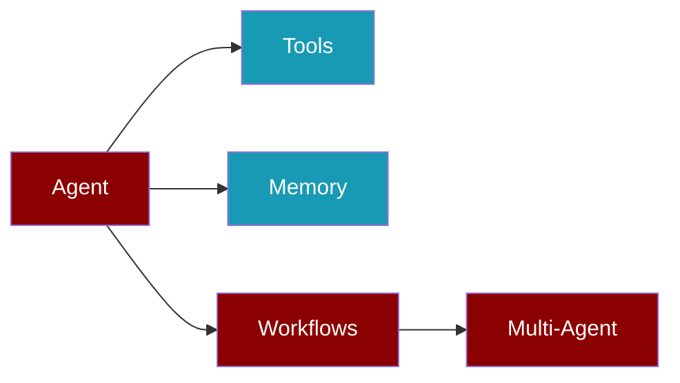

<Frame>
  
</Frame>

## Philosophy

PraisonAI is built on a simple philosophy:

<CardGroup cols={3}>
  <Card title="Simpler" icon="layer-group">
    Fewer concepts, cleaner API than competitors
  </Card>
  <Card title="Faster" icon="bolt">
    Lazy loading, minimal overhead, performance-first
  </Card>
  <Card title="Extensible" icon="puzzle-piece">
    Protocol-driven, plugin-ready architecture
  </Card>
</CardGroup>

---

## Agent-Centric Design

Every design decision centers on:



<AccordionGroup>
  <Accordion title="Agents" icon="robot">
    The core execution unit. Autonomous entities that can think, act, and learn.
  </Accordion>
  
  <Accordion title="Tools" icon="wrench">
    Extend agent capabilities. Functions, APIs, and integrations agents can use.
  </Accordion>
  
  <Accordion title="Memory" icon="brain">
    Short-term and long-term persistence. Context that persists across interactions.
  </Accordion>
  
  <Accordion title="Workflows" icon="diagram-project">
    Multi-agent coordination patterns. Sequential, parallel, and routing logic.
  </Accordion>
  
  <Accordion title="Sessions" icon="clock-rotate-left">
    State management and checkpointing. Resume from any point.
  </Accordion>
</AccordionGroup>

---

## Protocol-Driven Core

<Tabs>
  <Tab title="Architecture">
    ```
    ┌─────────────────────────────────────────┐
    │           praisonai (Wrapper)           │
    │  CLI • Integrations • Heavy Impls       │
    ├─────────────────────────────────────────┤
    │         praisonaiagents (Core)          │
    │  Protocols • Hooks • Base Classes       │
    ├─────────────────────────────────────────┤
    │        praisonai-tools (External)       │
    │  Optional • Plugins • Community         │
    └─────────────────────────────────────────┘
    ```
  </Tab>
  
  <Tab title="What Goes Where">
    | Core SDK | Wrapper | External |
    |----------|---------|----------|
    | Protocols | CLI commands | Community tools |
    | Hooks | Heavy integrations | Optional plugins |
    | Base classes | Database adapters | Marketplace |
    | Decorators | UI components | Third-party |
  </Tab>
</Tabs>

<Warning>
  The core SDK must remain lightweight. Heavy implementations go in the wrapper.
</Warning>

---

## Naming Conventions

<Steps>
  <Step title="Registration">
    Use `add_X()` for user-facing, `register_X()` for framework
    ```python
    add_hook("before_tool", handler)    # User-facing
    register_tool(my_tool)              # Framework
    ```
  </Step>
  
  <Step title="Retrieval">
    Use `get_X()` for single, `search_X()` for query, `list_X()` for all
    ```python
    tool = get_tool("search")           # By ID
    results = search_memory("query")    # By query
    tools = list_tools()                # All
    ```
  </Step>
  
  <Step title="Configuration">
    Use `XConfig` suffix for configuration dataclasses
    ```python
    MemoryConfig, HooksConfig, KnowledgeConfig
    ```
  </Step>
  
  <Step title="Protocols">
    Use `XProtocol` suffix for abstract interfaces
    ```python
    MemoryProtocol, AgentProtocol, ToolProtocol
    ```
  </Step>
</Steps>

---

## Performance Rules

<CardGroup cols={2}>
  <Card title="Lazy Imports" icon="clock">
    Heavy dependencies imported inside functions, not at module level
  </Card>
  
  <Card title="Optional Dependencies" icon="cube">
    ChromaDB, LiteLLM, FastAPI etc. are optional extras
  </Card>
  
  <Card title="No Hot-Path Impact" icon="fire">
    No heavy work in frequently-called code paths
  </Card>
  
  <Card title="< 200ms Import" icon="gauge">
    Package import time target under 200 milliseconds
  </Card>
</CardGroup>

<CodeGroup>
```python Correct (Lazy)
def use_chromadb():
    try:
        import chromadb  # Imported when needed
    except ImportError:
        raise ImportError("pip install praisonaiagents[memory]")
```

```python Wrong (Module Level)
import chromadb  # ❌ Adds 500ms+ to import time
```
</CodeGroup>

---

## Simple API Philosophy

<Tip>
  Fewer parameters, sensible defaults, explicit overrides when needed.
</Tip>

<Tabs>
  <Tab title="Basic">
    ```python
    from praisonaiagents import Agent
    
    agent = Agent(name="assistant")
    response = agent.start("Hello!")
    ```
  </Tab>
  
  <Tab title="With Tools">
    ```python
    from praisonaiagents import Agent, tool
    
    @tool
    def search(query: str) -> list:
        """Search the web."""
        return [{"result": query}]
    
    agent = Agent(name="researcher", tools=[search])
    ```
  </Tab>
  
  <Tab title="Full Control">
    ```python
    from praisonaiagents import Agent, MemoryConfig, HooksConfig
    
    agent = Agent(
        name="assistant",
        llm="gpt-4o-mini",
        memory=MemoryConfig(provider="chroma"),
        hooks=HooksConfig(before_tool=[validate]),
        guardrail=safety_check
    )
    ```
  </Tab>
</Tabs>

---

## Safety by Default

<CardGroup cols={2}>
  <Card title="Multi-Agent Safe" icon="users">
    No shared mutable state between agents
  </Card>
  
  <Card title="Async Safe" icon="rotate">
    Full async/await support throughout
  </Card>
  
  <Card title="Guardrails" icon="shield">
    Built-in safety checks and policies
  </Card>
  
  <Card title="HITL Ready" icon="hand">
    Human-in-the-loop approval workflows
  </Card>
</CardGroup>

---

## Implementation Checklist

Use this checklist for every new feature:

<Check>Protocol-first: Add protocol to core if needed</Check>
<Check>No new deps: Use optional dependencies only</Check>
<Check>Lazy imports: Heavy deps imported inside functions</Check>
<Check>Naming: Follow conventions (add_*, get_*, XConfig)</Check>
<Check>Tests: TDD - write failing tests first</Check>
<Check>CLI: Add corresponding CLI command</Check>
<Check>Docs: Update documentation</Check>
<Check>Examples: Add to examples directory</Check>
<Check>Multi-agent safe: No shared mutable state</Check>
<Check>Async-safe: Support async/await</Check>

---

## Quick Links

<CardGroup cols={2}>
  <Card title="Getting Started" icon="play" href="/quickstart">
    Build your first agent in 5 minutes
  </Card>
  
  <Card title="Tools Guide" icon="wrench" href="/tools">
    Create and use custom tools
  </Card>
  
  <Card title="Memory Guide" icon="brain" href="/memory/overview">
    Add persistence to your agents
  </Card>
  
  <Card title="Workflows" icon="diagram-project" href="/features/workflows">
    Multi-agent coordination patterns
  </Card>
</CardGroup>
