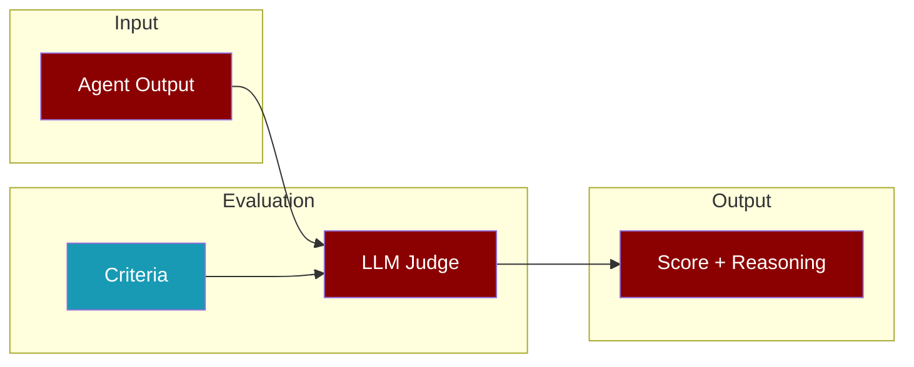
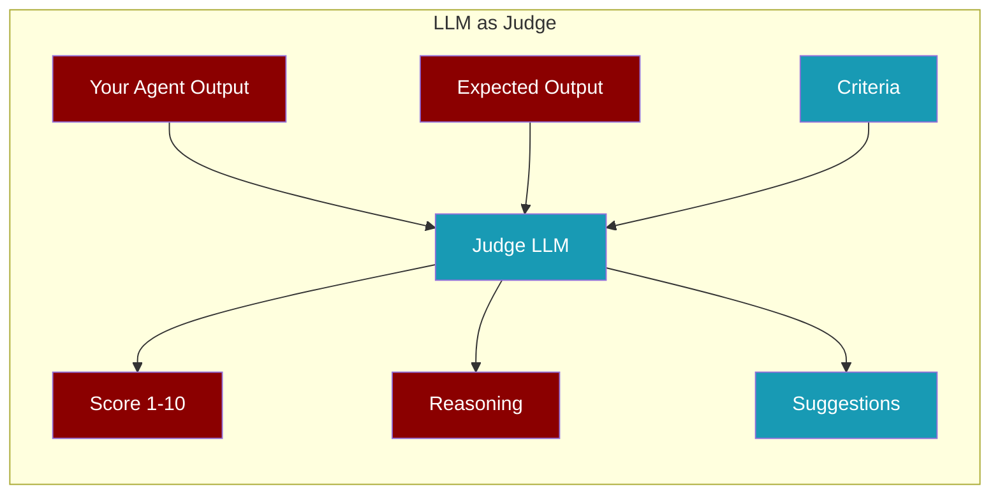
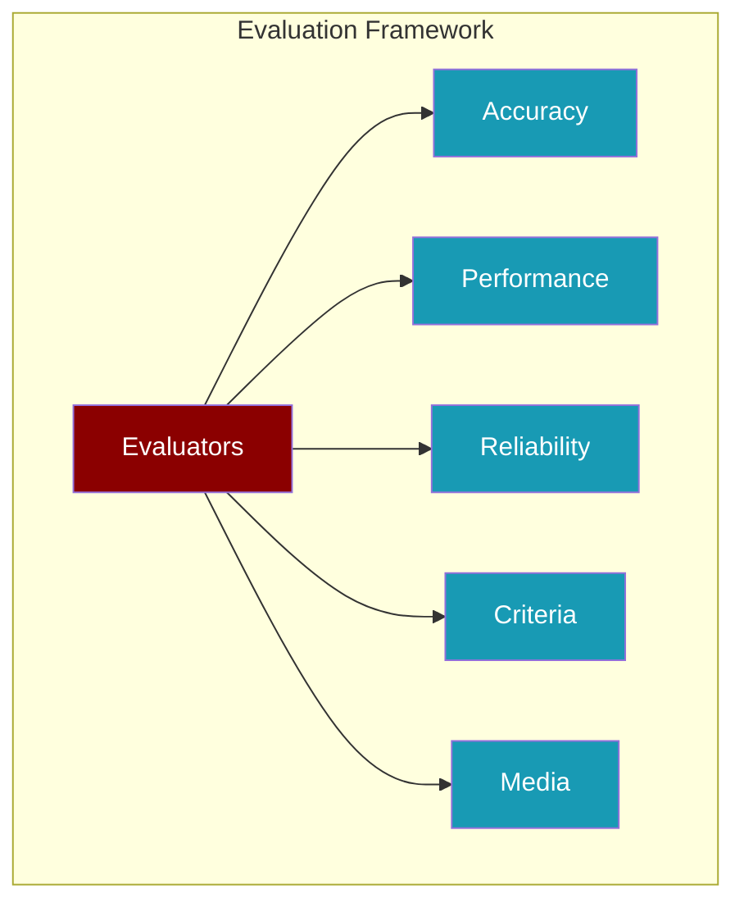
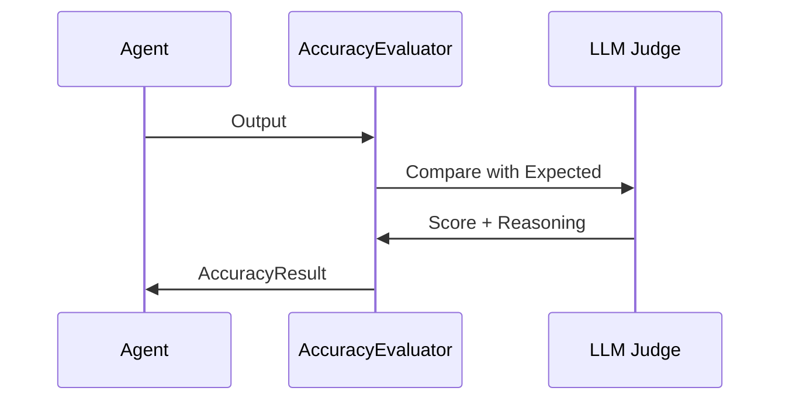
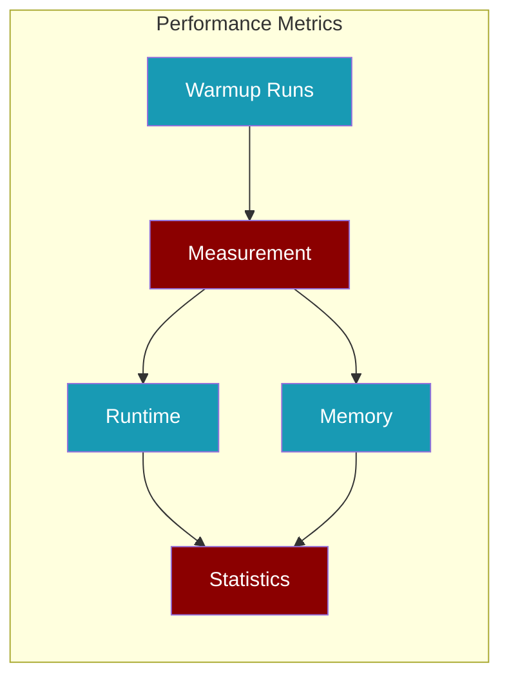
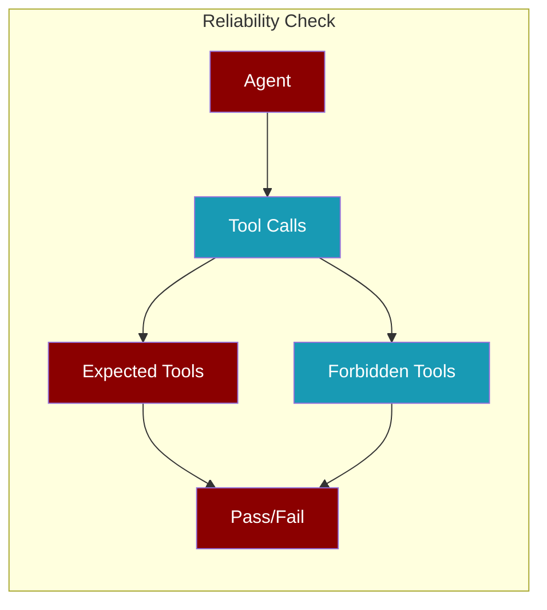
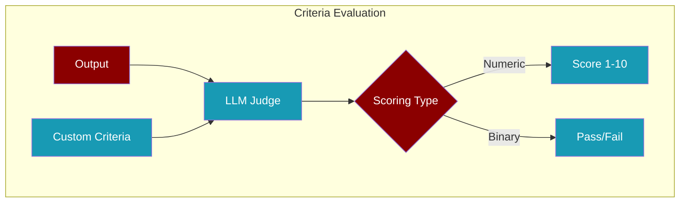
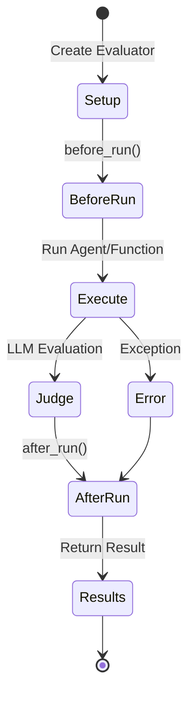
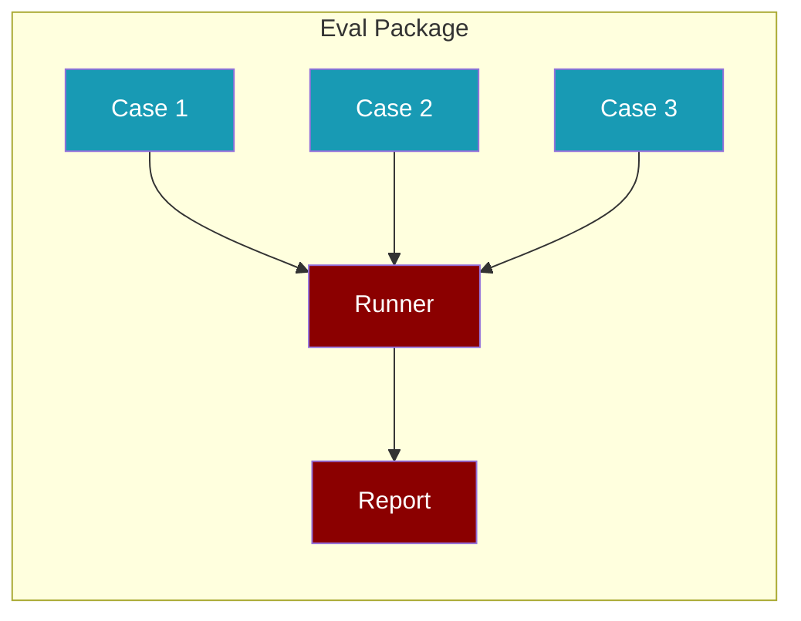

Evaluation uses LLM-as-Judge to assess AI outputs with human-like reasoning, providing scores, feedback, and improvement suggestions.

## How Evaluation Works



<CardGroup cols={2}>
  <Card title="LLM as Judge" icon="gavel" href="#llm-as-judge">
    AI evaluates AI with human-like reasoning
  </Card>
  <Card title="Accuracy" icon="bullseye" href="#accuracy-evaluation">
    Compare output vs expected result
  </Card>
  <Card title="Performance" icon="gauge-high" href="#performance-evaluation">
    Measure speed and memory usage
  </Card>
  <Card title="Reliability" icon="shield-check" href="#reliability-evaluation">
    Verify tools are called correctly
  </Card>
</CardGroup>

---

## LLM as Judge

The **Judge** class uses an LLM to evaluate outputs with human-like reasoning. This is the recommended approach for most evaluations.



<Tabs>
  <Tab title="Quick Start">
```python
from praisonaiagents.eval import Judge

# Evaluate any output
result = Judge().run(
    output="The capital of France is Paris.",
    expected="Paris is the capital of France."
)

print(f"Score: {result.score}/10")
print(f"Reasoning: {result.reasoning}")
```
  </Tab>
  <Tab title="With Agent">
```python
from praisonaiagents import Agent
from praisonaiagents.eval import Judge

# Create your agent
agent = Agent(name="assistant", instructions="Answer questions")

# Evaluate agent output
result = Judge().run(
    agent=agent,
    input="What is 2+2?",
    expected="4"
)

print(f"Score: {result.score}/10")
```
  </Tab>
  <Tab title="Custom Criteria">
```python
from praisonaiagents.eval import Judge

# Define your own evaluation criteria
result = Judge(criteria="Response is helpful, accurate, and concise").run(
    output="Here's a detailed explanation of quantum physics..."
)

print(f"Score: {result.score}/10")
print(f"Passed: {result.passed}")
```
  </Tab>
</Tabs>

### Judge Types

<AccordionGroup>
  <Accordion title="AccuracyJudge" icon="bullseye">
    Compares output against expected output.
    
```python
from praisonaiagents.eval import AccuracyJudge

judge = AccuracyJudge()
result = judge.run(
    output="Paris",
    expected="Paris",
    input="What is the capital of France?"
)
# Score: 10/10 - Perfect match
```
  </Accordion>
  
  <Accordion title="CriteriaJudge" icon="list-check">
    Evaluates against custom criteria.
    
```python
from praisonaiagents.eval import CriteriaJudge

judge = CriteriaJudge(criteria="Response is professional and helpful")
result = judge.run(output="Hello! How can I assist you today?")
# Score: 9/10 - Professional and helpful
```
  </Accordion>
  
  <Accordion title="RecipeJudge" icon="book">
    Evaluates multi-agent workflow outputs.
    
```python
from praisonaiagents.eval import RecipeJudge

judge = RecipeJudge()
result = judge.run(
    output=workflow_output,
    expected="Complete research report"
)
```
  </Accordion>
</AccordionGroup>

### Judge Registry

Register and retrieve custom judges:

```python
from praisonaiagents.eval import add_judge, get_judge, list_judges

# Register a custom judge
add_judge("my_judge", MyCustomJudge)

# List all judges
print(list_judges())  # ['accuracy', 'criteria', 'recipe', 'my_judge']

# Get a judge by name
judge = get_judge("my_judge")
```

---

## Evaluation Types



### Accuracy Evaluation

Compare agent output against expected output using LLM-as-judge.



<Tabs>
  <Tab title="Basic">
```python
from praisonaiagents.eval import AccuracyEvaluator

evaluator = AccuracyEvaluator(
    agent=my_agent,
    input_text="What is 2+2?",
    expected_output="4"
)

result = evaluator.run(print_summary=True)
print(f"Average Score: {result.avg_score}/10")
```
  </Tab>
  <Tab title="Multiple Iterations">
```python
from praisonaiagents.eval import AccuracyEvaluator

# Run 5 times to check consistency
evaluator = AccuracyEvaluator(
    agent=my_agent,
    input_text="Explain AI briefly",
    expected_output="AI is...",
    num_iterations=5
)

result = evaluator.run(print_summary=True)
print(f"Min: {result.min_score}, Max: {result.max_score}")
print(f"Std Dev: {result.std_dev_score}")
```
  </Tab>
  <Tab title="Evaluate Output">
```python
from praisonaiagents.eval import AccuracyEvaluator

# Evaluate pre-generated output (no agent needed)
evaluator = AccuracyEvaluator(
    input_text="What is Python?",
    expected_output="A programming language"
)

result = evaluator.evaluate_output(
    output="Python is a high-level programming language",
    print_summary=True
)
```
  </Tab>
</Tabs>

### Performance Evaluation

Measure runtime and memory usage.



<Tabs>
  <Tab title="Agent Benchmark">
```python
from praisonaiagents.eval import PerformanceEvaluator

evaluator = PerformanceEvaluator(
    agent=my_agent,
    input_text="Hello!",
    num_iterations=10,
    warmup_runs=2
)

result = evaluator.run(print_summary=True)
print(f"Avg Time: {result.avg_run_time:.3f}s")
print(f"Avg Memory: {result.avg_memory_usage:.2f}MB")
```
  </Tab>
  <Tab title="Function Benchmark">
```python
from praisonaiagents.eval import PerformanceEvaluator

def my_function():
    # Your code to benchmark
    return expensive_operation()

evaluator = PerformanceEvaluator(
    func=my_function,
    num_iterations=50,
    warmup_runs=5
)

result = evaluator.run(print_summary=True)
print(f"P95 Time: {result.p95_run_time:.3f}s")
```
  </Tab>
</Tabs>

<Accordion title="Performance Metrics Available">
| Metric | Description |
|--------|-------------|
| `avg_run_time` | Average execution time |
| `min_run_time` | Fastest execution |
| `max_run_time` | Slowest execution |
| `std_dev_run_time` | Standard deviation |
| `median_run_time` | Median execution time |
| `p95_run_time` | 95th percentile |
| `avg_memory_usage` | Average memory (MB) |
</Accordion>

### Reliability Evaluation

Verify that expected tools are called.



<Tabs>
  <Tab title="Expected Tools">
```python
from praisonaiagents.eval import ReliabilityEvaluator

evaluator = ReliabilityEvaluator(
    agent=my_agent,
    input_text="Search for AI news",
    expected_tools=["search_web", "summarize"]
)

result = evaluator.run(print_summary=True)
print(f"Status: {result.status}")  # PASSED or FAILED
print(f"Pass Rate: {result.pass_rate}%")
```
  </Tab>
  <Tab title="Forbidden Tools">
```python
from praisonaiagents.eval import ReliabilityEvaluator

# Ensure certain tools are NOT called
evaluator = ReliabilityEvaluator(
    agent=my_agent,
    input_text="Answer from memory only",
    forbidden_tools=["search_web", "database_query"]
)

result = evaluator.run(print_summary=True)
```
  </Tab>
  <Tab title="Pre-recorded">
```python
from praisonaiagents.eval import ReliabilityEvaluator

# Evaluate without running agent
evaluator = ReliabilityEvaluator(
    agent=my_agent,
    expected_tools=["search_web"]
)

result = evaluator.evaluate_tool_calls(
    actual_tools=["search_web", "summarize"],
    print_summary=True
)
```
  </Tab>
</Tabs>

### Criteria Evaluation

Evaluate against custom criteria with numeric or binary scoring.



<Tabs>
  <Tab title="Numeric Scoring">
```python
from praisonaiagents.eval import CriteriaEvaluator

evaluator = CriteriaEvaluator(
    criteria="Response is helpful, accurate, and professional",
    agent=my_agent,
    input_text="How do I reset my password?",
    scoring_type="numeric",
    threshold=7.0
)

result = evaluator.run(print_summary=True)
print(f"Score: {result.avg_score}/10")
print(f"Passed: {result.all_passed}")
```
  </Tab>
  <Tab title="Binary Scoring">
```python
from praisonaiagents.eval import CriteriaEvaluator

evaluator = CriteriaEvaluator(
    criteria="Response contains no harmful content",
    agent=my_agent,
    input_text="Tell me about safety",
    scoring_type="binary"
)

result = evaluator.run(print_summary=True)
print(f"Passed: {result.all_passed}")
```
  </Tab>
  <Tab title="With Callback">
```python
from praisonaiagents.eval import CriteriaEvaluator

def on_fail(score):
    print(f"⚠️ Failed: {score.reasoning}")
    # Send alert, log, etc.

evaluator = CriteriaEvaluator(
    criteria="Response is under 100 words",
    agent=my_agent,
    input_text="Explain quantum physics",
    on_fail=on_fail
)

result = evaluator.run()
```
  </Tab>
</Tabs>

---

## Evaluation Flow



---

## Async Evaluation

All evaluators support async execution:

```python
import asyncio
from praisonaiagents.eval import AccuracyEvaluator

async def evaluate():
    evaluator = AccuracyEvaluator(
        agent=my_agent,
        input_text="Hello",
        expected_output="Hi there!"
    )
    
    result = await evaluator.run_async(print_summary=True)
    return result

result = asyncio.run(evaluate())
```

---

## Saving Results

Save evaluation results for later analysis:

```python
from praisonaiagents.eval import AccuracyEvaluator

evaluator = AccuracyEvaluator(
    agent=my_agent,
    input_text="Test",
    expected_output="Expected",
    save_results_path="./eval_results/accuracy_{timestamp}.json"
)

result = evaluator.run()
# Results automatically saved to file
```

---

## Evaluation Packages

Run multiple test cases as a batch:



```python
from praisonaiagents.eval import EvalPackage, EvalCase, Judge

# Define test cases
cases = [
    EvalCase(name="math", input="2+2", expected="4"),
    EvalCase(name="geography", input="Capital of France?", expected="Paris"),
    EvalCase(name="greeting", input="Hello", expected="Hi"),
]

# Create package
package = EvalPackage(
    name="Math and Geography Tests",
    cases=cases
)

# Run cases with Judge
judge = Judge()
for case in package.cases:
    result = judge.run(
        agent=my_agent,
        input=case.input,
        expected=case.expected
    )
    print(f"{case.name}: {result.score}/10")
```

---

## Quick Reference

<CardGroup cols={2}>
  <Card title="Judge" icon="gavel">
    ```python
    from praisonaiagents.eval import Judge
    result = Judge().run(output="...", expected="...")
    ```
  </Card>
  <Card title="Accuracy" icon="bullseye">
    ```python
    from praisonaiagents.eval import AccuracyEvaluator
    result = AccuracyEvaluator(agent=a, input_text="...", expected_output="...").run()
    ```
  </Card>
  <Card title="Performance" icon="gauge-high">
    ```python
    from praisonaiagents.eval import PerformanceEvaluator
    result = PerformanceEvaluator(func=f, num_iterations=10).run()
    ```
  </Card>
  <Card title="Reliability" icon="shield-check">
    ```python
    from praisonaiagents.eval import ReliabilityEvaluator
    result = ReliabilityEvaluator(agent=a, expected_tools=["..."]).run()
    ```
  </Card>
</CardGroup>

---

## Best Practices

<AccordionGroup>
  <Accordion title="Start with LLM as Judge">
    Use `Judge` for most evaluations - it provides human-like reasoning.
  </Accordion>
  <Accordion title="Define Clear Criteria">
    Be specific: "Response is under 100 words and includes a greeting" is better than "Response is good".
  </Accordion>
  <Accordion title="Use Multiple Iterations">
    Run evaluations multiple times to account for LLM non-determinism.
  </Accordion>
  <Accordion title="Save Results">
    Use `save_results_path` to track evaluation history over time.
  </Accordion>
  <Accordion title="Combine Evaluators">
    Use Accuracy for correctness, Performance for speed, Reliability for tool usage.
  </Accordion>
</AccordionGroup>

<Warning>
**LLM Costs**: Each evaluation makes LLM API calls. Use `num_iterations` wisely and consider caching for repeated evaluations.
</Warning>

---

## Related

<CardGroup cols={2}>
  <Card title="Guardrails" icon="shield" href="/docs/concepts/guardrails">
    Protect agents with input/output validation
  </Card>
  <Card title="Hooks" icon="webhook" href="/docs/concepts/hooks">
    Intercept and modify agent behavior
  </Card>
</CardGroup>
