Execution configuration controls how agents run - maximum iterations, time limits, rate limiting, and retry behavior.

```mermaid
graph LR
    subgraph "Execution Limits"
        Iter[🔄 Iterations<br/>max_iter=20]
        Time[⏱️ Time<br/>max_execution_time]
        Rate[📊 Rate<br/>max_rpm]
        Retry[🔁 Retries<br/>max_retry_limit]
    end
    
    Iter --> Agent[🤖 Agent]
    Time --> Agent
    Rate --> Agent
    Retry --> Agent
    
    classDef limit fill:#F59E0B,stroke:#7C90A0,color:#fff
    classDef agent fill:#10B981,stroke:#7C90A0,color:#fff
    
    class Iter,Time,Rate,Retry limit
    class Agent agent
```



## Quick Start

<Steps>

<Step title="Preset Mode">
```python
from praisonaiagents import Agent

# Use a preset
agent = Agent(
    name="Fast Agent",
    instructions="You answer quickly",
    execution="fast"  # Preset: limited iterations
)
```
</Step>

<Step title="Custom Configuration">
```python
from praisonaiagents import Agent, ExecutionConfig

agent = Agent(
    name="Thorough Agent",
    instructions="You do comprehensive analysis",
    execution=ExecutionConfig(
        max_iter=50,              # Max iterations
        max_rpm=100,              # Requests per minute
        max_execution_time=300,   # 5 minute timeout
        max_retry_limit=5,        # Retries on failure
    )
)
```
</Step>

</Steps>

---

## Execution Presets

```mermaid
graph TB
    subgraph "Presets"
        Fast[⚡ fast<br/>max_iter=10]
        Balanced[⚖️ balanced<br/>max_iter=20]
        Thorough[🔍 thorough<br/>max_iter=50]
        Unlimited[♾️ unlimited<br/>No limits]
    end
    
    Fast -->|"Quick tasks"| Use[Use Case]
    Balanced -->|"Most tasks"| Use
    Thorough -->|"Complex tasks"| Use
    Unlimited -->|"Long-running"| Use
    
    classDef fast fill:#10B981,stroke:#7C90A0,color:#fff
    classDef balanced fill:#189AB4,stroke:#7C90A0,color:#fff
    classDef thorough fill:#F59E0B,stroke:#7C90A0,color:#fff
    classDef unlimited fill:#6366F1,stroke:#7C90A0,color:#fff
    
    class Fast fast
    class Balanced balanced
    class Thorough thorough
    class Unlimited unlimited
```



| Preset | max_iter | Use Case |
|--------|----------|----------|
| `fast` | 10 | Quick responses |
| `balanced` | 20 | Standard tasks |
| `thorough` | 50 | Complex analysis |
| `unlimited` | None | Long-running jobs |

```python
agent = Agent(instructions="...", execution="fast")
agent = Agent(instructions="...", execution="balanced")
agent = Agent(instructions="...", execution="thorough")
agent = Agent(instructions="...", execution="unlimited")
```

---

## Configuration Options

```python
from praisonaiagents import ExecutionConfig

config = ExecutionConfig(
    max_iter=20,              # Maximum iterations
    max_rpm=None,             # Requests per minute (None = no limit)
    max_execution_time=None,  # Timeout in seconds (None = no limit)
    max_retry_limit=2,        # Retries on failure
)
```

| Option | Type | Default | Description |
|--------|------|---------|-------------|
| `max_iter` | `int` | `20` | Maximum loop iterations |
| `max_rpm` | `int` | `None` | Rate limit (requests/minute) |
| `max_execution_time` | `int` | `None` | Timeout in seconds |
| `max_retry_limit` | `int` | `2` | Max retries on failure |

---

## Iteration Limits

Prevent infinite loops:


```python
agent = Agent(
    instructions="You solve problems iteratively",
    execution=ExecutionConfig(max_iter=30)
)

# Agent stops after 30 iterations even if not done
```

---

## Time Limits

Prevent runaway execution:

```python
agent = Agent(
    instructions="You analyze data",
    execution=ExecutionConfig(
        max_execution_time=60  # Stop after 60 seconds
    )
)
```


---

## Rate Limiting

Control API request rate:

```python
agent = Agent(
    instructions="You search the web",
    execution=ExecutionConfig(
        max_rpm=60  # Max 60 requests per minute
    )
)
```

Useful for:
- Respecting API rate limits
- Controlling costs
- Preventing abuse

---

## Retry Behavior

Handle transient failures:

```python
agent = Agent(
    instructions="You call external APIs",
    execution=ExecutionConfig(
        max_retry_limit=3  # Retry up to 3 times
    )
)
```


---

## Multi-Agent Execution

For multi-agent workflows:

```python
from praisonaiagents import PraisonAIAgents, MultiAgentExecutionConfig

agents = PraisonAIAgentManager(
    agents=[agent1, agent2],
    execution=MultiAgentExecutionConfig(
        max_iter=10,      # Per task
        max_retries=5,    # Per task
    )
)
```

---

## Combining Limits

Use multiple limits together:

```python
agent = Agent(
    instructions="You do comprehensive research",
    execution=ExecutionConfig(
        max_iter=100,             # Allow many iterations
        max_execution_time=600,   # But stop after 10 minutes
        max_rpm=30,               # Rate limit API calls
        max_retry_limit=3,        # Retry failures
    )
)
```

---

## Best Practices

<AccordionGroup>
  <Accordion title="Set appropriate iteration limits">
    Too low = incomplete tasks. Too high = wasted resources. Start with defaults and adjust.
  </Accordion>
  
  <Accordion title="Use time limits for production">
    Always set `max_execution_time` in production to prevent runaway agents.
  </Accordion>
  
  <Accordion title="Rate limit external API calls">
    Use `max_rpm` when agents call external APIs to respect rate limits.
  </Accordion>
  
  <Accordion title="Enable retries for unreliable operations">
    Set `max_retry_limit` for operations that may fail transiently.
  </Accordion>
</AccordionGroup>

---

## Related

<CardGroup cols={2}>
  <Card title="Output" icon="display" href="/concepts/output">
    Display configuration
  </Card>
  <Card title="Autonomy" icon="robot" href="/concepts/autonomy">
    Independence control
  </Card>
</CardGroup>
