# Agent Handoff System

The handoff system enables seamless task delegation between specialised agents, allowing complex workflows where each agent contributes their expertise.

```mermaid
graph LR
    User([👤 User]) --> TriageAgent[🤖 Triage Agent]
    TriageAgent --> BillingAgent[💳 Billing Agent]
    TriageAgent --> TechAgent[🛠️ Technical Agent]
    TriageAgent --> RefundAgent[💰 Refund Agent]
    BillingAgent --> EscalationAgent[📞 Escalation Agent]
    TechAgent --> EscalationAgent
    RefundAgent --> EscalationAgent

    classDef input fill:#8B0000,stroke:#7C90A0,color:#fff
    classDef process fill:#189AB4,stroke:#7C90A0,color:#fff
    classDef specialist fill:#2E8B57,stroke:#7C90A0,color:#fff

    class User input
    class TriageAgent process
    class BillingAgent,TechAgent,RefundAgent specialist
    class EscalationAgent input
```



## Key Concepts

<CardGroup cols={2}>
  <Card icon="exchange-alt">
    Agents can transfer conversations to specialists based on context and requirements
  </Card>
  <Card icon="history">
    Full conversation history and context are maintained during handoffs
  </Card>
  <Card icon="tools">
    Handoffs appear as tools that agents can invoke naturally
  </Card>
  <Card icon="route">
    Dynamic routing based on conversation context and agent expertise
  </Card>
</CardGroup>

## Quick Start

<CodeGroup>
```python Basic Handoff
from praisonaiagents import Agent

# Specialist agents
billing_agent = Agent(
    name="Billing Specialist",
    instructions="You handle billing inquiries and payment issues."
)

tech_agent = Agent(
    name="Technical Support",
    instructions="You solve technical problems and provide guidance."
)

# Main agent with handoffs
triage_agent = Agent(
    name="Customer Service",
    instructions="You help customers and route to specialists.",
    handoffs=[billing_agent, tech_agent]
)
```

```python Advanced Handoff
from praisonaiagents.agent.handoff import handoff, handoff_filters

# Log handoffs for analytics
def log_handoff(source_agent, input_data):
    print(f"Handoff from {source_agent.name}")

# Configure advanced handoff
agent = Agent(
    name="Support Agent",
    handoffs=[
        handoff(
            specialist_agent,
            tool_name_override="escalate_to_specialist",
            on_handoff=log_handoff,
            input_filter=handoff_filters.keep_last_n_messages(5)
        )
    ]
)
```

```python Starting Conversations
response = triage_agent.chat("I have a billing question")
# Agent automatically routes to billing_agent if needed
```
</CodeGroup>

## Handoff Configuration

### Basic Parameters

| Parameter | Type | Description | Default |
|-----------|------|-------------|---------|
| `agent` | Agent | Target agent for handoff | Required |
| `tool_name_override` | str | Custom name for handoff tool | `transfer_to_<agent_name>` |
| `tool_description_override` | str | Custom description | Auto-generated |
| `on_handoff` | Callable | Callback function | None |
| `input_filter` | Callable | Filter for conversation data | None |

### Handoff Filters

<CodeGroup>
```python Remove Tools
# Remove tool calls from history
handoff(
    agent,
    input_filter=handoff_filters.remove_all_tools
)
```

```python Limit Messages
# Keep only last N messages
handoff(
    agent,
    input_filter=handoff_filters.keep_last_n_messages(10)
)
```

```python Filter System Messages
# Filter out system messages
handoff(
    agent,
    input_filter=handoff_filters.remove_system_messages
)
```
</CodeGroup>

## Advanced Features

### Structured Input Types

Use Pydantic models for typed handoff data:

```python
from pydantic import BaseModel

class EscalationData(BaseModel):
    reason: str
    priority: str
    customer_id: str

escalation = handoff(
    escalation_agent,
    input_type=EscalationData,
    tool_description_override="Escalate to senior management with structured data"
)
```

### Callback Patterns

<CodeGroup>
```python Simple Callback
def on_transfer():
    print("Transfer initiated")

handoff(agent, on_handoff=on_transfer)
```

```python Agent Aware Callback
def on_transfer(source_agent):
    log.info(f"Transfer from {source_agent.name}")

handoff(agent, on_handoff=on_transfer)
```

```python Full Context Callback
def on_transfer(source_agent, input_data):
    analytics.track("handoff", {
        "from": source_agent.name,
        "messages": len(input_data.messages)
    })

handoff(agent, on_handoff=on_transfer)
```
</CodeGroup>

## Complete Example

<CodeGroup>
```python Customer Service System
from praisonaiagents import Agent
from praisonaiagents.agent.handoff import handoff, handoff_filters

# Specialist agents
order_agent = Agent(
    name="Order Management",
    instructions="You help with order status and tracking.",
    tools=[check_order_status, track_shipment]
)

refund_agent = Agent(
    name="Refund Specialist",
    instructions="You process refunds and handle return requests.",
    tools=[process_refund, check_refund_policy]
)

technical_agent = Agent(
    name="Technical Support",
    instructions="You solve technical issues and provide guidance.",
    tools=[diagnose_issue, create_ticket]
)

# Escalation with structured input
class EscalationRequest(BaseModel):
    issue_type: str
    severity: str
    description: str

escalation_agent = Agent(
    name="Senior Manager",
    instructions="You handle escalated issues requiring management attention."
)

# Main triage agent
triage_agent = Agent(
    name="Customer Service",
    instructions="""You are the first point of contact. Route customers to the right specialist:
    - Order issues → Order Management
    - Refunds → Refund Specialist
    - Technical problems → Technical Support
    - Complex issues → Escalate to management
    """,
    handoffs=[
        order_agent,
        refund_agent,
        technical_agent,
        handoff(
            escalation_agent,
            tool_name_override="escalate_to_management",
            input_type=EscalationRequest,
            on_handoff=lambda src, data: log_escalation(src.name, data)
        )
    ]
)

# Start the service
response = triage_agent.chat("I need a refund for order #12345")
```
</CodeGroup>

## Best Practices

<CardGroup cols={2}>
  <Card icon="id-card">
    Define specific expertise for each agent to ensure proper routing
  </Card>
  <Card icon="layer-group">
    Use input filters to manage conversation history size
  </Card>
  <Card icon="shield-exclamation">
    Implement callbacks to handle failed handoffs gracefully
  </Card>
  <Card icon="gauge-high">
    Limit handoff chains to prevent excessive delegation
  </Card>
</CardGroup>

## Integration with Agent Instructions

The handoff system automatically enhances agent prompts:

```python
# Automatic prompt enhancement
agent = Agent(
    name="Support Agent",
    instructions="You help customers with their issues.",
    handoffs=[billing_agent, tech_agent]
)

# The system adds:
# "You have the ability to transfer conversations to:
#  - Billing Specialist for billing issues
#  - Technical Support for technical problems"
```

## Next Steps

<CardGroup cols={2}>
  <Card icon="network-wired" href="/concepts/process">
    Build complex multi-agent workflows
  </Card>
  <Card icon="brain" href="/features/memory">
    Add persistent memory to your agents
  </Card>
</CardGroup>