# Agent Handoff System

The handoff system enables seamless task delegation between specialized agents, allowing complex workflows where each agent contributes their expertise.

```mermaid
graph LR
    User([👤 User]) --> TriageAgent[🤖 Triage Agent]
    TriageAgent --> BillingAgent[💳 Billing Agent]
    TriageAgent --> TechAgent[🛠️ Technical Agent]
    TriageAgent --> RefundAgent[💰 Refund Agent]
    BillingAgent --> EscalationAgent[📞 Escalation Agent]
    TechAgent --> EscalationAgent
    RefundAgent --> EscalationAgent

    classDef input fill:#8B0000,stroke:#7C90A0,color:#fff
    classDef process fill:#189AB4,stroke:#7C90A0,color:#fff
    classDef specialist fill:#2E8B57,stroke:#7C90A0,color:#fff

    class User input
    class TriageAgent process
    class BillingAgent,TechAgent,RefundAgent specialist
    class EscalationAgent input
```



## Overview

When an agent encounters a task outside its expertise, it can dynamically hand off the conversation to a more suitable agent, ensuring optimal task completion.

<Cards>
  <Card title="Automatic Detection" icon="brain">
    Agents automatically identify when to delegate tasks based on their capabilities
  </Card>
  <Card title="Context Preservation" icon="memory">
    Full conversation context is maintained across handoffs
  </Card>
  <Card title="Flexible Routing" icon="route">
    Support for specific agent selection or criteria-based routing
  </Card>
  <Card title="Event Hooks" icon="webhook">
    Hook into handoff events for logging, monitoring, or custom logic
  </Card>
</Cards>

## Quick Start

<Steps>
  <Step>
    Install praisonaiagents
    ```bash
    pip install praisonaiagents
    ```
  </Step>
  <Step>
    Import required components
    ```python
    from praisonaiagents import Agent, handoff
    ```
  </Step>
  <Step>
    Create specialist agents
    ```python
    # Technical support specialist
    tech_support = Agent(
        name="TechnicalSupport",
        instructions="You are a technical support specialist. Resolve technical issues."
    )
    
    # Billing specialist
    billing = Agent(
        name="Billing",
        instructions="You are a billing specialist. Handle payment and subscription issues."
    )
    ```
  </Step>
  <Step>
    Create main agent with handoff capabilities
    ```python
    # Customer service agent that can handoff to specialists
    customer_service = Agent(
        name="CustomerService",
        instructions="You are a customer service agent. For technical issues, handoff to TechnicalSupport.",
        handoffs=[tech_support, billing]  # Pass agent instances
    )
    ```
  </Step>
  <Step>
    Use handoffs naturally in conversation
    ```python
    # Customer service agent automatically hands off when needed
    response = customer_service.chat("I'm having trouble installing the software")
    # This will trigger a handoff to TechnicalSupport
    ```
  </Step>
</Steps>

## How Handoffs Work

### 1. Handoff Detection
Agents identify when they need to delegate based on:
- Task complexity beyond their expertise
- Specific keywords or patterns in user requests
- Explicit handoff instructions in their role

### 2. Target Selection
The system selects the best agent using:
- Predefined handoff targets in agent configuration
- Dynamic selection based on agent capabilities
- Custom selection logic via callbacks

### 3. Context Transfer
When handing off, the system:
- Packages the entire conversation history
- Includes any relevant metadata
- Maintains user context and preferences

### 4. Seamless Continuation
The receiving agent:
- Gets full context of the conversation
- Continues naturally without user intervention
- Can hand back or to another agent if needed

## Basic Usage

<CodeGroup>
```python Agent Instances
from praisonaiagents import Agent

# Specialist agents
billing_agent = Agent(
    name="Billing Specialist",
    instructions="You handle billing inquiries and payment issues."
)

tech_agent = Agent(
    name="Technical Support",
    instructions="You solve technical problems and provide guidance."
)

# Main agent with handoffs (pass agent instances)
triage_agent = Agent(
    name="Customer Service",
    instructions="You help customers and route to specialists.",
    handoffs=[billing_agent, tech_agent]
)
```

```python Agent Names
from praisonaiagents import Agent

# Agent with specific handoff targets by name
receptionist = Agent(
    name="Receptionist",
    role="Virtual Receptionist",
    goal="Route inquiries to appropriate departments",
    backstory="You are a helpful receptionist who directs people to the right specialist.",
    handoffs=["Sales", "Support", "HR"]  # Reference by name
)
```

```python Handoff Tool
from praisonaiagents import Agent, handoff

agent = Agent(
    name="Assistant",
    instructions="You are a general assistant. Use handoff for specialized tasks.",
    tools=[handoff]  # Provide handoff as a tool
)

# The agent can now use handoff() function when needed
response = agent.chat("I need help with a complex math problem")
```
</CodeGroup>

## Handoff Configuration

### Parameters

| Parameter | Type | Description | Default |
|-----------|------|-------------|---------|
| `agent` | Agent | Target agent for handoff | Required |
| `tool_name_override` | str | Custom name for handoff tool | `transfer_to_<agent_name>` |
| `tool_description_override` | str | Custom description | Auto-generated |
| `on_handoff` | Callable | Callback function | None |
| `input_filter` | Callable | Filter for conversation data | None |

### Handoff Filters

Control what conversation data is passed during handoff:

<CodeGroup>
```python Remove Tool Calls
from praisonaiagents.agent.handoff import handoff, handoff_filters

handoff(
    agent,
    input_filter=handoff_filters.remove_all_tools
)
```

```python Limit Messages
# Keep only last N messages
handoff(
    agent,
    input_filter=handoff_filters.keep_last_n_messages(10)
)
```

```python Filter System Messages
handoff(
    agent,
    input_filter=handoff_filters.remove_system_messages
)
```
</CodeGroup>

### Agent-Level Filters

```python
from praisonaiagents.agent.handoff import handoff_filters

# Default filters available: ["all", "none", "self", "other", "team:"]

agent = Agent(
    name="TeamLead",
    handoff_filter="team:support",  # Only handoff to support team
    handoffs=["Agent1", "Agent2", "Agent3"]
)

# Filter examples:
# "all" - Can receive from any agent (default)
# "none" - Cannot receive handoffs
# "self" - Can only receive from itself
# "other" - Can receive from any agent except itself
# "team:xyz" - Can only receive from agents in team 'xyz'
```

## Advanced Usage

### Custom Handoff Names

```python
from praisonaiagents import Agent, handoff

# Create handoff with custom name
transfer_to_human = handoff(
    name="transfer_to_human",
    description="Transfer the conversation to a human agent when the user requests it"
)

chatbot = Agent(
    name="Chatbot",
    instructions="You are an AI assistant. Transfer to human when requested.",
    tools=[transfer_to_human]
)
```

### Handoff Callbacks

<CodeGroup>
```python Simple Callback
def on_transfer():
    print("Transfer initiated")

handoff(agent, on_handoff=on_transfer)
```

```python Agent Aware Callback
def on_transfer(source_agent):
    print(f"Transfer from {source_agent.name}")

handoff(agent, on_handoff=on_transfer)
```

```python Full Context Callback
def on_transfer(source_agent, input_data):
    analytics.track("handoff", {
        "from": source_agent.name,
        "messages": len(input_data.messages)
    })

handoff(agent, on_handoff=on_transfer)
```
</CodeGroup>

### Structured Input with Pydantic

```python
from pydantic import BaseModel
from praisonaiagents import Agent
from praisonaiagents.agent.handoff import handoff

class EscalationData(BaseModel):
    reason: str
    priority: str
    customer_id: str

escalation = handoff(
    escalation_agent,
    input_type=EscalationData,
    tool_description_override="Escalate to senior management with structured data"
)

agent = Agent(
    name="Intake",
    tools=[escalation]
)
```

## Complete Example

```python
from praisonaiagents import Agent
from praisonaiagents.agent.handoff import handoff, handoff_filters
from pydantic import BaseModel

# Specialist agents
order_agent = Agent(
    name="Order Management",
    instructions="You help with order status and tracking.",
    tools=[check_order_status, track_shipment]
)

refund_agent = Agent(
    name="Refund Specialist",
    instructions="You process refunds and handle return requests.",
    tools=[process_refund, check_refund_policy]
)

technical_agent = Agent(
    name="Technical Support",
    instructions="You solve technical issues and provide guidance.",
    tools=[diagnose_issue, create_ticket]
)

# Escalation with structured input
class EscalationRequest(BaseModel):
    issue_type: str
    severity: str
    description: str

escalation_agent = Agent(
    name="Senior Manager",
    instructions="You handle escalated issues requiring management attention."
)

# Main triage agent
triage_agent = Agent(
    name="Customer Service",
    instructions="""You are the first point of contact. Route customers to the right specialist:
    - Order issues → Order Management
    - Refunds → Refund Specialist
    - Technical problems → Technical Support
    - Complex issues → Escalate to management
    """,
    handoffs=[
        order_agent,
        refund_agent,
        technical_agent,
        handoff(
            escalation_agent,
            tool_name_override="escalate_to_management",
            input_type=EscalationRequest,
            on_handoff=lambda src, data: log_escalation(src.name, data)
        )
    ]
)

# Start the service
response = triage_agent.chat("I need a refund for order #12345")
```

## Common Use Cases

### Customer Support System

```python
# Tiered support system with automatic escalation
l1_support = Agent(
    name="L1Support",
    role="Level 1 Support",
    instructions="Handle basic queries. Escalate complex issues to L2.",
    handoffs=["L2Support"]
)

l2_support = Agent(
    name="L2Support", 
    role="Level 2 Support",
    instructions="Handle complex technical issues. Escalate critical issues to L3.",
    handoffs=["L3Support", "L1Support"]
)

l3_support = Agent(
    name="L3Support",
    role="Level 3 Support", 
    instructions="Handle critical and escalated issues.",
    handoffs=["Engineering", "L2Support"]
)
```

### Multi-Department Routing

```python
# Multi-department organization
reception = Agent(
    name="Reception",
    role="Virtual Receptionist",
    handoffs=["Sales", "Support", "HR", "Finance", "Legal"]
)

# Each department can hand back to reception or to other departments
sales = Agent(
    name="Sales",
    role="Sales Department",
    handoffs=["Reception", "Finance", "Support"]
)
```

### Language-Based Routing

```python
# Multilingual support system
language_detector = Agent(
    name="LanguageRouter",
    role="Language Detection and Routing",
    instructions="Detect user language and route to appropriate agent.",
    handoffs=["EnglishSupport", "SpanishSupport", "FrenchSupport"]
)
```

## Best Practices

<CardGroup cols={2}>
  <Card title="Clear Handoff Criteria" icon="target">
    Define explicit criteria for when agents should handoff:
    - Specific keywords or phrases
    - Task complexity thresholds
    - User requests for specialists
    - Error or uncertainty conditions
  </Card>
  
  <Card title="Context Preservation" icon="save">
    Ensure important context is maintained:
    - Include conversation summary in handoffs
    - Pass relevant user preferences
    - Maintain task state and progress
    - Include any gathered information
  </Card>
  
  <Card title="Prevent Loops" icon="infinity">
    Avoid infinite handoff loops:
    - Implement handoff history tracking
    - Set maximum handoff limits
    - Use handoff filters appropriately
    - Design clear agent responsibilities
  </Card>
  
  <Card title="User Experience" icon="user">
    Make handoffs seamless for users:
    - Inform users about handoffs when appropriate
    - Maintain conversation continuity
    - Preserve user context and preferences
    - Minimize repetition of information
  </Card>
</CardGroup>

## Troubleshooting

<Accordion>
  <AccordionItem title="Handoff not triggering">
    Ensure the target agent name matches exactly
  </AccordionItem>
  <AccordionItem title="Context loss during handoff">
    Check that all agents are in the same workflow/memory context
  </AccordionItem>
  <AccordionItem title="Infinite handoff loops">
    Implement handoff history tracking and limits
  </AccordionItem>
  <AccordionItem title="Filter conflicts">
    Verify handoff_filter settings allow the intended handoffs
  </AccordionItem>
</Accordion>

## API Reference

See the [Handoff API documentation](/api/praisonaiagents/agent/handoff) for detailed information about:

- The `Handoff` class
- The `handoff()` function
- `HandoffInputData` structure
- Built-in handoff filters
- Callback signatures

## Next Steps

<CardGroup cols={2}>
  <Card icon="network-wired" href="/concepts/process">
    Build complex multi-agent workflows
  </Card>
  <Card icon="brain" href="/features/memory">
    Add persistent memory to your agents
  </Card>
</CardGroup>