PraisonAI provides two mechanisms for responding to agent events: **Hooks** (control flow) and **Callbacks** (observation). Understanding the difference is key to building effective integrations.

## Hooks (Control)

Intercept and **modify** agent behavior. Can allow, deny, or block execution.

```mermaid
graph LR
    A[🤖 Agent] --> H{🪝 Hook}
    H -->|allow| T[🔧 Tool]
    H -->|deny| X[❌ Blocked]
    H -->|modify| M[📝 Modified Input]
    M --> T
    
    classDef agent fill:#6366F1,stroke:#7C90A0,color:#fff
    classDef hook fill:#F59E0B,stroke:#7C90A0,color:#fff
    classDef blocked fill:#EF4444,stroke:#7C90A0,color:#fff
    
    class A agent
    class H hook
    class X blocked
```



## Callbacks (Observe)

Receive **notifications** about events. Cannot modify or block execution.

```mermaid
graph LR
    A[🤖 Agent] --> T[🔧 Execute]
    T --> C[📞 Callback]
    C --> L[📋 Log/Notify]
    
    classDef agent fill:#6366F1,stroke:#7C90A0,color:#fff
    classDef callback fill:#10B981,stroke:#7C90A0,color:#fff
    
    class A agent
    class C,L callback
```



---

## Quick Comparison

| Feature | Hooks | Callbacks |
|---------|-------|-----------|
| **Purpose** | Control flow | Observation |
| **Can modify input?** | ✅ Yes | ❌ No |
| **Can block execution?** | ✅ Yes | ❌ No |
| **Return value matters?** | ✅ Yes (decisions) | ❌ No |
| **When used** | Before/during execution | After events |
| **Typical use** | Validation, policies, guardrails | Logging, UI, monitoring |

---

## When to Use Each

<Tabs>
<Tab title="Use Hooks When">

**You need to control behavior:**

```python
from praisonaiagents.hooks import add_hook, HookResult

@add_hook('before_tool')
def block_dangerous_tools(event):
    if event.tool_name == "delete_file":
        return HookResult.deny("Deletion not allowed")
    return HookResult.allow()
```

**Examples:**
- Block specific tool calls
- Modify prompts before LLM
- Validate tool arguments
- Implement rate limiting
- Enforce security policies
</Tab>

<Tab title="Use Callbacks When">

**You need to observe events:**

```python
from praisonaiagents import register_display_callback

def log_interaction(message=None, response=None, **kwargs):
    print(f"User: {message}")
    print(f"Agent: {response}")

register_display_callback('interaction', log_interaction)
```

**Examples:**
- Log interactions to file
- Display progress in UI
- Track token usage
- Send notifications
- Collect analytics
</Tab>
</Tabs>

---

## Code Examples

### Hook: Block and Modify

```python
from praisonaiagents import Agent
from praisonaiagents.hooks import add_hook, HookResult

# Block dangerous tools
@add_hook('before_tool')
def security_policy(event):
    blocked = ["delete_file", "execute_command"]
    if event.tool_name in blocked:
        return HookResult.deny(f"Tool '{event.tool_name}' is blocked")
    return HookResult.allow()

# Modify prompt before LLM
@add_hook('before_llm')
def add_context(event):
    event.prompt = f"[System: Be helpful and safe]\n{event.prompt}"
    return HookResult.allow()

agent = Agent(name="safe_agent", instructions="You help users")
agent.start("Delete all files")  # Blocked by hook
```

### Callback: Log and Notify

```python
from praisonaiagents import Agent, Task, register_display_callback
import logging

logging.basicConfig(filename='agent.log', level=logging.INFO)

# Log all interactions
def log_callback(message=None, response=None, **kwargs):
    logging.info(f"User: {message}")
    logging.info(f"Agent: {response}")

register_display_callback('interaction', log_callback)

# Task completion callback
def task_done(output):
    print(f"✅ Task completed: {output.description}")

task = Task(
    description="Say hello",
    on_task_complete=task_done  # Callback on completion
)
```

---

## Decision Flow


---

## Hook Decisions

Hooks return `HookResult` with a decision:

| Decision | Effect |
|----------|--------|
| `allow()` | Execution proceeds normally |
| `deny(reason)` | Execution blocked, error returned |
| `block()` | Silent block, no error |
| `ask(prompt)` | Request human confirmation |

```python
from praisonaiagents.hooks import HookResult

# Allow (default)
return HookResult.allow()

# Deny with reason
return HookResult.deny("Not permitted by policy")

# Ask user for confirmation
return HookResult.ask("Are you sure you want to delete?")
```

---

## Summary Table

| Scenario | Use | Example |
|----------|-----|---------|
| Block tools based on policy | Hook | `HookResult.deny()` |
| Log all interactions | Callback | `register_display_callback()` |
| Modify prompt before LLM | Hook | Modify `event.prompt` |
| Show progress in UI | Callback | Display callback |
| Validate tool arguments | Hook | Check args, return allow/deny |
| Track completion | Callback | `on_task_complete` |
| Rate limit calls | Hook | Count and deny after limit |
| Send webhook notifications | Callback | HTTP POST in callback |

---

## Related

<CardGroup cols={2}>
  <Card title="Hooks" icon="anchor" href="/docs/concepts/hooks">
    Full hooks documentation
  </Card>
  <Card title="Callbacks" icon="bell" href="/docs/features/callbacks">
    Callback implementation
  </Card>
  <Card title="Guardrails" icon="shield" href="/docs/concepts/guardrails">
    Output validation
  </Card>
  <Card title="Approval" icon="check" href="/docs/concepts/approval">
    Human-in-the-loop
  </Card>
</CardGroup>
