```mermaid
graph TB
    subgraph "Multi-Agent Hooks"
        Start[▶ Start] --> H1[🪝 on_task_start]
        H1 --> A1[🤖 Agent 1]
        A1 --> H2[🪝 on_task_complete]
        H2 --> H3[🪝 on_task_start]
        H3 --> A2[🤖 Agent 2]
        A2 --> H4[🪝 on_task_complete]
        H4 --> End[✅ End]
    end
    
    classDef hook fill:#F59E0B,stroke:#7C90A0,color:#fff
    classDef agent fill:#10B981,stroke:#7C90A0,color:#fff
    
    class H1,H2,H3,H4 hook
    class A1,A2 agent
```

Hooks let you intercept agent execution at key points - before/after LLM calls, tool executions, and task completions.

```mermaid
graph LR
    subgraph "Hook Points"
        Input[📥 Input] --> H1[🪝 Before LLM]
        H1 --> LLM[🧠 LLM Call]
        LLM --> H2[🪝 After LLM]
        H2 --> H3[🪝 Before Tool]
        H3 --> Tool[🔧 Tool]
        Tool --> H4[🪝 After Tool]
        H4 --> Output[📤 Output]
    end
    
    classDef hook fill:#F59E0B,stroke:#7C90A0,color:#fff
    classDef process fill:#10B981,stroke:#7C90A0,color:#fff
    
    class H1,H2,H3,H4 hook
    class Input,LLM,Tool,Output process
```



## Quick Start

<Steps>

<Step title="Register Hooks">
```python
from praisonaiagents.hooks import add_hook, HookResult

@add_hook('before_tool')
def log_tool(event_data):
    print(f"Tool: {event_data.tool_name}")
    return HookResult.allow()
```
</Step>

<Step title="Create Agent">
```python
from praisonaiagents import Agent

agent = Agent(
    name="Hooked Agent",
    instructions="You are a helpful assistant"
)
# Hooks are automatically applied
agent.start("Help me with a task")
```
</Step>

</Steps>

### Alternative: HooksConfig

```python
from praisonaiagents import Agent, HooksConfig

def on_tool_call(tool_name, args):
    print(f"Tool: {tool_name}({args})")

agent = Agent(
    name="Hooked Agent",
    instructions="You are a helpful assistant",
    hooks=HooksConfig(
        on_tool_call=on_tool_call,
    )
)
```

---

## Hook Types


### Available Hooks

| Hook | When Triggered | Use Case |
|------|----------------|----------|
| `BEFORE_LLM` | Before LLM call | Modify prompt, log request |
| `AFTER_LLM` | After LLM response | Log response, track tokens |
| `BEFORE_TOOL` | Before tool execution | Validate args, log call |
| `AFTER_TOOL` | After tool execution | Log result, transform output |
| `AFTER_AGENT` | After agent completes | Cleanup, final logging |

---

## Configuration

```python
from praisonaiagents import HooksConfig

config = HooksConfig(
    on_step=my_step_callback,      # Called on each step
    on_tool_call=my_tool_callback, # Called on tool execution
    middleware=[my_middleware],    # Request/response middleware
)
```

| Option | Type | Description |
|--------|------|-------------|
| `on_step` | `Callable` | Called on each execution step |
| `on_tool_call` | `Callable` | Called when tools are invoked |
| `middleware` | `list` | List of middleware functions |

---

## Common Patterns

### Logging

```python
import logging

def log_llm_call(event):
    logging.info(f"LLM: {event['model']} - {event['tokens']} tokens")

def log_tool_call(tool_name, args, result):
    logging.info(f"Tool: {tool_name}({args}) -> {result}")

agent = Agent(
    instructions="You are helpful",
    hooks=HooksConfig(
        on_step=log_llm_call,
        on_tool_call=log_tool_call,
    )
)
```

### Cost Tracking

```python
total_tokens = 0

def track_tokens(event):
    global total_tokens
    total_tokens += event.get('tokens', 0)
    print(f"Total tokens: {total_tokens}")

agent = Agent(
    instructions="You are helpful",
    hooks=HooksConfig(on_step=track_tokens)
)
```

### Tool Validation

```python
def validate_tool_call(tool_name, args):
    if tool_name == "delete_file":
        if not args.get("confirmed"):
            raise ValueError("Deletion requires confirmation")
    return True

agent = Agent(
    instructions="You manage files",
    hooks=HooksConfig(on_tool_call=validate_tool_call)
)
```

---

## Multi-Agent Hooks

For multi-agent workflows, use `MultiAgentHooksConfig`:

```python
from praisonaiagents import PraisonAIAgents, MultiAgentHooksConfig

def on_task_start(task):
    print(f"Starting: {task.name}")

def on_task_complete(task, result):
    print(f"Completed: {task.name}")

agents = PraisonAIAgentManager(
    agents=[agent1, agent2],
    hooks=MultiAgentHooksConfig(
        on_task_start=on_task_start,
        on_task_complete=on_task_complete,
        completion_checker=my_checker,
    )
)
```



---

## Middleware

Middleware wraps the entire request/response cycle:

```python
def timing_middleware(func):
    def wrapper(*args, **kwargs):
        start = time.time()
        result = func(*args, **kwargs)
        print(f"Duration: {time.time() - start:.2f}s")
        return result
    return wrapper

agent = Agent(
    instructions="You are helpful",
    hooks=HooksConfig(middleware=[timing_middleware])
)
```

---

## Best Practices

<AccordionGroup>
  <Accordion title="Keep hooks lightweight">
    Hooks run synchronously. Heavy operations should be queued for async processing.
  </Accordion>
  
  <Accordion title="Handle errors gracefully">
    Wrap hook code in try/except to prevent hook failures from crashing the agent.
  </Accordion>
  
  <Accordion title="Use middleware for cross-cutting concerns">
    Logging, timing, and authentication are good middleware candidates.
  </Accordion>
</AccordionGroup>

---

## Related

<CardGroup cols={2}>
  <Card title="Callbacks" icon="phone" href="/features/callbacks">
    Event-driven notifications
  </Card>
  <Card title="Guardrails" icon="shield" href="/concepts/guardrails">
    Output validation
  </Card>
</CardGroup>
