Handle user input safely with the Agent's `start()` and `chat()` methods, plus optional guardrails for validation.

```mermaid
graph LR
    User([👤 User Input]) --> Agent[🤖 Agent]
    Agent --> Guardrails{🛡️ Guardrails}
    Guardrails -->|Valid| LLM[🧠 LLM]
    Guardrails -->|Invalid| Retry[🔄 Retry/Reject]
    LLM --> Response([📤 Response])
    
    classDef user fill:#8B0000,stroke:#7C90A0,color:#fff
    classDef agent fill:#189AB4,stroke:#7C90A0,color:#fff
    classDef guard fill:#2E8B57,stroke:#7C90A0,color:#fff
    
    class User,Response user
    class Agent,LLM agent
    class Guardrails,Retry guard
```



## Quick Start

<Steps>

<Step title="Basic Input with start()">
```python
from praisonaiagents import Agent

agent = Agent(
    name="Assistant",
    instructions="You are a helpful assistant"  # System Prompt: defines WHO the agent is
)

# User Prompt: defines WHAT to do (passed to start() method)
response = agent.start("What is 2 + 2?")
```
</Step>

<Step title="Programmatic Input with chat()">
```python
from praisonaiagents import Agent

agent = Agent(
    name="Assistant",
    instructions="You are a helpful assistant"  # System Prompt: agent identity
)

# User Prompt: the actual task/question
user_input = "Explain quantum computing"
response = agent.chat(user_input)  # User Prompt passed to chat()
print(response)
```
</Step>

<Step title="CLI Input Loop">
```python
from praisonaiagents import Agent

agent = Agent(
    name="Assistant",
    instructions="You are a helpful assistant"
)

# Interactive loop
while True:
    user_input = input("You: ")
    if user_input.lower() in ["quit", "exit"]:
        break
    response = agent.chat(user_input)
    print(f"Agent: {response}")
```
</Step>

</Steps>

## Input Methods

| Method | Use Case | Output |
|--------|----------|--------|
| `agent.start(prompt)` | Interactive terminal use | Verbose with streaming |
| `agent.chat(prompt)` | Scripts, APIs, production | Silent, returns string |
| `agent.run(prompt)` | Background processing | Silent, returns string |

```python
from praisonaiagents import Agent

agent = Agent(name="Assistant", instructions="Be helpful")  # System Prompt

# start() - Beginner-friendly, shows progress
result = agent.start("Research AI trends")  # User Prompt

# chat() - Programmatic, silent
result = agent.chat("What is machine learning?")  # User Prompt

# run() - Production, silent
result = agent.run("Analyze this data")  # User Prompt
```

## Guardrails

Use the `guardrails` parameter to validate agent outputs before returning:

```mermaid
graph LR
    Input([📥 Input]) --> Agent[🤖 Agent]
    Agent --> Output[📤 Output]
    Output --> Guard{🛡️ Guardrail}
    Guard -->|Pass| Return([✅ Return])
    Guard -->|Fail| Retry[🔄 Retry]
    Retry --> Agent
    
    classDef agent fill:#189AB4,stroke:#7C90A0,color:#fff
    classDef guard fill:#2E8B57,stroke:#7C90A0,color:#fff
    
    class Agent,Output agent
    class Guard,Retry,Return guard
```



### Function-based Guardrail

```python
from praisonaiagents import Agent

def validate_response(output):
    """Return (is_valid, result_or_error)"""
    if "error" in output.lower():
        return False, "Response contains error"
    if len(output) < 10:
        return False, "Response too short"
    return True, output

agent = Agent(
    name="SafeAgent",
    instructions="Provide helpful responses",
    guardrails=validate_response  # Function guardrail
)

response = agent.start("Explain AI")
```

### LLM-based Guardrail

```python
from praisonaiagents import Agent, GuardrailConfig

agent = Agent(
    name="SafeAgent",
    instructions="Provide helpful responses",
    guardrails=GuardrailConfig(
        llm_validator="Ensure the response is helpful, accurate, and safe",
        max_retries=3,
        on_fail="retry"
    )
)
```

### Guardrail Configuration Options

| Option | Type | Description |
|--------|------|-------------|
| `validator` | `Callable` | Function: `(output) -> (bool, result)` |
| `llm_validator` | `str` | LLM prompt for validation |
| `max_retries` | `int` | Max retry attempts (default: 3) |
| `on_fail` | `str` | Action on failure: `"retry"`, `"error"`, `"return"` |

## Structured Output Validation

Use Pydantic models to validate and structure agent outputs via the `chat()` method:

```python
from praisonaiagents import Agent
from pydantic import BaseModel, Field

class UserInfo(BaseModel):
    name: str = Field(..., min_length=1)
    email: str = Field(..., pattern=r"[^@]+@[^@]+\.[^@]+")
    age: int = Field(..., gt=0, lt=150)

agent = Agent(
    name="DataExtractor",
    instructions="Extract user information from text"
)

# Use output_pydantic in chat() method - NOT in Agent()
result = agent.chat(
    "John Doe, john@example.com, 30 years old",
    output_pydantic=UserInfo  # Validates output structure
)
```

## Input Sanitization

Sanitize user input before processing:

```python
from praisonaiagents import Agent
import re
import html

def sanitize_input(text: str) -> str:
    # Remove HTML tags
    text = re.sub(r'<[^>]+>', '', text)
    # Escape special characters
    text = html.escape(text)
    # Remove potential injection patterns
    text = re.sub(r'(;|--|\/\*|\*\/)', '', text)
    return text.strip()

agent = Agent(
    name="SafeAgent",
    instructions="Process user requests safely"
)

user_input = input("Enter your request: ")
safe_input = sanitize_input(user_input)
response = agent.chat(safe_input)
```

---

## Advanced Topics

<Accordion title="Rate Limiting">

Prevent abuse with rate limiting:

```python
from datetime import datetime, timedelta
from collections import defaultdict
from praisonaiagents import Agent

class RateLimiter:
    def __init__(self, max_requests=10, window_seconds=60):
        self.max_requests = max_requests
        self.window = timedelta(seconds=window_seconds)
        self.requests = defaultdict(list)
    
    def is_allowed(self, user_id: str) -> bool:
        now = datetime.now()
        user_requests = self.requests[user_id]
        # Remove old requests
        user_requests[:] = [t for t in user_requests if now - t < self.window]
        if len(user_requests) >= self.max_requests:
            return False
        user_requests.append(now)
        return True

rate_limiter = RateLimiter(max_requests=5, window_seconds=60)

def handle_request(user_id: str, message: str):
    if not rate_limiter.is_allowed(user_id):
        return "Rate limit exceeded. Try again later."
    agent = Agent(name="Assistant")
    return agent.chat(message)
```
</Accordion>

<Accordion title="Streamlit Integration">

```python
import streamlit as st
from praisonaiagents import Agent

agent = Agent(name="Assistant", instructions="Be helpful")

query = st.text_input("Enter your question:", max_chars=500)

if st.button("Submit") and query:
    with st.spinner("Processing..."):
        response = agent.chat(query)
    st.success(response)
```
</Accordion>

<Accordion title="Gradio Integration">

```python
import gradio as gr
from praisonaiagents import Agent

agent = Agent(name="Assistant")

def process(text):
    if not text.strip():
        return "Error: Input cannot be empty"
    return agent.chat(text)

gr.Interface(
    fn=process,
    inputs=gr.Textbox(label="Query"),
    outputs=gr.Textbox(label="Response"),
    title="PraisonAI Assistant"
).launch()
```
</Accordion>

<Accordion title="Environment Variables">

Securely handle API keys:

```python
import os
from praisonaiagents import Agent

# Environment variable (recommended)
api_key = os.getenv("OPENAI_API_KEY")
if not api_key:
    raise ValueError("OPENAI_API_KEY not set")

agent = Agent(
    name="SecureAgent",
    llm={"api_key": api_key}
)
```
</Accordion>

## Best Practices

<CardGroup cols={2}>
  <Card title="Validate All Input" icon="shield-check">
    Never trust user input - validate type, format, and content
  </Card>
  <Card title="Use Guardrails" icon="shield">
    Add `guardrails=` for output validation and safety
  </Card>
  <Card title="Sanitize for Context" icon="broom">
    Different contexts need different sanitization (HTML, SQL, shell)
  </Card>
  <Card title="Rate Limit" icon="gauge">
    Prevent abuse with request limits per user
  </Card>
</CardGroup>

## API Reference

### Agent Input Methods

| Method | Description | Use Case |
|--------|-------------|----------|
| `start(prompt)` | Interactive with verbose output | Terminal, debugging |
| `chat(prompt)` | Silent, returns string | APIs, scripts |
| `run(prompt)` | Silent, production mode | Background jobs |

### Guardrails Parameter

| Value | Description |
|-------|-------------|
| `Callable` | Function: `(output) -> (bool, result)` |
| `GuardrailConfig` | Full configuration with retries |
| `str` | Preset name (e.g., `"strict"`) |

## Related Documentation

<CardGroup cols={2}>
  <Card title="Guardrails" icon="shield" href="/features/guardrails">
    Detailed guardrail configuration
  </Card>
  <Card title="Structured Output" icon="code" href="/features/structured-output">
    Pydantic output validation
  </Card>
  <Card title="Tools" icon="wrench" href="/concepts/tools">
    Tool input handling
  </Card>
  <Card title="Agents" icon="robot" href="/concepts/agents">
    Agent configuration
  </Card>
</CardGroup>