```mermaid
flowchart LR
    subgraph "Knowledge (Pre-loaded)"
        Docs[(📚 Docs)] -->|"RAG"| Support
    end
    
    subgraph "Context (Runtime)"
        Support[Support Agent] -->|"findings"| Escalation[Escalation Agent]
    end
    
    subgraph "Memory (Persistent)"
        Support -->|"store"| Mem[(🧠 Memory)]
        Mem -->|"recall"| Support
    end
    
    classDef docs fill:#F59E0B,stroke:#7C90A0,color:#fff
    classDef agent fill:#189AB4,stroke:#7C90A0,color:#fff
    classDef memory fill:#8B5CF6,stroke:#7C90A0,color:#fff
    
    class Docs docs
    class Support,Escalation agent
    class Mem memory
```

Understanding how agents access and store information is key to building effective AI applications.


## Quick Comparison

| Aspect | Context | Memory | Knowledge | RAG |
|--------|---------|--------|-----------|-----|
| **What** | Runtime data flow | Persistent storage | Pre-loaded docs | Search technique |
| **When** | During execution | Across sessions | Before execution | Query time |
| **Lifetime** | Session only | Permanent | Permanent | N/A |
| **Direction** | Read-only | Read + Write | Read-only | Read-only |
| **Agent Param** | `context=` | `memory=` | `knowledge=` | Part of knowledge |
| **Dependencies** | None | None (file) | chromadb | chromadb |

---

## The Four Concepts Explained

### 1. Context = Runtime Data Flow

**What it is**: Data passed between agents during a single workflow execution.

```mermaid
graph LR
    User([👤 User]) --> A1[Agent 1]
    A1 -->|"output as context"| A2[Agent 2]
    A2 -->|"output as context"| A3[Agent 3]
    A3 --> Result([📤 Result])
    
    classDef agent fill:#189AB4,stroke:#7C90A0,color:#fff
    class A1,A2,A3 agent
```



```python
from praisonaiagents import Agent, PraisonAIAgents

researcher = Agent(
    name="Researcher",
    instructions="Research the topic"
)

writer = Agent(
    name="Writer",
    instructions="Write based on research"
)

# Context flows automatically: Researcher → Writer
agents = PraisonAIAgentManager(
    agents=[researcher, writer],
    process="sequential"
)

result = agents.start("Write about AI")
# Context is LOST after this completes
```

<Note>
**Key Point**: Context is ephemeral - lost when the session ends. Use for workflow data flow.
</Note>

---

### 2. Memory = Persistent Learning

**What it is**: Information stored and recalled across sessions. The agent "remembers".

```mermaid
graph TB
    subgraph "Session 1"
        A1[🤖 Agent] -->|"learn"| Store[(💾 Memory Store)]
    end
    
    subgraph "Session 2 (Later)"
        Store -->|"recall"| A2[🤖 Agent]
    end
    
    classDef agent fill:#189AB4,stroke:#7C90A0,color:#fff
    classDef store fill:#8B5CF6,stroke:#7C90A0,color:#fff
    
    class A1,A2 agent
    class Store store
```



```python
from praisonaiagents import Agent

# Session 1: Agent learns
agent = Agent(
    name="Assistant",
    instructions="Remember user preferences",
    memory=True  # Enable persistent memory
)
agent.start("I prefer dark mode and formal responses")

# Session 2 (later): Agent recalls
agent = Agent(
    name="Assistant",
    instructions="Remember user preferences",
    memory=True
)
agent.start("What are my preferences?")
# Agent remembers: "dark mode and formal responses"
```

<Note>
**Key Point**: Memory persists across sessions. Use for user preferences, learning, conversation history.
</Note>

---

### 3. Knowledge = Pre-loaded Documents

**What it is**: Reference documents loaded before the agent runs. Static information.

```mermaid
graph LR
    subgraph "Load Phase"
        PDF[📄 PDF] --> K[Knowledge]
        TXT[📝 TXT] --> K
        URL[🌐 URL] --> K
    end
    
    K --> VDB[(Vector DB)]
    VDB -->|"search"| Agent[🤖 Agent]
    
    classDef docs fill:#F59E0B,stroke:#7C90A0,color:#fff
    classDef agent fill:#189AB4,stroke:#7C90A0,color:#fff
    classDef db fill:#EF4444,stroke:#7C90A0,color:#fff
    
    class PDF,TXT,URL,K docs
    class Agent agent
    class VDB db
```



```python
from praisonaiagents import Agent

agent = Agent(
    name="Support Agent",
    instructions="Answer questions using the documentation",
    knowledge=["docs/manual.pdf", "docs/faq.txt"]
)

# Agent searches knowledge to answer
agent.start("How do I reset my password?")
```

<Note>
**Key Point**: Knowledge is read-only reference data. Use for manuals, FAQs, documentation.
</Note>

---

### 4. RAG = Retrieval Augmented Generation

**What it is**: A technique (not a separate system) that powers Knowledge search.

```mermaid
graph LR
    subgraph "RAG Process"
        Q[❓ Query] -->|"1\. embed"| E[Query Vector]
        E -->|"2\. search"| VDB[(Vector DB)]
        VDB -->|"3\. retrieve"| Chunks[📄 Relevant Chunks]
        Chunks -->|"4\. augment"| LLM[🧠 LLM]
        LLM -->|"5\. generate"| Answer[✅ Answer]
    end
    
    classDef query fill:#6366F1,stroke:#7C90A0,color:#fff
    classDef db fill:#EF4444,stroke:#7C90A0,color:#fff
    classDef llm fill:#189AB4,stroke:#7C90A0,color:#fff
    
    class Q,E query
    class VDB db
    class LLM,Answer llm
```



```python
from praisonaiagents import Agent, KnowledgeConfig

agent = Agent(
    name="RAG Agent",
    instructions="Answer using the knowledge base",
    knowledge=KnowledgeConfig(
        sources=["docs/"],
        retrieval_k=5,        # Return top 5 chunks
        rerank=True,          # Rerank for relevance
        chunking_strategy="semantic"
    )
)
```

<Note>
**Key Point**: RAG is HOW knowledge search works, not a separate system. It's the retrieval technique.
</Note>

---

## Decision Tree: Which to Use?

```mermaid
flowchart TD
    Start([🤔 What do I need?]) --> Q1{Need data after<br/>session ends?}
    
    Q1 -->|No| Q2{Passing data<br/>between agents?}
    Q2 -->|Yes| Context[✅ Use Context]
    Q2 -->|No| Context
    
    Q1 -->|Yes| Q3{External documents<br/>or files?}
    
    Q3 -->|Yes| Q4{Need semantic<br/>search?}
    Q4 -->|Yes| Knowledge[✅ Use Knowledge + RAG]
    Q4 -->|No| Knowledge
    
    Q3 -->|No| Q5{Agent should<br/>learn/remember?}
    Q5 -->|Yes| Memory[✅ Use Memory]
    Q5 -->|No| Memory
    
    classDef start fill:#6366F1,stroke:#7C90A0,color:#fff
    classDef question fill:#F59E0B,stroke:#7C90A0,color:#fff
    classDef answer fill:#10B981,stroke:#7C90A0,color:#fff
    
    class Start start
    class Q1,Q2,Q3,Q4,Q5 question
    class Context,Knowledge,Memory answer
```



---

## When to Use What

<CardGroup cols={2}>
  <Card title="Context" icon="arrows-left-right" color="#10B981">
    **Use for**: Agent-to-agent data flow, tool results, single-session workflows
    
    **Don't use for**: Anything that needs to persist
  </Card>
  <Card title="Memory" icon="brain" color="#8B5CF6">
    **Use for**: User preferences, conversation history, learning over time
    
    **Don't use for**: Large document collections
  </Card>
  <Card title="Knowledge" icon="book" color="#F59E0B">
    **Use for**: Reference docs, manuals, FAQs, static information
    
    **Don't use for**: Dynamic data that changes frequently
  </Card>
  <Card title="RAG" icon="magnifying-glass" color="#EF4444">
    **Use for**: Semantic search over large documents
    
    **Note**: This is a technique, not a separate param
  </Card>
</CardGroup>

---

## Agent Parameters Summary

```python
from praisonaiagents import Agent, MemoryConfig, KnowledgeConfig

agent = Agent(
    name="Complete Agent",
    instructions="You are a helpful assistant",
    
    # CONTEXT: Auto-enabled when using PraisonAIAgents
    # Manages token limits, deduplication, summarization
    context=True,  # or ManagerConfig for advanced settings
    
    # MEMORY: Persistent storage across sessions
    memory=MemoryConfig(
        session_id="user-123",
        user_id="user-123",
        backend="file",      # file, sqlite, redis, postgres
        auto_memory=True,    # Auto-extract important info
    ),
    
    # KNOWLEDGE: Pre-loaded documents with RAG
    knowledge=KnowledgeConfig(
        sources=["docs/"],
        retrieval_k=5,
        rerank=True,
    ),
)
```

### Parameter Quick Reference

| Parameter | Type | Description |
|-----------|------|-------------|
| `context=True` | `bool` | Enable context management |
| `context=ManagerConfig(...)` | `ManagerConfig` | Custom context settings |
| `memory=True` | `bool` | Enable file-based memory |
| `memory={"session_id": "..."}` | `dict` | Memory with session |
| `memory=MemoryConfig(...)` | `MemoryConfig` | Full memory config |
| `knowledge=["file.pdf"]` | `list` | Simple knowledge sources |
| `knowledge=KnowledgeConfig(...)` | `KnowledgeConfig` | Full knowledge config |

---

## Using All Together

The most powerful pattern combines all three:

```python
from praisonaiagents import Agent, PraisonAIAgents, MemoryConfig

# Agent with Knowledge + Memory
support_agent = Agent(
    name="Support",
    instructions="Answer questions using docs. Remember user issues.",
    knowledge=["docs/manual.pdf"],  # Pre-loaded reference
    memory=MemoryConfig(            # Persistent learning
        session_id="support-session",
        auto_memory=True
    )
)

# Agent receives Context from support_agent
escalation_agent = Agent(
    name="Escalation",
    instructions="Handle complex issues based on support findings"
)

# Context flows between agents in workflow
agents = PraisonAIAgentManager(
    agents=[support_agent, escalation_agent],
    process="sequential"
)

result = agents.start("My account is locked")
```



---

## Performance Comparison

| System | Setup Time | Query Time | Dependencies | Storage |
|--------|------------|------------|--------------|---------|
| **Context** | 0ms | 0ms | None | Memory only |
| **Memory (file)** | 0ms | 1-5ms | None | JSON files |
| **Memory (sqlite)** | 0ms | 5-10ms | Built-in | SQLite DB |
| **Knowledge** | 1-5s/doc | 50-200ms | chromadb | Vector DB |

---

## Summary

```mermaid
graph LR
    subgraph "Ephemeral"
        Context[📋 Context]
    end
    
    subgraph "Persistent"
        Memory[🧠 Memory]
        Knowledge[📚 Knowledge]
    end
    
    subgraph "Technique"
        RAG[🔍 RAG]
    end
    
    RAG -.->|"powers"| Knowledge
    
    classDef ephemeral fill:#10B981,stroke:#7C90A0,color:#fff
    classDef persistent fill:#8B5CF6,stroke:#7C90A0,color:#fff
    classDef technique fill:#EF4444,stroke:#7C90A0,color:#fff
    
    class Context ephemeral
    class Memory,Knowledge persistent
    class RAG technique
```



| Concept | One-liner |
|---------|-----------|
| **Context** | Runtime data flow between agents (lost after session) |
| **Memory** | Persistent storage for learning and recall |
| **Knowledge** | Pre-loaded reference documents |
| **RAG** | Semantic search technique powering Knowledge |

## Related Documentation

<CardGroup cols={2}>
  <Card title="Memory" icon="brain" href="/concepts/memory">
    Detailed memory configuration
  </Card>
  <Card title="Knowledge" icon="book" href="/concepts/knowledge">
    Knowledge base setup
  </Card>
  <Card title="Context Management" icon="sliders" href="/features/context-management">
    Context optimization
  </Card>
  <Card title="RAG Features" icon="magnifying-glass" href="/features/rag">
    Advanced RAG configuration
  </Card>
</CardGroup>
