```mermaid
graph LR
    subgraph "Combined Approach"
        A[🤖 Agent] --> L[📚 Learns Continuously]
        A --> T[🏋️ Trains Periodically]
        L --> B[Better Context]
        T --> B
        B --> A
    end
    
    classDef agent fill:#6366F1,stroke:#7C90A0,color:#fff
    classDef system fill:#F59E0B,stroke:#7C90A0,color:#fff
    classDef result fill:#10B981,stroke:#7C90A0,color:#fff
    
    class A agent
    class L,T system
    class B result
```

PraisonAI provides two distinct systems for improving agent behavior: **Agent Learn** (passive) and **Agent Train** (active). Understanding when to use each is key to building effective agents.

## Agent Learn (Passive)

Automatically captures patterns during normal interactions:

```mermaid
graph LR
    I[💬 User Interaction] --> C[🧠 Auto-Capture]
    C --> S[(💾 Learn Stores)]
    S --> R[🔍 Retrieve]
    R --> E[⚡ Enhanced Response]
    
    classDef input fill:#6366F1,stroke:#7C90A0,color:#fff
    classDef process fill:#10B981,stroke:#7C90A0,color:#fff
    classDef store fill:#F59E0B,stroke:#7C90A0,color:#fff
    
    class I input
    class C,R,E process
    class S store
```



## Agent Train (Active)

Explicit iterative improvement with feedback:

```mermaid
graph LR
    S[📋 Scenario] --> A[🤖 Execute]
    A --> O[📝 Output]
    O --> G{👤 Grade}
    G -->|Score + Feedback| I[📈 Improve]
    I --> A
    
    classDef scenario fill:#8B0000,stroke:#7C90A0,color:#fff
    classDef process fill:#6366F1,stroke:#7C90A0,color:#fff
    classDef grade fill:#F59E0B,stroke:#7C90A0,color:#fff
    
    class S scenario
    class A,O,I process
    class G grade
```



---

## Quick Comparison

| Aspect | Agent Learn | Agent Train |
|--------|-------------|----------------|
| **Type** | Passive / Automatic | Active / Explicit |
| **When** | During normal interactions | Dedicated training sessions |
| **Feedback** | Implicit (auto-detected patterns) | Explicit (human/LLM scores) |
| **Purpose** | Remember preferences & patterns | Improve specific behaviors |
| **Storage** | 7 specialized stores | Scenarios & reports |
| **Iterations** | Continuous | Fixed (1-N iterations) |
| **Code Location** | `praisonaiagents` (core SDK) | `praisonai` (wrapper) |

---

## When to Use Each

```mermaid
graph TD
    Q1{What do you need?}
    
    Q1 -->|Remember user preferences| Learn
    Q1 -->|Improve specific behaviors| Train
    Q1 -->|Adapt over time| Learn
    Q1 -->|Focused improvement session| Train
    Q1 -->|Automatic capture| Learn
    Q1 -->|Human feedback| Train
    
    Learn[✅ Use Agent Learn]
    Train[✅ Use Agent Training]
    
    classDef learn fill:#10B981,stroke:#7C90A0,color:#fff
    classDef train fill:#6366F1,stroke:#7C90A0,color:#fff
    
    class Learn learn
    class Train train
```



### Use Agent Learn When:

- **Remembering user preferences** - Dark mode, language, communication style
- **Capturing domain knowledge** - Project-specific terms, codebase patterns
- **Building context over time** - Session history, conversation threads
- **Automatic adaptation** - No intervention needed
- **Long-term memory** - Persistent across sessions

### Use Agent Training When:

- **Improving specific responses** - Better greetings, more accurate answers
- **Quality assurance** - Iterative refinement with scoring
- **Human feedback loops** - Expert-in-the-loop improvement
- **Benchmarking behavior** - Measurable improvement metrics
- **One-time improvement sessions** - Focused training runs

---

## Data Flow Comparison

<Tabs>
<Tab title="Agent Learn Flow">


**Key Points:**
- Happens automatically during `agent.start()`
- No explicit feedback required
- Stores in 7 specialized stores
- Retrieved automatically for future interactions
</Tab>

<Tab title="Agent Training Flow">


**Key Points:**
- Explicit training session
- Human or LLM provides scores
- Iterative improvement loop
- Generates measurable reports
</Tab>
</Tabs>

---

## Storage Comparison

### Agent Learn Stores

| Store | Purpose | Auto-Captured |
|-------|---------|---------------|
| `PersonaStore` | User preferences, profile | ✅ Yes |
| `InsightStore` | Observations, learnings | ✅ Yes |
| `ThreadStore` | Session/conversation context | ✅ Yes |
| `PatternStore` | Reusable knowledge patterns | Optional |
| `DecisionStore` | Decision logging | Optional |
| `FeedbackStore` | Outcome signals | Optional |
| `ImprovementStore` | Self-improvement proposals | Optional |

### Agent Training Storage

| Data | Purpose | Format |
|------|---------|--------|
| `TrainingScenario` | Input + expected output | JSON |
| `TrainingIteration` | Per-iteration results | JSON |
| `TrainingReport` | Summary with scores | JSON |

---

## Code Examples

<Tabs>
<Tab title="Agent Learn">
```python
from praisonaiagents import Agent

# Enable learning with simple shorthand
agent = Agent(
    name="Assistant",
    instructions="You are a helpful assistant",
    memory="learn"  # Enables passive learning
)

# Learnings captured automatically
agent.start("I prefer concise answers")
agent.start("Always use Python examples")

# Later - agent remembers preferences
agent.start("How do I sort a list?")
# Agent gives concise Python answer
```
</Tab>

<Tab title="Agent Training">
```python
from praisonai.train.agents import AgentTrainer, TrainingScenario, apply_training
from praisonaiagents import Agent

agent = Agent(
    name="Assistant",
    instructions="You are a helpful assistant"
)

# Create explicit training session
trainer = AgentTrainer(
    agent=agent,
    iterations=5,
    human_mode=True  # Get human feedback
)

trainer.add_scenario(TrainingScenario(
    id="greeting",
    input_text="Hello!",
    expected_output="Friendly, welcoming response"
))

# Run training with feedback
report = trainer.run()
print(f"Score improved: {report.improvement:+.1f}")

# Apply the best iteration at runtime
apply_training(agent, session_id=report.session_id)

# Now agent uses learned improvements
response = agent.start("Hello!")
```
</Tab>
</Tabs>

---

## Using Both Together

Agent Learn and Agent Training are **complementary**. Use them together for best results:

```python
from praisonaiagents import Agent
from praisonai.train.agents import AgentTrainer, TrainingScenario

# Create agent with learning enabled
agent = Agent(
    name="Assistant",
    instructions="You are a helpful assistant",
    memory="learn"  # Passive learning always on
)

# Periodically run training sessions
trainer = AgentTrainer(agent=agent, iterations=3, human_mode=True)
trainer.add_scenario(TrainingScenario(
    id="quality_check",
    input_text="Explain machine learning",
    expected_output="Clear, accurate explanation"
))

# Training improves specific behavior
report = trainer.run()

# Agent continues learning passively
# AND benefits from training improvements
```



---

## Summary

| Feature | Agent Learn | Agent Training |
|---------|-------------|----------------|
| **Enable** | `memory="learn"` | `AgentTrainer(agent)` |
| **Trigger** | Automatic | Manual |
| **Feedback** | None needed | Score + suggestions |
| **Best for** | Preferences, context | Quality improvement |
| **Persistence** | Learn stores | Training reports |
| **CLI** | `praisonai memory learn` | `praisonai train agents` |

---

## Related

<CardGroup cols={2}>
  <Card title="Agent Learn" icon="graduation-cap" href="/docs/concepts/agent-learn">
    Passive continuous learning
  </Card>
  <Card title="Agent Train" icon="dumbbell" href="/docs/concepts/agent-train">
    Active iterative training
  </Card>
  <Card title="Memory" icon="brain" href="/docs/concepts/memory">
    Agent memory systems
  </Card>
  <Card title="Train CLI" icon="terminal" href="/docs/cli/train">
    CLI reference
  </Card>
</CardGroup>
