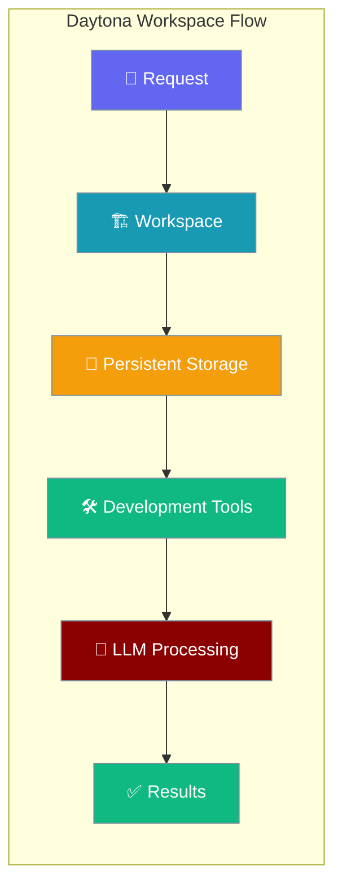
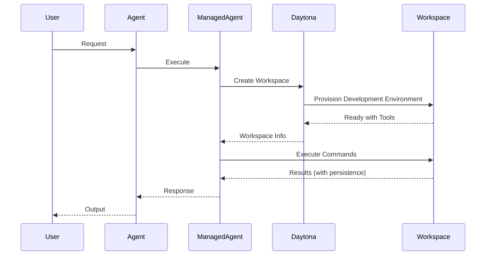

Daytona workspace agents provide persistent development environments with full IDE support and long-term storage.



## Quick Start

<Steps>
<Step title="Setup Daytona API Key">
```bash
export DAYTONA_API_KEY="your-daytona-api-key"
```

Get your API key from [Daytona Dashboard](https://www.daytona.io)
</Step>

<Step title="Basic Daytona Agent">
```python
import asyncio
from praisonai import Agent, ManagedAgent, LocalManagedConfig

managed = ManagedAgent(
    provider="local",
    config=LocalManagedConfig(
        model="gpt-4o-mini",
        name="DaytonaAgent"
    ),
    compute="daytona"  # Requires DAYTONA_API_KEY
)
agent = Agent(name="daytona-agent", backend=managed)

# Provision persistent workspace
info = asyncio.run(managed.provision_compute())
print(f"Workspace: {info.instance_id}, Status: {info.status}")

# Execute in development environment
result = asyncio.run(managed.execute_in_compute("python3 --version && node --version"))
print(result["stdout"])
```
</Step>
</Steps>

---

## How It Works



Daytona provides full development environments with persistent storage, making them ideal for long-term projects.

---

## Workspace Management

### Development Environment

```python
import asyncio
from praisonai import Agent, ManagedAgent, LocalManagedConfig

managed = ManagedAgent(
    provider="local",
    config=LocalManagedConfig(model="gpt-4o-mini"),
    compute="daytona"
)

# Provision workspace with development tools
info = asyncio.run(managed.provision_compute(
    template="full-stack",  # Pre-configured development environment
    resources={"cpu": 2, "memory": 4096}  # 4GB memory
))

print(f"Workspace ID: {info.instance_id}")
print(f"Template: {info.template}")
print(f"Status: {info.status}")
```

### Persistent File Operations

```python
# Create project structure that persists
create_project = asyncio.run(managed.execute_in_compute("""
mkdir -p myproject/src myproject/tests myproject/docs
cd myproject

# Create package.json
cat > package.json << 'EOF'
{
  "name": "myproject",
  "version": "1.0.0",
  "description": "A sample project",
  "main": "src/index.js",
  "scripts": {
    "test": "jest",
    "start": "node src/index.js"
  }
}
EOF

# Create main application file
cat > src/index.js << 'EOF'
console.log("Hello from Daytona workspace!");

function fibonacci(n) {
    if (n <= 1) return n;
    return fibonacci(n - 1) + fibonacci(n - 2);
}

console.log("Fibonacci(10):", fibonacci(10));
EOF

# List project structure
find . -type f
"""))

print(create_project["stdout"])
```

### Development Workflow

```python
# Development workflow with persistent state
workflow = asyncio.run(managed.execute_in_compute("""
cd myproject

# Install dependencies
npm install express jest

# Update package.json to include express
cat > src/index.js << 'EOF'
const express = require('express');
const app = express();
const port = 3000;

app.get('/', (req, res) => {
    res.json({ message: 'Hello from Daytona workspace!', timestamp: new Date() });
});

app.get('/fibonacci/:n', (req, res) => {
    const n = parseInt(req.params.n);
    function fib(x) {
        if (x <= 1) return x;
        return fib(x - 1) + fib(x - 2);
    }
    res.json({ n: n, result: fib(n) });
});

if (require.main === module) {
    app.listen(port, () => {
        console.log(\`Server running at http://localhost:\${port}\`);
    });
}

module.exports = app;
EOF

# Create tests
cat > tests/index.test.js << 'EOF'
const request = require('supertest');
const app = require('../src/index');

describe('API Tests', () => {
    test('GET / should return message', async () => {
        const res = await request(app).get('/');
        expect(res.statusCode).toBe(200);
        expect(res.body.message).toContain('Hello');
    });

    test('GET /fibonacci/5 should return 5', async () => {
        const res = await request(app).get('/fibonacci/5');
        expect(res.statusCode).toBe(200);
        expect(res.body.result).toBe(5);
    });
});
EOF

# Install test dependencies
npm install supertest --save-dev

# Run tests
npm test
"""))

print(workflow["stdout"])
```

---

## LLM Integration

```python
import asyncio
from praisonai import Agent, ManagedAgent, LocalManagedConfig

managed = ManagedAgent(
    provider="local",
    config=LocalManagedConfig(
        model="gpt-4o-mini",
        system="You are a full-stack developer with access to a persistent Daytona workspace."
    ),
    compute="daytona"
)
agent = Agent(name="developer", backend=managed)

# Provision development workspace
info = asyncio.run(managed.provision_compute(template="full-stack"))

# LLM-driven development workflow
result = agent.start("""
Create a complete REST API for a todo application:
1. Set up a Node.js/Express project
2. Implement CRUD endpoints (GET, POST, PUT, DELETE)
3. Add in-memory storage
4. Include error handling
5. Write unit tests
6. Create documentation

The workspace should persist all files for future development.
""", stream=True)
```

---

## Common Patterns

### Full-Stack Development

```python
import asyncio
from praisonai import Agent, ManagedAgent, LocalManagedConfig

managed = ManagedAgent(
    provider="local",
    config=LocalManagedConfig(
        model="gpt-4o-mini",
        system="You are a full-stack developer using a Daytona workspace for development."
    ),
    compute="daytona"
)
agent = Agent(name="fullstack-dev", backend=managed)

# Full-stack workspace
info = asyncio.run(managed.provision_compute(
    template="full-stack",
    resources={"cpu": 4, "memory": 8192}  # 8GB for full development
))

# Build full application
result = agent.start("""
Create a full-stack web application:
1. Backend: Node.js/Express API with user authentication
2. Frontend: React application with login/dashboard
3. Database: JSON file-based storage
4. Testing: Unit and integration tests
5. Documentation: README with setup instructions

Structure the project professionally with separate folders.
""")
```

### DevOps Pipeline

```python
import asyncio
from praisonai import Agent, ManagedAgent, LocalManagedConfig

managed = ManagedAgent(
    provider="local",
    config=LocalManagedConfig(model="gpt-4o-mini"),
    compute="daytona"
)
agent = Agent(name="devops-engineer", backend=managed)

# DevOps workspace with tools
info = asyncio.run(managed.provision_compute(template="devops"))

# Set up CI/CD pipeline
result = agent.start("""
Create a DevOps pipeline setup:
1. Dockerfile for containerization
2. GitHub Actions workflow
3. Docker Compose for local development
4. Makefile for common operations
5. Environment configuration files
6. Deployment scripts

Focus on best practices and maintainability.
""")
```

### Long-term Project Development

```python
import asyncio
from praisonai import Agent, ManagedAgent, LocalManagedConfig

managed = ManagedAgent(
    provider="local",
    config=LocalManagedConfig(
        model="gpt-4o-mini",
        system="You are working on a long-term project in a persistent workspace."
    ),
    compute="daytona"
)
agent = Agent(name="project-lead", backend=managed)

# Resume existing workspace (if available)
existing_workspace_id = "workspace-123"  # From previous session
if existing_workspace_id:
    managed.resume_session(existing_workspace_id)

# Continue development
result = agent.start("""
Continue working on the project:
1. Check current project status
2. Review recent changes
3. Plan next development phase
4. Implement new features
5. Update documentation

Use git to track all changes.
""")
```

---

## Configuration Options

### Workspace Configuration

| Option | Type | Default | Description |
|--------|------|---------|-------------|
| `template` | `str` | `"basic"` | Workspace template |
| `resources` | `Dict` | `{"cpu": 2, "memory": 2048}` | Resource allocation |
| `storage` | `int` | `10240` | Storage in MB (10GB) |
| `timeout` | `int` | `0` | Workspace timeout (0 = persistent) |

### Available Templates

| Template | Environment | Pre-installed |
|----------|-------------|---------------|
| `basic` | Ubuntu with basics | git, curl, vim |
| `full-stack` | Full development | Node.js, Python, Docker |
| `python` | Python development | Python 3.11, pip, poetry |
| `nodejs` | Node.js development | Node.js 18, npm, yarn |
| `devops` | DevOps tools | Docker, kubectl, terraform |

### Persistent Storage

```python
import asyncio
from praisonai import Agent, ManagedAgent, LocalManagedConfig

managed = ManagedAgent(
    provider="local",
    config=LocalManagedConfig(model="gpt-4o-mini"),
    compute="daytona"
)

# Large persistent workspace
info = asyncio.run(managed.provision_compute(
    template="full-stack",
    resources={"cpu": 4, "memory": 8192},
    storage=51200,  # 50GB storage
    timeout=0       # Persistent (no auto-shutdown)
))
```

---

## Best Practices

<AccordionGroup>
<Accordion title="Resource Management">
Allocate appropriate CPU and memory for your development needs. Use larger resources for compilation and testing phases.
</Accordion>

<Accordion title="Version Control">
Always initialize git repositories in your workspace. Commit frequently and push to external repositories for backup.
</Accordion>

<Accordion title="Workspace Lifecycle">
Daytona workspaces persist data across sessions. Use workspace IDs to resume development. Clean up unused workspaces to manage costs.
</Accordion>

<Accordion title="Development Workflow">
Structure projects professionally with separate folders for source, tests, docs. Use package managers (npm, pip, poetry) for dependency management.
</Accordion>
</AccordionGroup>

---

## Related

<CardGroup cols={2}>
<Card title="Managed Agents" icon="cloud" href="/docs/concepts/managed-agents">
  Overview of managed agent concepts
</Card>
<Card title="E2B Cloud" icon="cloud-bolt" href="/docs/concepts/managed-agents-e2b">
  Instant cloud sandboxes
</Card>
</CardGroup>