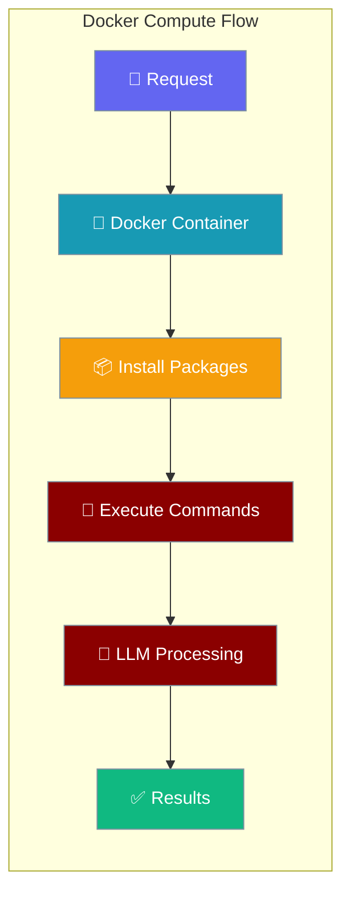
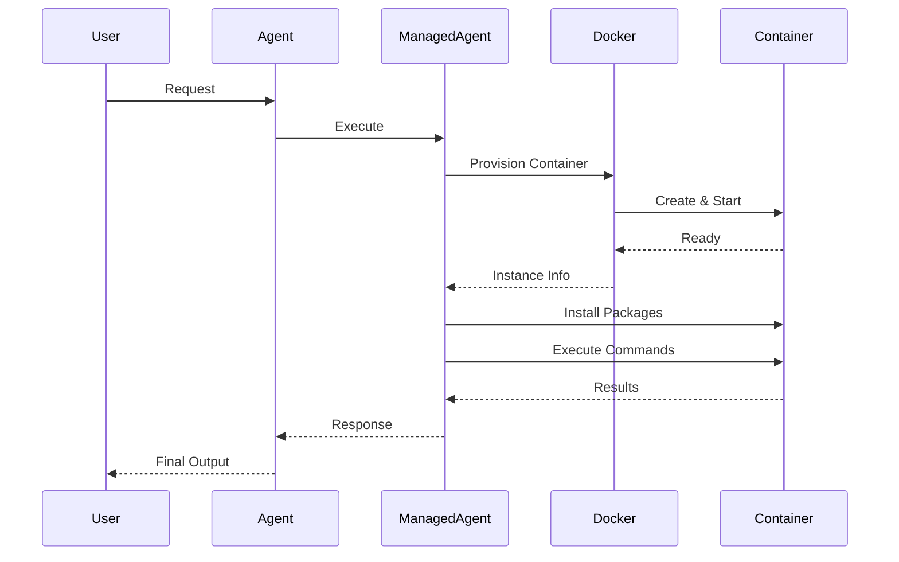

Docker compute agents run in isolated containers, providing reproducible environments with custom packages and dependencies.



## Quick Start

<Steps>
<Step title="Basic Docker Setup">
```python
import asyncio
from praisonai import Agent, ManagedAgent, LocalManagedConfig

managed = ManagedAgent(
    provider="local",
    config=LocalManagedConfig(
        model="gpt-4o-mini",
        name="DockerAgent"
    ),
    compute="docker"
)
agent = Agent(name="docker-agent", backend=managed)

# Provision container
info = asyncio.run(managed.provision_compute(image="python:3.12-slim"))
print(f"Container: {info.instance_id}, Status: {info.status}")

# Execute commands
result = asyncio.run(managed.execute_in_compute("python3 --version"))
print(result["stdout"])
```
</Step>

<Step title="With Package Installation">
```python
import asyncio
from praisonai import Agent, ManagedAgent, LocalManagedConfig

managed = ManagedAgent(
    provider="local",
    config=LocalManagedConfig(model="gpt-4o-mini"),
    compute="docker"
)
agent = Agent(name="data-agent", backend=managed)

# Provision with packages
info = asyncio.run(managed.provision_compute(
    image="python:3.12-slim",
    packages=["pandas", "numpy", "matplotlib"]
))

# Use installed packages
result = asyncio.run(managed.execute_in_compute(
    "python3 -c \"import pandas as pd; print(pd.__version__)\""
))
print(f"Pandas version: {result['stdout']}")
```
</Step>
</Steps>

---

## How It Works



Docker compute provides isolated, reproducible execution environments with custom package management.

---

## Container Management

### Provisioning Containers

```python
import asyncio
from praisonai import Agent, ManagedAgent, LocalManagedConfig

managed = ManagedAgent(
    provider="local",
    config=LocalManagedConfig(model="gpt-4o-mini"),
    compute="docker"
)

# Provision with custom image
info = asyncio.run(managed.provision_compute(
    image="python:3.11-slim",
    packages=["requests", "beautifulsoup4", "lxml"]
))

print(f"Container ID: {info.instance_id}")
print(f"Status: {info.status}")
print(f"Image: {info.image}")
```

### Executing Commands

```python
# Execute Python scripts
result = asyncio.run(managed.execute_in_compute("""
python3 -c "
import requests
response = requests.get('https://api.github.com/users/octocat')
print(f'Status: {response.status_code}')
print(f'User: {response.json()[\"name\"]}')
"
"""))

print(result["stdout"])
if result["stderr"]:
    print(f"Errors: {result['stderr']}")
```

### Container Lifecycle

```python
# Check container status
status = asyncio.run(managed.get_compute_status())
print(f"Container status: {status}")

# Clean up when done
asyncio.run(managed.shutdown_compute())
print("Container cleaned up")
```

---

## LLM Integration

```python
import asyncio
from praisonai import Agent, ManagedAgent, LocalManagedConfig

managed = ManagedAgent(
    provider="local",
    config=LocalManagedConfig(
        model="gpt-4o-mini",
        system="You are a data analysis assistant. Use the containerized environment to run Python code."
    ),
    compute="docker"
)
agent = Agent(name="analyst", backend=managed)

# Provision container with data science packages
info = asyncio.run(managed.provision_compute(
    image="python:3.12-slim",
    packages=["pandas", "matplotlib", "seaborn", "numpy"]
))

# LLM can now use the containerized environment
result = agent.start(
    "Create a bar chart showing sales data: {'Q1': 100, 'Q2': 150, 'Q3': 120, 'Q4': 180}",
    stream=True
)
```

---

## Common Patterns

### Data Processing Pipeline

```python
import asyncio
from praisonai import Agent, ManagedAgent, LocalManagedConfig

managed = ManagedAgent(
    provider="local",
    config=LocalManagedConfig(
        model="gpt-4o-mini",
        system="You are a data processing expert."
    ),
    compute="docker"
)
agent = Agent(name="processor", backend=managed)

# Set up data science environment
info = asyncio.run(managed.provision_compute(
    image="python:3.12-slim",
    packages=["pandas", "numpy", "scipy", "scikit-learn"]
))

# Process data through LLM + container
result = agent.start(
    "Load this CSV data and calculate basic statistics: age,salary\n25,50000\n30,60000\n35,70000",
    stream=True
)

# Clean up
asyncio.run(managed.shutdown_compute())
```

### Web Scraping Environment

```python
import asyncio
from praisonai import Agent, ManagedAgent, LocalManagedConfig

managed = ManagedAgent(
    provider="local",
    config=LocalManagedConfig(model="gpt-4o-mini"),
    compute="docker"
)
agent = Agent(name="scraper", backend=managed)

# Web scraping environment
info = asyncio.run(managed.provision_compute(
    image="python:3.12-slim",
    packages=["requests", "beautifulsoup4", "selenium", "lxml"]
))

# Execute scraping task
result = agent.start("Scrape the title from https://example.com", stream=True)
```

### Development Environment

```python
import asyncio
from praisonai import Agent, ManagedAgent, LocalManagedConfig

managed = ManagedAgent(
    provider="local",
    config=LocalManagedConfig(
        model="gpt-4o-mini",
        system="You are a full-stack developer."
    ),
    compute="docker"
)

# Multi-language environment
info = asyncio.run(managed.provision_compute(
    image="node:18-slim",
    packages=["python3", "pip", "git"]
))

# Install both Python and Node packages
asyncio.run(managed.execute_in_compute("apt-get update && apt-get install -y python3-pip"))
asyncio.run(managed.execute_in_compute("pip install flask"))
asyncio.run(managed.execute_in_compute("npm install express"))
```

---

## Configuration Options

### Compute Configuration

| Option | Type | Default | Description |
|--------|------|---------|-------------|
| `image` | `str` | `"python:3.12-slim"` | Docker base image |
| `packages` | `List[str]` | `[]` | Python packages to install |
| `environment` | `Dict[str, str]` | `{}` | Environment variables |
| `working_dir` | `str` | `"/workspace"` | Container working directory |

### Supported Images

| Image | Use Case | Pre-installed |
|-------|----------|---------------|
| `python:3.12-slim` | Python development | Python 3.12, pip |
| `node:18-slim` | JavaScript/Node.js | Node.js 18, npm |
| `ubuntu:22.04` | General Linux | Basic Linux utilities |
| `python:3.12-alpine` | Minimal Python | Python 3.12 (smaller size) |

---

## Best Practices

<AccordionGroup>
<Accordion title="Choose Appropriate Base Images">
Use slim images for faster startup. Alpine images for minimal size. Full images when you need system packages and compilation tools.
</Accordion>

<Accordion title="Package Management">
Install packages during provisioning rather than runtime. Cache heavy dependencies by using custom Docker images for repeated use.
</Accordion>

<Accordion title="Resource Management">
Always call `shutdown_compute()` when done to free container resources. Monitor container resource usage for long-running tasks.
</Accordion>

<Accordion title="Security Considerations">
Containers provide isolation but share the Docker daemon. Don't run untrusted code without additional sandboxing measures.
</Accordion>
</AccordionGroup>

---

## Related

<CardGroup cols={2}>
<Card title="Managed Agents" icon="cloud" href="/docs/concepts/managed-agents">
  Overview of managed agent concepts
</Card>
<Card title="E2B Cloud" icon="cloud-bolt" href="/docs/concepts/managed-agents-e2b">
  Cloud-based sandboxed execution
</Card>
</CardGroup>