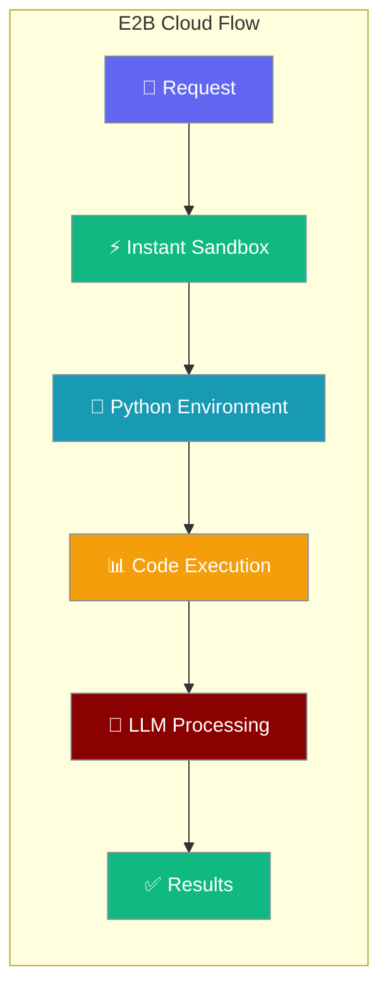
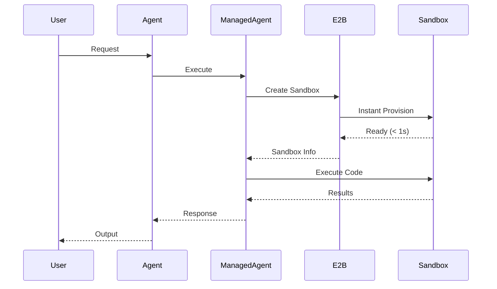

E2B cloud agents provide instant, isolated sandboxes in the cloud with pre-configured development environments.



## Quick Start

<Steps>
<Step title="Setup E2B API Key">
```bash
export E2B_API_KEY="your-e2b-api-key"
```

Get your API key from [E2B Dashboard](https://e2b.dev)
</Step>

<Step title="Basic E2B Agent">
```python
import asyncio
from praisonaiagents import Agent
from praisonai.integrations.managed_agents import ManagedAgent, ManagedConfig

managed = ManagedAgent(
    provider="local",
    config=ManagedConfig(
        model="gpt-4o-mini",
        name="E2BAgent"
    ),
    compute="e2b"  # Requires E2B_API_KEY
)
agent = Agent(name="e2b-agent", backend=managed)

# Provision instant sandbox
info = asyncio.run(managed.provision_compute())
print(f"Sandbox: {info.instance_id}, Status: {info.status}")

# Execute Python code
result = asyncio.run(managed.execute_in_compute("python3 -c \"print(42 * 13)\""))
print(f"Result: {result['stdout']}")
```
</Step>
</Steps>

---

## How It Works



E2B provides instant sandbox provisioning with pre-built environments, eliminating container startup time.

---

## Sandbox Management

### Instant Provisioning

```python
import asyncio
from praisonaiagents import Agent
from praisonai.integrations.managed_agents import ManagedAgent, ManagedConfig

managed = ManagedAgent(
    provider="local",
    config=ManagedConfig(model="gpt-4o-mini"),
    compute="e2b"
)

# E2B sandboxes start in under 1 second
info = asyncio.run(managed.provision_compute())
print(f"Sandbox ID: {info.instance_id}")
print(f"Status: {info.status}")
print(f"Template: {info.template}")  # Default: base Python environment
```

### Code Execution

```python
# Execute Python scripts
result = asyncio.run(managed.execute_in_compute("""
python3 -c "
import json
import urllib.request

# Fetch data
with urllib.request.urlopen('https://api.github.com/users/octocat') as response:
    data = json.loads(response.read().decode())
    print(f'GitHub user: {data[\"name\"]}')
    print(f'Public repos: {data[\"public_repos\"]}')
"
"""))

print(result["stdout"])
```

### File Operations

```python
# Create and run Python files
create_file = asyncio.run(managed.execute_in_compute("""
cat > data_analysis.py << 'EOF'
import csv
import statistics

# Sample data
data = [1, 2, 3, 4, 5, 10, 15, 20, 25, 30]

print(f"Mean: {statistics.mean(data)}")
print(f"Median: {statistics.median(data)}")
print(f"Mode: {statistics.mode(data) if len(set(data)) < len(data) else 'No mode'}")
print(f"Standard deviation: {statistics.stdev(data):.2f}")
EOF
"""))

run_file = asyncio.run(managed.execute_in_compute("python3 data_analysis.py"))
print(run_file["stdout"])
```

---

## LLM Integration

```python
import asyncio
from praisonaiagents import Agent
from praisonai.integrations.managed_agents import ManagedAgent, ManagedConfig

managed = ManagedAgent(
    provider="local",
    config=ManagedConfig(
        model="gpt-4o-mini",
        system="You are a Python developer. Use the E2B sandbox to run and test code."
    ),
    compute="e2b"
)
agent = Agent(name="python-dev", backend=managed)

# Provision sandbox
info = asyncio.run(managed.provision_compute())

# LLM can execute code in the sandbox
result = agent.start(
    "Write a Python script that downloads a JSON file from an API, processes it, and shows statistics",
    stream=True
)

# Multi-turn with persistent sandbox
result2 = agent.start(
    "Now modify that script to save the results to a CSV file",
    stream=True
)

# Clean up
asyncio.run(managed.shutdown_compute())
```

---

## Common Patterns

### Data Science Workflow

```python
import asyncio
from praisonaiagents import Agent
from praisonai.integrations.managed_agents import ManagedAgent, ManagedConfig

managed = ManagedAgent(
    provider="local",
    config=ManagedConfig(
        model="gpt-4o-mini",
        system="You are a data scientist. Use Python for analysis and visualization."
    ),
    compute="e2b"
)
agent = Agent(name="data-scientist", backend=managed)

# Provision for data science
info = asyncio.run(managed.provision_compute())

# Install data science packages if needed
asyncio.run(managed.execute_in_compute("pip install pandas matplotlib seaborn"))

# Analyze data
result = agent.start("""
Analyze this sales data and create a visualization:
January: 1000
February: 1200
March: 800
April: 1500
May: 1300
""", stream=True)
```

### Web Scraping

```python
import asyncio
from praisonaiagents import Agent
from praisonai.integrations.managed_agents import ManagedAgent, ManagedConfig

managed = ManagedAgent(
    provider="local",
    config=ManagedConfig(model="gpt-4o-mini"),
    compute="e2b"
)
agent = Agent(name="scraper", backend=managed)

# Set up scraping environment
info = asyncio.run(managed.provision_compute())
asyncio.run(managed.execute_in_compute("pip install requests beautifulsoup4 lxml"))

# Scrape and process
result = agent.start("Scrape the latest Python package from PyPI homepage and show its details")
```

### API Testing

```python
import asyncio
from praisonaiagents import Agent
from praisonai.integrations.managed_agents import ManagedAgent, ManagedConfig

managed = ManagedAgent(
    provider="local",
    config=ManagedConfig(
        model="gpt-4o-mini",
        system="You are an API testing expert."
    ),
    compute="e2b"
)
agent = Agent(name="api-tester", backend=managed)

# Test REST APIs
info = asyncio.run(managed.provision_compute())
result = agent.start("""
Test these REST API endpoints and report status:
1. GET https://api.github.com/users/octocat
2. GET https://jsonplaceholder.typicode.com/posts/1
3. GET https://httpbin.org/get

Show response codes, headers, and sample data for each.
""")
```

---

## Configuration Options

### E2B Configuration

| Option | Type | Default | Description |
|--------|------|---------|-------------|
| `template` | `str` | `"base"` | E2B template to use |
| `timeout` | `int` | `300` | Sandbox timeout in seconds |
| `memory` | `int` | `512` | Memory limit in MB |
| `cpu` | `float` | `1.0` | CPU limit (cores) |

### Available Templates

| Template | Environment | Pre-installed |
|----------|-------------|---------------|
| `base` | Python 3.11 | python, pip, git |
| `python` | Python 3.11 | numpy, pandas, matplotlib |
| `nodejs` | Node.js 18 | node, npm, yarn |
| `ubuntu` | Ubuntu 22.04 | Standard Linux tools |

### Custom Templates

```python
import asyncio
from praisonaiagents import Agent
from praisonai.integrations.managed_agents import ManagedAgent, ManagedConfig

managed = ManagedAgent(
    provider="local",
    config=ManagedConfig(model="gpt-4o-mini"),
    compute="e2b"
)

# Use specific template
info = asyncio.run(managed.provision_compute(
    template="python",  # Pre-configured Python data science environment
    memory=1024,        # 1GB memory
    timeout=600         # 10 minutes timeout
))
```

---

## Best Practices

<AccordionGroup>
<Accordion title="Choose the Right Template">
Use `base` for general Python work. Use `python` template for data science with pre-installed packages. Create custom templates for repeated setups.
</Accordion>

<Accordion title="Package Management">
Install packages once per sandbox session. E2B sandboxes persist packages during the session but reset between sessions.
</Accordion>

<Accordion title="Sandbox Lifecycle">
E2B sandboxes auto-shutdown after timeout. Always call `shutdown_compute()` to clean up resources and avoid charges.
</Accordion>

<Accordion title="API Key Security">
Store E2B_API_KEY securely. Never commit API keys to code. Use environment variables or secure secret management.
</Accordion>
</AccordionGroup>

---

## Related

<CardGroup cols={2}>
<Card title="Managed Agents" icon="cloud" href="/docs/concepts/managed-agents">
  Overview of managed agent concepts
</Card>
<Card title="Modal Compute" icon="server" href="/docs/concepts/managed-agents-modal">
  Serverless compute environments
</Card>
</CardGroup>