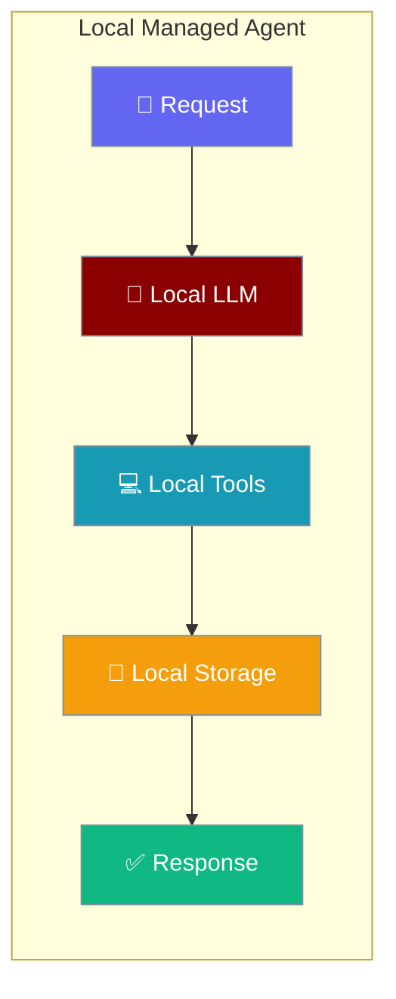
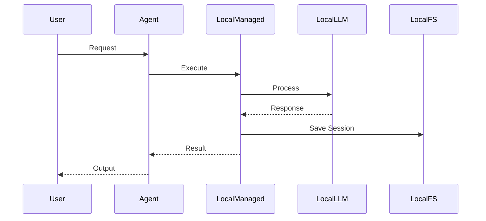

Local managed agents provide cloud-style APIs while running on your local infrastructure.



## Quick Start

<Steps>
<Step title="Basic Local Agent">
```python
from praisonaiagents import Agent
from praisonai.integrations.managed_agents import ManagedAgent, ManagedConfig

managed = ManagedAgent(
    provider="local",
    config=ManagedConfig(model="gpt-4o-mini")
)
agent = Agent(name="local-assistant", backend=managed)
result = agent.start("What is the capital of France?", stream=True)
```
</Step>

<Step title="With Custom Configuration">
```python
from praisonaiagents import Agent
from praisonai.integrations.managed_agents import ManagedAgent, ManagedConfig

managed = ManagedAgent(
    provider="local",
    config=ManagedConfig(
        model="gpt-4o-mini",
        system="You are a helpful assistant. Be concise.",
        name="LocalAgent",
        tools=["web_search", "calculator"]
    )
)
agent = Agent(name="local-advanced", backend=managed)
result = agent.start("Search for today's weather and calculate 25 * 4", stream=True)
```
</Step>
</Steps>

---

## How It Works



Local managed agents provide the same APIs as cloud providers while keeping data on your infrastructure.

---

## Configuration Options

### ManagedConfig Fields

| Option | Type | Default | Description |
|--------|------|---------|-------------|
| `model` | `str` | `"gpt-4o-mini"` | OpenAI model to use |
| `system` | `str` | `"You are a helpful assistant."` | System prompt |
| `name` | `str` | `"Agent"` | Agent display name |
| `tools` | `List[str]` | `[]` | Enabled tool names |
| `temperature` | `float` | `0.7` | Response randomness |
| `max_tokens` | `int` | `1000` | Maximum response length |

---

## Session Management

### Persistent Sessions

```python
from praisonaiagents import Agent
from praisonai.integrations.managed_agents import ManagedAgent, ManagedConfig

# Create agent with session persistence
managed = ManagedAgent(
    provider="local",
    config=ManagedConfig(
        model="gpt-4o-mini",
        name="PersistentAgent"
    )
)
agent = Agent(name="persistent", backend=managed)

# First conversation
agent.start("Remember: my favorite color is blue")
session_info = managed.retrieve_session()
print(f"Session ID: {session_info['id']}")

# Save session for later
ids = managed.save_ids()
# Store ids to file/database for persistence across restarts
```

### Resume Sessions

```python
# In another process/restart
managed2 = ManagedAgent(
    provider="local", 
    config=ManagedConfig(model="gpt-4o-mini")
)
managed2.restore_ids(ids)
managed2.resume_session(ids["session_id"])

agent2 = Agent(name="resumed", backend=managed2)
result = agent2.start("What is my favorite color?")  # Knows: blue
```

---

## Multi-turn Conversations

```python
from praisonaiagents import Agent
from praisonai.integrations.managed_agents import ManagedAgent, ManagedConfig

managed = ManagedAgent(
    provider="local",
    config=ManagedConfig(
        model="gpt-4o-mini",
        system="You are a math tutor. Help students learn step by step.",
        name="MathTutor"
    )
)
agent = Agent(name="tutor", backend=managed)

# Multi-turn conversation in same session
response1 = agent.start("Explain what a derivative is", stream=True)
response2 = agent.start("Now show me how to find the derivative of x²", stream=True)
response3 = agent.start("What about x³?", stream=True)

# Session remembers all previous context
```

---

## Usage Tracking

```python
from praisonaiagents import Agent
from praisonai.integrations.managed_agents import ManagedAgent, ManagedConfig

managed = ManagedAgent(
    provider="local",
    config=ManagedConfig(model="gpt-4o-mini")
)
agent = Agent(name="tracker", backend=managed)

# Execute some tasks
agent.start("Write a short poem")
agent.start("Explain quantum physics briefly")

# Check usage
session_info = managed.retrieve_session()
if session_info.get("usage"):
    print(f"Input tokens: {session_info['usage']['input_tokens']}")
    print(f"Output tokens: {session_info['usage']['output_tokens']}")

# Also available on instance
print(f"Total input: {managed.total_input_tokens}")
print(f"Total output: {managed.total_output_tokens}")
```

---

## Best Practices

<AccordionGroup>
<Accordion title="Model Selection">
Use `gpt-4o-mini` for cost-effective operations. Upgrade to `gpt-4o` for complex reasoning tasks. Configure appropriate `max_tokens` to control costs.
</Accordion>

<Accordion title="Session Persistence">
Save session IDs using `save_ids()` for resuming conversations. Store IDs in a database or file system for persistence across application restarts.
</Accordion>

<Accordion title="Tool Configuration">
Only enable tools your agent needs. Use selective tool lists like `["web_search", "calculator"]` instead of all tools to improve performance.
</Accordion>

<Accordion title="Error Handling">
Implement proper error handling for API failures. Local managed agents depend on OpenAI API availability and rate limits.
</Accordion>
</AccordionGroup>

---

## Related

<CardGroup cols={2}>
<Card title="Managed Agents" icon="cloud" href="/docs/concepts/managed-agents">
  Overview of managed agent concepts
</Card>
<Card title="Docker Compute" icon="docker" href="/docs/concepts/managed-agents-docker">
  Containerized execution environments
</Card>
</CardGroup>