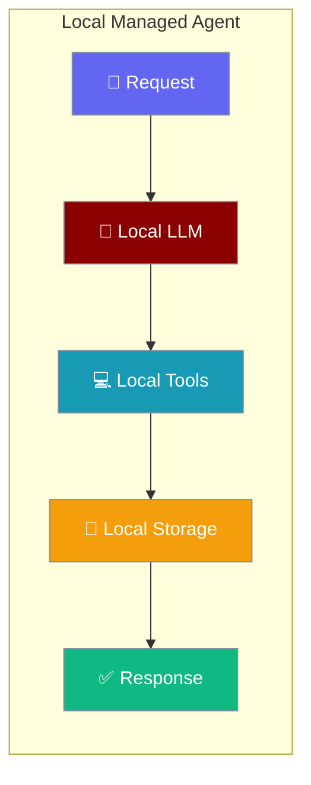
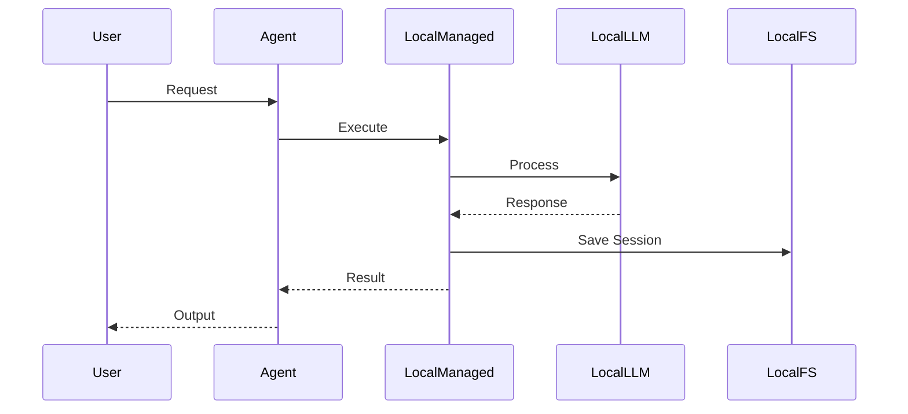
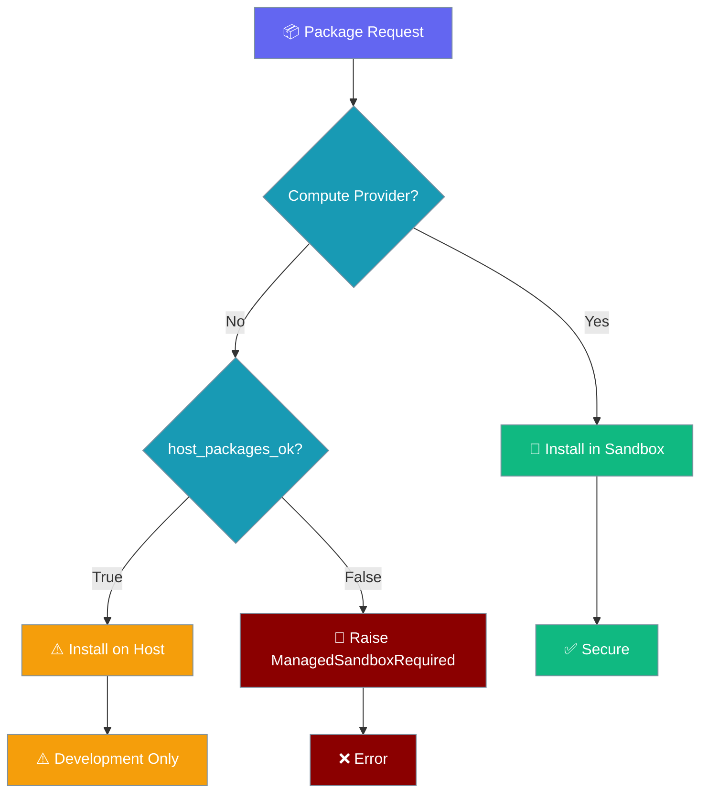
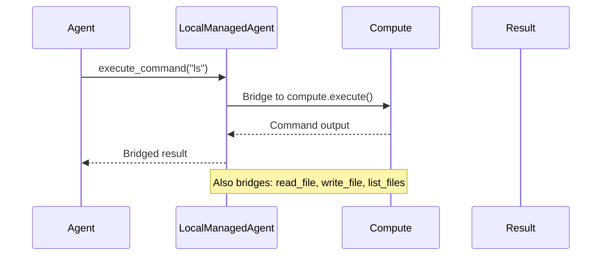

Local managed agents provide cloud-style APIs while running on your local infrastructure.



## Quick Start

<Steps>
<Step title="Basic Local Agent">
```python
from praisonaiagents import Agent
from praisonai.integrations.managed_agents import ManagedAgent, ManagedConfig

managed = ManagedAgent(
    provider="local",
    config=ManagedConfig(model="gpt-4o-mini")
)
agent = Agent(name="local-assistant", backend=managed)
result = agent.start("What is the capital of France?", stream=True)
```
</Step>

<Step title="With Secure Package Installation">
```python
from praisonaiagents import Agent
from praisonai.integrations.managed_agents import ManagedAgent, ManagedConfig

managed = ManagedAgent(
    provider="local",
    config=ManagedConfig(
        model="gpt-4o-mini",
        packages={"pip": ["pandas", "numpy"]},
    ),
    compute="docker",   # required when packages are specified
)
agent = Agent(name="analyst", backend=managed)
result = agent.start("Analyze this data: [1,2,3,4,5]", stream=True)
```
</Step>
</Steps>

---

## How It Works



Local managed agents provide the same APIs as cloud providers while keeping data on your infrastructure.

---

## Security: Sandboxed Package Installation

Local managed agents enforce sandbox-first security for package installation by default.



When `packages` are specified, three resolution paths exist:

1. **Compute Provider (Recommended)**: Attach `compute="docker"` to install packages in a sandbox
2. **Host Installation (Development Only)**: Set `host_packages_ok=True` for trusted environments
3. **No Packages**: Remove `packages` configuration to avoid installation

<Warning>
Setting `host_packages_ok=True` installs packages directly on your host system, which can create security risks. Only use this in trusted developer environments where you control the package sources.
</Warning>

---

## Compute Tool Bridging

When a compute provider is attached, four shell-based tools automatically execute inside the compute instance instead of on the host:



Bridged tools: `execute_command`, `read_file`, `write_file`, `list_files`

---

## Configuration Options

### LocalManagedConfig Fields

| Option | Type | Default | Description |
|--------|------|---------|-------------|
| `model` | `str` | `"gpt-4o"` | LLM model to use |
| `system` | `str` | `"You are a helpful coding assistant."` | System prompt |
| `name` | `str` | `"Agent"` | Agent display name |
| `tools` | `List[str]` | Default tools | Enabled tool names |
| `packages` | `Dict[str, List[str]]` | `None` | Packages to install (e.g. `{"pip": ["pandas"]}`) |
| `networking` | `Dict[str, Any]` | `{"type": "unrestricted"}` | Network access policy |
| `host_packages_ok` | `bool` | `False` | Security opt-out. When `True`, permits pip install on host when no compute provider is attached |
| `working_dir` | `str` | `""` | Working directory inside the sandbox |
| `env` | `Dict[str, str]` | `{}` | Extra environment variables |

---

## Session Management

### Persistent Sessions

```python
from praisonaiagents import Agent
from praisonai.integrations.managed_agents import ManagedAgent, ManagedConfig

# Create agent with session persistence
managed = ManagedAgent(
    provider="local",
    config=ManagedConfig(
        model="gpt-4o-mini",
        name="PersistentAgent"
    )
)
agent = Agent(name="persistent", backend=managed)

# First conversation
agent.start("Remember: my favorite color is blue")
session_info = managed.retrieve_session()
print(f"Session ID: {session_info['id']}")

# Save session for later
ids = managed.save_ids()
# Store ids to file/database for persistence across restarts
```

### Resume Sessions

```python
# In another process/restart
managed2 = ManagedAgent(
    provider="local", 
    config=ManagedConfig(model="gpt-4o-mini")
)
managed2.restore_ids(ids)
managed2.resume_session(ids["session_id"])

agent2 = Agent(name="resumed", backend=managed2)
result = agent2.start("What is my favorite color?")  # Knows: blue
```

---

## Multi-turn Conversations

```python
from praisonaiagents import Agent
from praisonai.integrations.managed_agents import ManagedAgent, ManagedConfig

managed = ManagedAgent(
    provider="local",
    config=ManagedConfig(
        model="gpt-4o-mini",
        system="You are a math tutor. Help students learn step by step.",
        name="MathTutor"
    )
)
agent = Agent(name="tutor", backend=managed)

# Multi-turn conversation in same session
response1 = agent.start("Explain what a derivative is", stream=True)
response2 = agent.start("Now show me how to find the derivative of x²", stream=True)
response3 = agent.start("What about x³?", stream=True)

# Session remembers all previous context
```

---

## Usage Tracking

```python
from praisonaiagents import Agent
from praisonai.integrations.managed_agents import ManagedAgent, ManagedConfig

managed = ManagedAgent(
    provider="local",
    config=ManagedConfig(model="gpt-4o-mini")
)
agent = Agent(name="tracker", backend=managed)

# Execute some tasks
agent.start("Write a short poem")
agent.start("Explain quantum physics briefly")

# Check usage
session_info = managed.retrieve_session()
if session_info.get("usage"):
    print(f"Input tokens: {session_info['usage']['input_tokens']}")
    print(f"Output tokens: {session_info['usage']['output_tokens']}")

# Also available on instance
print(f"Total input: {managed.total_input_tokens}")
print(f"Total output: {managed.total_output_tokens}")
```

---

## Best Practices

<AccordionGroup>
<Accordion title="Configure Security Appropriately">
Use compute providers like `compute="docker"` for package installation. Only set `host_packages_ok=True` in trusted developer environments. Packages require a sandbox by default to prevent security risks.
</Accordion>

<Accordion title="Handle ManagedSandboxRequired">
```python
from praisonai.integrations.managed_agents import ManagedSandboxRequired
try:
    agent.start("Install pandas and analyze data")
except ManagedSandboxRequired as e:
    # Either attach a compute provider, or set host_packages_ok=True
    print(f"Security error: {e}")
```
</Accordion>

<Accordion title="Session Persistence">
Save session IDs using `save_ids()` for resuming conversations. Store IDs in a database or file system for persistence across application restarts.
</Accordion>

<Accordion title="Tool Configuration">
Only enable tools your agent needs. When using compute providers, shell tools automatically execute in the sandbox for security.
</Accordion>
</AccordionGroup>

---

## Related

<CardGroup cols={2}>
<Card title="Managed Agents" icon="cloud" href="/docs/concepts/managed-agents">
  Overview of managed agent concepts
</Card>
<Card title="Docker Compute" icon="docker" href="/docs/concepts/managed-agents-docker">
  Containerized execution environments
</Card>
</CardGroup>