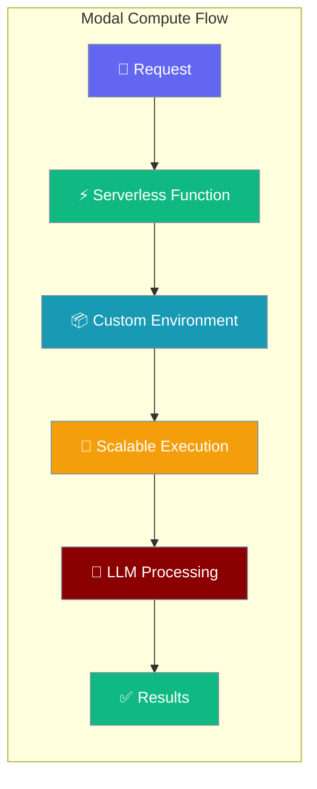
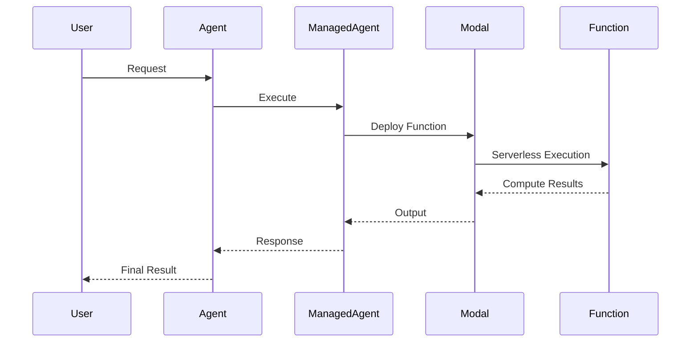

Modal compute agents leverage serverless infrastructure for high-performance, scalable computing workloads.



## Quick Start

<Steps>
<Step title="Setup Modal Authentication">
```bash
pip install modal
modal token new
```

Set up Modal token with your credentials from [Modal Dashboard](https://modal.com)
</Step>

<Step title="Basic Modal Agent">
```python
import asyncio
from praisonai import Agent, ManagedAgent, LocalManagedConfig

managed = ManagedAgent(
    provider="local",
    config=LocalManagedConfig(
        model="gpt-4o-mini",
        name="ModalAgent"
    ),
    compute="modal"  # Requires Modal authentication
)
agent = Agent(name="modal-agent", backend=managed)

# Provision serverless compute
info = asyncio.run(managed.provision_compute())
print(f"Function: {info.instance_id}, Status: {info.status}")

# Execute high-performance computation
result = asyncio.run(managed.execute_in_compute("python3 -c \"print(sum(range(1000001)))\""))
print(f"Sum of 1-1M: {result['stdout']}")
```
</Step>
</Steps>

---

## How It Works



Modal provides serverless compute with automatic scaling, custom environments, and high-performance execution.

---

## Serverless Compute

### Function Deployment

```python
import asyncio
from praisonai import Agent, ManagedAgent, LocalManagedConfig

managed = ManagedAgent(
    provider="local",
    config=LocalManagedConfig(model="gpt-4o-mini"),
    compute="modal"
)

# Deploy function with custom image
info = asyncio.run(managed.provision_compute(
    image="python:3.12",
    packages=["numpy", "scipy", "numba"]  # High-performance packages
))

print(f"Function deployed: {info.instance_id}")
print(f"Status: {info.status}")
```

### High-Performance Computing

```python
# Execute computationally intensive tasks
result = asyncio.run(managed.execute_in_compute("""
python3 -c "
import numpy as np
import time

# Large matrix multiplication
start = time.time()
a = np.random.rand(1000, 1000)
b = np.random.rand(1000, 1000)
c = np.dot(a, b)
end = time.time()

print(f'Matrix multiplication (1000x1000): {end - start:.3f} seconds')
print(f'Result shape: {c.shape}')
print(f'Sample result: {c[0, 0]:.6f}')
"
"""))

print(result["stdout"])
```

### Parallel Processing

```python
# Execute parallel computations
result = asyncio.run(managed.execute_in_compute("""
python3 -c "
import multiprocessing as mp
import time

def worker(n):
    return sum(i * i for i in range(n))

start = time.time()
with mp.Pool() as pool:
    results = pool.map(worker, [100000] * 8)
end = time.time()

print(f'Parallel computation: {end - start:.3f} seconds')
print(f'Results: {results[:3]}...')
"
"""))

print(result["stdout"])
```

---

## LLM Integration

```python
import asyncio
from praisonai import Agent, ManagedAgent, LocalManagedConfig

managed = ManagedAgent(
    provider="local",
    config=LocalManagedConfig(
        model="gpt-4o-mini",
        system="You are a computational scientist. Use Modal's serverless platform for intensive computations."
    ),
    compute="modal"
)
agent = Agent(name="scientist", backend=managed)

# Provision high-performance environment
info = asyncio.run(managed.provision_compute(
    packages=["numpy", "scipy", "matplotlib", "pandas", "scikit-learn"]
))

# LLM directs high-performance computing
result = agent.start("""
Perform a Monte Carlo simulation to estimate π using 10 million random points.
Show the convergence process and final estimate.
""", stream=True)
```

---

## Common Patterns

### Machine Learning Pipeline

```python
import asyncio
from praisonai import Agent, ManagedAgent, LocalManagedConfig

managed = ManagedAgent(
    provider="local",
    config=LocalManagedConfig(
        model="gpt-4o-mini",
        system="You are an ML engineer using Modal for scalable model training."
    ),
    compute="modal"
)
agent = Agent(name="ml-engineer", backend=managed)

# ML environment with GPU support (if available)
info = asyncio.run(managed.provision_compute(
    packages=["torch", "scikit-learn", "numpy", "pandas"]
))

# Train models at scale
result = agent.start("""
Create and train a simple neural network on synthetic data:
1. Generate 10,000 samples with 10 features
2. Create a 3-layer neural network
3. Train for 100 epochs
4. Report final accuracy and training time
""")
```

### Data Processing Pipeline

```python
import asyncio
from praisonai import Agent, ManagedAgent, LocalManagedConfig

managed = ManagedAgent(
    provider="local",
    config=LocalManagedConfig(
        model="gpt-4o-mini",
        system="You are a data engineer processing large datasets efficiently."
    ),
    compute="modal"
)
agent = Agent(name="data-engineer", backend=managed)

# Big data environment
info = asyncio.run(managed.provision_compute(
    packages=["pandas", "polars", "pyarrow", "dask"]
))

# Process large datasets
result = agent.start("""
Simulate processing a large dataset:
1. Create a 1M row DataFrame with random data
2. Perform groupby operations and aggregations
3. Calculate percentiles and statistics
4. Measure processing time and memory usage
""")
```

### Scientific Computing

```python
import asyncio
from praisonai import Agent, ManagedAgent, LocalManagedConfig

managed = ManagedAgent(
    provider="local",
    config=LocalManagedConfig(model="gpt-4o-mini"),
    compute="modal"
)
agent = Agent(name="physicist", backend=managed)

# Scientific computing environment
info = asyncio.run(managed.provision_compute(
    packages=["numpy", "scipy", "sympy", "matplotlib"]
))

# Complex calculations
result = agent.start("""
Solve a differential equation numerically:
1. dy/dx = -2*y + x with initial condition y(0) = 1
2. Solve over x = [0, 5]
3. Plot the solution
4. Compare with analytical solution
""")
```

---

## Configuration Options

### Modal Configuration

| Option | Type | Default | Description |
|--------|------|---------|-------------|
| `image` | `str` | `"python:3.12"` | Base container image |
| `packages` | `List[str]` | `[]` | Python packages to install |
| `gpu` | `str` | `None` | GPU type (if needed) |
| `memory` | `int` | `1024` | Memory limit in MB |
| `cpu` | `float` | `2.0` | CPU cores |
| `timeout` | `int` | `300` | Function timeout |

### Compute Resources

| Resource Tier | CPU | Memory | Use Case |
|---------------|-----|--------|----------|
| **Basic** | 1 core | 1GB | Light computation |
| **Standard** | 2 cores | 4GB | General workloads |
| **High-CPU** | 8 cores | 16GB | CPU-intensive tasks |
| **High-Memory** | 4 cores | 32GB | Memory-intensive tasks |

### GPU Support

```python
import asyncio
from praisonai import Agent, ManagedAgent, LocalManagedConfig

managed = ManagedAgent(
    provider="local",
    config=LocalManagedConfig(model="gpt-4o-mini"),
    compute="modal"
)

# GPU-accelerated compute (if available in your Modal plan)
info = asyncio.run(managed.provision_compute(
    packages=["torch", "transformers", "accelerate"],
    gpu="T4",  # or "A10G", "A100" based on availability
    memory=8192  # 8GB for GPU workloads
))
```

---

## Best Practices

<AccordionGroup>
<Accordion title="Resource Optimization">
Choose appropriate CPU and memory based on workload. Use GPU instances only when needed for deep learning or parallel computation.
</Accordion>

<Accordion title="Package Management">
Install packages during provisioning for better performance. Cache frequently used environments to reduce cold start times.
</Accordion>

<Accordion title="Cost Management">
Modal charges for compute time. Shutdown functions promptly after use. Monitor usage in the Modal dashboard.
</Accordion>

<Accordion title="Scaling Considerations">
Modal auto-scales serverless functions. Design stateless computations for better parallelization and scaling.
</Accordion>
</AccordionGroup>

---

## Advanced Features

### Custom Images

```python
# Use custom Docker images for specialized environments
info = asyncio.run(managed.provision_compute(
    image="tensorflow/tensorflow:latest-gpu",
    packages=["transformers", "datasets"]
))
```

### Shared Storage

```python
# Access Modal's shared volumes (if configured)
result = asyncio.run(managed.execute_in_compute("""
# Upload/download files to/from Modal volumes
echo "Data processing complete" > /data/results.txt
cat /data/results.txt
"""))
```

### Environment Variables

```python
# Set environment variables for functions
result = asyncio.run(managed.execute_in_compute("""
export COMPUTE_TYPE=modal
export WORKER_ID=$RANDOM
python3 -c "import os; print(f'Running on {os.environ.get(\"COMPUTE_TYPE\")}')"
"""))
```

---

## Related

<CardGroup cols={2}>
<Card title="Managed Agents" icon="cloud" href="/docs/concepts/managed-agents">
  Overview of managed agent concepts
</Card>
<Card title="Docker Compute" icon="docker" href="/docs/concepts/managed-agents-docker">
  Containerized execution environments
</Card>
</CardGroup>