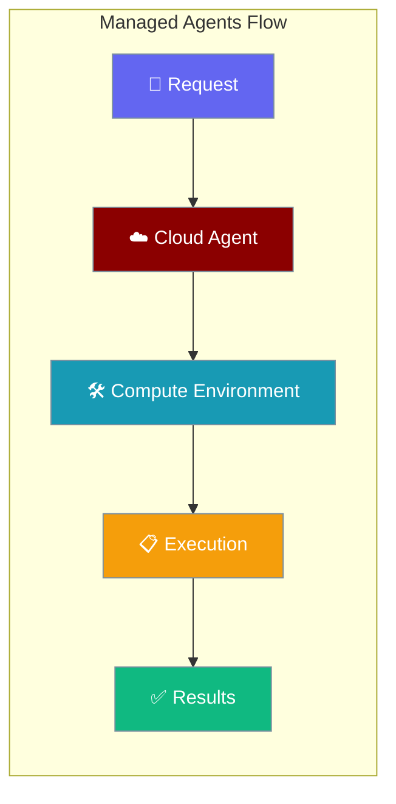
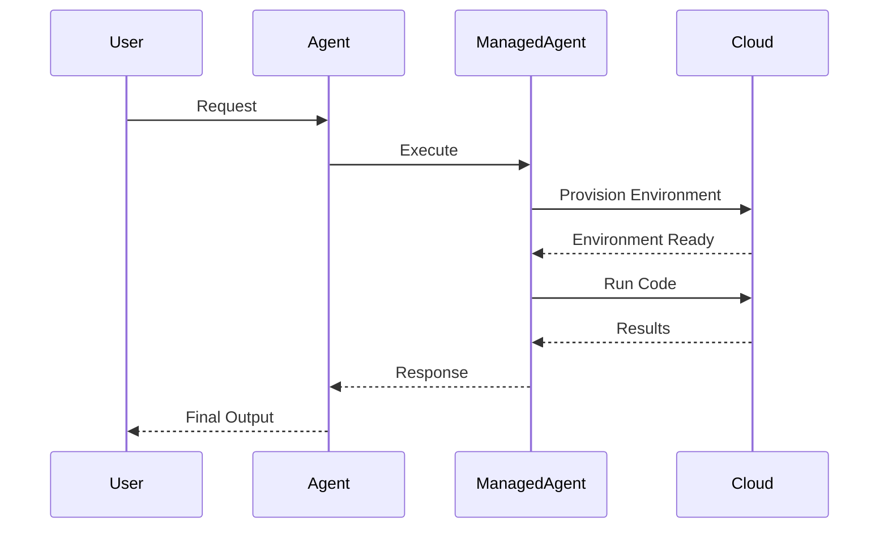

Managed Agents run on cloud infrastructure, automatically provisioning compute resources and managing execution environments.



## Quick Start

<Steps>
<Step title="Basic Usage">
```python
from praisonai import Agent, ManagedAgent

agent = Agent(name="teacher", backend=ManagedAgent())
result = agent.start("Write a Python script that prints Hello World and run it")
print(result)
```
</Step>

<Step title="With Configuration">
```python
from praisonai import Agent, ManagedAgent, ManagedConfig

managed = ManagedAgent(
    config=ManagedConfig(
        model="claude-sonnet-4-6",
        system="You are a helpful assistant. Be concise.",
        name="MyAgent",
        packages={"pip": ["pandas", "numpy"]},
    )
)
agent = Agent(name="data-analyst", backend=managed)
result = agent.start("Analyze this data: [1,2,3,4,5]", stream=True)
```
</Step>
</Steps>

---

## How It Works



| Component | Purpose | Managed By |
|-----------|---------|------------|
| **Agent Definition** | Model, system prompt, tools | Cloud Provider |
| **Environment** | Compute resources, packages | Cloud Provider |
| **Session** | Conversation context, state | Cloud Provider |
| **Execution** | Code running, tool usage | Cloud Provider |

---

## Compute Providers

Managed Agents support multiple compute providers for different use cases:

<CardGroup cols={2}>
<Card title="Local Provider" icon="desktop" href="/docs/concepts/managed-agents-local">
  Run on local infrastructure with cloud management
</Card>
<Card title="Docker Compute" icon="docker" href="/docs/concepts/managed-agents-docker">
  Containerized execution environments
</Card>
<Card title="E2B Cloud" icon="cloud-bolt" href="/docs/concepts/managed-agents-e2b">
  Instant cloud sandboxes for code execution
</Card>
<Card title="Modal Compute" icon="server" href="/docs/concepts/managed-agents-modal">
  Serverless compute for scalable workloads
</Card>
<Card title="Daytona Workspaces" icon="code" href="/docs/concepts/managed-agents-daytona">
  Development environments with persistent storage
</Card>
</CardGroup>

---

## Configuration Options

<Card title="ManagedConfig API Reference" icon="code" href="/docs/sdk/reference/typescript/classes/ManagedConfig">
  Complete configuration options for managed agents
</Card>

### Key Configuration Fields

| Option | Type | Default | Description |
|--------|------|---------|-------------|
| `model` | `str` | `"claude-haiku-4-5"` | LLM model to use |
| `system` | `str` | `"You are a helpful coding assistant."` | System prompt |
| `tools` | `List[Dict]` | `[{"type": "agent_toolset_20260401"}]` | Available tools |
| `packages` | `Dict[str, List[str]]` | `None` | Package dependencies |
| `networking` | `Dict[str, Any]` | `{"type": "unrestricted"}` | Network access policy |

---

## Common Patterns

### Environment with Packages

```python
from praisonai import Agent, ManagedAgent, ManagedConfig

managed = ManagedAgent(
    config=ManagedConfig(
        model="claude-sonnet-4-6",
        packages={
            "pip": ["pandas", "matplotlib", "requests"],
            "npm": ["@types/node", "axios"]
        },
        networking={"type": "limited"}
    )
)
agent = Agent(name="data-scientist", backend=managed)
```

### Session Persistence

```python
# Save session state
managed = ManagedAgent(config=config)
agent = Agent(name="persistent", backend=managed)
agent.start("Remember: my favorite color is blue")
ids = managed.save_ids()

# Resume in another process
managed2 = ManagedAgent(config=config)
managed2.restore_ids(ids)
managed2.resume_session(ids["session_id"])
agent2 = Agent(name="resumed", backend=managed2)
result = agent2.start("What is my favorite color?")  # Knows: blue
```

### Custom Tools

```python
def handle_calculator(tool_name, tool_input):
    expr = tool_input.get("expression", "0")
    return str(eval(expr, {"__builtins__": {}}))

managed = ManagedAgent(
    config=ManagedConfig(
        tools=[{
            "type": "custom",
            "name": "calculator",
            "description": "Evaluate math expressions",
            "input_schema": {
                "type": "object",
                "properties": {"expression": {"type": "string"}},
                "required": ["expression"]
            }
        }]
    ),
    on_custom_tool=handle_calculator
)
```

---

## Best Practices

<AccordionGroup>
<Accordion title="Choose the Right Compute Provider">
- **Local**: Development and testing with existing infrastructure
- **Docker**: Isolated, reproducible environments
- **E2B**: Quick prototyping and sandboxed execution
- **Modal**: High-performance, scalable workloads
- **Daytona**: Development environments with persistence
</Accordion>

<Accordion title="Manage Sessions Effectively">
Save session IDs for resuming conversations across process restarts. Use `save_ids()` and `restore_ids()` to maintain context between runs.
</Accordion>

<Accordion title="Configure Security Appropriately">
Use `networking: {"type": "limited"}` for untrusted code execution. Enable only required packages to minimize attack surface.
</Accordion>

<Accordion title="Monitor Resource Usage">
Track token usage with `retrieve_session()` to monitor costs. Set appropriate timeouts for long-running operations.
</Accordion>
</AccordionGroup>

---

## Related

<CardGroup cols={2}>
<Card title="Agents" icon="user" href="/docs/concepts/agents">
  Core agent concepts and configuration
</Card>
<Card title="Tools" icon="wrench" href="/docs/concepts/tools">
  Available tools and custom tool creation
</Card>
</CardGroup>