MCP (Model Context Protocol) enables agents to connect to external tool servers using standardized transports - stdio, SSE, HTTP stream, or WebSocket.

```mermaid
graph LR
    subgraph "MCP Architecture"
        Agent[🤖 Agent] --> MCP[🔌 MCP Client]
        MCP --> Server[🖥️ MCP Server]
        Server --> Tools[🔧 Tools]
    end
    
    classDef agent fill:#10B981,stroke:#7C90A0,color:#fff
    classDef mcp fill:#6366F1,stroke:#7C90A0,color:#fff
    classDef server fill:#F59E0B,stroke:#7C90A0,color:#fff
    
    class Agent agent
    class MCP mcp
    class Server,Tools server
```



## Quick Start

<Steps>

<Step title="Install MCP Support">
```bash
pip install praisonaiagents[mcp]
```
</Step>

<Step title="Connect to MCP Server">
```python
from praisonaiagents import Agent
from praisonaiagents.mcp import MCP

# Connect to an MCP server
agent = Agent(
    instructions="You are a helpful assistant",
    tools=MCP("python /path/to/mcp_server.py")
)

agent.start("Use the available tools to help me")
```
</Step>

</Steps>

---

## Transport Types

```mermaid
graph TB
    subgraph "MCP Transports"
        Stdio[📟 stdio<br/>Subprocess]
        SSE[📡 SSE<br/>Server-Sent Events]
        HTTP[🌐 HTTP Stream<br/>Current Standard]
        WS[🔗 WebSocket<br/>SEP-1288]
    end
    
    Stdio -->|"Local servers"| Use[Use Case]
    SSE -->|"Legacy HTTP"| Use
    HTTP -->|"Modern HTTP"| Use
    WS -->|"Real-time"| Use
    
    classDef transport fill:#189AB4,stroke:#7C90A0,color:#fff
    classDef use fill:#10B981,stroke:#7C90A0,color:#fff
    
    class Stdio,SSE,HTTP,WS transport
    class Use use
```



| Transport | URL Pattern | Use Case |
|-----------|-------------|----------|
| **stdio** | Command string | Local subprocess servers |
| **SSE** | `http://...​/sse` | Legacy HTTP+SSE servers |
| **HTTP Stream** | `http://...` | Modern HTTP servers |
| **WebSocket** | `ws://...` or `wss://...` | Real-time bidirectional |

---

## Connection Methods

### Stdio (Subprocess)

```python
from praisonaiagents.mcp import MCP

# Method 1: Single command string
tools = MCP("python /path/to/server.py")

# Method 2: Separate command and args
tools = MCP(
    command="/usr/bin/python",
    args=["/path/to/server.py"]
)

# Method 3: NPX for npm packages
tools = MCP("npx -y @anthropic/mcp-server-fetch")
```

### HTTP/SSE

```python
# SSE endpoint (legacy)
tools = MCP("http://localhost:8080/sse")

# HTTP Stream (modern)
tools = MCP("http://localhost:8080/mcp")
```

### WebSocket

```python
# WebSocket connection
tools = MCP("wss://mcp.example.com/ws")

# With authentication
tools = MCP(
    "wss://mcp.example.com/ws",
    auth_token="your-token"
)
```

---

## Configuration Options

```python
from praisonaiagents.mcp import MCP

mcp = MCP(
    command_or_string="python server.py",  # Command or URL
    args=None,                              # Arguments (for stdio)
    timeout=60,                             # Initialization timeout
    debug=False,                            # Enable debug logging
    # HTTP Stream options
    responseMode="streaming",               # Response mode
    headers={"Authorization": "Bearer ..."},
    # WebSocket options
    auth_token="token",                     # Auth token
)
```

| Option | Type | Default | Description |
|--------|------|---------|-------------|
| `command_or_string` | `str` | Required | Command, URL, or command string |
| `args` | `list` | `None` | Arguments for stdio transport |
| `timeout` | `int` | `60` | Timeout in seconds |
| `debug` | `bool` | `False` | Enable debug logging |
| `auth_token` | `str` | `None` | Authentication token (WebSocket) |

---

## How It Works


### Tool Discovery

MCP automatically discovers tools from the server:

```python
from praisonaiagents.mcp import MCP

mcp = MCP("python server.py")

# Tools are automatically available
print(mcp.tools)  # List of callable functions
```

### Tool Execution

Tools are executed through the MCP protocol:

```python
agent = Agent(
    instructions="You can search the web",
    tools=MCP("npx -y @anthropic/mcp-server-fetch")
)

# Agent automatically uses MCP tools
agent.start("Fetch the content from example.com")
```

---

## Creating MCP Servers

Expose your tools as an MCP server:

```python
from praisonaiagents.mcp import ToolsMCPServer, launch_tools_mcp_server

def my_tool(query: str) -> str:
    """Search for information."""
    return f"Results for: {query}"

# Create and launch server
server = ToolsMCPServer(tools=[my_tool])
launch_tools_mcp_server(server)
```

---

## Common Patterns

### NPX Servers (Smithery)

```python
# Fetch server
tools = MCP("npx -y @anthropic/mcp-server-fetch")

# Filesystem server
tools = MCP("npx -y @anthropic/mcp-server-filesystem /path/to/dir")

# GitHub server
tools = MCP("npx -y @anthropic/mcp-server-github")
```

### Multi-Server Setup

```python
from praisonaiagents import Agent
from praisonaiagents.mcp import MCP

# Combine tools from multiple servers
fetch_tools = MCP("npx -y @anthropic/mcp-server-fetch")
fs_tools = MCP("npx -y @anthropic/mcp-server-filesystem .")

agent = Agent(
    instructions="You can fetch web content and manage files",
    tools=fetch_tools + fs_tools  # Combine tool lists
)
```

---

## Best Practices

<AccordionGroup>
  <Accordion title="Use appropriate transport">
    - **stdio**: Best for local tools, simple setup
    - **HTTP Stream**: Best for remote servers, modern standard
    - **WebSocket**: Best for real-time, bidirectional communication
</Accordion>
  
  <Accordion title="Set reasonable timeouts">
    Increase timeout for slow-starting servers or network latency.
  </Accordion>
  
  <Accordion title="Enable debug for troubleshooting">
    Use `debug=True` to see MCP protocol messages when debugging.
  </Accordion>
  
  <Accordion title="Handle server availability">
    MCP servers may not always be available. Handle initialization failures gracefully.
  </Accordion>
</AccordionGroup>

---

## Related

<CardGroup cols={2}>
  <Card title="Tools" icon="wrench" href="/concepts/tools">
    Function-based tools
  </Card>
  <Card title="Skills" icon="puzzle-piece" href="/concepts/skills">
    Modular skill packages
  </Card>
</CardGroup>
