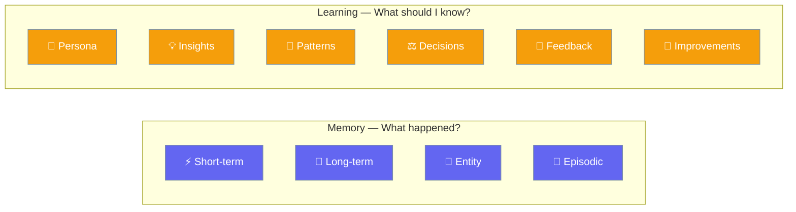
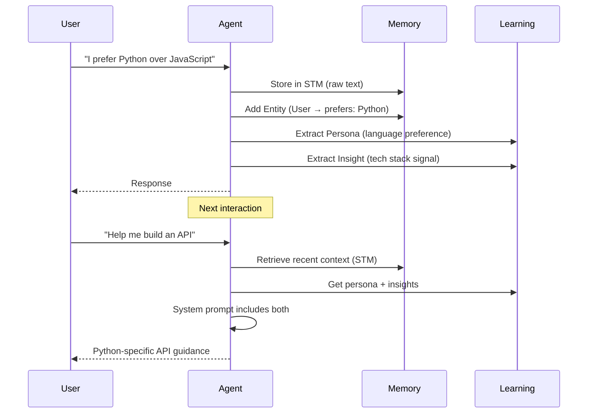

Memory and Learning are **different but complementary** systems. Memory stores raw data, while Learning extracts actionable knowledge from it.



## Key Differences

| Dimension | Memory | Learning |
|-----------|--------|----------|
| **Analogy** | Notebook / filing cabinet | Adaptive brain tissue |
| **Question** | "What happened before?" | "What should I know going forward?" |
| **When** | Every interaction (read/write) | Post-interaction analysis |
| **How** | Direct storage (key-value, vector, relational) | LLM-powered extraction + structured stores |
| **Lifetime** | Session (STM) or persistent (LTM) | Always persistent, grows over time |
| **Output** | Raw conversation history, entity records | User profiles, behavioral patterns, decision logs |
| **Cost** | Low (no LLM calls for basic ops) | Higher (requires LLM extraction step) |

---

## When to Use Each

<CardGroup cols={2}>
  <Card title="Use Memory When" icon="brain">
    - You need conversation context across sessions
    - You want to store/retrieve specific facts
    - You need entity tracking (people, places)
    - You want lightweight, zero-LLM-cost storage
  </Card>
  <Card title="Use Learning When" icon="graduation-cap">
    - Agents should adapt to user preferences over time
    - You want pattern recognition across interactions
    - You need decision logging and rationale tracking
    - You want self-improvement proposals
  </Card>
</CardGroup>

---

## API Comparison

<Tabs>
<Tab title="Memory Only">
```python
from praisonaiagents import Agent

agent = Agent(
    name="Assistant",
    instructions="You are a helpful assistant",
    memory=True   # STM + LTM + Entity + Episodic
)
```
</Tab>

<Tab title="Learning Only">
```python
from praisonaiagents import Agent

agent = Agent(
    name="Assistant",
    instructions="You learn from every interaction",
    memory="learn"  # Enables all default learn stores
)
```
</Tab>

<Tab title="Both Together">
```python
from praisonaiagents import Agent, MemoryConfig, LearnConfig

agent = Agent(
    name="Full Assistant",
    instructions="You remember and learn",
    memory=MemoryConfig(
        backend="file",              # Memory backend
        user_id="user_123",          # User isolation
        learn=LearnConfig(           # Learning layer
            persona=True,            # User preferences
            insights=True,           # Observations
            patterns=True,           # Reusable knowledge
            decisions=True,          # Decision logging
        )
    )
)
```
</Tab>
</Tabs>

---

## What Each System Stores

### Memory Types

| Type | What It Stores | Persistence |
|------|---------------|-------------|
| **Short-term** | Recent conversation context | Rolling buffer, auto-expires |
| **Long-term** | Important facts with importance scores | Permanent |
| **Entity** | Named entities (people, places) with attributes | Permanent |
| **Episodic** | Date-based interaction history | Configurable retention |

### Learning Stores

| Store | What It Extracts | Default |
|-------|-----------------|---------|
| **Persona** | User preferences, communication style | ✅ On |
| **Insights** | Observations and learnings | ✅ On |
| **Thread** | Session context | ✅ On |
| **Patterns** | Reusable knowledge patterns | ❌ Off |
| **Decisions** | Decision rationale and trade-offs | ❌ Off |
| **Feedback** | Outcome signals and corrections | ❌ Off |
| **Improvements** | Self-improvement proposals | ❌ Off |

---

## How They Work Together



**Memory** provides the raw recall. **Learning** provides the adaptive intelligence on top.

---

## Related

<CardGroup cols={2}>
  <Card title="Memory" icon="brain" href="/concepts/memory">
    Complete memory guide — types, backends, API
  </Card>
  <Card title="Agent Learn" icon="graduation-cap" href="/concepts/agent-learn">
    Learning stores, configuration, CLI
  </Card>
  <Card title="Context vs Memory" icon="scale-balanced" href="/concepts/context-vs-memory">
    Context window vs persistent memory
  </Card>
  <Card title="Knowledge vs Memory vs Context" icon="book" href="/concepts/knowledge-memory-context-rag">
    Full comparison of all data systems
  </Card>
</CardGroup>
