# AI Agents with Memory

PraisonAI provides comprehensive memory capabilities for AI agents, from simple file-based storage to advanced multi-agent RAG systems.

```mermaid
flowchart TB
    subgraph "Memory Types"
        direction TB
        STM[⚡ Short-term Memory]
        LTM[💾 Long-term Memory]
        ENT[👤 Entity Memory]
        EPI[📅 Episodic Memory]
    end

    subgraph "Storage Options"
        direction TB
        JSON[(📄 JSON Files)]
        SQL[(🗃️ SQLite)]
        VEC[(🔍 Vector DB)]
    end

    subgraph "Agent Types"
        direction LR
        SA[Single Agent]
        MA[Multi-Agent]
    end

    STM --> JSON
    LTM --> SQL
    LTM --> VEC
    ENT --> JSON
    EPI --> JSON

    JSON --> SA
    SQL --> MA
    VEC --> MA

    style STM fill:#8B0000,color:#fff
    style LTM fill:#8B0000,color:#fff
    style ENT fill:#8B0000,color:#fff
    style EPI fill:#8B0000,color:#fff
    style JSON fill:#2E8B57,color:#fff
    style SQL fill:#2E8B57,color:#fff
    style VEC fill:#2E8B57,color:#fff
    style SA fill:#189AB4,color:#fff
    style MA fill:#189AB4,color:#fff
```



| Feature | [Knowledge](/concepts/knowledge) | [Memory](/concepts/memory) |
|---------|--------------------------------|---------------------------|
| When Used | Pre-loaded before agent execution | Created and updated during runtime |
| Purpose | Provide static reference information | Store dynamic context and interactions |
| Storage | Read-only knowledge base | Read-write memory store |
| Persistence | Permanent until explicitly changed | Can be temporary (STM) or persistent (LTM) |
| Updates | Manual updates through knowledge files | Automatic updates during agent execution |

## Memory Types

<CardGroup cols={2}>
  <Card title="Short-term Memory" icon="bolt">
    Rolling buffer of recent context. Auto-expires when limit reached. High-importance items can be auto-promoted to long-term.
  </Card>
  <Card title="Long-term Memory" icon="database">
    Persistent important facts sorted by importance score. Supports semantic search with RAG.
  </Card>
  <Card title="Entity Memory" icon="user">
    Named entities (people, places, organizations) with attributes and relationships.
  </Card>
  <Card title="Episodic Memory" icon="calendar">
    Date-based interaction history. Configurable retention period with automatic cleanup.
  </Card>
</CardGroup>

## Storage Providers

| Provider | Dependencies | Description |
|----------|-------------|-------------|
| `memory=True` | None | File-based JSON storage (default) |
| `memory="file"` | None | Explicit file-based storage |
| `memory="sqlite"` | Built-in | SQLite with indexing |
| `memory="chromadb"` | chromadb | Vector/semantic search |
| `memory="mem0"` | mem0ai | Graph memory, cloud |
| `memory="rag"` | chromadb | RAG-based semantic search |

---

## Quick Start - Single Agent (Zero Dependencies)

Enable persistent memory for agents without any extra packages. Memory is automatically injected into conversations.

<CodeGroup>
```python Basic Usage
from praisonaiagents import Agent

# Enable memory with a single parameter
agent = Agent(
    name="Personal Assistant",
    instructions="You are a helpful assistant that remembers user preferences.",
    memory=True  # Enables file-based memory (no extra deps!)
)

# Memory is automatically injected into conversations
result = agent.start("My name is John and I prefer dark mode")
result = agent.start("What's my name?")  # Agent recalls: "John"
```

```python With User Isolation
from praisonaiagents import Agent

# Isolate memory per user
agent = Agent(
    name="Assistant",
    memory={"user_id": "user_123"}  # Each user gets separate memory storage
)

# Store memories programmatically
agent.store_memory("User prefers concise answers", memory_type="short_term")
agent.store_memory("User is a software engineer", memory_type="long_term", importance=0.9)

# Get memory context
context = agent.get_memory_context()
print(context)
```

```python Memory Persistence
from praisonaiagents import Agent

# First session - store memories
agent1 = Agent(name="Assistant", memory={"user_id": "john_doe"})
agent1.store_memory("User's favorite color is blue", memory_type="long_term", importance=0.8)
agent1.start("Remember that I work at Acme Corp")

# Later session - memories persist!
agent2 = Agent(name="Assistant", memory={"user_id": "john_doe"})
result = agent2.start("Where do I work?")  # Agent recalls: "Acme Corp"
```
</CodeGroup>

### Single Agent Configuration

```python
from praisonaiagents import Agent

# Full configuration
agent = Agent(
    name="Assistant",
    memory={
        "backend": "file",           # Storage backend
        "user_id": "user_123",        # User isolation
        "config": {
            "short_term_limit": 100,      # Max short-term items
            "long_term_limit": 1000,      # Max long-term items
            "importance_threshold": 0.7,  # Min importance for auto-promotion
            "auto_promote": True,         # Auto-promote high-importance items
            "episodic_retention_days": 30 # Days to keep episodic memories
        }
    }
)
```

### Storage Structure

Memory is stored in JSON files under `.praison/memory/{user_id}/`:

```
.praison/memory/user_123/
├── config.json        # Memory configuration
├── short_term.json    # Rolling buffer (recent context)
├── long_term.json     # Persistent facts
├── entities.json      # Named entities
├── episodic/          # Date-based memories
│   ├── 2024-12-15.json
│   └── 2024-12-14.json
└── summaries.json     # LLM-generated summaries
```

---

## Quick Start - Multi-Agent Memory

For multi-agent workflows using `Agents`, memory enables agents to share information and maintain context across tasks.

<Tabs>
  <Tab title="Code">
    <Steps>
        <Step title="Install Package">
            ```bash
            pip install "praisonaiagents[memory]" duckduckgo_search 
            ```
        </Step>

        <Step title="Set API Key">
            ```bash
            export OPENAI_API_KEY=your_api_key_here
            ```
        </Step>

        <Step title="Create a file">
            Create `app.py`:
```python
from praisonaiagents import Agent, Task, Agents
from praisonaiagents import duckduckgo

# Create research agent with memory
research_agent = Agent(
    role="Research Analyst",
    goal="Research and document key information about topics",
    backstory="Expert at analyzing and storing information in memory",
    llm="gpt-4o-mini",
    tools=[duckduckgo]
)

# Create blog writer agent
blog_agent = Agent(
    role="Blog Writer",
    goal="Write a blog post about the research",
    backstory="Expert at writing blog posts",
    llm="gpt-4o-mini"
)

# Create tasks
research_task = Task(
    description="Research and document key information about AI trends",
    expected_output="Detailed research findings about AI trends",
    agent=research_agent
)

blog_task = Task(
    description="Write a blog post about the research findings",
    expected_output="Well-written blog post based on research",
    agent=blog_agent
)

# Create and start the agents with memory enabled
agents = Agents(
    agents=[research_agent, blog_agent],
    tasks=[research_task, blog_task],
    memory=True
)   

result = agents.start()
print(result)
```
        </Step>

        <Step title="Run">
            ```bash
            python app.py
            ```
        </Step>
    </Steps>
  </Tab>
  <Tab title="No Code (YAML)">
```yaml
framework: praisonai
process: sequential
memory: true
agents:  # Canonical: use 'agents' instead of 'roles'
  researcher:
    instructions:  # Canonical: use 'instructions' instead of 'backstory' Expert at analyzing and storing information in memory.
    goal: Research and document key information about topics
    role: Research Analyst
    llm: gpt-4o-mini
    tools:
      - duckduckgo
    tasks:
      research_task:
        description: Research and document key information about AI trends.
        expected_output: Detailed research findings.

  writer:
    instructions:  # Canonical: use 'instructions' instead of 'backstory' Expert at writing blog posts.
    goal: Write a blog post about the research
    role: Blog Writer
    llm: gpt-4o-mini
    tasks:
      blog_task:
        description: Write a blog post about the research.
        expected_output: Well-written blog post based on research.
```

Run with:
```bash
praisonai agents.yaml
```
  </Tab>
</Tabs>

### Multi-Agent Memory Configuration

```python
# Create agents with memory enabled
agents = Agents(
    agents=[agent],
    tasks=[task],
    memory=True  # Enable memory with defaults
)
```

---

## Memory Methods

### Store Memory

```python
# Short-term (recent context)
agent.store_memory("User asked about Python", memory_type="short_term")

# Long-term (important facts)
agent.store_memory("User's name is Alice", memory_type="long_term", importance=0.95)

# Entity
agent._memory_instance.add_entity(
    name="Alice",
    entity_type="person",
    attributes={"role": "developer", "company": "Acme"}
)

# Episodic (date-based)
agent._memory_instance.add_episodic("Had a meeting about project X")
```

### Retrieve Memory

```python
# Get memory context for prompts
context = agent.get_memory_context(query="user preferences")

# Search memories
results = agent._memory_instance.search("Python", limit=10)

# Get specific memory types
short_term = agent._memory_instance.get_short_term(limit=10)
long_term = agent._memory_instance.get_long_term(limit=10)
entities = agent._memory_instance.get_all_entities(entity_type="person")
```

### Memory Management

```python
# Clear short-term memory
agent._memory_instance.clear_short_term()

# Clear all memory
agent._memory_instance.clear_all()

# Get statistics
stats = agent._memory_instance.get_stats()
print(stats)
# {'user_id': 'user_123', 'short_term_count': 5, 'long_term_count': 10, ...}

# Export/Import
data = agent._memory_instance.export()
agent._memory_instance.import_data(data)
```

### Memory Deletion

Delete specific memories by ID or query. Essential for cleaning up image-based context to prevent context window overflow.

```python
from praisonaiagents import Agent

agent = Agent(
    instructions="You analyze images and remember context",
    memory=True
)

# Store memory (returns ID)
mem_id = agent._memory_instance.add_short_term("[IMAGE] Cat photo analysis")

# Delete specific memory by ID
deleted = agent._memory_instance.delete_memory(mem_id)
print(f"Deleted: {deleted}")  # True

# Delete by memory type
agent._memory_instance.delete_short_term(mem_id)  # Short-term
agent._memory_instance.delete_long_term(mem_id)   # Long-term
agent._memory_instance.delete_entity("John")       # Entity by name

# Bulk delete by query pattern
count = agent._memory_instance.delete_memories_matching("[IMAGE]")
print(f"Deleted {count} image-related memories")
```

**CLI Commands for Memory Deletion:**

```bash
/memory list                    # Shows memories with IDs
/memory delete <id>             # Delete by ID
/memory delete --query [IMAGE]  # Bulk delete by pattern
```

| Command | Description |
|---------|-------------|
| `/memory list` | Display memories with IDs for selective deletion |
| `/memory delete <id>` | Delete a specific memory by ID |
| `/memory delete --query <pattern>` | Delete all memories matching pattern |

### Memory Quality Control (Multi-Agent)

```python
# Store with quality metrics
agents.memory.store_long_term(
    text="Important information to remember",
    metadata={
        "task_id": "task_123",
        "agent": "research_agent"
    },
    completeness=0.9,
    relevance=0.85,
    clarity=0.95,
    accuracy=0.9,
    weights={
        "completeness": 0.3,
        "relevance": 0.3,
        "clarity": 0.2,
        "accuracy": 0.2
    }
)

# Search with quality filter
results = agents.memory.search_long_term(
    query="search query",
    min_quality=0.8,
    limit=5
)
```

---

## Session Save/Resume

Save and resume conversation sessions for later continuation:

```python
from praisonaiagents import FileMemory

memory = FileMemory(user_id="user_123")

# Add context during conversation
memory.add_short_term("User is working on ML project")
memory.add_long_term("User prefers Python", importance=0.9)

# Save session with conversation history
conversation = [
    {"role": "user", "content": "Help me with ML"},
    {"role": "assistant", "content": "I'd be happy to help..."}
]
memory.save_session("ml_project", conversation_history=conversation)

# Later: Resume the session
session_data = memory.resume_session("ml_project")

# List all saved sessions
sessions = memory.list_sessions()
for s in sessions:
    print(f"{s['name']} - saved at {s['saved_at']}")

# Delete a session
memory.delete_session("old_session")
```

---

## Context Compression

Compress short-term memory to save context window space:

```python
from praisonaiagents import FileMemory

memory = FileMemory(user_id="user_123", config={"short_term_limit": 100})

# Add many items during conversation
for i in range(50):
    memory.add_short_term(f"Discussion point {i}")

# Manual compression with LLM summarization
def llm_summarize(prompt):
    return agent.chat(prompt)

summary = memory.compress(llm_func=llm_summarize, max_items=10)
# Compresses older items into a summary, keeps recent 10

# Auto-compress when memory gets full (70% threshold)
memory.auto_compress_if_needed(threshold_percent=0.7, llm_func=llm_summarize)
```

---

## Checkpointing

Create checkpoints before risky operations and restore if needed:

```python
from praisonaiagents import FileMemory

memory = FileMemory(user_id="user_123")

# Create checkpoint before making changes
checkpoint_id = memory.create_checkpoint("before_refactor")

# Optionally include file snapshots
checkpoint_id = memory.create_checkpoint(
    "before_refactor",
    include_files=["main.py", "config.yaml"]
)

# Make changes...
memory.clear_all()
# Something went wrong!

# Restore from checkpoint
memory.restore_checkpoint(checkpoint_id)

# Restore with file snapshots
memory.restore_checkpoint(checkpoint_id, restore_files=True)

# List all checkpoints
checkpoints = memory.list_checkpoints()

# Delete old checkpoint
memory.delete_checkpoint("old_checkpoint")
```

---

## Memory Slash Commands

Handle memory commands programmatically (useful for CLI/chat interfaces):

```python
from praisonaiagents import FileMemory

memory = FileMemory(user_id="user_123")

# Available commands
result = memory.handle_command("/memory show")      # Display stats
result = memory.handle_command("/memory add User likes coffee")  # Add memory
result = memory.handle_command("/memory search Python")  # Search
result = memory.handle_command("/memory clear short")    # Clear short-term
result = memory.handle_command("/memory save my_session")  # Save session
result = memory.handle_command("/memory resume my_session")  # Resume
result = memory.handle_command("/memory sessions")   # List sessions
result = memory.handle_command("/memory compress")   # Compress
result = memory.handle_command("/memory checkpoint") # Create checkpoint
result = memory.handle_command("/memory restore cp_123")  # Restore
result = memory.handle_command("/memory checkpoints")  # List checkpoints
result = memory.handle_command("/memory refresh")    # Reload from disk
result = memory.handle_command("/memory help")       # Show all commands
```

| Command | Description |
|---------|-------------|
| `/memory show` | Display memory stats and recent items |
| `/memory add <content>` | Add to long-term memory |
| `/memory clear [short\|all]` | Clear memory |
| `/memory search <query>` | Search memories |
| `/memory list` | List memories with IDs for deletion |
| `/memory delete <id>` | Delete specific memory by ID |
| `/memory delete --query <pattern>` | Bulk delete by pattern |
| `/memory save <name>` | Save session |
| `/memory resume <name>` | Resume session |
| `/memory sessions` | List saved sessions |
| `/memory compress` | Compress short-term memory |
| `/memory checkpoint [name]` | Create checkpoint |
| `/memory restore <id>` | Restore checkpoint |
| `/memory checkpoints` | List checkpoints |
| `/memory refresh` | Reload from disk |

---

## Auto-Generated Memories

Automatically extract and store memories from conversations without manual intervention:

```python
from praisonaiagents import FileMemory, AutoMemory

# Create base memory
memory = FileMemory(user_id="user123")

# Wrap with auto-generation
auto = AutoMemory(memory, enabled=True)

# Process interactions - memories are automatically extracted
memories = auto.process_interaction(
    user_message="My name is John and I prefer Python for backend work",
    assistant_response="Nice to meet you, John! Python is great for backend."
)

# Extracted memories:
# - name: "John" (entity)
# - preference: "Python for backend work" (long-term)

print(f"Extracted {len(memories)} memories automatically")
```

### Pattern-Based Extraction

AutoMemory uses fast pattern matching (no LLM calls) to extract:

| Type | Examples | Importance |
|------|----------|------------|
| **Name** | "My name is John", "I'm Alice" | 0.95 |
| **Role** | "I'm a developer", "I work as an engineer" | 0.85 |
| **Preference** | "I prefer Python", "I like dark mode" | 0.70 |
| **Project** | "Working on ML project", "Building an app" | 0.75 |
| **Technology** | "Using Python", "prefer TypeScript" | 0.70 |
| **Location** | "I live in NYC", "Based in London" | 0.60 |

### LLM-Enhanced Extraction

For better accuracy, enable LLM-based extraction:

```python
from praisonaiagents import AutoMemory, AutoMemoryExtractor

# Create extractor with LLM
extractor = AutoMemoryExtractor(
    min_importance=0.6,
    use_llm=True,
    llm_func=lambda prompt: agent.chat(prompt)
)

# Use with AutoMemory
auto = AutoMemory(
    memory=memory,
    extractor=extractor,
    enabled=True
)
```

---

## Direct FileMemory Usage

```python
from praisonaiagents import FileMemory, create_memory

# Create memory instance directly
memory = FileMemory(
    user_id="user_123",
    base_path=".praison/memory",
    config={"short_term_limit": 50},
    verbose=1
)

# Use all memory features
memory.add_short_term("Recent interaction")
memory.add_long_term("Important fact", importance=0.9)
memory.add_entity("John", "person", {"role": "manager"})
memory.add_episodic("Meeting notes")

# Search and retrieve
results = memory.search("John")
context = memory.get_context(query="manager")

# Convenience function
memory = create_memory(user_id="user_456")
```

---

## How Memory Injection Works

When `memory=True`, the agent automatically:

1. **Loads** existing memories from storage on initialization
2. **Builds** a memory context string with important facts, entities, and recent context
3. **Injects** the context into the system prompt before each LLM call
4. **Persists** new memories to storage after interactions

```python
# System prompt with memory injection looks like:
"""
You are a helpful assistant.

Your Role: Assistant
Your Goal: Help users with their tasks

## Memory (Information you remember about the user)
## Important Facts
- User's name is Alice
- User works as a software engineer
## Known Entities
- Alice (person): role=developer, company=Acme
## Recent Context
- User prefers detailed explanations
"""
```

---

## Best Practices

<AccordionGroup>
  <Accordion title="Use importance scores wisely">
    Set higher importance (0.8-1.0) for critical facts like user names, preferences, and key information. Lower importance (0.3-0.5) for transient context.
  </Accordion>
  <Accordion title="Isolate memory per user">
    Always set `user_id` when building multi-user applications to prevent memory leakage between users.
  </Accordion>
  <Accordion title="Clean up old memories">
    Call `cleanup_episodic()` periodically to remove old date-based memories and save storage space.
  </Accordion>
  <Accordion title="Use entities for structured data">
    Store people, places, and organizations as entities with attributes rather than plain text for better retrieval.
  </Accordion>
  <Accordion title="Configure memory based on use case">
    Use file-based memory for simple single-agent apps, RAG for multi-agent semantic search, and graph memory for complex relationships.
  </Accordion>
</AccordionGroup>

---

## Troubleshooting

<CardGroup cols={2}>
  <Card title="Memory Issues" icon="triangle-exclamation">
    If memory isn't working as expected:
    - Check memory configuration
    - Enable verbose mode for debugging
    - Verify memory provider settings
    - Check file permissions for storage path
  </Card>

  <Card title="Context Flow" icon="code">
    If context isn't being maintained:
    - Review task dependencies
    - Check memory configuration
    - Verify agent communication
    - Ensure user_id is consistent across sessions
  </Card>
</CardGroup>

---

## Next Steps

<CardGroup cols={2}>
  <Card title="Advanced Memory" icon="brain" href="/features/advanced-memory">
    Multi-tiered memory with quality scoring, ChromaDB, and graph support
  </Card>
  <Card title="Graph Memory" icon="project-diagram" href="/features/graph-memory">
    Neo4j/Memgraph integration for relationship-based memory
  </Card>
  <Card title="Memory Configuration" icon="gear" href="/configuration/memory-config">
    Detailed memory configuration options
  </Card>
  <Card title="Rules & Instructions" icon="scroll" href="/features/rules">
    Auto-discover and apply persistent rules like Cursor and Windsurf
  </Card>
</CardGroup>

<Note>
  For optimal results, configure memory settings based on your specific use case requirements and expected interaction patterns.
</Note>
