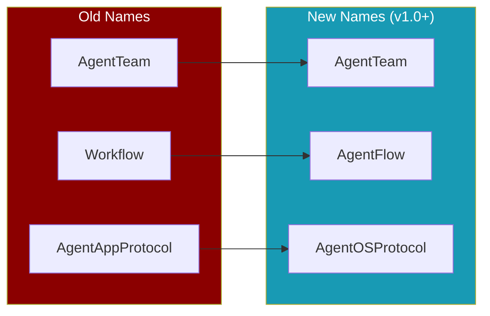
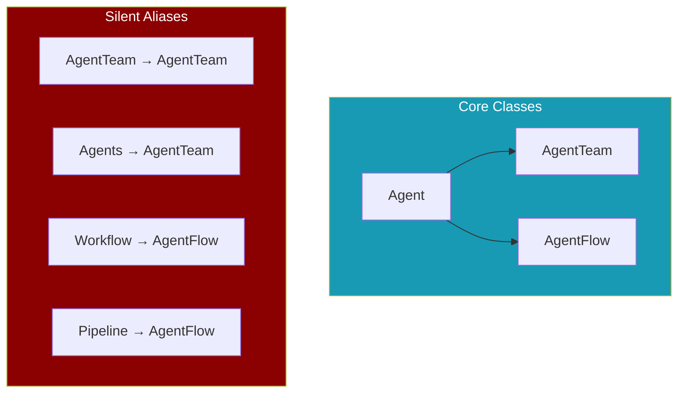

## Overview

PraisonAI v1.0 introduces a consistent **Agent\*** prefix naming convention for core orchestration classes. This makes the API more intuitive and agent-centric.

<Note>
**Backward Compatible**: All old names continue to work as silent aliases. No code changes are required for existing projects.
</Note>



## What Changed

<CardGroup cols={2}>
  <Card title="AgentTeam" icon="users">
    Manages a team of agents working together on tasks.
    
    **Old**: `AgentTeam`, `Agents`
  </Card>
  <Card title="AgentFlow" icon="diagram-project">
    Defines step-by-step workflows with routing and patterns.
    
    **Old**: `Workflow`, `Pipeline`
  </Card>
  <Card title="AgentOSProtocol" icon="server">
    Protocol for production deployment of agents.
    
    **Old**: `AgentAppProtocol`
  </Card>
  <Card title="AgentOSConfig" icon="gear">
    Configuration for AgentOS deployments.
    
    **Old**: `AgentAppConfig`
  </Card>
</CardGroup>

## Quick Reference

| Old Name | New Name | Purpose |
|----------|----------|---------|
| `AgentTeam` | **`AgentTeam`** | Multi-agent orchestration |
| `Agents` | **`AgentTeam`** | Multi-agent orchestration |
| `Workflow` | **`AgentFlow`** | Step-based workflows |
| `Pipeline` | **`AgentFlow`** | Step-based workflows |
| `AgentAppProtocol` | **`AgentOSProtocol`** | Deployment protocol |
| `AgentAppConfig` | **`AgentOSConfig`** | Deployment config |

## Migration Examples

<Tabs>
  <Tab title="AgentTeam">
    <CodeGroup>
    ```python Before
    from praisonaiagents import Agent, AgentTeam

    agent1 = Agent(name="researcher", instructions="Research topics")
    agent2 = Agent(name="writer", instructions="Write content")

    team = AgentTeam(agents=[agent1, agent2])
    result = team.start()
    ```

    ```python After (Recommended)
    from praisonaiagents import Agent, AgentTeam

    agent1 = Agent(name="researcher", instructions="Research topics")
    agent2 = Agent(name="writer", instructions="Write content")

    team = AgentTeam(agents=[agent1, agent2])
    result = team.start()
    ```
    </CodeGroup>
  </Tab>
  <Tab title="AgentFlow">
    <CodeGroup>
    ```python Before
    from praisonaiagents import Agent, AgentFlow

    flow = AgentFlow(steps=[
        {"agent": research_agent, "task": "Research the topic"},
        {"agent": writer_agent, "task": "Write the article"}
    ])
    result = flow.start()
    ```

    ```python After (Recommended)
    from praisonaiagents import Agent, AgentFlow

    flow = AgentFlow(steps=[
        {"agent": research_agent, "task": "Research the topic"},
        {"agent": writer_agent, "task": "Write the article"}
    ])
    result = flow.start()
    ```
    </CodeGroup>
  </Tab>
  <Tab title="AgentOS">
    <CodeGroup>
    ```python Before
    from praisonaiagents import AgentAppProtocol, AgentAppConfig
    ```

    ```python After (Recommended)
    from praisonaiagents import AgentOSProtocol, AgentOSConfig
    ```
    </CodeGroup>
  </Tab>
</Tabs>

## No Breaking Changes

<Check>
All old names work exactly as before. They are **silent aliases** with no deprecation warnings.
</Check>

```python
# Both work identically
from praisonaiagents import AgentTeam  # ✓ Still works
from praisonaiagents import AgentTeam     # ✓ New recommended name

# They are the same class
assert AgentTeam is AgentTeam  # True
```

## Why the Change?

<AccordionGroup>
  <Accordion title="Consistency" icon="check">
    All orchestration classes now follow the `Agent*` prefix pattern, making the API more predictable.
  </Accordion>
  <Accordion title="Clarity" icon="lightbulb">
    - **AgentTeam** clearly indicates a team of agents
    - **AgentFlow** clearly indicates a flow/workflow of agent steps
    - **AgentOS** clearly indicates an operating system for agents
  </Accordion>
  <Accordion title="Agent-Centric" icon="robot">
    The naming reinforces that PraisonAI is an agent-first framework where everything revolves around agents.
  </Accordion>
</AccordionGroup>

## Recommended Actions

<Steps>
  <Step title="No Immediate Action Required">
    Your existing code will continue to work without any changes.
  </Step>
  <Step title="Update New Code">
    Use the new names (`AgentTeam`, `AgentFlow`, `AgentOSProtocol`) in new projects.
  </Step>
  <Step title="Gradual Migration">
    When updating existing code, switch to the new names for consistency.
  </Step>
</Steps>

## Class Hierarchy



## Need Help?

<CardGroup cols={2}>
  <Card title="Documentation" icon="book" href="/concepts/agents">
    Learn more about agents and orchestration
  </Card>
  <Card title="Examples" icon="code" href="/examples">
    See working examples with the new names
  </Card>
</CardGroup>
