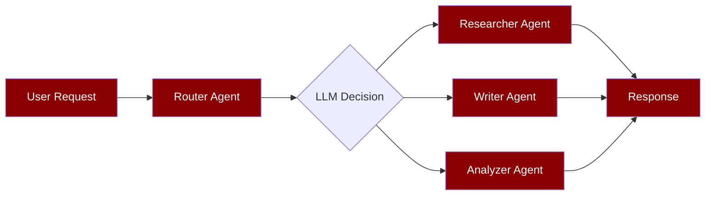
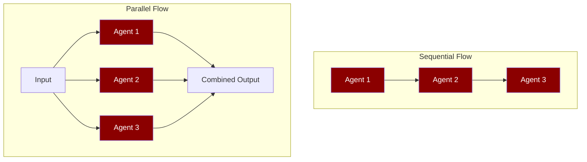
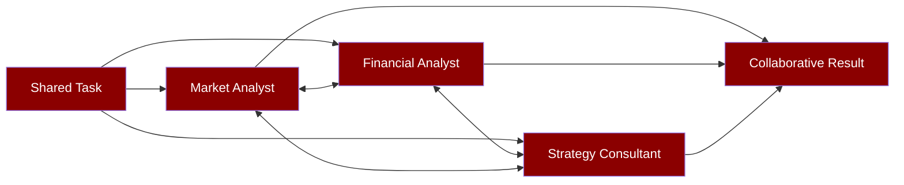

## Quick Decision Guide

<CardGroup cols={2}>
  <Card title="Handoffs (LLM-Driven)" icon="arrow-right-arrow-left">
    **When to use:** LLM decides which agent to call. Best for routing and triage.
    
    **Pattern:** `Agent(handoffs=[b, c])`
    
    **Example:** Customer service router → specialist agents
  </Card>
  
  <Card title="AgentFlow (Sequential/Parallel)" icon="diagram-project">
    **When to use:** Fixed sequence or parallel execution. Best for pipelines.
    
    **Pattern:** `AgentFlow([a, b, c])`
    
    **Example:** Research → Write → Review pipeline
  </Card>
  
  <Card title="AgentTeam (Collaborative)" icon="users">
    **When to use:** Agents collaborate on shared task. Best for complex analysis.
    
    **Pattern:** `AgentTeam([a, b, c])`
    
    **Example:** Multi-expert analysis team
  </Card>
  
  <Card title="Programmatic Handoffs" icon="code">
    **When to use:** Code-driven transfers. Best for conditional logic.
    
    **Pattern:** `agent.handoff_to(b, msg)`
    
    **Example:** Error handling, conditional workflows
  </Card>
</CardGroup>

---

## Decision Matrix

| Question | Use Case | Pattern | Code Example |
|----------|----------|---------|---------------|
| **Who decides the next agent?** | LLM chooses | **Handoffs** | `Agent(handoffs=[specialist_a, specialist_b])` |
| **Who decides the next agent?** | Your code chooses | **Programmatic** | `await agent.handoff_to(specialist, "task")` |
| **What's the execution order?** | Fixed sequence/parallel | **AgentFlow** | `AgentFlow([step1, step2, step3])` |
| **What's the execution order?** | Dynamic collaboration | **AgentTeam** | `AgentTeam([expert1, expert2, expert3])` |

---

## Pattern 1: Handoffs (LLM-Driven Routing)

**When to use:** The LLM needs to decide at runtime which specialist agent to call based on the user's request.

<Accordion title="Basic Handoff Example">

```python
from praisonaiagents import Agent

# Create specialist agents
researcher = Agent(
    name="researcher",
    instructions="You research topics thoroughly using web search.",
    tools=["web_search"]
)

writer = Agent(
    name="writer", 
    instructions="You write engaging articles based on research.",
)

# Router agent with handoff capabilities
router = Agent(
    name="router",
    instructions="You route requests to the appropriate specialist.",
    handoffs=[researcher, writer]  # LLM can choose which agent to call
)

# The LLM will automatically decide whether to call researcher or writer
result = router.run("Write an article about AI trends after researching the latest developments")
# → LLM routes to researcher first, then to writer
```

</Accordion>

<Accordion title="Advanced Handoff with Context Policy">

```python
from praisonaiagents import Agent, HandoffConfig, ContextPolicy

# Configure how context is shared during handoffs
handoff_config = HandoffConfig(
    context_policy=ContextPolicy.SUMMARY,  # Share summarized context (safe)
    max_context_tokens=2000,  # Limit context size
    detect_cycles=True,       # Prevent infinite loops
    max_depth=5              # Max handoff chain length
)

researcher = Agent(
    name="researcher",
    instructions="Research topics and gather information.",
    tools=["web_search", "file_search"]
)

analyzer = Agent(
    name="analyzer", 
    instructions="Analyze research data and extract insights.",
)

writer = Agent(
    name="writer",
    instructions="Write comprehensive reports based on analysis.",
)

# Router with advanced handoff configuration
router = Agent(
    name="intelligent_router",
    instructions="Route complex requests through the appropriate specialists in sequence.",
    handoffs=[researcher, analyzer, writer],
    handoff_config=handoff_config
)

# LLM can chain through multiple agents automatically
result = router.run("Create a comprehensive market analysis report on renewable energy trends")
# → researcher → analyzer → writer (LLM decides the chain)
```

</Accordion>

<Accordion title="Handoff with Typed Input">

```python
from praisonaiagents import Agent
from pydantic import BaseModel
from typing import Literal

class CustomerRequest(BaseModel):
    request_type: Literal["technical", "billing", "general"]
    priority: Literal["low", "medium", "high"] 
    description: str

technical_agent = Agent(
    name="technical_support",
    instructions="Handle technical issues and troubleshooting.",
    input_type=CustomerRequest
)

billing_agent = Agent(
    name="billing_support", 
    instructions="Handle billing questions and account issues.",
    input_type=CustomerRequest
)

router = Agent(
    name="customer_service_router",
    instructions="Route customer requests to appropriate specialists based on request type.",
    handoffs=[technical_agent, billing_agent]
)

# Structured routing with validation
result = router.run("I'm having trouble with my API integration returning 503 errors")
# → LLM identifies as technical issue and routes to technical_agent with structured input
```

</Accordion>

### Handoff Flow Diagram



---

## Pattern 2: Programmatic Handoffs

**When to use:** Your application code needs to explicitly control which agent handles a task, typically for error handling or conditional logic.

<Accordion title="Basic Programmatic Handoff">

```python
from praisonaiagents import Agent

reviewer = Agent(
    name="code_reviewer",
    instructions="Review code for bugs and improvements.",
)

fixer = Agent(
    name="code_fixer", 
    instructions="Fix code issues based on review feedback.",
)

# Your code decides when and how to handoff
async def process_code_review(code: str):
    # First, review the code
    review_result = await reviewer.arun(f"Review this code:\n{code}")
    
    # Check if issues were found (your logic)
    if "issues found" in review_result.lower():
        # Explicitly handoff to fixer with context
        fix_result = await reviewer.handoff_to(
            fixer, 
            f"Fix the issues in this code based on review:\nReview: {review_result}\nCode: {code}"
        )
        return fix_result
    
    return review_result

# Usage
result = await process_code_review("def divide(a, b): return a / b")  
# → Your code controls the handoff flow
```

</Accordion>

<Accordion title="Async Concurrent Handoffs">

```python
from praisonaiagents import Agent
import asyncio

data_validator = Agent(
    name="validator",
    instructions="Validate data quality and completeness.",
)

data_processor = Agent(
    name="processor",
    instructions="Process and transform validated data.",
)

data_analyzer = Agent(
    name="analyzer", 
    instructions="Analyze processed data for insights.",
)

# Concurrent processing with explicit control
async def process_dataset(datasets: list):
    coordinator = Agent(
        name="coordinator",
        instructions="Coordinate data processing tasks.",
    )
    
    # Process multiple datasets concurrently
    validation_tasks = []
    for dataset in datasets:
        task = coordinator.handoff_to_async(
            data_validator, 
            f"Validate dataset: {dataset}"
        )
        validation_tasks.append(task)
    
    # Wait for all validations
    validation_results = await asyncio.gather(*validation_tasks)
    
    # Sequential processing of validated data
    processed_results = []
    for i, validation_result in enumerate(validation_results):
        if "valid" in validation_result.lower():
            processed = await coordinator.handoff_to(
                data_processor,
                f"Process this validated data: {datasets[i]}"
            )
            processed_results.append(processed)
    
    return processed_results

# Usage
datasets = ["dataset1.csv", "dataset2.csv", "dataset3.csv"]
results = await process_dataset(datasets)
```

</Accordion>

### Programmatic Flow Diagram

```mermaid
graph TD
    A[Your Application Code]:::agent --> B[Agent.handoff_to()]
    B --> C[Target Agent]:::agent
    C --> D[Result]:::agent
    D --> A
    
    A --> E[Conditional Logic]
    E --> F[Different Agent]:::agent
    F --> G[Different Result]:::agent
    G --> A
    
    classDef agent fill:#8B0000,color:#fff
    classDef tool fill:#189AB4,color:#fff
```

---

## Pattern 3: AgentFlow (Sequential/Parallel Pipelines)

**When to use:** Tasks follow a predictable sequence or can be executed in parallel. Best for data pipelines and workflows.

<Accordion title="Sequential AgentFlow">

```python
from praisonaiagents import Agent, AgentFlow, Task

# Define agents for each step
extractor = Agent(
    name="data_extractor",
    instructions="Extract data from various sources.",
    tools=["file_tools", "web_scraper"]
)

transformer = Agent(
    name="data_transformer",
    instructions="Clean and transform extracted data.",
)

loader = Agent(
    name="data_loader", 
    instructions="Load transformed data into target systems.",
    tools=["database_tools"]
)

# Define tasks for each step
extract_task = Task(
    name="extract_data",
    description="Extract customer data from CRM and CSV files",
    agent=extractor
)

transform_task = Task(
    name="transform_data", 
    description="Clean and standardize the extracted data",
    agent=transformer
)

load_task = Task(
    name="load_data",
    description="Load clean data into the analytics database", 
    agent=loader
)

# Create sequential workflow
etl_pipeline = AgentFlow(
    name="etl_pipeline",
    agents=[extractor, transformer, loader],
    tasks=[extract_task, transform_task, load_task]
)

# Execute the pipeline - runs in fixed sequence
result = etl_pipeline.run("Process today's customer data batch")
# → extractor → transformer → loader (fixed sequence)
```

</Accordion>

<Accordion title="Parallel AgentFlow">

```python
from praisonaiagents import Agent, AgentFlow, Task

# Parallel analysis agents
sentiment_agent = Agent(
    name="sentiment_analyzer",
    instructions="Analyze sentiment in text data.",
)

keyword_agent = Agent(
    name="keyword_extractor", 
    instructions="Extract key topics and entities.",
)

summary_agent = Agent(
    name="summarizer",
    instructions="Generate concise summaries.",
)

# Parallel tasks
sentiment_task = Task(
    name="analyze_sentiment",
    description="Analyze customer feedback sentiment",
    agent=sentiment_agent
)

keyword_task = Task(
    name="extract_keywords",
    description="Extract key topics from feedback", 
    agent=keyword_agent
)

summary_task = Task(
    name="summarize_feedback",
    description="Create executive summary of feedback",
    agent=summary_agent  
)

# Parallel workflow
analysis_flow = AgentFlow(
    name="parallel_analysis",
    agents=[sentiment_agent, keyword_agent, summary_agent],
    tasks=[sentiment_task, keyword_task, summary_task],
    parallel=True  # Enable parallel execution
)

# All agents process simultaneously
result = analysis_flow.run("Analyze this customer feedback batch")
# → sentiment_agent || keyword_agent || summary_agent (parallel execution)
```

</Accordion>

### AgentFlow Patterns Diagram



---

## Pattern 4: AgentTeam (Collaborative)

**When to use:** Multiple agents need to work together on the same problem, sharing context and building on each other's work.

<Accordion title="Collaborative AgentTeam">

```python
from praisonaiagents import Agent, AgentTeam, Task

# Expert agents for collaborative analysis
market_analyst = Agent(
    name="market_analyst",
    instructions="Analyze market trends, competition, and opportunities.",
    tools=["web_search", "data_analysis"]
)

financial_analyst = Agent(
    name="financial_analyst", 
    instructions="Analyze financial data, projections, and risk factors.",
    tools=["financial_tools", "calculator"]
)

strategy_consultant = Agent(
    name="strategy_consultant",
    instructions="Synthesize analysis into actionable strategic recommendations.",
)

# Collaborative task requiring multiple perspectives
analysis_task = Task(
    name="market_analysis",
    description="Conduct comprehensive market analysis for new product launch in renewable energy sector",
    agent=market_analyst  # Primary agent, but team will collaborate
)

# Create collaborative team
expert_team = AgentTeam(
    name="strategic_analysis_team",
    agents=[market_analyst, financial_analyst, strategy_consultant],
    tasks=[analysis_task],
    collaboration_mode="consensus"  # Agents build on each other's work
)

# Team works together on shared problem
result = expert_team.run("Analyze market opportunity for solar panel manufacturing startup")
# → All agents contribute their expertise to shared analysis
```

</Accordion>

### AgentTeam Collaboration Diagram



---

## Advanced Patterns

<Accordion title="Conditional Routing with Handoff Filters">

```python
from praisonaiagents import Agent, handoff_filters

# Define condition-based handoff filters
def is_technical_issue(message: str) -> bool:
    technical_keywords = ["error", "bug", "api", "integration", "timeout"]
    return any(keyword in message.lower() for keyword in technical_keywords)

def is_billing_issue(message: str) -> bool:
    billing_keywords = ["payment", "charge", "invoice", "subscription", "billing"]
    return any(keyword in message.lower() for keyword in billing_keywords)

technical_agent = Agent(
    name="technical_support",
    instructions="Handle technical issues and API problems.",
)

billing_agent = Agent(
    name="billing_support",
    instructions="Handle billing and payment issues.",
)

# Router with conditional handoffs
smart_router = Agent(
    name="smart_router", 
    instructions="Route customer issues to appropriate specialists.",
    handoffs=handoff_filters([
        (is_technical_issue, technical_agent),
        (is_billing_issue, billing_agent),
    ])
)

# Intelligent routing based on content
result = smart_router.run("My API is returning 503 errors consistently")
# → Routes to technical_agent based on filter condition
```

</Accordion>

<Accordion title="Nested Handoff Chains">

```python
from praisonaiagents import Agent

# Create 3-level handoff chain: Intake → Specialist → Quality Assurance

qa_agent = Agent(
    name="quality_assurance",
    instructions="Review and validate completed work for quality and accuracy.",
)

technical_specialist = Agent(
    name="technical_specialist", 
    instructions="Solve complex technical problems.",
    handoffs=[qa_agent]  # Can handoff to QA for review
)

billing_specialist = Agent(
    name="billing_specialist",
    instructions="Resolve billing and account issues.", 
    handoffs=[qa_agent]  # Can handoff to QA for review
)

intake_agent = Agent(
    name="intake_agent",
    instructions="Initial customer request processing and routing.",
    handoffs=[technical_specialist, billing_specialist]
)

# 3-level chain: Intake → Specialist → QA
result = intake_agent.run("I'm getting charged twice for my API usage this month")
# → intake_agent → billing_specialist → qa_agent
```

</Accordion>

---

## Troubleshooting

<AccordionGroup>

<Accordion title="Common Errors">

**HandoffCycleError: Cycle detected in handoff chain**
```
Agent 'router' → 'specialist' → 'reviewer' → 'router'
```
**Solution:** Enable cycle detection or redesign your handoff flow to avoid loops.

```python
handoff_config = HandoffConfig(
    detect_cycles=True,  # Enable cycle detection
    max_depth=5         # Limit chain depth
)
```

**HandoffDepthError: Maximum handoff depth exceeded**
```
Handoff chain exceeded maximum depth of 10
```
**Solution:** Increase max_depth or redesign for shorter chains.

```python
handoff_config = HandoffConfig(max_depth=15)  # Increase limit
```

**"No specific task was provided" during handoff**
**Solution:** Ensure handoff messages are descriptive and actionable.

```python
# ❌ Vague handoff
result = agent.handoff_to(specialist, "help")

# ✅ Specific handoff  
result = agent.handoff_to(specialist, "Analyze this sales data for Q4 trends: [data]")
```

</Accordion>

<Accordion title="Improved Error Messages">

PraisonAI provides helpful error messages with remediation hints:

```python
HandoffError: Agent 'writer' is unreachable from 'router'.
  → Did you add 'writer' to handoffs=[...] in the router agent?
  → For programmatic handoffs, use: router.handoff_to(writer, "task")

CycleError: Handoff cycle detected: router → writer → editor → router
  → Agent 'router' already appeared in the handoff chain.
  → To allow deeper chains, set: HandoffConfig(max_depth=10)
  → To prevent cycles, set: HandoffConfig(detect_cycles=True)

TimeoutError: Handoff to 'analyzer' timed out after 300 seconds
  → Increase timeout: HandoffConfig(timeout_seconds=600)  
  → Check if the target agent is stuck or needs more time
```

</Accordion>

<Accordion title="Performance Considerations">

**Choose the Right Pattern for Your Use Case:**

- **Handoffs:** Best for dynamic routing (10-100ms overhead per handoff)
- **AgentFlow:** Best for predictable pipelines (minimal overhead)
- **AgentTeam:** Best for collaborative analysis (higher context sharing cost) 
- **Programmatic:** Best for explicit control (lowest overhead)

**Optimization Tips:**

```python
# ✅ Efficient context sharing
handoff_config = HandoffConfig(
    context_policy=ContextPolicy.SUMMARY,  # Reduce context size
    max_context_tokens=1000                # Limit token usage
)

# ✅ Parallel processing when possible
flow = AgentFlow(tasks=tasks, parallel=True)

# ✅ Async for I/O-bound operations
result = await agent.handoff_to_async(specialist, task)
```

</Accordion>

</AccordionGroup>

---

## Pattern Combination Examples

<Accordion title="Hybrid: AgentFlow + Handoffs">

```python
# Combine deterministic pipeline with dynamic routing
preprocessing_flow = AgentFlow([
    extractor_agent,   # Always extract first
    cleaner_agent,     # Always clean second
])

# Router can choose analysis path
analysis_router = Agent(
    name="analysis_router",
    handoffs=[sentiment_agent, topic_agent, summary_agent]
)

# Final pipeline combines both patterns
hybrid_pipeline = AgentFlow([
    preprocessing_flow,  # Fixed preprocessing
    analysis_router      # Dynamic analysis routing
])
```

</Accordion>

<Accordion title="Team + Handoffs for Quality Control">

```python
# Expert team for collaborative work
expert_team = AgentTeam([research_agent, analysis_agent, writer_agent])

# Quality control with handoff
reviewer = Agent(
    name="reviewer",
    instructions="Review team output for quality and completeness.",
    handoffs=[expert_team]  # Can send back for revision
)

# Quality-controlled workflow
result = reviewer.run("Create comprehensive market report with expert analysis")
# → reviewer → expert_team → (potential revision loop) → final result
```

</Accordion>

---

## Best Practices

<Note>
**Pattern Selection Guidelines:**

1. **Start Simple:** Use single agents first, add patterns as complexity grows
2. **LLM Routing:** Use handoffs when the AI should decide the flow
3. **Deterministic:** Use AgentFlow for predictable, repeatable processes  
4. **Collaborative:** Use AgentTeam when agents need to build on each other's work
5. **Explicit Control:** Use programmatic handoffs for error handling and conditionals
</Note>

<Tip>
**Context Management:**

- Use `ContextPolicy.SUMMARY` for most handoffs (safe default)
- Use `ContextPolicy.FULL` only when complete history is essential
- Set `max_context_tokens` to control costs and latency
- Enable `detect_cycles=True` to prevent infinite loops
</Tip>

<Warning>
**Production Considerations:**

- Always set reasonable timeout values (`timeout_seconds`)
- Implement error handling for failed handoffs
- Monitor handoff chains for performance bottlenecks
- Use async patterns for I/O-bound operations
- Test cycle detection with your specific agent configurations
</Warning>

---

*Choose the pattern that matches your problem structure. Start with simple handoffs for routing, use AgentFlow for pipelines, AgentTeam for collaboration, and programmatic handoffs for explicit control.*