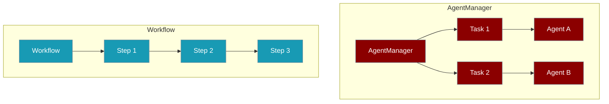
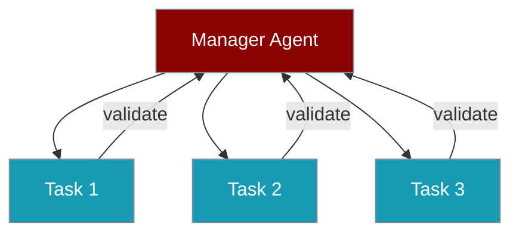

# Agent Orchestration

PraisonAI provides two orchestration patterns for multi-agent systems. Choose based on your mental model.



## Quick Decision Guide

<CardGroup cols={2}>
  <Card title="Use AgentManager" icon="users-gear">
    - Task-based DAG execution
    - Hierarchical with manager agent
    - Explicit task-agent assignment
    - Complex dependencies
  </Card>
  <Card title="Use Workflow" icon="diagram-project">
    - Simple sequential pipelines
    - Pattern-based (Route, Loop, Parallel)
    - Workflow composition
    - Cleaner syntax
  </Card>
</CardGroup>

## Comparison

| Feature | AgentManager | Workflow |
|---------|--------------|----------|
| **Mental Model** | "Who does what" | "What happens next" |
| **Unit of Work** | `Task` + `Agent` | `Step` (Agent/function) |
| **Sequential** | `process="sequential"` | Default behavior |
| **Parallel** | `process="parallel"` | `parallel([...])` |
| **Conditional** | `task.condition={...}` | `route({...})`, `when()` |
| **Loop** | `task.loop_over="items"` | `loop(step, over="items")` |
| **Hierarchical** | ✅ `manager_llm` | ❌ Not available |
| **Repeat Until** | ❌ Not available | ✅ `repeat(step, until=...)` |
| **Composition** | ❌ Not available | ✅ `include(workflow=...)` |

## AgentManager

Best for **task-centric** workflows where you think in terms of "who does what task".

```python
from praisonaiagents import Agent, AgentManager, Task

researcher = Agent(role="Researcher", instructions="Research topics")
writer = Agent(role="Writer", instructions="Write content")

task1 = Task(description="Research AI trends", agent=researcher)
task2 = Task(description="Write article", agent=writer)

manager = AgentManager(
    agents=[researcher, writer],
    tasks=[task1, task2],
    process="sequential"  # or "parallel", "hierarchical"
)
result = manager.start()
```

### Hierarchical Mode

Use a manager agent to validate and coordinate:

```python
manager = AgentManager(
    agents=[researcher, writer, editor],
    tasks=[task1, task2, task3],
    process="hierarchical",
    manager_llm="gpt-4o-mini"
)
```



## Workflow

Best for **flow-centric** pipelines where you think in terms of "what happens in sequence".

```python
from praisonaiagents import Agent
from praisonaiagents.workflows import Workflow

researcher = Agent(instructions="Research topics")
writer = Agent(instructions="Write content")
editor = Agent(instructions="Edit content")

workflow = Workflow(steps=[researcher, writer, editor])
result = workflow.start("Write about AI")
```

### Patterns

<Tabs>
  <Tab title="Route">
    Branch based on output:
    ```python
    from praisonaiagents.workflows import Workflow, route
    
    workflow = Workflow(steps=[
        classifier,
        route({
            "positive": [celebrate],
            "negative": [escalate],
            "default": [log]
        })
    ])
    ```
  </Tab>
  <Tab title="Parallel">
    Execute concurrently:
    ```python
    from praisonaiagents.workflows import Workflow, parallel
    
    workflow = Workflow(steps=[
        parallel([researcher1, researcher2, researcher3]),
        aggregator
    ])
    ```
  </Tab>
  <Tab title="Loop">
    Iterate over items:
    ```python
    from praisonaiagents.workflows import Workflow, loop
    
    workflow = Workflow(
        steps=[loop(processor, over="items")],
        variables={"items": ["a", "b", "c"]}
    )
    ```
  </Tab>
  <Tab title="Repeat">
    Repeat until condition:
    ```python
    from praisonaiagents.workflows import Workflow, repeat
    
    workflow = Workflow(steps=[
        repeat(
            improver,
            until=lambda ctx: "done" in ctx.previous_result,
            max_iterations=5
        )
    ])
    ```
  </Tab>
</Tabs>

## Same Use Case, Different APIs

<Accordion title="Sequential: Research → Write → Edit">
<CodeGroup>
```python AgentManager
manager = AgentManager(
    agents=[researcher, writer, editor],
    tasks=[
        Task(description="Research AI", agent=researcher),
        Task(description="Write article", agent=writer),
        Task(description="Edit article", agent=editor),
    ],
    process="sequential"
)
result = manager.start()
```

```python Workflow
workflow = Workflow(steps=[researcher, writer, editor])
result = workflow.start("Research AI")
```
</CodeGroup>
</Accordion>

<Accordion title="Parallel Execution">
<CodeGroup>
```python AgentManager
manager = AgentManager(
    agents=[a, b, c],
    tasks=[Task(..., agent=a), Task(..., agent=b), Task(..., agent=c)],
    process="parallel"
)
```

```python Workflow
workflow = Workflow(steps=[
    parallel([a, b, c]),
    aggregator
])
```
</CodeGroup>
</Accordion>

## Shared Features

Both support the same consolidated parameters:

| Parameter | Description |
|-----------|-------------|
| `memory` | Memory configuration |
| `planning` | Planning mode |
| `context` | Context management |
| `output` | Output configuration |
| `hooks` | Lifecycle callbacks |
| `autonomy` | Agent autonomy |
| `knowledge` | RAG configuration |
| `guardrails` | Validation |
| `web` | Web search/fetch |
| `reflection` | Self-reflection |
| `caching` | Caching |

## Best Practices

<Steps>
  <Step title="Start Simple">
    Use `Workflow` for simple sequential pipelines. It's cleaner.
  </Step>
  <Step title="Add Patterns">
    Use `route()`, `parallel()`, `loop()` for complex flows.
  </Step>
  <Step title="Use AgentManager for DAGs">
    When you need explicit task dependencies or hierarchical validation.
  </Step>
  <Step title="Don't Mix">
    Pick one pattern per workflow. Don't nest AgentManager in Workflow.
  </Step>
</Steps>

## Related

<CardGroup cols={2}>
  <Card title="Workflows" icon="diagram-project" href="/features/workflows">
    Deep dive into Workflow patterns
  </Card>
  <Card title="AgentManager" icon="users-gear" href="/features/agent-manager">
    Task-based orchestration details
  </Card>
  <Card title="Tasks" icon="list-check" href="/concepts/tasks">
    Task configuration reference
  </Card>
  <Card title="Agents" icon="robot" href="/concepts/agents">
    Agent configuration reference
  </Card>
</CardGroup>
