Output configuration controls how agents display their responses - silent for programmatic use, verbose for interactive sessions, or streaming for real-time feedback.

```mermaid
graph LR
    subgraph "Output Modes"
        Silent[🔇 Silent<br/>No display]
        Actions[📋 Actions<br/>Tool calls only]
        Verbose[📢 Verbose<br/>Rich panels]
        Stream[🌊 Stream<br/>Real-time]
    end
    
    Silent -->|"API/SDK"| Use[Use Case]
    Actions -->|"Debugging"| Use
    Verbose -->|"Interactive"| Use
    Stream -->|"Chat UI"| Use
    
    classDef silent fill:#6366F1,stroke:#7C90A0,color:#fff
    classDef actions fill:#F59E0B,stroke:#7C90A0,color:#fff
    classDef verbose fill:#10B981,stroke:#7C90A0,color:#fff
    
    class Silent silent
    class Actions actions
    class Verbose,Stream verbose
```



## Quick Start

<Steps>

<Step title="Default (Silent)">
```python
from praisonaiagents import Agent

# Default is silent - no output overhead
agent = Agent(
    name="API Agent",
    instructions="You process data"
)

result = agent.chat("Analyze this data")  # Returns result, no display
```
</Step>

<Step title="Verbose Mode">
```python
agent = Agent(
    name="Interactive Agent",
    instructions="You help users",
    output="verbose"  # Rich panels and formatting
)

agent.start("Help me with Python")  # Shows formatted output
```
</Step>

</Steps>

---

## Output Presets


| Preset | Display | Use Case |
|--------|---------|----------|
| `silent` | None | Programmatic use, fastest |
| `actions` | Tool calls + final output | Debugging |
| `verbose` | Rich panels | Interactive sessions |
| `json` | JSONL events | Piping to other tools |

```python
# Preset examples
agent = Agent(instructions="...", output="silent")   # Default
agent = Agent(instructions="...", output="actions")  # Debug
agent = Agent(instructions="...", output="verbose")  # Interactive
agent = Agent(instructions="...", output="json")     # Piping
```

---

## Configuration Options

```python
from praisonaiagents import OutputConfig

config = OutputConfig(
    verbose=True,           # Enable verbose output
    markdown=True,          # Format as markdown
    stream=True,            # Enable streaming
    metrics=True,           # Show token metrics
    reasoning_steps=True,   # Show reasoning
    actions_trace=False,    # Tool call trace
    json_output=False,      # JSONL output
    simple_output=False,    # Plain text only
    show_parameters=False,  # Show LLM parameters (debug)
    status_trace=False,     # Clean inline status updates
)
```

| Option | Type | Default | Description |
|--------|------|---------|-------------|
| `verbose` | `bool` | `False` | Enable verbose output |
| `markdown` | `bool` | `False` | Format as markdown |
| `stream` | `bool` | `False` | Enable streaming |
| `metrics` | `bool` | `False` | Show token metrics |
| `reasoning_steps` | `bool` | `False` | Show reasoning process |
| `actions_trace` | `bool` | `False` | Show tool calls |
| `json_output` | `bool` | `False` | Output JSONL events |
| `simple_output` | `bool` | `False` | Plain text without panels |
| `show_parameters` | `bool` | `False` | Show LLM parameters (debug) |
| `status_trace` | `bool` | `False` | Clean inline status updates |

---

## Streaming

Real-time output as the agent generates:

```python
agent = Agent(
    instructions="You write stories",
    output=OutputConfig(stream=True)
)

# Streams response in real-time
agent.start("Write a short story about AI")
```


---

## Verbose vs Silent

```mermaid
graph LR
    subgraph "Silent Mode"
        S1[Request] --> S2[Process]
        S2 --> S3[Return]
    end
    
    subgraph "Verbose Mode"
        V1[Request] --> V2[🎨 Panel: Processing]
        V2 --> V3[🔧 Panel: Tool Call]
        V3 --> V4[📝 Panel: Response]
        V4 --> V5[Return]
    end
    
    classDef silent fill:#6366F1,stroke:#7C90A0,color:#fff
    classDef verbose fill:#10B981,stroke:#7C90A0,color:#fff
    
    class S1,S2,S3 silent
    class V1,V2,V3,V4,V5 verbose
```



### Silent (Default)

```python
# Fastest - no display overhead
agent = Agent(instructions="...")
result = agent.chat("Query")  # Just returns result
```

### Verbose

```python
# Rich formatted output
agent = Agent(instructions="...", output="verbose")
agent.start("Query")  # Shows panels, formatting
```

---

## JSON Output

For piping to other tools:

```python
agent = Agent(
    instructions="You analyze data",
    output=OutputConfig(json_output=True)
)

# Outputs JSONL events to stderr
# {"event": "llm_start", "model": "gpt-4o", ...}
# {"event": "llm_end", "tokens": 150, ...}
# {"event": "response", "content": "...", ...}
```

---

## Metrics Display

Show token usage and timing:

```python
agent = Agent(
    instructions="You help with tasks",
    output=OutputConfig(
        verbose=True,
        metrics=True,  # Show token counts
    )
)

# Output includes:
# Tokens: 150 input, 200 output
# Time: 1.2s
```

---

## Method-Specific Output

Different methods have different default behaviors:

| Method | Default Output | Override |
|--------|----------------|----------|
| `agent.chat()` | Silent | Use `output=` param |
| `agent.start()` | Verbose + Stream | Use `output=` param |
| `agent.run()` | Silent | Use `output=` param |

```python
# chat() is silent by default
result = agent.chat("Query")

# start() is verbose by default
agent.start("Query")

# Override defaults
agent.chat("Query", stream=True)  # Force streaming
```

---

## Best Practices

<AccordionGroup>
  <Accordion title="Use silent for APIs">
    Default silent mode has zero overhead - ideal for programmatic use.
  </Accordion>
  
  <Accordion title="Use verbose for debugging">
    See exactly what the agent is doing with verbose mode.
  </Accordion>
  
  <Accordion title="Enable streaming for UX">
    Users prefer seeing progress - enable streaming for interactive apps.
  </Accordion>
  
  <Accordion title="Use JSON for pipelines">
    JSONL output integrates well with log aggregators and pipelines.
  </Accordion>
</AccordionGroup>

---

## Related

<CardGroup cols={2}>
  <Card title="Streaming" icon="water" href="/features/streaming">
    Real-time output
  </Card>
  <Card title="Execution" icon="play" href="/concepts/execution">
    Execution limits
  </Card>
</CardGroup>
