```mermaid
graph LR
    subgraph "Multi-Agent Planning"
        Task[📋 Task] --> Planner[🧠 Planner]
        Planner --> Plan[📝 Plan]
        Plan --> A1[🤖 Agent 1]
        Plan --> A2[🤖 Agent 2]
        A1 --> Result[✅ Result]
        A2 --> Result
    end
    
    classDef task fill:#6366F1,stroke:#7C90A0,color:#fff
    classDef agent fill:#10B981,stroke:#7C90A0,color:#fff
    
    class Task,Plan task
    class Planner,A1,A2,Result agent
```

Planning enables agents to think before acting - decomposing complex tasks into manageable steps, then executing them systematically.

```mermaid
graph LR
    subgraph "Planning Flow"
        Task[📋 Complex Task] -->|1\. Analyze| Planner[🧠 Planner]
        Planner -->|2\. Decompose| Steps[📝 Steps]
        Steps -->|3\. Execute| Agent[🤖 Agent]
        Agent -->|4\. Complete| Result[✅ Result]
    end
    
    classDef task fill:#6366F1,stroke:#7C90A0,color:#fff
    classDef planner fill:#F59E0B,stroke:#7C90A0,color:#fff
    classDef agent fill:#10B981,stroke:#7C90A0,color:#fff
    
    class Task,Steps task
    class Planner planner
    class Agent,Result agent
```



## Quick Start

<Steps>

<Step title="Enable Planning">
```python
from praisonaiagents import Agent

agent = Agent(
    name="Planner Agent",
    instructions="You solve complex problems step by step",
    planning=True  # Enable planning
)

agent.start("Build a REST API with authentication")
```
</Step>

<Step title="With Configuration">
```python
from praisonaiagents import Agent, PlanningConfig

agent = Agent(
    name="Advanced Planner",
    instructions="You are a strategic problem solver",
    planning=PlanningConfig(
        llm="gpt-4o",           # Use powerful model for planning
        reasoning=True,         # Show reasoning process
        auto_approve=False,     # Require approval before execution
    )
)
```
</Step>

</Steps>

---

## How Planning Works


### The Planning Process

| Phase | What Happens | Output |
|-------|--------------|--------|
| **Analyze** | Understand the task requirements | Goal definition |
| **Decompose** | Break into subtasks | List of steps |
| **Order** | Determine dependencies | Execution order |
| **Execute** | Run each step | Intermediate results |
| **Synthesize** | Combine results | Final output |

---

## Configuration Options

```python
from praisonaiagents import PlanningConfig

config = PlanningConfig(
    llm="gpt-4o",           # LLM for planning (can differ from execution)
    tools=[search_tool],    # Tools available during planning
    reasoning=True,         # Enable reasoning display
    auto_approve=False,     # Require user approval
    read_only=False,        # Read-only mode (no modifications)
)
```

| Option | Type | Default | Description |
|--------|------|---------|-------------|
| `llm` | `str` | `None` | LLM model for planning (uses agent's LLM if not set) |
| `tools` | `list` | `None` | Tools available during planning phase |
| `reasoning` | `bool` | `False` | Show reasoning process |
| `auto_approve` | `bool` | `False` | Auto-approve plans without confirmation |
| `read_only` | `bool` | `False` | Only allow read operations |

---

## Planning Modes

```mermaid
graph TB
    subgraph "Planning Modes"
        Simple[🎯 Simple<br/>planning=True]
        Config[⚙️ Configured<br/>PlanningConfig]
        ReadOnly[🔒 Read-Only<br/>read_only=True]
    end
    
    Simple -->|"Default settings"| Execute[Execute Plan]
    Config -->|"Custom LLM, tools"| Execute
    ReadOnly -->|"No modifications"| Execute
    
    classDef mode fill:#189AB4,stroke:#7C90A0,color:#fff
    classDef exec fill:#10B981,stroke:#7C90A0,color:#fff
    
    class Simple,Config,ReadOnly mode
    class Execute exec
```



### Simple Planning

```python
# Just enable it
agent = Agent(
    instructions="You are a helpful assistant",
    planning=True
)
```

### Configured Planning

```python
# With specific settings
agent = Agent(
    instructions="You are a code architect",
    planning=PlanningConfig(
        llm="gpt-4o",
        reasoning=True,
        auto_approve=True,
    )
)
```

### Read-Only Planning

```python
# Safe mode - no file modifications
agent = Agent(
    instructions="You analyze code",
    planning=PlanningConfig(
        read_only=True,  # Only read operations allowed
    )
)
```

---

## Multi-Agent Planning

Enable planning for multi-agent workflows:

```python
from praisonaiagents import Agent, Task, PraisonAIAgents

researcher = Agent(name="Researcher", instructions="Research topics")
writer = Agent(name="Writer", instructions="Write content")

agents = PraisonAIAgentManager(
    agents=[researcher, writer],
    planning=True,  # Enable planning for the workflow
)

agents.start("Write a blog post about AI trends")
```



---

## When to Use Planning

<CardGroup cols={2}>
  <Card title="✅ Use Planning For" icon="check">
    - Complex multi-step tasks
    - Tasks requiring coordination
    - Code refactoring projects
    - Research and analysis
    - Content creation workflows
  </Card>
  <Card title="❌ Skip Planning For" icon="xmark">
    - Simple Q&A
    - Single-step operations
    - Real-time responses needed
    - Trivial tasks
  </Card>
</CardGroup>

---

## Best Practices

<AccordionGroup>
  <Accordion title="Use a powerful model for planning">
    Planning benefits from stronger reasoning. Use `gpt-4o` or similar for planning even if using a smaller model for execution.
  </Accordion>
  
  <Accordion title="Enable reasoning for complex tasks">
    Set `reasoning=True` to see the agent's thought process and catch issues early.
  </Accordion>
  
  <Accordion title="Review plans before execution">
    Keep `auto_approve=False` for critical tasks to review and modify plans.
  </Accordion>
  
  <Accordion title="Use read-only mode for analysis">
    When analyzing code or data, use `read_only=True` to prevent accidental modifications.
  </Accordion>
</AccordionGroup>

---

## Related

<CardGroup cols={2}>
  <Card title="Reflection" icon="rotate" href="/concepts/reflection">
    Self-evaluation after execution
  </Card>
  <Card title="Autonomy" icon="robot" href="/concepts/autonomy">
    Control agent independence
  </Card>
</CardGroup>
