# Understanding Process Types

Process types in PraisonAI define how tasks are executed and how agents collaborate. Each process type offers different patterns for task execution and agent coordination.

<Note>
**Naming Convention**: `AgentTeam` uses `process` parameter for sequential/hierarchical. `AgentFlow` is a separate class for workflow patterns with `route()`, `parallel()`, `loop()`.
</Note>

## Process Types Overview

```mermaid
graph TB
    subgraph AgentTeamProcess["AgentTeam Processes"]
        direction LR
        SEQ["➡️ sequential"]
        HIER["👔 hierarchical"]
    end
    
    subgraph AgentFlowPatterns["AgentFlow Patterns"]
        direction LR
        ROUTE["🔀 route()"]
        PAR["⚡ parallel()"]
        LOOP["🔁 loop()"]
    end
    
    classDef process fill:#189AB4,stroke:#7C90A0,color:#fff
    classDef pattern fill:#2E8B57,stroke:#7C90A0,color:#fff
    
    class SEQ,HIER process
    class ROUTE,PAR,LOOP pattern
```



<CardGroup cols={3}>
  <Card
    title="Sequential"
    icon="arrow-right"
  >
    Linear task execution in a predefined order via `AgentTeam`
  </Card>
  <Card
    title="Hierarchical"
    icon="sitemap"
  >
    Manager-coordinated task execution with dynamic assignment via `AgentTeam`
  </Card>
  <Card
    title="Workflow"
    icon="diagram-project"
  >
    Complex flows with routing, parallel, and loops via `AgentFlow`
  </Card>
</CardGroup>

## Sequential Process

```mermaid
graph LR
    Input([▶]) --> A1[🤖 Agent 1] --> A2[🤖 Agent 2] --> A3[🤖 Agent 3] --> Output([✓])
    
    classDef io fill:#8B0000,stroke:#7C90A0,color:#fff
    classDef agent fill:#189AB4,stroke:#7C90A0,color:#fff
    
    class Input,Output io
    class A1,A2,A3 agent
```



The simplest form of task execution where tasks are performed one after another.

<Card>
  ### Characteristics
  - Linear execution flow
  - Each task receives output from previous task
  - Predictable order
  - Simple dependency management

  ### Usage
  ```python
  from praisonaiagents import Agent, AgentTeam

  agents = AgentTeam(
      agents=[agent1, agent2, agent3],
      tasks=[task1, task2, task3],
      process="sequential"  # Default
  )
  result = agents.start()
  ```
</Card>

## Hierarchical Process

```mermaid
graph TB
    Input([▶]) --> Manager[👔 Manager Agent]
    
    Manager -->|assign| W1[🤖 Worker 1]
    Manager -->|assign| W2[🤖 Worker 2]
    Manager -->|assign| W3[🤖 Worker 3]
    
    W1 -->|report| Manager
    W2 -->|report| Manager
    W3 -->|report| Manager
    
    Manager --> Output([✓])
    
    classDef io fill:#8B0000,stroke:#7C90A0,color:#fff
    classDef manager fill:#6366F1,stroke:#7C90A0,color:#fff
    classDef worker fill:#189AB4,stroke:#7C90A0,color:#fff
    
    class Input,Output io
    class Manager manager
    class W1,W2,W3 worker
```



Uses a manager LLM to coordinate task execution and agent assignments dynamically.

<Card>
  ### Characteristics
  - Manager-driven coordination using `manager_llm`
  - Dynamic task assignment to best-suited agents
  - Flexible execution order (manager decides)
  - Intelligent resource allocation

  ### Configuration
  ```python
  from praisonaiagents import Agent, Task, AgentTeam

  agents = AgentTeam(
      agents=[researcher, writer, editor],
      tasks=[research_task, write_task, edit_task],
      process="hierarchical",
      manager_llm="gpt-4o"  # Required for hierarchical
  )
  result = agents.start()
  ```
</Card>

## Workflow Process (AgentFlow)

```mermaid
graph LR
    Input([▶]) --> Start[Step 1]
    Start --> C{Condition}
    
    C -->|route A| A[Handler A]
    C -->|route B| B[Handler B]
    
    A --> Join[Step 3]
    B --> Join
    
    Join --> Output([✓])
    
    classDef io fill:#8B0000,stroke:#7C90A0,color:#fff
    classDef step fill:#189AB4,stroke:#7C90A0,color:#fff
    classDef condition fill:#6366F1,stroke:#7C90A0,color:#fff
    
    class Input,Output io
    class Start,A,B,Join step
    class C condition
```



<Note>
`AgentFlow` is a separate class from `AgentTeam`. Use `AgentFlow` for deterministic step sequences with advanced patterns.
</Note>

<Card>
  ### Features
  - Sequential step execution (steps can be agents OR functions)
  - Conditional routing with `route()`
  - Parallel execution with `parallel()`
  - Loop iteration with `loop(from_csv="file.csv")`
  - Repeat until condition with `repeat()`
  - Callbacks and guardrails

  ### Implementation
  ```python
  from praisonaiagents import Agent, AgentFlow
  from praisonaiagents import route, parallel, loop

  researcher = Agent(instructions="Research topics")
  writer = Agent(instructions="Write content")

  # AgentFlow with agents as steps
  flow = AgentFlow(
      steps=[
          researcher,
          route({
              "positive": [writer],
              "negative": [fallback_agent]
          })
      ]
  )
  result = flow.start("Research AI trends")
  ```
</Card>

### AgentFlow Patterns

```mermaid
graph TB
    subgraph Sequential["Sequential"]
        S1[Step] --> S2[Step] --> S3[Step]
    end
    
    subgraph Parallel["⚡ parallel()"]
        P1[Step]
        P2[Step]
        P3[Step]
    end
    
    subgraph Route["🔀 route()"]
        R{Condition}
        R --> RA[Step A]
        R --> RB[Step B]
    end
    
    subgraph Loop["🔁 loop()"]
        L1[Step] --> L2{Check}
        L2 -->|repeat| L1
        L2 -->|done| L3[Done]
    end
    
    classDef step fill:#189AB4,stroke:#7C90A0,color:#fff
    classDef condition fill:#6366F1,stroke:#7C90A0,color:#fff
    classDef done fill:#10B981,stroke:#7C90A0,color:#fff
    
    class S1,S2,S3,P1,P2,P3,RA,RB,L1 step
    class R,L2 condition
    class L3 done
```



## Getting Started

<Steps>
  <Step title="Install PraisonAI">
    Install the core package:
    ```bash Terminal
    pip install praisonaiagents
    ```
  </Step>

  <Step title="Configure Environment">
    ```bash Terminal
    export OPENAI_API_KEY=your_openai_key
    ```
    Generate your OpenAI API key from [OpenAI](https://platform.openai.com/api-keys)
    Use other LLM providers like Ollama, Anthropic, Groq, Google, etc. Please refer to the [Models](/models) for more information.
  </Step>

  <Step title="Create Agent">
    Create `app.py`:
<CodeGroup>
  ```python Single Agent Sequential Process
  from praisonaiagents import Agent, Task, AgentTeam

  # Create an agent
  researcher = Agent(
      name="Researcher",
      role="Senior Research Analyst",
      goal="Uncover cutting-edge developments in AI",
      backstory="You are an expert at a technology research group",
      
      llm="gpt-4o"
  )

  # Define a task
  task = Task(
      name="research_task",
      description="Analyze 2024's AI advancements",
      expected_output="A detailed report",
      agent=researcher
  )

  # Run the agents
  agents = AgentTeam(
      agents=[researcher],
      tasks=[task],
      output="silent",
      process="sequential"
  )

  result = agents.start()
  ```

  ```python Multiple Agents Hierarchical Process
  from praisonaiagents import Agent, Task, AgentTeam

  # Create multiple agents 
  researcher = Agent(
      name="Researcher",
      role="Senior Research Analyst",
      goal="Uncover cutting-edge developments in AI",
      backstory="You are an expert at a technology research group",
      
      llm="gpt-4o",
      
  )

  writer = Agent(
      name="Writer",
      role="Tech Content Strategist",
      goal="Craft compelling content on tech advancements",
      backstory="You are a content strategist",
      llm="gpt-4o",
      
  )

  # Define multiple tasks
  task1 = Task(
      name="research_task",
      description="Analyze 2024's AI advancements",
      expected_output="A detailed report",
      agent=researcher
  )

  task2 = Task(
      name="writing_task",
      description="Create a blog post about AI advancements",
      expected_output="A blog post",
      agent=writer
  )

  # Run with hierarchical process
  agents = AgentTeam(
      agents=[researcher, writer],
      tasks=[task1, task2],
      output="silent",
      process="hierarchical",
      manager_llm="gpt-4o"
  )

  result = agents.start()
  ```
</CodeGroup>
  </Step>
</Steps>
<br /><br />
<div className="relative w-full aspect-video">
  <iframe
    className="absolute top-0 left-0 w-full h-full"
    src="https://www.youtube.com/embed/yWTH44QPl2A"
    title="YouTube video player"
    allow="accelerometer; autoplay; clipboard-write; encrypted-media; gyroscope; picture-in-picture"
    allowFullScreen
  ></iframe>
</div>
<br />

## Advanced Features

<CardGroup cols={2}>
  <Card title="State Management" icon="database" iconType="solid">
    <AccordionGroup>
      <Accordion title="Task State Tracking">
        Monitor and manage the progress of each task in real-time
      </Accordion>
      <Accordion title="Context Preservation">
        Maintain important information across different stages of execution
      </Accordion>
      <Accordion title="Data Flow Control">
        Manage how data moves between tasks and agents efficiently
      </Accordion>
    </AccordionGroup>
  </Card>

  <Card title="Error Handling" icon="shield-check" iconType="solid">
    <AccordionGroup>
      <Accordion title="Graceful Recovery">
        Automatically handle failures and continue execution
      </Accordion>
      <Accordion title="Alternative Paths">
        Switch to backup plans when primary execution fails
      </Accordion>
      <Accordion title="Error Reporting">
        Detailed error logs and diagnostic information
      </Accordion>
    </AccordionGroup>
  </Card>

  <Card title="Monitoring" icon="chart-line" iconType="solid">
    <AccordionGroup>
      <Accordion title="Progress Tracking">
        Real-time visibility into task completion status
      </Accordion>
      <Accordion title="Performance Metrics">
        Measure execution time and resource efficiency
      </Accordion>
      <Accordion title="Resource Usage">
        Monitor system resource utilization
      </Accordion>
    </AccordionGroup>
  </Card>

  <Card title="Integration" icon="plug" iconType="solid">
    <AccordionGroup>
      <Accordion title="External Systems">
        Connect with other services and platforms
      </Accordion>
      <Accordion title="API Sync">
        Maintain data consistency across systems
      </Accordion>
      <Accordion title="Event Handling">
        React to system and external events
      </Accordion>
    </AccordionGroup>
  </Card>
</CardGroup>

## Async Processing

<Note>
All process types support asynchronous execution through async generators, enabling efficient parallel processing and non-blocking operations.
</Note>

### Core Async Methods

<CardGroup cols={3}>
  <Card title="asequential" icon="arrow-right">
    Async version of sequential process for non-blocking linear execution
  </Card>
  <Card title="aworkflow" icon="diagram-project">
    Async workflow process for complex parallel task execution
  </Card>
  <Card title="ahierarchical" icon="sitemap">
    Async hierarchical process for distributed task management
  </Card>
</CardGroup>

### Process-Specific Features

<Tabs>
  <Tab title="Sequential Process">
    <Card>
      - Tasks execute in order but don't block
      - Maintains sequence while allowing async operations
      - Perfect for I/O-heavy tasks
      ```python
      async def main():
          agents = AgentTeam(
              process="sequential",
              async_mode=True
          )
          await agents.astart()
      ```
    </Card>
  </Tab>
  
  <Tab title="Workflow Process">
    <Card>
      - Parallel execution with `parallel()`
      - Conditional routing with `route()`
      - Loop iteration with `loop()`
      - Repeat patterns with `repeat()`
      ```python
      from praisonaiagents import AgentFlow
      from praisonaiagents import parallel

      workflow = AgentFlow(
          steps=[
              parallel([step1, step2, step3]),
              aggregator_step
          ]
      )
      result = workflow.start("input")
      ```
    </Card>
  </Tab>
  
  <Tab title="Hierarchical Process">
    <Card>
      - Async manager delegation
      - Parallel subtask execution
      - Dynamic worker assignment
      ```python
      async def main():
          agents = AgentTeam(
              process="hierarchical",
              async_mode=True,
              dynamic_assignment=True
          )
          await agents.astart()
      ```
    </Card>
  </Tab>
</Tabs>

### Key Benefits

<CardGroup cols={2}>
  <Card title="Performance" icon="bolt">
    - Efficient resource utilization
    - Reduced waiting time
    - Better throughput
  </Card>
  
  <Card title="Flexibility" icon="puzzle-piece">
    - Mix sync and async tasks
    - Adaptable execution patterns
    - Easy scaling
  </Card>
</CardGroup>