```mermaid
graph LR
    subgraph "Shared Knowledge"
        Docs[(📚 Documents)] --> VDB[(Vector DB)]
    end
    
    subgraph "Agents"
        VDB -->|"search"| R[🔍 Researcher]
        R -->|"context"| W[✍️ Writer]
    end
    
    W --> Output([📄 Report])
    
    classDef docs fill:#F59E0B,stroke:#7C90A0,color:#fff
    classDef agent fill:#189AB4,stroke:#7C90A0,color:#fff
    
    class Docs,VDB docs
    class R,W agent
```

RAG enables agents to retrieve relevant information from documents before generating responses, producing accurate, grounded answers with citations.

```mermaid
graph LR
    subgraph "RAG Pipeline"
        Q[❓ Query] -->|1\. Embed| E[Query Vector]
        E -->|2\. Search| VDB[(Vector DB)]
        VDB -->|3\. Retrieve| Chunks[📄 Relevant Chunks]
        Chunks -->|4\. Augment| LLM[🧠 LLM]
        LLM -->|5\. Generate| Answer[✅ Answer + Citations]
    end
    
    classDef query fill:#6366F1,stroke:#7C90A0,color:#fff
    classDef db fill:#EF4444,stroke:#7C90A0,color:#fff
    classDef llm fill:#10B981,stroke:#7C90A0,color:#fff
    
    class Q,E query
    class VDB db
    class LLM,Answer,Chunks llm
```



## Quick Start

<Steps>

<Step title="Install">
```bash
pip install "praisonaiagents[knowledge]"
export OPENAI_API_KEY=your_key
```
</Step>

<Step title="Create Agent with Knowledge">
```python
from praisonaiagents import Agent

agent = Agent(
    name="RAG Agent",
    instructions="Answer questions using the knowledge base",
    knowledge=["docs/manual.pdf"]  # Your documents
)

agent.start("What are the key features?")
```
</Step>

<Step title="Get Answer with Citations">
```python
# Use query() for structured results with citations
result = agent.query("What are the main findings?")

print(result.answer)
for citation in result.citations:
    print(f"  [{citation.id}] {citation.source}")
```
</Step>

</Steps>

---

## How RAG Works


### The RAG Process

| Phase | What Happens | When |
|-------|--------------|------|
| **Indexing** | Documents → Chunks → Embeddings → Vector DB | Once per document |
| **Retrieval** | Query → Embedding → Similarity Search → Top-K chunks | Every query |
| **Generation** | Query + Context → LLM → Answer + Citations | Every query |

---

## Agent Methods for RAG


| Method | Returns | Use Case |
|--------|---------|----------|
| `agent.start(prompt)` | String | Interactive terminal with RAG |
| `agent.chat(prompt)` | String | Programmatic RAG |
| `agent.query(prompt)` | `RAGResult` | Structured answer + citations |
| `agent.retrieve(prompt)` | `ContextPack` | Context only, no LLM generation |

### Example: All Methods

```python
from praisonaiagents import Agent

agent = Agent(
    name="Research Agent",
    instructions="Answer using the knowledge base",
    knowledge=["research_paper.pdf"]
)

# Method 1: Interactive (verbose output)
agent.start("Summarize the findings")

# Method 2: Programmatic (silent)
answer = agent.chat("What methodology was used?")

# Method 3: Structured with citations
result = agent.query("What are the conclusions?")
print(result.answer)
print(result.citations)

# Method 4: Retrieval only (no LLM)
context = agent.retrieve("key findings")
print(f"Found {len(context.citations)} sources")
print(context.context)  # Raw retrieved text
```

---

## Knowledge Configuration

### Basic: File List

```python
agent = Agent(
    name="Agent",
    knowledge=["doc1.pdf", "doc2.txt", "folder/"]
)
```

### Advanced: Full Configuration

```python
from praisonaiagents import Agent, KnowledgeConfig

agent = Agent(
    name="Advanced RAG Agent",
    instructions="Answer with high precision",
    knowledge=KnowledgeConfig(
        sources=["docs/"],
        
        # Retrieval settings
        retrieval_k=5,              # Number of chunks to retrieve
        rerank=True,                # Rerank for better relevance
        
        # Chunking settings
        chunking_strategy="semantic",  # semantic, fixed, sentence
        chunk_size=1000,
        chunk_overlap=200,
        
        # Vector store
        vector_store={
            "provider": "chroma",
            "config": {
                "collection_name": "my_docs",
                "path": ".praison"
            }
        }
    )
)
```

### Configuration Options

| Option | Type | Default | Description |
|--------|------|---------|-------------|
| `sources` | `list` | `[]` | Files, folders, or URLs |
| `retrieval_k` | `int` | `5` | Number of chunks to retrieve |
| `rerank` | `bool` | `False` | Enable reranking |
| `chunking_strategy` | `str` | `"semantic"` | How to split documents |
| `chunk_size` | `int` | `1000` | Max tokens per chunk |
| `chunk_overlap` | `int` | `200` | Overlap between chunks |
| `auto_retrieve` | `bool` | `True` | Auto-inject context |

---

## Retrieval Strategies

PraisonAI automatically selects the optimal strategy based on corpus size:

```mermaid
graph TD
    Start([📊 Corpus Size]) --> Q1{< 10 files?}
    Q1 -->|Yes| Direct[🎯 DIRECT<br/>Load all content]
    Q1 -->|No| Q2{< 100 files?}
    Q2 -->|Yes| Basic[🔍 BASIC<br/>Semantic search]
    Q2 -->|No| Q3{< 1000 files?}
    Q3 -->|Yes| Hybrid[⚡ HYBRID<br/>Keyword + Semantic]
    Q3 -->|No| Q4{< 10000 files?}
    Q4 -->|Yes| Reranked[🏆 RERANKED<br/>Hybrid + Reranking]
    Q4 -->|No| Compressed[📦 COMPRESSED<br/>+ Compression]
    
    classDef small fill:#10B981,stroke:#7C90A0,color:#fff
    classDef medium fill:#F59E0B,stroke:#7C90A0,color:#fff
    classDef large fill:#EF4444,stroke:#7C90A0,color:#fff
    
    class Direct,Basic small
    class Hybrid,Reranked medium
    class Compressed large
```



| Strategy | Files | Technique |
|----------|-------|-----------|
| **DIRECT** | < 10 | Load all content into context |
| **BASIC** | < 100 | Embedding-based semantic search |
| **HYBRID** | < 1000 | Keyword + semantic search |
| **RERANKED** | < 10000 | Hybrid + cross-encoder reranking |
| **COMPRESSED** | < 100000 | Reranked + contextual compression |
| **HIERARCHICAL** | ≥ 100000 | Summaries + top-down routing |

### Force a Strategy

```python
agent = Agent(
    knowledge={
        "sources": ["large_corpus/"],
        "strategy": "reranked"  # Force reranking
    }
)
```

---

## RAG vs Knowledge vs Memory vs Context

```mermaid
graph TB
    subgraph "Information Systems"
        RAG[🔍 RAG<br/>Retrieval technique]
        Knowledge[📚 Knowledge<br/>Pre-loaded docs]
        Memory[🧠 Memory<br/>Persistent learning]
        Context[📋 Context<br/>Runtime data flow]
    end
    
    RAG -.->|"powers"| Knowledge
    Knowledge -->|"read-only"| Agent[🤖 Agent]
    Memory -->|"read/write"| Agent
    Context -->|"ephemeral"| Agent
    
    classDef rag fill:#EF4444,stroke:#7C90A0,color:#fff
    classDef knowledge fill:#F59E0B,stroke:#7C90A0,color:#fff
    classDef memory fill:#8B5CF6,stroke:#7C90A0,color:#fff
    classDef context fill:#10B981,stroke:#7C90A0,color:#fff
    classDef agent fill:#189AB4,stroke:#7C90A0,color:#fff
    
    class RAG rag
    class Knowledge knowledge
    class Memory memory
    class Context context
    class Agent agent
```



### Comparison Table

| Aspect | RAG | Knowledge | Memory | Context |
|--------|-----|-----------|--------|---------|
| **What** | Search technique | Pre-loaded docs | Persistent storage | Runtime data |
| **When** | Query time | Before execution | Across sessions | During execution |
| **Lifetime** | N/A | Permanent | Permanent | Session only |
| **Direction** | Read-only | Read-only | Read + Write | Read-only |
| **Agent Param** | Part of `knowledge=` | `knowledge=` | `memory=` | `context=` |

### When to Use What


---

## Agent with Knowledge (Simple)

For small document sets where you don't need advanced retrieval:

```python
from praisonaiagents import Agent

# Simple knowledge - loads documents, enables basic search
agent = Agent(
    name="FAQ Agent",
    instructions="Answer questions from the FAQ",
    knowledge=["faq.txt"]  # Small file, basic search
)

agent.start("What is the return policy?")
```

## Agent with RAG (Advanced)

For large document sets requiring sophisticated retrieval:

```python
from praisonaiagents import Agent, KnowledgeConfig

# Advanced RAG - full retrieval pipeline
agent = Agent(
    name="Research Agent",
    instructions="Answer with citations from research papers",
    knowledge=KnowledgeConfig(
        sources=["papers/"],
        retrieval_k=10,
        rerank=True,
        chunking_strategy="semantic"
    )
)

# Get structured result with citations
result = agent.query("What are the latest findings on X?")
```

---

## Multi-Agent RAG

Share knowledge across multiple agents:

```python
from praisonaiagents import Agent, Knowledge, PraisonAIAgents

# Create shared knowledge base
knowledge = Knowledge(config={
    "vector_store": {
        "provider": "chroma",
        "config": {"collection_name": "shared_docs"}
    }
})
knowledge.add("company_docs/")

# Multiple agents share the same knowledge
researcher = Agent(
    name="Researcher",
    instructions="Find relevant information",
    knowledge=knowledge
)

writer = Agent(
    name="Writer",
    instructions="Write based on research findings"
)

agents = PraisonAIAgentManager(
    agents=[researcher, writer],
    process="sequential"
)

agents.start("Write a report on Q4 performance")
```



---

## Supported File Types

<CardGroup cols={3}>
  <Card title="Documents" icon="file-pdf">
    PDF, DOC, DOCX, PPT, PPTX, XLS, XLSX
  </Card>
  <Card title="Text" icon="file-lines">
    TXT, CSV, JSON, XML, MD, HTML
  </Card>
  <Card title="Media" icon="image">
    Images (with OCR), Audio (with transcription)
  </Card>
</CardGroup>

---

## Vector Store Backends

```python
# ChromaDB (default)
knowledge={"sources": ["docs/"], "vector_store": {"provider": "chroma"}}

# MongoDB Atlas
knowledge={"sources": ["docs/"], "vector_store": {"provider": "mongodb"}}

# Qdrant
knowledge={"sources": ["docs/"], "vector_store": {"provider": "qdrant"}}

# Pinecone
knowledge={"sources": ["docs/"], "vector_store": {"provider": "pinecone"}}
```

---

## Citations

RAG automatically provides source citations:

```python
result = agent.query("What is the main conclusion?")

# Access citations
for citation in result.citations:
    print(f"[{citation.id}] {citation.source}")
    print(f"  Score: {citation.score:.2f}")
    print(f"  Text: {citation.text[:100]}...")
```

### Citation Modes

```python
from praisonaiagents import Agent, RetrievalConfig, CitationsMode

agent = Agent(
    knowledge=RetrievalConfig(
        sources=["docs/"],
        citations=True,
        citations_mode=CitationsMode.APPEND  # or INLINE, HIDDEN
    )
)
```

| Mode | Description |
|------|-------------|
| `APPEND` | Add sources at end of response |
| `INLINE` | Insert citation markers in text |
| `HIDDEN` | Include in metadata only |

---

## Best Practices

<CardGroup cols={2}>
  <Card title="Chunk Size" icon="scissors">
    Use 500-1000 tokens per chunk. Too small = lost context. Too large = noise.
  </Card>
  <Card title="Overlap" icon="layer-group">
    Use 10-20% overlap to preserve context across chunk boundaries.
  </Card>
  <Card title="Reranking" icon="ranking-star">
    Enable reranking for large corpora to improve relevance.
  </Card>
  <Card title="Top-K" icon="list-ol">
    Start with k=5, increase if answers lack detail.
  </Card>
</CardGroup>

---

## Troubleshooting

<AccordionGroup>
  <Accordion title="No relevant results">
    - Check if documents were indexed: `knowledge.stats()`
    - Lower the similarity threshold
    - Try different chunking strategy
</Accordion>
  
  <Accordion title="Slow retrieval">
    - Reduce `retrieval_k`
    - Disable reranking for faster results
    - Use persistent vector store
</Accordion>
  
  <Accordion title="Missing context">
    - Increase chunk overlap
    - Use semantic chunking
    - Increase `retrieval_k`
</Accordion>
</AccordionGroup>

---

## Related Documentation

<CardGroup cols={2}>
  <Card title="Knowledge" icon="book" href="/concepts/knowledge">
    Document loading and indexing
  </Card>
  <Card title="Memory" icon="brain" href="/concepts/memory">
    Persistent agent memory
  </Card>
  <Card title="Context" icon="arrows-left-right" href="/concepts/context">
    Runtime data flow
  </Card>
  <Card title="Quality RAG" icon="star" href="/features/quality-based-rag">
    Advanced quality patterns
  </Card>
</CardGroup>
