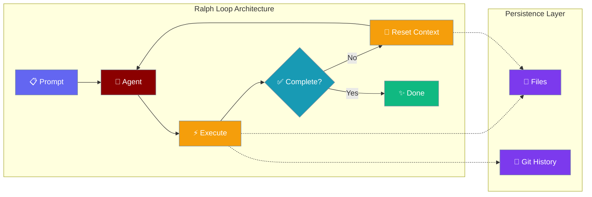
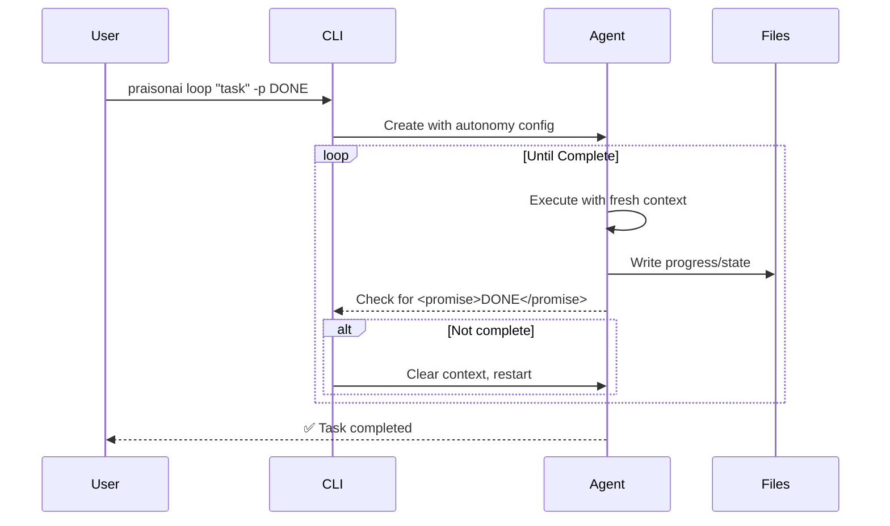

Ralph Loops enable agents to work autonomously through iterative execution cycles, using file-based state persistence and fresh context windows to prevent context degradation.



## What is Ralph?

Ralph is an autonomous AI agent loop pattern that emphasizes "naive persistence" - the agent keeps trying until it succeeds. Named after the character Ralph Wiggum from The Simpsons, it embodies a simple but effective philosophy: clear the context, read the state from files, make progress, and repeat.

**Key Principles:**
- **Fresh Context**: Each iteration starts with a clean LLM context window
- **File-Based State**: Progress persists through files and Git history, not chat memory
- **Completion Promises**: Agent signals task completion via explicit markers
- **Doom Loop Detection**: Prevents repetitive, non-productive cycles

---

## Quick Start

<Steps>

<Step title="Basic Loop">
```bash
praisonai loop "Build a REST API for user management" -n 5
```
</Step>

<Step title="With Completion Promise">
```bash
praisonai loop "Refactor the authentication module" -p DONE -v
```
The agent will include `<promise>DONE</promise>` in its response when complete.
</Step>

<Step title="With Context Clearing">
```bash
praisonai loop "Implement feature X" -p COMPLETE -c -n 20
```
Clears chat history between iterations, forcing file-based state management.
</Step>

</Steps>

---

## How It Works



| Phase | Description |
|-------|-------------|
| **Initialize** | Agent receives task with autonomy configuration |
| **Execute** | Agent works on task, writes state to files |
| **Check** | System checks for completion promise in output |
| **Reset** | If not done, context clears and loop restarts |
| **Complete** | Promise detected or max iterations reached |

---

## Configuration Options

```python
from praisonaiagents import Agent

agent = Agent(
    name="loop_agent",
    instructions="Complete the task autonomously",
    autonomy={
        "max_iterations": 10,
        "completion_promise": "DONE",
        "clear_context": True,
    }
)

result = agent.run_autonomous(
    prompt="Build a calculator app",
    max_iterations=10,
    timeout_seconds=300,
    completion_promise="DONE",
    clear_context=True,
)
```

### CLI Options

| Option | Short | Type | Default | Description |
|--------|-------|------|---------|-------------|
| `--max-iterations` | `-n` | `int` | `10` | Maximum loop iterations |
| `--completion-promise` | `-p` | `str` | `None` | Text that signals completion |
| `--clear-context` | `-c` | `bool` | `False` | Clear chat history between iterations |
| `--timeout` | `-t` | `float` | `None` | Timeout in seconds |
| `--model` | `-m` | `str` | `None` | LLM model to use |
| `--verbose` | `-v` | `bool` | `False` | Show detailed output |

### Programmatic Options

| Option | Type | Default | Description |
|--------|------|---------|-------------|
| `max_iterations` | `int` | `10` | Maximum autonomous iterations |
| `completion_promise` | `str` | `None` | Promise text for completion detection |
| `clear_context` | `bool` | `False` | Reset context each iteration |
| `timeout_seconds` | `float` | `None` | Overall timeout limit |

---

## Completion Detection

The agent signals completion by including a promise marker in its output:

```
<promise>DONE</promise>
```

This explicit signaling prevents false completions and gives the agent precise control over when to stop iterating.

**Exit Conditions:**
1. **Promise matched**: Output contains `<promise>{TEXT}</promise>` matching the configured promise
2. **Max iterations**: Reached the iteration limit
3. **Timeout**: Exceeded the time limit
4. **Doom loop**: Detected repetitive non-productive actions
5. **User interrupt**: Ctrl+C cancellation

---

## Common Patterns

### Long-Running Development Tasks

```bash
# Build a complete feature with 20 iterations and 10-minute timeout
praisonai loop "Implement user authentication with JWT" \
  -p FEATURE_COMPLETE \
  -c \
  -n 20 \
  -t 600 \
  -v
```

### Debugging Sessions

```bash
# Debug with verbose output and completion signal
praisonai loop "Find and fix the memory leak in the cache module" \
  -p BUG_FIXED \
  -v
```

### Refactoring Tasks

```bash
# Refactor with context clearing for clean iterations
praisonai loop "Refactor database layer to use async/await" \
  -p REFACTORED \
  -c \
  -n 15
```

---

## Best Practices

<AccordionGroup>
  <Accordion title="Use file-based state for complex tasks">
    When `--clear-context` is enabled, ensure your agent writes progress to files (like `progress.txt` or a task list) so state persists across iterations.
  </Accordion>
  
  <Accordion title="Set appropriate completion promises">
    Choose unique, unmistakable completion words like `TASK_COMPLETE`, `DONE`, or `FEATURE_SHIPPED`. Avoid common words that might appear accidentally.
  </Accordion>
  
  <Accordion title="Use timeouts for safety">
    Always set `--timeout` for production use to prevent runaway loops from consuming excessive resources.
  </Accordion>
  
  <Accordion title="Enable verbose mode for debugging">
    Use `-v` when developing new autonomous workflows to understand the agent's behavior across iterations.
  </Accordion>
</AccordionGroup>

---

## Related

<CardGroup cols={2}>
  <Card title="Autonomy" icon="robot" href="/docs/concepts/autonomy">
    Configure autonomous agent behavior
  </Card>
  <Card title="Execution" icon="play" href="/docs/concepts/execution">
    Control execution limits and patterns
  </Card>
</CardGroup>
