Agent Recipes are ready-to-use AI agent blueprints. Think of them like cooking recipes - follow the steps and get reliable results every time.

```mermaid
graph LR
    subgraph "What is a Recipe?"
        Recipe["🍳 Recipe\n(Blueprint)"] --> Agents["🤖 Agents\n(Workers)"]
        Recipe --> Tasks["📋 Tasks\n(Instructions)"]
        Recipe --> Tools["🔧 Tools\n(Capabilities)"]
    end
    
    Run["▶️ Run"] --> Recipe
    Recipe --> Result["✅ Result"]
    
    classDef recipe fill:#8B0000,stroke:#7C90A0,color:#fff
    classDef component fill:#189AB4,stroke:#7C90A0,color:#fff
    classDef action fill:#10B981,stroke:#7C90A0,color:#fff
    
    class Recipe recipe
    class Agents,Tasks,Tools component
    class Run,Result action
```



---

## Why Use Recipes?

<CardGroup cols={3}>
  <Card title="No Coding Required" icon="wand-magic-sparkles">
    Just run them - everything is pre-configured
  </Card>
  <Card title="Battle-Tested" icon="shield-check">
    Community-proven patterns that work
  </Card>
  <Card title="Customizable" icon="sliders">
    Adjust variables to fit your needs
  </Card>
</CardGroup>

---

## Quick Start

<Steps>

<Step title="Install PraisonAI">
```bash
pip install praisonai
```
</Step>

<Step title="Set Your API Key">
```bash
export OPENAI_API_KEY=your_key_here
```
</Step>

<Step title="Run a Recipe">
```bash
praisonai recipe run research-agent --var topic="AI trends 2024"
```
</Step>

</Steps>

---

## How Recipes Work


| Step | What Happens |
|------|--------------|
| 1. **You provide input** | Tell the recipe what to work on |
| 2. **Agents are created** | The blueprint builds specialized workers |
| 3. **Tasks execute** | Each agent completes their job |
| 4. **Tools help** | Agents use search, files, etc. |
| 5. **You get results** | Combined output from all agents |

---

## Popular Recipes

<CardGroup cols={2}>
  <Card title="Research Agent" icon="magnifying-glass">
    Searches the web and creates summaries on any topic
    
    ```bash
    praisonai recipe run research-agent --var topic="Your topic"
    ```
  </Card>
  <Card title="Video Editor" icon="video">
    AI-powered video editing and optimization
    
    ```bash
    praisonai recipe run ai-video-editor --var input=video.mp4
    ```
  </Card>
  <Card title="Code Reviewer" icon="code">
    Reviews code and suggests improvements
    
    ```bash
    praisonai recipe run code-reviewer --var repo=./myproject
    ```
  </Card>
  <Card title="Content Writer" icon="pen-nib">
    Creates articles, blog posts, and marketing copy
    
    ```bash
    praisonai recipe run content-writer --var topic="Your topic"
    ```
  </Card>
</CardGroup>

---

## Recipe Commands

| What you want to do | Command |
|---------------------|---------|
| See all recipes | `praisonai recipe list` |
| Get recipe details | `praisonai recipe info <name>` |
| Run a recipe | `praisonai recipe run <name>` |
| Run with options | `praisonai recipe run <name> --var key=value` |
| Create your own | `praisonai recipe init my-recipe` |

---

## Anatomy of a Recipe

Every recipe is just a folder with a configuration file:

```
my-recipe/
├── agents.yaml    ← The blueprint
├── tools.py       ← Optional: custom tools
└── README.md      ← Optional: documentation
```

### The agents.yaml File

This is where the magic happens. Here's a simple example:

```yaml
framework: praisonai
topic: "{{task}}"

roles:
  researcher:
    role: Research Specialist
    goal: Find accurate information
    tools:
      - internet_search
    tasks:
      research:
        description: "Research {{task}} and provide key findings"
        expected_output: "Summary with sources"
```

<Tip>
  The `{{task}}` is a variable - you fill it in when running the recipe!
</Tip>

---

## Customizing Recipes

### Option 1: Change Variables

Most recipes have built-in options you can adjust:

```bash
# See what options are available
praisonai recipe info research-agent

# Run with your settings
praisonai recipe run research-agent \
  --var topic="Renewable energy" \
  --var depth="comprehensive"
```

### Option 2: Edit the Blueprint

For bigger changes, modify the `agents.yaml` file:

1. Find or create a recipe folder
2. Edit the `agents.yaml` file
3. Run your modified recipe

```yaml
# agents.yaml - add another agent!
roles:
  researcher:
    role: Researcher
    goal: Find information
    tasks:
      research:
        description: "Research {{topic}}"
  
  writer:  # ← Add this!
    role: Writer
    goal: Write engaging content
    tasks:
      write:
        description: "Write about the research findings"
```

---

## Creating Your Own Recipe

<Steps>

<Step title="Initialize">
```bash
praisonai recipe init my-awesome-recipe
cd my-awesome-recipe
```
</Step>

<Step title="Edit agents.yaml">
Define your agents and what they should do:

```yaml
framework: praisonai
topic: "{{task}}"

roles:
  helper:
    role: Helpful Assistant
    goal: Complete the user's task
    tasks:
      main:
        description: "{{task}}"
        expected_output: "Task completed successfully"
```
</Step>

<Step title="Test It">
```bash
praisonai recipe run . --var task="Say hello world"
```
</Step>

</Steps>

---

## Recipe Variables

Variables let you customize recipes without editing files:

| In the YAML file | How to use it |
|------------------|---------------|
| `{{topic}}` | `--var topic="Your topic"` |
| `{{input}}` | `--var input="file.txt"` |
| `{{output}}` | `--var output="result.txt"` |

<Note>
  Variable names are flexible - recipe authors can name them anything!
</Note>

---

## Adding Tools to Recipes

Tools give your agents superpowers:

```yaml
roles:
  agent:
    role: My Agent
    tools:
      - internet_search    # Search the web
      - file_read_tool     # Read files
      - shell_tool         # Run commands
```

### Available Tools

| Tool | What it does |
|------|--------------|
| `internet_search` | Search the web for information |
| `file_read_tool` | Read files from disk |
| `file_write_tool` | Write files to disk |
| `shell_tool` | Run terminal commands |

<Info>
  Run `praisonai tools list` to see all available tools!
</Info>

---

## Running Recipes from GitHub

Share and use recipes from anywhere:

```bash
# Run directly from GitHub
praisonai recipe run github:MervinPraison/Agent-Recipes/research-agent

# From a specific branch
praisonai recipe run github:MervinPraison/Agent-Recipes/research-agent@main
```

---

## Troubleshooting

<AccordionGroup>
  <Accordion title="Recipe not found">
    Make sure you're in the right directory or use the full path:
    ```bash
    praisonai recipe run ./my-recipe
    ```
  </Accordion>
  
  <Accordion title="Tool not working">
    Check if the tool is available:
    ```bash
    praisonai tools list
    ```
  </Accordion>
  
  <Accordion title="Variable not substituted">
    Make sure you're using the correct variable name with `--var`:
    ```bash
    praisonai recipe run my-recipe --var topic="My topic"
    ```
  </Accordion>
  
  <Accordion title="Need more details">
    Enable verbose mode to see what's happening:
    ```bash
    praisonai recipe run my-recipe --verbose
    ```
  </Accordion>
</AccordionGroup>

---

## Best Practices

<AccordionGroup>
  <Accordion title="Start with existing recipes">
    Browse the recipe library first - someone may have already built what you need!
  </Accordion>
  
  <Accordion title="Keep it simple">
    Start with one agent, then add more as needed. Simpler is usually better.
  </Accordion>
  
  <Accordion title="Use clear task descriptions">
    Tell your agents exactly what you want in the task description.
  </Accordion>
  
  <Accordion title="Test incrementally">
    Test your recipe after each change to catch issues early.
  </Accordion>
</AccordionGroup>

---

## Related

<CardGroup cols={2}>
  <Card title="Tools" icon="wrench" href="/concepts/tools">
    Give your agents more capabilities
  </Card>
  <Card title="Agents" icon="robot" href="/concepts/agents">
    Understand how agents work
  </Card>
</CardGroup>
