Reflection enables agents to critically evaluate their outputs and iteratively improve them before delivering the final response.

```mermaid
graph LR
    subgraph "Reflection Loop"
        Input[📥 Input] --> Generate[🧠 Generate]
        Generate --> Evaluate[🔍 Evaluate]
        Evaluate -->|"Not good enough"| Generate
        Evaluate -->|"Satisfactory"| Output[✅ Output]
    end
    
    classDef input fill:#6366F1,stroke:#7C90A0,color:#fff
    classDef process fill:#F59E0B,stroke:#7C90A0,color:#fff
    classDef output fill:#10B981,stroke:#7C90A0,color:#fff
    
    class Input input
    class Generate,Evaluate process
    class Output output
```



## Quick Start

<Steps>

<Step title="Enable Reflection">
```python
from praisonaiagents import Agent

agent = Agent(
    name="Reflective Agent",
    instructions="You write high-quality content",
    reflection=True  # Enable self-reflection
)

agent.start("Write a compelling product description")
```
</Step>

<Step title="With Configuration">
```python
from praisonaiagents import Agent, ReflectionConfig

agent = Agent(
    name="Quality Agent",
    instructions="You produce accurate, well-researched content",
    reflection=ReflectionConfig(
        min_iterations=1,    # Minimum reflection cycles
        max_iterations=3,    # Maximum reflection cycles
        llm="gpt-4o",        # Model for reflection
    )
)
```
</Step>

</Steps>

---

## How Reflection Works


### The Reflection Process

| Phase | What Happens | Purpose |
|-------|--------------|---------|
| **Generate** | Create initial response | First attempt |
| **Evaluate** | Assess quality, accuracy, completeness | Find issues |
| **Improve** | Refine based on feedback | Better output |
| **Repeat** | Continue until satisfactory or max iterations | Quality assurance |

---

## Configuration Options

```python
from praisonaiagents import ReflectionConfig

config = ReflectionConfig(
    min_iterations=1,     # Minimum reflection cycles
    max_iterations=3,     # Maximum reflection cycles
    llm="gpt-4o",         # LLM for reflection (optional)
    prompt="Evaluate...", # Custom reflection prompt (optional)
)
```

| Option | Type | Default | Description |
|--------|------|---------|-------------|
| `min_iterations` | `int` | `1` | Minimum reflection cycles |
| `max_iterations` | `int` | `3` | Maximum reflection cycles |
| `llm` | `str` | `None` | LLM for reflection (uses agent's LLM if not set) |
| `prompt` | `str` | `None` | Custom reflection prompt |

---

## Reflection Depth

```mermaid
graph TB
    subgraph "Iteration Depth"
        L1[1️⃣ Light<br/>min=1, max=1]
        L2[2️⃣ Standard<br/>min=1, max=3]
        L3[3️⃣ Thorough<br/>min=2, max=5]
    end
    
    L1 -->|"Quick tasks"| Fast[⚡ Fast]
    L2 -->|"Most tasks"| Balanced[⚖️ Balanced]
    L3 -->|"Critical tasks"| Quality[🏆 Quality]
    
    classDef depth fill:#189AB4,stroke:#7C90A0,color:#fff
    classDef result fill:#10B981,stroke:#7C90A0,color:#fff
    
    class L1,L2,L3 depth
    class Fast,Balanced,Quality result
```



### Light Reflection

```python
# Single pass - quick check
agent = Agent(
    instructions="You answer questions",
    reflection=ReflectionConfig(
        min_iterations=1,
        max_iterations=1,
    )
)
```

### Standard Reflection

```python
# Default - good balance
agent = Agent(
    instructions="You write articles",
    reflection=True  # Uses defaults: min=1, max=3
)
```

### Thorough Reflection

```python
# Deep reflection for critical content
agent = Agent(
    instructions="You write legal documents",
    reflection=ReflectionConfig(
        min_iterations=2,
        max_iterations=5,
        llm="gpt-4o",  # Use powerful model
    )
)
```

---

## Custom Reflection Prompts

Customize what the agent evaluates:

```python
agent = Agent(
    instructions="You write technical documentation",
    reflection=ReflectionConfig(
        prompt="""Evaluate this response for:
1. Technical accuracy - Are all facts correct?
2. Completeness - Is anything missing?
3. Clarity - Is it easy to understand?
4. Code examples - Are they correct and runnable?

If any issues found, provide specific improvements."""
    )
)
```

---

## When to Use Reflection

```mermaid
flowchart TD
    Start([🤔 Should I use reflection?]) --> Q1{Quality critical?}
    
    Q1 -->|Yes| Use[✅ Use Reflection]
    Q1 -->|No| Q2{Complex task?}
    
    Q2 -->|Yes| Use
    Q2 -->|No| Q3{Time sensitive?}
    
    Q3 -->|Yes| Skip[⏭️ Skip Reflection]
    Q3 -->|No| Light[💡 Light Reflection]
    
    classDef start fill:#6366F1,stroke:#7C90A0,color:#fff
    classDef yes fill:#10B981,stroke:#7C90A0,color:#fff
    classDef no fill:#EF4444,stroke:#7C90A0,color:#fff
    
    class Start start
    class Use,Light yes
    class Skip no
```



<CardGroup cols={2}>
  <Card title="✅ Use Reflection For" icon="check">
    - Content writing
    - Code generation
    - Technical documentation
    - Research summaries
    - Customer-facing content
  </Card>
  <Card title="❌ Skip Reflection For" icon="xmark">
    - Real-time chat
    - Simple lookups
    - Time-critical responses
    - Trivial questions
  </Card>
</CardGroup>

---

## Reflection vs Planning

| Aspect | Planning | Reflection |
|--------|----------|------------|
| **When** | Before execution | After generation |
| **Purpose** | Decompose task | Improve output |
| **Focus** | Strategy | Quality |
| **Iterations** | Once | Multiple |

```mermaid
graph LR
    Task[📋 Task] --> Planning[📝 Planning]
    Planning --> Execute[⚙️ Execute]
    Execute --> Reflection[🔍 Reflection]
    Reflection -->|"Improve"| Execute
    Reflection -->|"Done"| Output[✅ Output]
    
    classDef phase fill:#189AB4,stroke:#7C90A0,color:#fff
    
    class Planning,Execute,Reflection phase
```



---

## Best Practices

<AccordionGroup>
  <Accordion title="Set appropriate iteration limits">
    More iterations = better quality but slower. Use `max_iterations=3` for most tasks, increase for critical content.
  </Accordion>
  
  <Accordion title="Use custom prompts for domain-specific evaluation">
    Generic reflection may miss domain-specific issues. Customize the prompt for your use case.
  </Accordion>
  
  <Accordion title="Combine with planning for complex tasks">
    Use planning to break down the task, then reflection to ensure quality output.
  </Accordion>
</AccordionGroup>

---

## Related

<CardGroup cols={2}>
  <Card title="Planning" icon="list-check" href="/concepts/planning">
    Think before acting
  </Card>
  <Card title="Guardrails" icon="shield" href="/concepts/guardrails">
    Validate outputs
  </Card>
</CardGroup>
