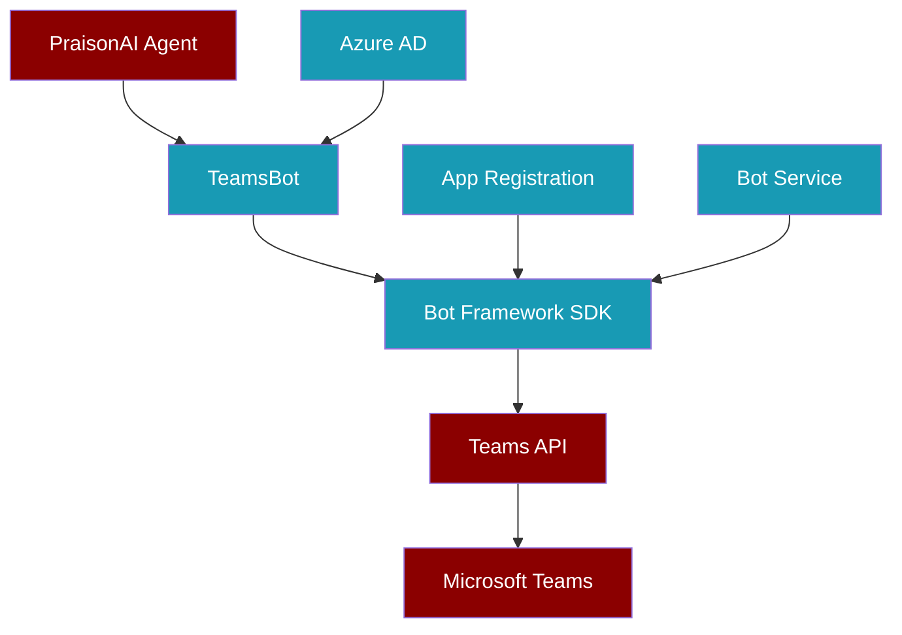

<Info>
**RFC Status**: Draft | **Priority**: High | **Timeline**: Q2 2026
</Info>

## Overview

This RFC proposes implementing Microsoft Teams as a first-class PraisonAI messaging channel to address frequent enterprise requirements and RFP requests.

## Motivation

### Business Requirements

1. **Enterprise RFPs**: Teams is frequently listed as a mandatory requirement
2. **Microsoft 365 Integration**: Many organizations are Teams-first for collaboration
3. **Competitive Parity**: Address OpenClaw's Teams support claim
4. **Market Demand**: #1 requested platform in customer feedback

### Success Criteria

- ✅ Full BotOS protocol compatibility
- ✅ Multi-agent team deployment in Teams channels
- ✅ Enterprise security and compliance features
- ✅ Rich message formatting and interactive cards
- ✅ SSO and Azure AD integration

---

## Technical Design

### Architecture Overview



### Core Components

<Accordion title="TeamsBot Implementation">

```python
from praisonaiagents.bots.protocols import BotOSProtocol
from botbuilder.core import TurnContext, MessageFactory
from botbuilder.schema import Activity, ChannelAccount

class TeamsBot:
    """Microsoft Teams bot adapter for PraisonAI agents."""
    
    def __init__(self, app_id: str, app_password: str, **kwargs):
        self.app_id = app_id
        self.app_password = app_password
        self.agent = kwargs.get('agent')
        self._adapter = None
        
    async def start(self):
        """Initialize Bot Framework adapter and webhook."""
        # Bot Framework setup
        # Webhook server configuration
        # Agent connection
        
    async def on_message_activity(self, turn_context: TurnContext):
        """Handle incoming messages from Teams."""
        # Extract user message
        # Route to agent
        # Format agent response
        # Send back to Teams
        
    async def send_message(self, channel_id: str, message: str, **kwargs):
        """Send message to Teams channel."""
        # Format message for Teams
        # Handle adaptive cards
        # Send via Bot Framework
```

</Accordion>

### Authentication & Security

<Steps>
  <Step title="Azure App Registration">
    - Create Azure AD app registration
    - Configure Bot Framework authentication
    - Set required permissions (Mail.Send, User.Read, etc.)
  </Step>
  
  <Step title="Bot Service Setup">  
    - Deploy Azure Bot Service
    - Configure messaging endpoint
    - Enable Teams channel
  </Step>
  
  <Step title="Enterprise Integration">
    - Azure AD SSO support
    - Tenant-specific app deployment
    - Compliance and data residency
  </Step>
</Steps>

---

## Implementation Plan

### Phase 1: Core Messaging (4 weeks)

**Week 1-2: Foundation**
- [ ] Bot Framework SDK integration
- [ ] Basic message send/receive
- [ ] BotOS protocol implementation
- [ ] Azure deployment pipeline

**Week 3-4: Agent Integration**
- [ ] Multi-agent message routing
- [ ] Session management
- [ ] Error handling and retry logic
- [ ] Basic testing framework

### Phase 2: Advanced Features (3 weeks)

**Week 5-6: Rich Messaging**
- [ ] Adaptive Cards support
- [ ] File attachments and media
- [ ] Message reactions and mentions
- [ ] Thread and channel management

**Week 7: Enterprise Features**
- [ ] Azure AD authentication
- [ ] Approval workflow integration
- [ ] Audit logging and compliance
- [ ] Rate limiting and throttling

### Phase 3: Production Readiness (2 weeks)

**Week 8-9: Testing & Polish**
- [ ] Comprehensive test suite
- [ ] Performance optimization
- [ ] Security audit
- [ ] Documentation and examples

---

## Technical Specifications

### Message Format Translation

<CodeGroup>

```python Agent → Teams
# Agent sends simple text
agent_message = "Hello from PraisonAI!"

# TeamsBot converts to Teams format
teams_message = MessageFactory.text(agent_message)

# For rich content, use Adaptive Cards
adaptive_card = {
    "type": "AdaptiveCard",
    "body": [
        {
            "type": "TextBlock", 
            "text": agent_message,
            "wrap": True
        }
    ],
    "actions": [
        {
            "type": "Action.Submit",
            "title": "Approve",
            "data": {"action": "approve"}
        }
    ]
}
```

```python Teams → Agent
# Teams message received
teams_activity = turn_context.activity

# Extract for agent processing
agent_input = {
    "text": teams_activity.text,
    "user_id": teams_activity.from_property.id,
    "channel_id": teams_activity.channel_id,
    "metadata": {
        "platform": "teams",
        "message_id": teams_activity.id,
        "timestamp": teams_activity.timestamp
    }
}

# Route to appropriate agent
response = await agent.process(agent_input)
```

</CodeGroup>

### Configuration Schema

```yaml
# teams-bot.yaml
platform: teams
app_id: ${TEAMS_APP_ID}
app_password: ${TEAMS_APP_PASSWORD}
tenant_id: ${AZURE_TENANT_ID}

agent:
  name: "TeamsAssistant"
  instructions: "You are a helpful assistant in Microsoft Teams"
  
features:
  adaptive_cards: true
  file_uploads: true
  reactions: true
  threading: true
  
security:
  sso_enabled: true
  audit_logging: true
  data_residency: "us" # or "eu", "asia"
```

---

## Security Considerations

### Data Handling

<Warning>
**Enterprise Compliance Requirements**:

- All messages must support audit logging
- Encryption in transit and at rest
- GDPR/CCPA compliance for EU/CA deployments
- SOC2 Type II controls for data processing
</Warning>

### Azure Integration

| Security Layer | Implementation | Notes |
|----------------|----------------|-------|
| **Authentication** | Azure AD OAuth 2.0 | SSO with existing tenant |
| **Authorization** | Teams app permissions | Minimal required scopes |
| **Data Encryption** | TLS 1.3 + Azure Key Vault | All communications encrypted |
| **Audit Trail** | Azure Monitor + PraisonAI logs | Comprehensive activity logging |
| **Rate Limiting** | Azure API Management | Protect against abuse |

---

## Testing Strategy

### Test Coverage Requirements

<Accordion title="Testing Checklist">

**Unit Tests**:
- [ ] Message formatting and parsing
- [ ] Authentication flow
- [ ] Error handling scenarios
- [ ] BotOS protocol compliance

**Integration Tests**:
- [ ] End-to-end message flow
- [ ] Multi-agent coordination
- [ ] File upload/download
- [ ] Adaptive card interactions

**Security Tests**:
- [ ] Authentication bypass attempts  
- [ ] Input validation and sanitization
- [ ] Rate limiting effectiveness
- [ ] Data encryption verification

**Performance Tests**:
- [ ] Concurrent user scenarios
- [ ] Large message handling
- [ ] Memory usage under load
- [ ] Response time benchmarks

</Accordion>

### Test Environment

```python
# Example test setup
import pytest
from praisonai.bots import TeamsBot
from praisonaiagents import Agent

@pytest.fixture
async def teams_bot():
    agent = Agent(name="TestAgent", instructions="Test assistant")
    bot = TeamsBot(
        app_id="test-app-id",
        app_password="test-password",
        agent=agent
    )
    await bot.start()
    return bot

@pytest.mark.asyncio
async def test_message_routing(teams_bot):
    # Simulate Teams message
    message = create_teams_message("Hello bot!")
    
    # Process through bot
    response = await teams_bot.process_message(message)
    
    # Verify agent response
    assert response.text is not None
    assert "hello" in response.text.lower()
```

---

## Migration & Deployment

### Deployment Options

<Steps>
  <Step title="Azure Deployment (Recommended)">
    **Benefits**: Native integration, simplified auth, enterprise features
    
    **Components**:
    - Azure App Service for bot hosting
    - Azure Bot Service for Teams integration  
    - Azure AD for authentication
    - Azure Key Vault for secrets management
  </Step>
  
  <Step title="Self-Hosted Deployment">
    **Benefits**: Full control, custom compliance requirements
    
    **Requirements**:
    - Public HTTPS endpoint for webhooks
    - Azure Bot Service registration (still required)
    - Manual certificate and secret management
  </Step>
</Steps>

### Configuration Migration

```python
# Existing BotOS configuration
from praisonai.bots import BotOS

# Add Teams to existing multi-platform setup
botos = BotOS(
    agent=my_agent,
    platforms={
        "telegram": {"token": telegram_token},
        "discord": {"token": discord_token},
        "teams": {  # New platform
            "app_id": teams_app_id,
            "app_password": teams_password,
            "tenant_id": azure_tenant_id
        }
    }
)

await botos.run()  # Now includes Teams
```

---

## Success Metrics

### Technical KPIs

| Metric | Target | Measurement |
|--------|--------|-------------|
| **Message Latency** | <200ms p95 | End-to-end response time |
| **Uptime** | 99.9% SLA | Bot availability |
| **Throughput** | 1000 msg/min | Peak message processing |
| **Error Rate** | <0.1% | Failed message rate |

### Business KPIs  

| Metric | Target | Timeline |
|--------|--------|----------|
| **Enterprise Adoption** | 25% of customers | 6 months |
| **RFP Win Rate** | +30% where Teams required | 12 months |  
| **Developer Usage** | 100+ Teams bot deployments | 6 months |
| **Customer Satisfaction** | 4.5+ rating for Teams features | Ongoing |

---

## Open Questions & Risks

### Technical Risks

<Warning>
**High Risk Items**:

1. **Azure Bot Framework Changes**: Microsoft may deprecate/change APIs
   - *Mitigation*: Use stable v4 framework, monitor roadmaps
   
2. **Enterprise Permission Complexity**: Teams admin policies vary widely
   - *Mitigation*: Comprehensive documentation, support team training
   
3. **Rate Limiting Variability**: Teams throttling can be unpredictable
   - *Mitigation*: Adaptive rate limiting, queue management
</Warning>

### Open Questions

1. **App Distribution**: Should we publish to Teams App Store or enterprise-only?
2. **Pricing Model**: Additional cost for Teams integration or included in BotOS?
3. **Multi-Tenant**: Single app registration or per-tenant deployment model?
4. **Custom Connectors**: Integration with Teams workflows and Power Platform?

---

## Next Steps

### Immediate (Next 2 weeks)

- [ ] **Technical Spike**: Bot Framework evaluation and proof of concept
- [ ] **Azure Setup**: Development tenant and app registration  
- [ ] **Stakeholder Review**: Engineering and product team approval
- [ ] **Resource Allocation**: Assign development team

### Phase 1 Kickoff (Week 3)

- [ ] **Repository Setup**: Create teams-bot branch
- [ ] **CI/CD Pipeline**: Azure DevOps or GitHub Actions
- [ ] **Development Environment**: Shared Azure tenant for testing
- [ ] **Documentation**: Technical specification and API docs

---

<Info>
**Review & Feedback**: This RFC is open for community and team feedback. Please comment on GitHub issue #1311 with questions, suggestions, or concerns.

**Approval Process**: Requires sign-off from Engineering Lead, Product Manager, and Security team before implementation begins.
</Info>