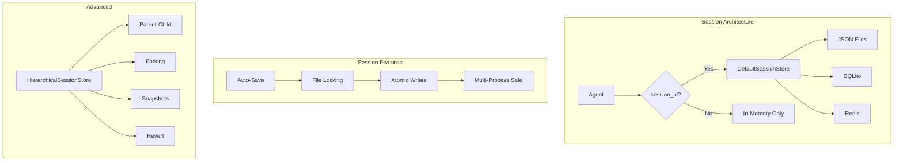
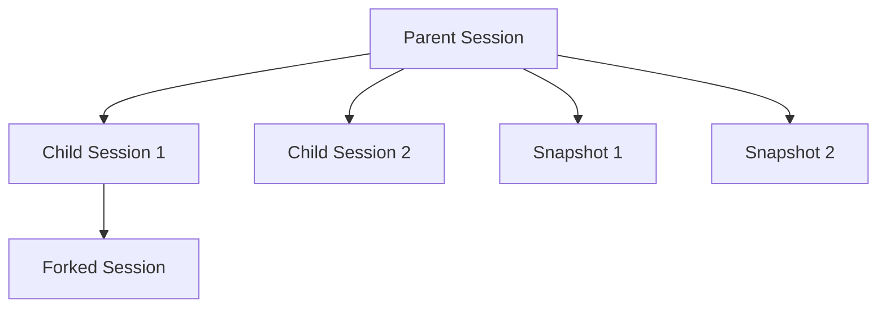
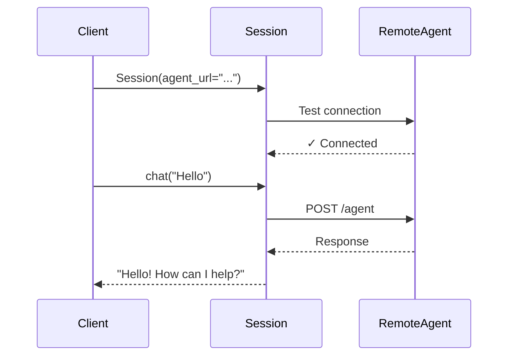

Learn how to implement stateful applications with persistent sessions, enabling memory across conversations, user-specific contexts, and checkpoint-based recovery.

## Overview



Session management in PraisonAI enables:
- **Zero-config persistence** - Just provide a `session_id` and history auto-saves
- **Multi-process safety** - File locking prevents corruption
- **Multiple storage backends** - JSON (default), SQLite, Redis
- **Hierarchical sessions** - Parent-child relationships, forking, snapshots
- **Remote agent connectivity** - Connect to agents running on other machines
- **Lazy loading** - Zero import overhead when not used

<Note>
**Default Storage Location**: `~/.praison/sessions/{session_id}.json`
</Note>

## Quick Start

### Simplest Usage - Agent with session_id

The easiest way to enable session persistence is to provide a `session_id` to your Agent:

```python
from praisonaiagents import Agent

# Create agent with session persistence
agent = Agent(
    name="Assistant",
    instructions="You are a helpful assistant",
    session_id="my-session-123"  # This enables auto-persistence!
)

# First conversation
agent.start("My name is Alice")

# Later, in a new process - history is automatically restored!
agent = Agent(
    name="Assistant",
    instructions="You are a helpful assistant",
    session_id="my-session-123"
)
agent.start("What's my name?")  # Remembers "Alice"!
```

### Using the Session Class

For more control, use the `Session` class directly:

```python
from praisonaiagents import Session

# Create a local session
session = Session(
    session_id="chat_123",
    user_id="user_456"
)

# Create an agent within the session
agent = session.Agent(
    name="Assistant",
    role="Helpful AI",
    memory=True  # Enable memory integration
)

# Chat with the agent
response = agent.start("Hello, I'm learning Python")

# Save session state
session.save_state({"topic": "Python learning", "level": "beginner"})
```

## Storage Backends

PraisonAI supports multiple storage backends for session persistence:

| Backend | Use Case | Dependencies |
|---------|----------|--------------|
| **JSON (default)** | Single user, simple apps | None (stdlib) |
| **SQLite** | Multi-user, concurrent access | None (stdlib) |
| **Redis** | High-speed, distributed apps | `redis` package |

### JSON Storage (Default)

```python
from praisonaiagents.session import DefaultSessionStore

# Use default store (auto-created)
from praisonaiagents.session import get_default_session_store
store = get_default_session_store()

# Or create custom store
store = DefaultSessionStore(
    session_dir="~/.praison/sessions",  # Custom directory
    max_messages=100,                    # Message limit per session
    lock_timeout=5.0                     # File lock timeout (seconds)
)

# Add messages
store.add_user_message("session-123", "Hello!")
store.add_assistant_message("session-123", "Hi there!")

# Get chat history (LLM-compatible format)
history = store.get_chat_history("session-123")
# [{"role": "user", "content": "Hello!"}, {"role": "assistant", "content": "Hi there!"}]

# List all sessions
sessions = store.list_sessions(limit=50)
```

### SQLite Storage

```python
from praisonaiagents.storage.backends import SQLiteBackend

# Create SQLite backend
backend = SQLiteBackend(
    db_path="~/.praison/sessions.db",
    table_name="praison_sessions"
)

# Use with BaseJSONStore
from praisonaiagents.storage.base import BaseJSONStore

class MySessionStore(BaseJSONStore):
    def __init__(self, backend):
        super().__init__("sessions", backend=backend)

store = MySessionStore(backend)
```

### Redis Storage

```python
from praisonaiagents.storage.backends import RedisBackend

# Create Redis backend
backend = RedisBackend(
    url="redis://localhost:6379",
    prefix="praison:",
    ttl=3600,  # Auto-expire after 1 hour
    db=0
)

# Save/load data
backend.save("session_123", {"messages": [], "metadata": {}})
data = backend.load("session_123")

# List keys
keys = backend.list_keys(prefix="session_")
```

### Backend Factory

```python
from praisonaiagents.storage.backends import get_backend

# Get backend by type
file_backend = get_backend("file", storage_dir="~/.praison/data")
sqlite_backend = get_backend("sqlite", db_path="~/.praison/data.db")
redis_backend = get_backend("redis", url="redis://localhost:6379")
```

## Memory Integration

Sessions integrate seamlessly with PraisonAI's memory system:

```python
from praisonaiagents import Session

# Session with memory enabled
session = Session(
    session_id="user_123",
    user_id="alice",
    memory_config={
        "provider": "rag",
        "use_embedding": False,
        "rag_db_path": ".praison/sessions/user_123/chroma_db"
    }
)

# Create agent with session memory
agent = session.Agent(
    name="Assistant",
    role="Helpful AI",
    memory=True  # Uses session's memory
)

# Add to memory directly
session.add_memory("User prefers Python", memory_type="long")
session.add_memory("Current topic: web development", memory_type="short")

# Search memory
results = session.search_memory("programming preferences", memory_type="long")

# Build context from memory
context = session.get_context("What should I recommend?", max_items=3)
```

## Hierarchical Sessions

PraisonAI supports advanced hierarchical session management with parent-child relationships, forking, and snapshots:



### Creating Hierarchical Sessions

```python
from praisonaiagents.session.hierarchy import HierarchicalSessionStore

# Create hierarchical store
store = HierarchicalSessionStore()

# Create parent session
parent_id = store.create_session(
    title="Main Conversation",
    agent_name="Assistant"
)

# Add messages to parent
store.add_message(parent_id, "user", "Let's discuss Python")
store.add_message(parent_id, "assistant", "Great! What aspect interests you?")

# Create child session
child_id = store.create_session(
    title="Python Web Frameworks",
    parent_id=parent_id
)
```

### Session Forking

Fork a session to explore alternative conversation paths:

```python
# Fork from message index 5 (keeps messages 0-5)
forked_id = store.fork_session(
    parent_id,
    from_message_index=5,
    title="Alternative approach"
)

# The forked session has its own independent history
store.add_message(forked_id, "user", "What about a different approach?")
```

### Snapshots and Revert

```python
# Create a snapshot before making changes
snapshot_id = store.create_snapshot(
    parent_id,
    label="Before refactoring discussion"
)

# Continue conversation...
store.add_message(parent_id, "user", "Let's try something risky")

# Revert to snapshot if needed
store.revert_to_snapshot(parent_id, snapshot_id)

# Or revert to specific message index
store.revert_to_message(parent_id, message_index=3)
```

### Session Tree Navigation

```python
# Get session hierarchy
tree = store.get_session_tree(parent_id)
# {"session_id": "...", "title": "Main", "message_count": 10, "children": [...]}

# Get parent/children
parent = store.get_parent(child_id)
children = store.get_children(parent_id)

# List all snapshots
snapshots = store.get_snapshots(parent_id)
```

### Export/Import Sessions

```python
# Export session to portable format
data = store.export_session(parent_id)

# Import into new session
new_id = store.import_session(data, new_session_id="imported-session")
```

## Session Context Tracking

Track conversation state (summary, goal, plan, progress) across turns:

```python
from praisonaiagents.context.session_tracker import SessionContextTracker

# Create tracker
tracker = SessionContextTracker(
    session_id="task-123",
    track_summary=True,
    track_goal=True,
    track_plan=True,
    track_progress=True
)

# Update state
tracker.update_goal("Build a REST API")
tracker.update_plan([
    "Design endpoints",
    "Implement authentication",
    "Add database models",
    "Write tests"
])

# Mark progress
tracker.add_progress("Designed 5 endpoints")
tracker.mark_plan_step_complete(0)  # Mark first step done

# Get context for system prompt
context_str = tracker.to_context_string()
# **User's Goal**: Build a REST API
# **Plan**:
#   1. Design endpoints
#   2. Implement authentication
#   ...
# **Progress**:
#   ✓ Designed 5 endpoints

# Get full system prompt section
prompt_section = tracker.to_system_prompt_section()
```

## Remote Sessions

Connect to agents running on remote machines:



### Connecting to Remote Agents

```python
from praisonaiagents import Session

# Connect to remote agent (auto-adds http:// if missing)
session = Session(
    agent_url="192.168.1.100:8000/agent",
    session_id="user_456",
    user_id="alice",
    timeout=30  # HTTP timeout in seconds
)
# ✓ Successfully connected to remote agent at http://192.168.1.100:8000/agent

# Chat with remote agent
response = session.chat("Hello from remote client!")

# Alternative method (Google ADK pattern)
response = session.send_message("What can you help me with?")
```

<Warning>
Remote sessions do **not** support local memory/knowledge operations. Use `session.chat()` for all interactions.
</Warning>

### Serving an Agent Remotely

```python
from fastapi import FastAPI
from praisonaiagents import Agent

app = FastAPI()

# Create agent
agent = Agent(
    name="RemoteAssistant",
    instructions="You are a helpful remote assistant"
)

@app.post("/agent")
async def handle_request(request: dict):
    query = request.get("query", "")
    session_id = request.get("session_id", "default")
    
    # Process with session context
    response = agent.start(query)
    
    return {"response": response}

@app.get("/health")
async def health():
    return {"status": "ok"}

# Run: uvicorn server:app --host 0.0.0.0 --port 8000
```

## State Operations

### Session State Management

```python
from praisonaiagents import Session

session = Session(session_id="user_123", user_id="alice")

# Save arbitrary state data
session.save_state({
    "topic": "Python learning",
    "level": "intermediate",
    "preferences": {"format": "detailed"}
})

# Restore state
state = session.restore_state()
# {"topic": "Python learning", "level": "intermediate", ...}

# Get/set individual values
topic = session.get_state("topic", default="general")
session.set_state("level", "advanced")

# Increment numeric values
session.increment_state("interaction_count", increment=1, default=0)
```

### Session Data Structure

The `SessionData` class stores:

```python
from praisonaiagents.session.store import SessionData, SessionMessage

# Session data structure
session_data = SessionData(
    session_id="my-session",
    messages=[
        SessionMessage(role="user", content="Hello"),
        SessionMessage(role="assistant", content="Hi there!")
    ],
    created_at="2024-01-01T00:00:00Z",
    updated_at="2024-01-01T00:01:00Z",
    agent_name="Assistant",
    user_id="alice",
    metadata={"custom_key": "custom_value"}
)

# Convert to dict for serialization
data_dict = session_data.to_dict()

# Get LLM-compatible chat history
history = session_data.get_chat_history(max_messages=50)
# [{"role": "user", "content": "Hello"}, {"role": "assistant", "content": "Hi there!"}]
```

## Database Adapter Protocol

For custom database integrations, implement the `DbAdapter` protocol:

```python
from praisonaiagents.db.protocol import DbAdapter, DbMessage, DbRun

class MyDatabaseAdapter:
    """Custom database adapter implementing DbAdapter protocol."""
    
    def on_agent_start(
        self,
        agent_name: str,
        session_id: str,
        user_id: str = None,
        metadata: dict = None
    ) -> list:
        """Called when agent starts. Return previous messages for resume."""
        # Load and return previous messages
        return []
    
    def on_user_message(self, session_id: str, content: str, metadata: dict = None):
        """Called when user sends a message."""
        pass
    
    def on_agent_message(self, session_id: str, content: str, metadata: dict = None):
        """Called when agent responds."""
        pass
    
    def on_tool_call(self, session_id: str, tool_name: str, args: dict, result, metadata: dict = None):
        """Called when a tool is executed."""
        pass
    
    def on_agent_end(self, session_id: str, metadata: dict = None):
        """Called when agent session ends."""
        pass
    
    def on_run_start(self, session_id: str, run_id: str, input_content: str = None, metadata: dict = None):
        """Called when a new turn starts."""
        pass
    
    def on_run_end(self, session_id: str, run_id: str, output_content: str = None, 
                   status: str = "completed", metrics: dict = None, metadata: dict = None):
        """Called when a turn ends."""
        pass
    
    def close(self):
        """Close database connection."""
        pass

# Use with Agent
from praisonaiagents import Agent

agent = Agent(
    name="Assistant",
    instructions="You are helpful",
    db=MyDatabaseAdapter()  # Custom persistence
)
```

### Async Database Adapter

For async applications, implement `AsyncDbAdapter`:

```python
from praisonaiagents.db.protocol import AsyncDbAdapter

class MyAsyncAdapter:
    async def on_agent_start(self, agent_name, session_id, user_id=None, metadata=None):
        return []
    
    async def on_user_message(self, session_id, content, metadata=None):
        pass
    
    # ... other async methods
    
    async def close(self):
        pass
```

## Best Practices

### 1. Session ID Strategies

```python
import uuid
from datetime import datetime

# User-based (persistent across conversations)
session_id = f"user_{user_id}"

# Conversation-based (new session per conversation)
session_id = f"conv_{uuid.uuid4().hex[:8]}"

# Time-based (auto-generated by Agent if not provided)
# Format: YYYYMMDDHH-{agent_hash} (hourly sessions)
session_id = f"{datetime.utcnow().strftime('%Y%m%d%H')}-abc123"

# Task-based
session_id = f"task_{task_id}_{user_id}"
```

### 2. Session Cleanup

Use the built-in cleanup utilities:

```python
from praisonaiagents.storage.base import cleanup_old_sessions, list_json_sessions
from pathlib import Path

# List sessions
sessions = list_json_sessions(
    storage_dir=Path("~/.praison/sessions").expanduser(),
    suffix=".json",
    limit=50
)

for s in sessions:
    print(f"{s.session_id}: {s.item_count} messages, modified {s.modified_at}")

# Cleanup old sessions
deleted = cleanup_old_sessions(
    storage_dir=Path("~/.praison/sessions").expanduser(),
    max_age_days=30,
    max_size_mb=100
)
print(f"Deleted {deleted} old sessions")
```

### 3. Multi-Process Safety

PraisonAI uses file locking for safe concurrent access:

```python
from praisonaiagents.session.store import FileLock

# File locking is automatic, but you can use it directly
filepath = "~/.praison/sessions/my-session.json"

with FileLock(filepath, timeout=5.0):
    # Safe to read/write file
    pass
```

### 4. Cache Management

```python
from praisonaiagents.session import get_default_session_store

store = get_default_session_store()

# Invalidate cache for specific session (force reload from disk)
store.invalidate_cache("session-123")

# Invalidate all cached sessions
store.invalidate_cache()
```

## CLI Commands

Manage sessions from the command line:

```bash
# Start a new session
praisonai session start my-session

# List all sessions
praisonai session list

# Resume a session
praisonai session resume my-session

# Show session details
praisonai session show my-session

# Delete a session
praisonai session delete my-session

# Use different storage backends
praisonai session start my-session --storage file
praisonai session start my-session --storage sqlite
praisonai session start my-session --storage redis --redis-url redis://localhost:6379
```

## Troubleshooting

<AccordionGroup>
<Accordion title="Session not restoring">
- Verify `session_id` is exactly the same
- Check storage directory exists: `~/.praison/sessions/`
- Ensure file permissions allow read/write
- Try invalidating cache: `store.invalidate_cache(session_id)`
</Accordion>

<Accordion title="File lock timeout">
- Another process may be holding the lock
- Increase `lock_timeout` parameter
- Check for stale `.lock` files and remove them
</Accordion>

<Accordion title="Memory issues with large sessions">
- Set `max_messages` limit on DefaultSessionStore
- Use `get_chat_history(max_messages=50)` to limit retrieval
- Consider using SQLite backend for better performance
</Accordion>

<Accordion title="Remote session connection failed">
- Verify agent URL is correct and accessible
- Check firewall/network settings
- Ensure remote agent has `/health` endpoint
- Increase `timeout` parameter for slow networks
</Accordion>
</AccordionGroup>

## API Reference

### Session Class

| Parameter | Type | Default | Description |
|-----------|------|---------|-------------|
| `session_id` | `str` | Auto-generated | Unique session identifier |
| `user_id` | `str` | `"default_user"` | User identifier for memory isolation |
| `agent_url` | `str` | `None` | URL for remote agent connection |
| `memory_config` | `dict` | RAG defaults | Memory system configuration |
| `knowledge_config` | `dict` | `{}` | Knowledge base configuration |
| `timeout` | `int` | `30` | HTTP timeout for remote calls |

### DefaultSessionStore Class

| Parameter | Type | Default | Description |
|-----------|------|---------|-------------|
| `session_dir` | `str` | `~/.praison/sessions` | Storage directory |
| `max_messages` | `int` | `100` | Max messages per session |
| `lock_timeout` | `float` | `5.0` | File lock timeout (seconds) |

### Key Methods

| Method | Description |
|--------|-------------|
| `add_message(session_id, role, content)` | Add a message |
| `get_chat_history(session_id, max_messages)` | Get LLM-compatible history |
| `get_session(session_id)` | Get full SessionData |
| `list_sessions(limit)` | List all sessions |
| `delete_session(session_id)` | Delete a session |
| `clear_session(session_id)` | Clear messages only |
| `session_exists(session_id)` | Check if session exists |

## Related Documentation

<CardGroup cols={2}>
  <Card title="Session Persistence" icon="database" href="/features/session-persistence">
    Detailed persistence options and configuration
  </Card>
  <Card title="Session Hierarchy" icon="sitemap" href="/features/session-hierarchy">
    Parent-child sessions, forking, and snapshots
  </Card>
  <Card title="Memory System" icon="brain" href="/concepts/memory">
    Memory integration with sessions
  </Card>
  <Card title="CLI Session Commands" icon="terminal" href="/cli/session">
    Command-line session management
  </Card>
</CardGroup>