Skills are modular capability packages that extend agents with specialized knowledge and workflows without bloating the system prompt.

```mermaid
graph LR
    subgraph "Skills System"
        Agent[🤖 Agent] --> Manager[📦 Skill Manager]
        Manager --> S1[🔧 Skill 1]
        Manager --> S2[🔧 Skill 2]
        Manager --> S3[🔧 Skill 3]
        S1 --> Prompt[📝 System Prompt]
        S2 --> Prompt
        S3 --> Prompt
    end
    
    classDef agent fill:#10B981,stroke:#7C90A0,color:#fff
    classDef skill fill:#6366F1,stroke:#7C90A0,color:#fff
    classDef prompt fill:#F59E0B,stroke:#7C90A0,color:#fff
    
    class Agent agent
    class Manager,S1,S2,S3 skill
    class Prompt prompt
```



## Quick Start

<Steps>

<Step title="Create a Skill">
Create a directory with a `SKILL.md` file:

```
my-skill/
└── SKILL.md
```

```yaml
---
name: code-review
description: Review code for bugs, security issues, and best practices. Use when asked to review or analyze code.
---

# Code Review Instructions

When reviewing code:
1. Check for security vulnerabilities
2. Identify potential bugs
3. Suggest improvements
```
</Step>

<Step title="Use with Agent">
```python
from praisonaiagents import Agent

agent = Agent(
    name="Code Assistant",
    instructions="You help with coding tasks",
    skills=["./my-skill"]  # Load skill
)

agent.start("Review this Python code for issues")
```
</Step>

</Steps>

---

## How Skills Work


### Progressive Disclosure

| Level | What's Loaded | When | Token Cost |
|-------|---------------|------|------------|
| **1. Metadata** | Name + description | At startup | ~100 tokens |
| **2. Instructions** | Full SKILL.md body | When triggered | Up to 5000 tokens |
| **3. Resources** | Scripts, assets | On demand | Variable |

---

## SKILL.md Format

```yaml
---
name: skill-name              # Required: lowercase, hyphens only
description: What it does...  # Required: when to use this skill
license: Apache-2.0           # Optional
compatibility: PraisonAI      # Optional
metadata:                     # Optional
  author: your-org
  version: "1.0"
allowed-tools: Read Write     # Optional: required tools
---

# Skill Instructions

Your detailed instructions here...
```

### Required Fields

| Field | Constraints | Example |
|-------|-------------|---------|
| `name` | 1-64 chars, lowercase, hyphens | `code-review` |
| `description` | 1-1024 chars | `Review code for bugs...` |

### Directory Structure

```
skill-name/
├── SKILL.md          # Required
├── scripts/          # Optional: executable code
├── references/       # Optional: documentation
└── assets/           # Optional: templates, data
```

---

## Loading Skills

```mermaid
graph TB
    subgraph "Skill Loading"
        Direct[📁 Direct Path<br/>skills=["./skill"]]
        Dirs[📂 Directory Scan<br/>skills_dirs=["./skills"]]
        Auto[🔍 Auto-discover<br/>Default locations]
    end
    
    Direct --> Agent[🤖 Agent]
    Dirs --> Agent
    Auto --> Agent
    
    classDef method fill:#189AB4,stroke:#7C90A0,color:#fff
    classDef agent fill:#10B981,stroke:#7C90A0,color:#fff
    
    class Direct,Dirs,Auto method
    class Agent agent
```

### Direct Paths

```python
agent = Agent(
    skills=["./skills/code-review", "./skills/testing"]
)
```

### Directory Scan

```python
agent = Agent(
    skills_dirs=["./skills"]  # Scans for subdirectories with SKILL.md
)
```

### Default Locations

Skills are auto-discovered from:
1. `./.praison/skills/` or `./.claude/skills/` (project)
2. `~/.praison/skills/` (user)
3. `/etc/praison/skills/` (system)

---

## Using SkillManager

```python
from praisonaiagents import SkillManager

manager = SkillManager()

# Discover skills
manager.discover(["./skills"])

# Add single skill
manager.add_skill("./my-skill")

# Get skill by name
skill = manager.get_skill("code-review")

# Activate (load instructions)
manager.activate_by_name("code-review")

# Generate prompt XML
prompt_xml = manager.to_prompt()
```

---

## CLI Commands

```bash
# List available skills
praisonai skills list

# Validate a skill
praisonai skills validate --path ./my-skill

# Create new skill
praisonai skills create --name my-skill

# Generate prompt XML
praisonai skills prompt --dirs ./skills
```

---

## Compatibility

Skills follow the open [agentskills.io](https://agentskills.io) standard:

```mermaid
graph LR
    Standard[📋 Agent Skills Standard] --> P[PraisonAI]
    Standard --> C[Claude Code]
    Standard --> G[GitHub Copilot]
    Standard --> Cu[Cursor]
    
    classDef standard fill:#6366F1,stroke:#7C90A0,color:#fff
    classDef impl fill:#10B981,stroke:#7C90A0,color:#fff
    
    class Standard standard
    class P,C,G,Cu impl
```



PraisonAI supports both `.praison/skills/` and `.claude/skills/` directories.

---

## Performance

Skills have **zero performance impact** when not used:

- **Lazy Loading**: Only loaded when accessed
- **No Auto-discovery**: Discovery runs only when requested
- **Minimal Memory**: Unused skills consume no memory

---

## Best Practices

<AccordionGroup>
  <Accordion title="Write clear descriptions">
    The description tells the agent WHEN to use the skill. Be specific about triggers.
  </Accordion>
  
  <Accordion title="Keep instructions focused">
    Each skill should do one thing well. Split complex capabilities into multiple skills.
  </Accordion>
  
  <Accordion title="Use progressive disclosure">
    Put essential info in instructions, detailed references in the `references/` folder.
  </Accordion>
</AccordionGroup>

---

## Related

<CardGroup cols={2}>
  <Card title="Tools" icon="wrench" href="/concepts/tools">
    Function-based capabilities
  </Card>
  <Card title="Knowledge" icon="book" href="/concepts/knowledge">
    Document-based context
  </Card>
</CardGroup>
