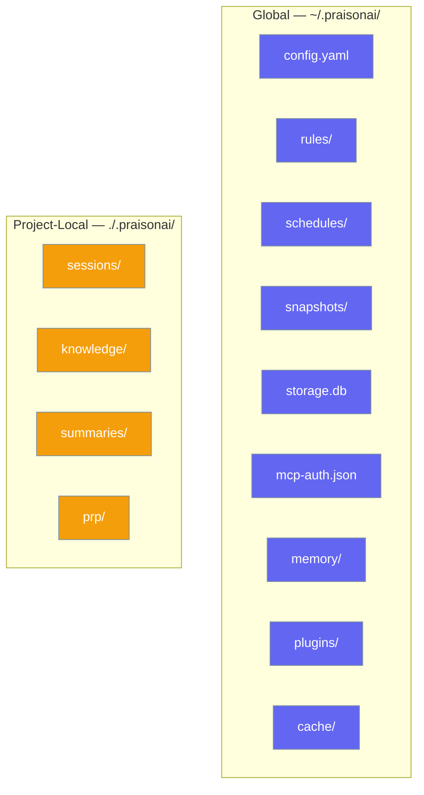

PraisonAI uses two directories to organize data: a **global** directory in your home folder and a **project-local** directory in your working directory. All paths resolve through a single `paths` module and honor the `PRAISONAI_HOME` environment variable.



## Directory Layout

### Global — `~/.praisonai/`

User-level configuration and state. Applies across all projects.

| Path | Purpose | Helper |
|------|---------|--------|
| (root) | Data root | `get_data_dir()` |
| `sessions/` | Global sessions | `get_sessions_dir()` |
| `skills/` | User skills | `get_skills_dir()` |
| `plugins/` | User-installed plugins | `get_plugins_dir()` |
| `mcp/` | MCP config | `get_mcp_dir()` |
| `mcp-auth.json` | MCP auth tokens | `get_mcp_auth_path()` |
| `docs/` | Documentation data | `get_docs_dir()` |
| `rules/` | Guardrail rules | `get_rules_dir()` |
| `permissions/` | Permission data | `get_permissions_dir()` |
| `storage/` | Generic storage | `get_storage_dir()` |
| `storage.db` | Default SQLite DB | `get_storage_path()` |
| `schedules/` | Scheduler state | `get_schedules_dir()` |
| `checkpoints/` | Checkpoint data | `get_checkpoints_dir()` |
| `snapshots/` | Autonomy snapshots | `get_snapshots_dir()` |
| `learn/` | Learning stores | `get_learn_dir()` |
| `cache/` | Disposable cache | `get_cache_dir()` |
| `memory/` | Short/long-term DBs | `get_memory_dir()` |
| `workflows/` | Workflow data | `get_workflows_dir()` |
| `summaries/` | RAG summaries | `get_summaries_dir()` |
| `prp/` | PRP output | `get_prp_dir()` |
| `runs/` | Run artifacts | `get_runs_dir()` |

### Project-Local — `./.praisonai/`

Per-project data in your working directory. Add `.praisonai/` to `.gitignore`.

| Path | Purpose | Helper |
|------|---------|--------|
| (root) | Project data root | `get_project_data_dir()` |
| `sessions/` | Conversation sessions | `get_project_sessions_dir()` |
| `knowledge/` | Knowledge base vectors | `get_project_knowledge_dir()` |
| `summaries/` | RAG summaries | `get_project_summaries_dir()` |
| `prp/` | Context engineering output | `get_project_prp_dir()` |

---

## Customizing Storage Location

### `PRAISONAI_HOME` Environment Variable

Override the global directory location:

```bash
# Redirect all global paths
export PRAISONAI_HOME=/custom/path
```

| Scenario | Setting |
|----------|---------|
| **Docker** | `ENV PRAISONAI_HOME=/app/data` |
| **Team shared config** | `export PRAISONAI_HOME=/shared/team/config` |
| **CI/CD** | `PRAISONAI_HOME=/tmp/praisonai` |

<Warning>
Project-local paths (`./.praisonai/`) are always relative to the current working directory and are **not** affected by `PRAISONAI_HOME`.
</Warning>

### Legacy Migration

If `~/.praison/` exists but `~/.praisonai/` doesn't, PraisonAI uses the legacy path with a deprecation warning:

```
DeprecationWarning: Using legacy data directory ~/.praison/.
Run 'praisonai migrate-data' to migrate to ~/.praisonai/.
```

---

## Python API

All paths resolve through the `paths` module:

```python
from praisonaiagents.paths import (
    # Global paths — ~/.praisonai/
    get_data_dir,           # ~/.praisonai/
    get_rules_dir,          # ~/.praisonai/rules/
    get_schedules_dir,      # ~/.praisonai/schedules/
    get_snapshots_dir,      # ~/.praisonai/snapshots/
    get_storage_dir,        # ~/.praisonai/storage/
    get_storage_path,       # ~/.praisonai/storage.db
    get_memory_dir,         # ~/.praisonai/memory/
    get_mcp_auth_path,      # ~/.praisonai/mcp-auth.json
    get_plugins_dir,        # ~/.praisonai/plugins/
    get_cache_dir,          # ~/.praisonai/cache/
    
    # Project-local paths — ./.praisonai/
    get_project_data_dir,       # ./.praisonai/
    get_project_sessions_dir,   # ./.praisonai/sessions/
    get_project_knowledge_dir,  # ./.praisonai/knowledge/
    get_project_summaries_dir,  # ./.praisonai/summaries/
    get_project_prp_dir,        # ./.praisonai/prp/
    
    # Utilities
    ensure_dir,             # Create dir if missing
    get_all_paths,          # Dict of all path names → Path objects
)
```

<Tip>
If you're building a plugin or extension, always use these helpers instead of hardcoding paths. They respect `PRAISONAI_HOME` and ensure consistent directory creation.
</Tip>

---

## CLI

```bash
# Show all resolved paths with Rich table output
praisonai paths show

# Machine-readable output
praisonai paths show --json
```

Example output:
```
Global:  /Users/you/.praisonai/
Project: /Users/you/my-app/.praisonai/
Env:     PRAISONAI_HOME (not set)
```

---

## Common Patterns

<Tabs>
<Tab title="Solo Developer">
```
~/my-project/
├── main.py
└── .praisonai/          ← project data
    ├── sessions/
    └── knowledge/

~/.praisonai/            ← global config
├── config.yaml
└── mcp-auth.json
```
</Tab>

<Tab title="Multiple Projects">
```
~/project-A/.praisonai/  ← isolated per project
~/project-B/.praisonai/  ← own sessions & knowledge

~/.praisonai/            ← shared config
├── rules/               ← same guardrails
└── plugins/             ← same plugins
```
</Tab>

<Tab title="Docker">
```dockerfile
ENV PRAISONAI_HOME=/app/data
WORKDIR /app

# All global paths → /app/data/
# Project paths → /app/.praisonai/
```
</Tab>

<Tab title="Team / CI">
```bash
export PRAISONAI_HOME=/shared/team/config
# All team members use same rules, schedules, plugins
# Project data stays local in ./.praisonai/
```
</Tab>
</Tabs>

---

## Related

<CardGroup cols={2}>
  <Card title="Memory" icon="brain" href="/concepts/memory">
    Agent memory storage
  </Card>
  <Card title="Knowledge" icon="book" href="/concepts/knowledge">
    Knowledge base management
  </Card>
  <Card title="Session Management" icon="clock" href="/concepts/session-management">
    Conversation sessions
  </Card>
  <Card title="Store Types" icon="database" href="/concepts/store-types">
    Storage backend comparison
  </Card>
</CardGroup>
