```mermaid
flowchart LR
    subgraph "Knowledge Store"
        Docs[(📚 Docs)] -->|"RAG"| Support
    end
    
    subgraph "Context (Runtime)"
        Support[Support] -->|"findings"| Escalation[Escalation]
    end
    
    subgraph "State Store"
        Support -->|"learn"| Mem[(🧠 Memory)]
        Mem -->|"recall"| Support
    end
    
    subgraph "Conversation Store"
        Support -->|"save"| Chat[(💬 History)]
        Chat -->|"restore"| Support
    end
    
    classDef docs fill:#F59E0B,stroke:#7C90A0,color:#fff
    classDef agent fill:#189AB4,stroke:#7C90A0,color:#fff
    classDef store fill:#10B981,stroke:#7C90A0,color:#fff
    
    class Docs docs
    class Support,Escalation agent
    class Mem,Chat store
```

PraisonAI uses three store types to manage different kinds of information for your agents.

```mermaid
graph LR
    subgraph "Store Types"
        CS["💬 Conversation Store\nChat history"]
        KS["📚 Knowledge Store\nDocuments & RAG"]
        SS["🧠 State Store\nLearning & memory"]
    end
    
    Agent([🤖 Agent]) --> CS
    Agent --> KS
    Agent --> SS
    
    classDef agent fill:#8B0000,stroke:#7C90A0,color:#fff
    classDef conv fill:#189AB4,stroke:#7C90A0,color:#fff
    classDef know fill:#F59E0B,stroke:#7C90A0,color:#fff
    classDef state fill:#10B981,stroke:#7C90A0,color:#fff
    
    class Agent agent
    class CS conv
    class KS know
    class SS state
```



## Quick Start

<Steps>

<Step title="Use All Three Stores">
```python
from praisonaiagents import Agent

agent = Agent(
    name="Assistant",
    instructions="You are a helpful assistant",
    memory={"session_id": "chat-123"},  # Conversation Store
    knowledge=["docs/manual.pdf"],       # Knowledge Store
)

agent.start("What does the manual say about setup?")
```
</Step>

</Steps>

---

## Quick Comparison

| Aspect | Conversation Store | Knowledge Store | State Store |
|--------|-------------------|-----------------|-------------|
| **What it stores** | Chat messages | Documents & chunks | Learned facts & preferences |
| **Agent param** | `memory={"session_id": "..."}` | `knowledge=[...]` | `memory=True` |
| **Lifetime** | Persistent | Persistent | Persistent |
| **Direction** | Read + Write | Read-mostly | Read + Write |
| **Search** | Sequential | Semantic (RAG) | Text similarity |
| **Dependencies** | None | chromadb | None (file) / chromadb |
| **Use case** | Resume conversations | Answer from documents | Remember preferences |

---

## Conversation Store

Saves chat messages so users can resume conversations after app restart.

```mermaid
graph LR
    U([👤 User]) -->|"message"| Agent[🤖 Agent]
    Agent -->|"save"| Store[(💬 Session Store)]
    Store -->|"restore"| Agent
    
    classDef user fill:#8B0000,stroke:#7C90A0,color:#fff
    classDef agent fill:#189AB4,stroke:#7C90A0,color:#fff
    classDef store fill:#10B981,stroke:#7C90A0,color:#fff
    
    class U user
    class Agent agent
    class Store store
```



```python
from praisonaiagents import Agent

# Session 1: Start a conversation
agent = Agent(
    name="Assistant",
    instructions="You are a helpful assistant",
    memory={"session_id": "my-session-123"}
)
agent.start("My name is Alice and I love Python")

# Session 2 (later): History restored automatically
agent = Agent(
    name="Assistant",
    instructions="You are a helpful assistant",
    memory={"session_id": "my-session-123"}
)
agent.start("What's my name?")  # Remembers: "Alice"
```

### Supported Databases

<CardGroup cols={3}>
  <Card title="PostgreSQL" icon="database" href="/databases/postgres">
    Production-ready
  </Card>
  <Card title="SQLite" icon="database" href="/databases/sqlite">
    Lightweight, local
  </Card>
  <Card title="JSON" icon="file" href="/databases/json">
    Zero dependencies
  </Card>
</CardGroup>

---

## Knowledge Store

Pre-loads documents into a vector database for semantic search (RAG). Agents find relevant information by meaning, not keywords.

```mermaid
graph LR
    subgraph "Load"
        PDF[📄 PDF] --> K[Knowledge]
        TXT[📝 TXT] --> K
        URL[🌐 URL] --> K
    end
    
    K -->|"chunk & embed"| VDB[(🔍 Vector DB)]
    VDB -->|"search"| Agent[🤖 Agent]
    
    classDef docs fill:#F59E0B,stroke:#7C90A0,color:#fff
    classDef agent fill:#189AB4,stroke:#7C90A0,color:#fff
    classDef db fill:#10B981,stroke:#7C90A0,color:#fff
    
    class PDF,TXT,URL,K docs
    class Agent agent
    class VDB db
```



```python
from praisonaiagents import Agent

agent = Agent(
    name="Support Agent",
    instructions="Answer questions using the documentation",
    knowledge=["docs/manual.pdf", "docs/faq.txt"]
)

agent.start("How do I reset my password?")
```

### Supported Databases

<CardGroup cols={3}>
  <Card title="ChromaDB" icon="brain" href="/databases/chroma">
    Default, local
  </Card>
  <Card title="Qdrant" icon="brain" href="/databases/qdrant">
    Production vector DB
  </Card>
  <Card title="Pinecone" icon="brain" href="/databases/pinecone">
    Managed cloud
  </Card>
</CardGroup>

---

## State Store

Stores learned facts, preferences, and entities across sessions. Agents get smarter over time.

```mermaid
graph TB
    subgraph "Session 1"
        A1[🤖 Agent] -->|"learn"| Mem[(🧠 Memory)]
    end
    
    subgraph "Session 2"
        Mem -->|"recall"| A2[🤖 Agent]
    end
    
    classDef agent fill:#189AB4,stroke:#7C90A0,color:#fff
    classDef mem fill:#10B981,stroke:#7C90A0,color:#fff
    
    class A1,A2 agent
    class Mem mem
```



```python
from praisonaiagents import Agent

# Session 1: Agent learns
agent = Agent(
    name="Assistant",
    instructions="Remember user preferences",
    memory=True
)
agent.start("I prefer dark mode and formal responses")

# Session 2: Agent recalls
agent = Agent(
    name="Assistant",
    instructions="Remember user preferences",
    memory=True
)
agent.start("What are my preferences?")
# Remembers: "dark mode and formal responses"
```

### Supported Databases

<CardGroup cols={3}>
  <Card title="JSON Files" icon="file" href="/databases/json">
    Zero dependencies
  </Card>
  <Card title="Redis" icon="bolt" href="/databases/redis">
    Fast, ephemeral
  </Card>
  <Card title="MongoDB" icon="database" href="/databases/mongodb">
    Document-oriented
  </Card>
</CardGroup>

---

## Which Store Do I Need?

```mermaid
flowchart TD
    Start(["🤔 What do I need?"]) --> Q1{"Resume conversations\nafter restart?"}
    
    Q1 -->|Yes| CONV["💬 Conversation Store\nmemory={session_id: '...'}"]
    Q1 -->|No| Q2{"Search documents\nfor answers?"}
    
    Q2 -->|Yes| KNOW["📚 Knowledge Store\nknowledge=['file.pdf']"]
    Q2 -->|No| Q3{"Agent should learn\nand remember?"}
    
    Q3 -->|Yes| STATE["🧠 State Store\nmemory=True"]
    Q3 -->|No| NONE["No store needed\nContext flows automatically"]
    
    classDef start fill:#6366F1,stroke:#7C90A0,color:#fff
    classDef question fill:#F59E0B,stroke:#7C90A0,color:#fff
    classDef answer fill:#10B981,stroke:#7C90A0,color:#fff
    
    class Start start
    class Q1,Q2,Q3 question
    class CONV,KNOW,STATE,NONE answer
```



---

## Using Multiple Stores Together

The most powerful pattern combines all three stores.

```python
from praisonaiagents import Agent, AgentTeam, MemoryConfig

# Agent with all three store types
support = Agent(
    name="Support",
    instructions="Answer questions using docs. Remember user issues.",
    knowledge=["docs/manual.pdf"],    # Knowledge Store
    memory=MemoryConfig(              # Conversation + State Store
        session_id="support-123",
        auto_memory=True
    )
)

escalation = Agent(
    name="Escalation",
    instructions="Handle complex issues based on support findings"
)

team = AgentTeam(
    agents=[support, escalation],
    process="sequential"
)

team.start("My account is locked")
```



---

## Performance

| Store Type | Setup Time | Query Time | Dependencies |
|-----------|------------|------------|--------------|
| **Conversation** | 0ms | 1-5ms | None |
| **Knowledge** | 1-5s per doc | 50-200ms | chromadb |
| **State (file)** | 0ms | 1-5ms | None |
| **State (chromadb)** | ~100ms | 20-100ms | chromadb |

<Note>
Start with zero-dependency stores (JSON files). Add chromadb only when you need semantic search.
</Note>

---

## Best Practices

<AccordionGroup>
  <Accordion title="Start simple, add stores as needed">
    Most agents only need one store type. Add `memory={"session_id": "..."}` for chat apps, `knowledge=[...]` for document Q&A, or `memory=True` for learning agents. Combine only when your use case requires it.
  </Accordion>

  <Accordion title="Use meaningful session IDs">
    Include user context in session IDs: `user-123-main`, `support-ticket-456`. This isolates conversations and makes debugging easier.
  </Accordion>

  <Accordion title="Choose the right database for production">
    JSON files work for development. For production: PostgreSQL for conversation stores, ChromaDB or Qdrant for knowledge stores, Redis for fast state stores.
  </Accordion>

  <Accordion title="Keep knowledge stores focused">
    Load only relevant documents per agent. A support agent needs FAQs, not engineering specs. Smaller knowledge bases give faster, more accurate results.
  </Accordion>
</AccordionGroup>

---

## Related

<CardGroup cols={2}>
  <Card title="Context vs Memory" icon="arrows-split-up-and-left" href="/concepts/context-vs-memory">
    Ephemeral vs persistent data
  </Card>
  <Card title="Context vs Knowledge" icon="book-open" href="/concepts/context-vs-knowledge">
    Runtime vs pre-loaded data
  </Card>
  <Card title="Knowledge vs Memory vs Context" icon="layer-group" href="/concepts/knowledge-memory-context-rag">
    Complete comparison with RAG
  </Card>
  <Card title="Session Management" icon="clock-rotate-left" href="/concepts/session-management">
    Session persistence details
  </Card>
</CardGroup>
