```mermaid
graph LR
    T1[📋 Research] --> T2[📝 Write]
    
    classDef task fill:#189AB4,stroke:#7C90A0,color:#fff
    class T1,T2 task
```

Tasks are units of work that agents execute. Each task has a description, expected output, and optional configuration for routing, retries, and advanced features.

```mermaid
graph LR
    Input[📥 Input] --> Task[📋 Task]
    Task --> Agent[🤖 Agent]
    Agent --> Output[📤 Output]
    
    classDef input fill:#8B0000,stroke:#7C90A0,color:#fff
    classDef process fill:#189AB4,stroke:#7C90A0,color:#fff
    
    class Input,Output input
    class Task,Agent process
```



## Quick Start

<Tabs>
<Tab title="Basic Task">
```python
from praisonaiagents import Agent, Task, AgentTeam

agent = Agent(name="Researcher", instructions="Research topics")

task = Task(
    action="Research AI trends in 2024",
    expected_output="A summary report",
    agent=agent
)

team = AgentTeam(agents=[agent], tasks=[task])
team.start()
```
</Tab>

<Tab title="With Handler">
```python
# Custom function instead of agent
def process_data(context):
    return {"result": "Processed"}

task = Task(
    action="Process the data",
    handler=process_data
)
```
</Tab>
</Tabs>

---

## Core Parameters

| Parameter | Type | Description |
|-----------|------|-------------|
| `action` | `str` | What the task should accomplish |
| `expected_output` | `str` | What the output should look like |
| `agent` | `Agent` | Agent to execute the task |
| `name` | `str` | Optional identifier |
| `tools` | `list` | Tools available to the task |

<Warning>
`description` is deprecated. Use `action` instead.
</Warning>

---

## Task Dependencies

Use `context` to chain tasks:

```python
task1 = Task(
    name="research",
    action="Research AI trends",
    agent=researcher
)

task2 = Task(
    name="write",
    action="Write a report based on research",
    agent=writer,
    context=[task1]  # or depends_on=[task1]
)
```



---

## Conditional Execution

### Simple Condition (`should_run`)

```python
task = Task(
    action="Optional step",
    should_run=lambda ctx: ctx.get("enabled", False)
)
```

### When/Then/Else Routing

```python
task = Task(
    action="Evaluate score",
    when="{{score}} > 80",      # Condition expression
    then_task="celebrate",       # If true
    else_task="retry"           # If false
)
```

---

## Loop Support

Iterate over a list:

```python
task = Task(
    action="Process {{item}}",
    loop_over="items",    # Variable containing the list
    loop_var="item"       # Name for each item
)
```

---

## Callbacks

Use `on_task_complete` for task completion notifications:

```python
def on_complete(output):
    print(f"Task done: {output.raw}")

task = Task(
    action="Do something",
    agent=agent,
    on_task_complete=on_complete
)
```

<Note>
The `callback` parameter is deprecated. Use `on_task_complete` instead.
</Note>

---

## Guardrails

Validate task output before accepting:

```python
def validate_output(output):
    if len(output.raw) < 100:
        return (False, "Output too short")
    return (True, output)

task = Task(
    action="Write detailed report",
    agent=writer,
    guardrails=validate_output,
    max_retries=3
)
```

---

## Robustness Features

| Parameter | Type | Description |
|-----------|------|-------------|
| `max_retries` | `int` | Maximum retry attempts (default: 3) |
| `retry_delay` | `float` | Seconds between retries |
| `skip_on_failure` | `bool` | Continue workflow if task fails |

```python
task = Task(
    action="Optional enrichment",
    skip_on_failure=True,   # Workflow continues if this fails
    retry_delay=1.0,        # Wait between retries
    max_retries=3
)
```

---

## Output Configuration

| Parameter | Type | Description |
|-----------|------|-------------|
| `output_file` | `str` | Save output to file |
| `output_json` | `BaseModel` | Parse output as JSON |
| `output_pydantic` | `BaseModel` | Validate with Pydantic |
| `output_variable` | `str` | Store output in workflow variable |

```python
from pydantic import BaseModel

class Report(BaseModel):
    title: str
    summary: str

task = Task(
    action="Generate report",
    output_pydantic=Report,
    output_file="report.json"
)
```

---

## Feature Configs

Enable advanced features per-task:

```python
task = Task(
    action="Complex task",
    autonomy=True,         # Agent autonomy level
    knowledge=["docs/"],   # Knowledge base paths
    web=True,              # Web search enabled
    reflection=True,       # Self-reflection
    planning=True,         # Task planning
    caching=True           # Response caching
)
```

---

## Task Types

| Type | Description |
|------|-------------|
| `task` | Standard task (default) |
| `decision` | Branching logic with conditions |
| `loop` | Iterate over items |

```python
# Decision task
task = Task(
    action="Decide next step",
    task_type="decision",
    condition={
        "approve": ["next_task"],
        "reject": ["error_task"]
    }
)
```

---

## Async Execution

```python
task = Task(
    action="Long running task",
    agent=agent,
    async_execution=True
)

# Run async
result = await team.astart()
```

---

## Full Parameter Reference

<Accordion title="All Task Parameters">

| Parameter | Type | Default | Description |
|-----------|------|---------|-------------|
| `action` | `str` | - | What the task should do (required) |
| `expected_output` | `str` | "Complete successfully" | Expected output format |
| `agent` | `Agent` | None | Agent to execute |
| `name` | `str` | None | Task identifier |
| `tools` | `list` | [] | Available tools |
| `context` | `list` | [] | Dependent tasks |
| `depends_on` | `list` | [] | Alias for context |
| `handler` | `Callable` | None | Custom function |
| `should_run` | `Callable` | None | Condition to run |
| `loop_over` | `str` | None | Variable containing list |
| `loop_var` | `str` | "item" | Loop variable name |
| `when` | `str` | None | Condition expression |
| `then_task` | `str` | None | Task if condition true |
| `else_task` | `str` | None | Task if condition false |
| `on_task_complete` | `Callable` | None | Completion callback |
| `guardrails` | `Callable/str` | None | Output validation |
| `max_retries` | `int` | 3 | Max retry attempts |
| `retry_delay` | `float` | 0.0 | Retry delay seconds |
| `skip_on_failure` | `bool` | False | Continue on failure |
| `async_execution` | `bool` | False | Run async |
| `output_file` | `str` | None | Save to file |
| `output_json` | `BaseModel` | None | JSON output model |
| `output_pydantic` | `BaseModel` | None | Pydantic validation |
| `output_variable` | `str` | None | Workflow variable name |
| `task_type` | `str` | "task" | task/decision/loop |
| `routing` | `dict` | {} | Next task routing |
| `images` | `list` | [] | Image inputs |
| `input_file` | `str` | None | Input file path |
| `memory` | `Memory` | None | Memory instance |
| `variables` | `dict` | {} | Task variables |
| ~~`description`~~ | `str` | - | **Deprecated** - use `action` |

</Accordion>

---

## Related

<CardGroup cols={2}>
  <Card title="Agents" icon="user" href="/docs/concepts/agents">
    Create and configure agents
  </Card>
  <Card title="AgentTeam" icon="users" href="/docs/concepts/agent-team">
    Orchestrate multiple agents
  </Card>
  <Card title="Callbacks" icon="bell" href="/docs/features/callbacks">
    Task completion callbacks
  </Card>
  <Card title="Guardrails" icon="shield" href="/docs/concepts/guardrails">
    Output validation
  </Card>
</CardGroup>