Templates let you customize how agents construct their prompts - system instructions, user prompts, and response formats.


## Quick Start

<Steps>

<Step title="Basic Templates">
```python
from praisonaiagents import Agent, TemplateConfig

agent = Agent(
    name="Custom Agent",
    instructions="You are a helpful assistant",  # System Prompt: defines agent identity
    templates=TemplateConfig(
        system="You are {role}. {instructions}",  # System Prompt template
        prompt="User request: {input}",  # User Prompt template
    )
)
```
</Step>

<Step title="Response Format">
```python
agent = Agent(
    name="Structured Agent",
    instructions="You provide structured answers",
    templates=TemplateConfig(
        response="""Format your response as:
## Summary
[Brief summary]

## Details
[Detailed explanation]

## Next Steps
[Recommendations]"""
    )
)
```
</Step>

</Steps>

---

## Template Types

```mermaid
graph TB
    subgraph "Template Types"
        System[🔧 System<br/>Agent identity & rules]
        Prompt[💬 Prompt<br/>User input formatting]
        Response[📝 Response<br/>Output structure]
    end
    
    System -->|"Who am I?"| Agent[🤖 Agent]
    Prompt -->|"What to do?"| Agent
    Response -->|"How to answer?"| Agent
    
    classDef template fill:#189AB4,stroke:#7C90A0,color:#fff
    classDef agent fill:#10B981,stroke:#7C90A0,color:#fff
    
    class System,Prompt,Response template
    class Agent agent
```



| Template | Purpose | When Applied |
|----------|---------|--------------|
| `system` | Agent identity, rules, context | Start of conversation |
| `prompt` | Format user input | Each request |
| `response` | Structure output format | Each response |

---

## Configuration Options

```python
from praisonaiagents import TemplateConfig

config = TemplateConfig(
    system="You are {role}...",      # System Prompt: agent identity (WHO you are)
    prompt="Query: {input}",          # User Prompt: task input (WHAT to do)
    response="Format: ...",           # Response format (HOW to answer)
    use_system_prompt=True,           # Include system prompt
)
```

| Option | Type | Default | Description |
|--------|------|---------|-------------|
| `system` | `str` | `None` | System prompt template |
| `prompt` | `str` | `None` | User prompt template |
| `response` | `str` | `None` | Response format template |
| `use_system_prompt` | `bool` | `True` | Whether to use system prompt |

---

## Template Variables

Templates support variable substitution:

```python
agent = Agent(
    name="Support Agent",
    role="Customer Support Specialist",
    instructions="Help customers with their issues",
    templates=TemplateConfig(
        system="""You are {role}.
Your goal: {goal}
Background: {backstory}

{instructions}"""
    )
)
```

### Available Variables

| Variable | Source |
|----------|--------|
| `{name}` | Agent name |
| `{role}` | Agent role |
| `{goal}` | Agent goal |
| `{backstory}` | Agent backstory |
| `{instructions}` | Agent instructions |
| `{input}` | User input |

---

## Common Patterns

### Structured Output

```python
agent = Agent(
    instructions="You analyze data",
    templates=TemplateConfig(
        response="""Provide your analysis in this format:

**Finding**: [Main finding]
**Evidence**: [Supporting data]
**Confidence**: [High/Medium/Low]
**Recommendation**: [Action to take]"""
    )
)
```

### Role-Based System

```python
agent = Agent(
    name="Expert",
    role="Senior Software Engineer",
    backstory="10 years of experience in Python",
    templates=TemplateConfig(
        system="""# Role
You are {role} with the following background:
{backstory}

# Guidelines
{instructions}

# Constraints
- Always explain your reasoning
- Provide code examples when relevant
- Cite best practices"""
    )
)
```

### Chain-of-Thought

```python
agent = Agent(
    instructions="You solve problems step by step",
    templates=TemplateConfig(
        response="""Think through this step by step:

1. **Understanding**: What is being asked?
2. **Analysis**: What are the key factors?
3. **Solution**: What is the answer?
4. **Verification**: Is this correct?

Final Answer: [Your answer]"""
    )
)
```

---

## Disabling System Prompt

For some use cases, you may want to skip the system prompt:

```python
agent = Agent(
    instructions="...",
    templates=TemplateConfig(
        use_system_prompt=False  # No system prompt
    )
)
```

---

## Template Inheritance

Templates combine with agent properties:


```python
# Agent properties
agent = Agent(
    name="Helper",
    role="Assistant",
    instructions="Be helpful and concise",
    templates=TemplateConfig(
        system="{role}: {instructions}"
    )
)

# Results in: "Assistant: Be helpful and concise"
```

---

## Best Practices

<AccordionGroup>
  <Accordion title="Keep templates focused">
    Each template should have a clear purpose. Don't overload the system template.
  </Accordion>
  
  <Accordion title="Use response templates for consistency">
    Define response formats to get predictable, structured outputs.
  </Accordion>
  
  <Accordion title="Test template combinations">
    Variables are substituted at runtime - test with different agent configurations.
  </Accordion>
  
  <Accordion title="Document custom templates">
    If using custom templates, document what variables are expected.
  </Accordion>
</AccordionGroup>

---

## Related

<CardGroup cols={2}>
  <Card title="Output" icon="display" href="/concepts/output">
    Display configuration
  </Card>
  <Card title="Structured Output" icon="code" href="/features/structured">
    Pydantic output models
  </Card>
</CardGroup>
