```mermaid
graph TB
    Query[❓ Query] --> Local{Local Knowledge?}
    Local -->|"Found"| Answer[✅ Answer]
    Local -->|"Not found"| Web[🌐 Web Search]
    Web --> Answer
    
    classDef query fill:#6366F1,stroke:#7C90A0,color:#fff
    classDef decision fill:#F59E0B,stroke:#7C90A0,color:#fff
    classDef answer fill:#10B981,stroke:#7C90A0,color:#fff
    
    class Query query
    class Local decision
    class Web,Answer answer
```

Web capabilities let agents search the internet and fetch page content to answer questions with up-to-date information.

```mermaid
graph LR
    subgraph "Web Capabilities"
        Agent[🤖 Agent] --> Search[🔍 Search]
        Agent --> Fetch[📄 Fetch]
        Search --> Results[📋 Results]
        Fetch --> Content[📝 Content]
        Results --> Answer[✅ Answer]
        Content --> Answer
    end
    
    classDef agent fill:#10B981,stroke:#7C90A0,color:#fff
    classDef web fill:#6366F1,stroke:#7C90A0,color:#fff
    classDef result fill:#F59E0B,stroke:#7C90A0,color:#fff
    
    class Agent agent
    class Search,Fetch web
    class Results,Content,Answer result
```



## Quick Start

<Steps>

<Step title="Enable Web">
```python
from praisonaiagents import Agent

agent = Agent(
    name="Web Agent",
    instructions="You search the web for information",
    web=True  # Enable web search and fetch
)

agent.start("What are the latest AI news today?")
```
</Step>

<Step title="With Configuration">
```python
from praisonaiagents import Agent, WebConfig

agent = Agent(
    name="Research Agent",
    instructions="You do thorough web research",
    web=WebConfig(
        search=True,                    # Enable search
        fetch=True,                     # Enable page fetch
        search_provider="duckduckgo",   # Search provider
        max_results=10,                 # Results per search
    )
)
```
</Step>

</Steps>

---

## Web Features

```mermaid
graph TB
    subgraph "Features"
        Search[🔍 Web Search<br/>Find relevant pages]
        Fetch[📄 Page Fetch<br/>Get full content]
    end
    
    Search -->|"Query"| Results[📋 Search Results]
    Fetch -->|"URL"| Content[📝 Page Content]
    
    classDef feature fill:#189AB4,stroke:#7C90A0,color:#fff
    classDef output fill:#10B981,stroke:#7C90A0,color:#fff
    
    class Search,Fetch feature
    class Results,Content output
```



### Web Search

Find relevant pages for a query:

```python
agent = Agent(
    instructions="You answer questions using web search",
    web=WebConfig(search=True)
)

agent.start("What is the current price of Bitcoin?")
```

### Page Fetch

Retrieve full content from URLs:

```python
agent = Agent(
    instructions="You analyze web pages",
    web=WebConfig(fetch=True)
)

agent.start("Summarize the content at https://example.com/article")
```

---

## Configuration Options

```python
from praisonaiagents import WebConfig

config = WebConfig(
    search=True,                    # Enable web search
    fetch=True,                     # Enable page fetch
    search_provider="duckduckgo",   # Search provider
    max_results=5,                  # Max results per search
    search_config={},               # Provider-specific config
    fetch_config={},                # Fetch-specific config
)
```

| Option | Type | Default | Description |
|--------|------|---------|-------------|
| `search` | `bool` | `True` | Enable web search |
| `fetch` | `bool` | `True` | Enable page fetch |
| `search_provider` | `str` | `"duckduckgo"` | Search provider |
| `max_results` | `int` | `5` | Results per search |
| `search_config` | `dict` | `{}` | Provider config |
| `fetch_config` | `dict` | `{}` | Fetch config |

---

## Search Providers

```mermaid
graph LR
    subgraph "Providers"
        DDG[🦆 DuckDuckGo<br/>Free, no API key]
        Google[🔍 Google<br/>API key required]
        Tavily[🔎 Tavily<br/>AI-optimized]
        Serper[📊 Serper<br/>Google results]
    end
    
    classDef free fill:#10B981,stroke:#7C90A0,color:#fff
    classDef paid fill:#F59E0B,stroke:#7C90A0,color:#fff
    
    class DDG free
    class Google,Tavily,Serper paid
```



| Provider | API Key | Best For |
|----------|---------|----------|
| `duckduckgo` | ❌ Not needed | General use, free |
| `google` | ✅ Required | Comprehensive results |
| `tavily` | ✅ Required | AI-optimized search |
| `serper` | ✅ Required | Google results API |
| `bing` | ✅ Required | Microsoft ecosystem |

### Using Different Providers

```python
# DuckDuckGo (default, free)
agent = Agent(
    web=WebConfig(search_provider="duckduckgo")
)

# Tavily (AI-optimized)
agent = Agent(
    web=WebConfig(
        search_provider="tavily",
        search_config={"api_key": "your-key"}
    )
)

# Google
agent = Agent(
    web=WebConfig(
        search_provider="google",
        search_config={
            "api_key": "your-key",
            "cx": "your-search-engine-id"
        }
    )
)
```

---

## How It Works


---

## Use Cases

<CardGroup cols={2}>
  <Card title="Research" icon="magnifying-glass">
    Find and synthesize information from multiple sources
  </Card>
  <Card title="News" icon="newspaper">
    Get current events and latest updates
  </Card>
  <Card title="Fact-Checking" icon="check-double">
    Verify claims with web sources
  </Card>
  <Card title="Monitoring" icon="bell">
    Track topics and get updates
  </Card>
</CardGroup>

---

## Combining with Knowledge

Web search complements local knowledge:

```python
agent = Agent(
    instructions="You answer using docs and web",
    knowledge=["docs/"],  # Local documents
    web=True,             # Web search fallback
)

# Agent checks local docs first, then searches web
```



---

## Best Practices

<AccordionGroup>
  <Accordion title="Use DuckDuckGo for simple needs">
    Free and requires no API key - good for basic search needs.
  </Accordion>
  
  <Accordion title="Use Tavily for AI applications">
    Tavily is optimized for AI agents with better structured results.
  </Accordion>
  
  <Accordion title="Limit results for speed">
    Lower `max_results` for faster responses when you don't need many sources.
  </Accordion>
  
  <Accordion title="Combine with knowledge for best results">
    Use local knowledge for domain-specific info, web for current events.
  </Accordion>
</AccordionGroup>

---

## Related

<CardGroup cols={2}>
  <Card title="Knowledge" icon="book" href="/concepts/knowledge">
    Local document search
  </Card>
  <Card title="RAG" icon="magnifying-glass" href="/concepts/rag">
    Retrieval augmented generation
  </Card>
</CardGroup>
