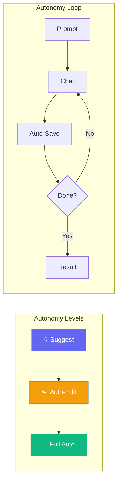

Control how autonomous agents operate, including autonomy levels, doom-loop detection, memory integration, and completion signals.



## Quick Start

<Steps>
<Step title="Simple Enable">

Enable autonomy with defaults:

```python
from praisonaiagents import Agent

agent = Agent(
    name="Autonomous Agent",
    instructions="Work autonomously",
    autonomy=True
)
```

</Step>

<Step title="With Configuration">

Configure autonomy behavior:

```python
from praisonaiagents import Agent, AutonomyConfig

agent = Agent(
    name="Autonomous Agent",
    instructions="Work autonomously",
    autonomy=AutonomyConfig(
        level="auto_edit",
        max_iterations=30,
        doom_loop_threshold=5,
        auto_escalate=True,
    )
)
```

</Step>

<Step title="With Memory Integration">

Autonomy loops auto-save sessions between iterations when memory is enabled:

```python
from praisonaiagents import Agent, AutonomyConfig

agent = Agent(
    name="Persistent Agent",
    instructions="Work autonomously with memory",
    autonomy=AutonomyConfig(max_iterations=20),
    memory=True,
    auto_save="my_session",
)
```

</Step>
</Steps>

---

## Configuration Options

```python
from praisonaiagents import AutonomyConfig, AutonomyLevel

config = AutonomyConfig(
    # Core settings
    enabled=True,                      # Enable/disable autonomy
    level="suggest",                   # Autonomy level (suggest, auto_edit, full_auto)
    max_iterations=20,                 # Max loop iterations before stopping
    
    # Doom loop detection
    doom_loop_threshold=3,             # Repeated actions before doom loop triggers
    auto_escalate=True,                # Escalate to user when stuck
    
    # Completion signals
    completion_promise="TASK_DONE",    # Structured promise tag for completion
    
    # Observability
    observe=False,                     # Emit trace events
    
    # Context management
    clear_context=False,               # Clear chat history between iterations
    
    # Verification
    verification_hooks=None,           # List of VerificationHook instances
)
```

| Parameter | Type | Default | Description |
|-----------|------|---------|-------------|
| `enabled` | `bool` | `True` | Whether autonomy is enabled |
| `level` | `str` | `"suggest"` | Autonomy level (`suggest`, `auto_edit`, `full_auto`) |
| `max_iterations` | `int` | `20` | Maximum iterations before stopping |
| `doom_loop_threshold` | `int` | `3` | Number of repeated actions to trigger doom loop |
| `auto_escalate` | `bool` | `True` | Automatically escalate complexity when stuck |
| `completion_promise` | `str \| None` | `None` | Structured completion signal (e.g. `"DONE"`) |
| `observe` | `bool` | `False` | Emit observability events during loop |
| `clear_context` | `bool` | `False` | Clear chat history between iterations |
| `verification_hooks` | `list \| None` | `None` | VerificationHook instances for output verification |

---

## Autonomy Levels

| Level | Enum Value | Description |
|-------|------------|-------------|
| `suggest` | `AutonomyLevel.SUGGEST` | Agent suggests actions, user approves |
| `auto_edit` | `AutonomyLevel.AUTO_EDIT` | Agent edits files, user reviews critical changes |
| `full_auto` | `AutonomyLevel.FULL_AUTO` | Agent operates fully autonomously |

```python
from praisonaiagents import AutonomyLevel

# Use enum or string - both work
config = AutonomyConfig(level=AutonomyLevel.AUTO_EDIT.value)
config = AutonomyConfig(level="auto_edit")
```

---

## Common Patterns

### Pattern 1: Safe Autonomous Agent

```python
from praisonaiagents import Agent, AutonomyConfig

agent = Agent(
    name="Safe Agent",
    instructions="Work carefully",
    autonomy=AutonomyConfig(
        level="suggest",
        max_iterations=10,
        doom_loop_threshold=3,
        auto_escalate=True,
    )
)
```

### Pattern 2: Full Autonomy with Completion Promise

```python
from praisonaiagents import Agent, AutonomyConfig

agent = Agent(
    name="Full Auto Agent",
    instructions="Complete autonomy",
    autonomy=AutonomyConfig(
        level="full_auto",
        max_iterations=50,
        completion_promise="ALL_DONE",
    )
)

result = agent.run_autonomous(
    "Build the feature end to end",
    completion_promise="ALL_DONE",
)
print(f"Success: {result.success}, Iterations: {result.iterations}")
```

### Pattern 3: Multi-Agent Autonomy Propagation

```python
from praisonaiagents import Agent, AgentTeam, AutonomyConfig

researcher = Agent(name="Researcher", instructions="Research topics")
writer = Agent(name="Writer", instructions="Write articles")

# AgentTeam propagates autonomy to all agents
team = AgentTeam(
    agents=[researcher, writer],
    autonomy=AutonomyConfig(max_iterations=30),
)
```

---

## Best Practices

<AccordionGroup>
<Accordion title="Start with Suggest Level">
Begin with `suggest` level and increase autonomy as you gain confidence.
</Accordion>

<Accordion title="Use Doom Loop Detection">
Keep `doom_loop_threshold` at 3-5 to prevent agents from repeating the same action.
</Accordion>

<Accordion title="Enable Memory for Long Sessions">
Combine `autonomy=True` with `memory=True` and `auto_save` to persist progress between iterations.
</Accordion>

<Accordion title="Use Completion Promises">
Use `completion_promise` for structured completion signals instead of relying on keyword detection.
</Accordion>
</AccordionGroup>

---

## Related

<CardGroup cols={2}>
<Card title="Autonomy Loop" icon="arrows-spin" href="/docs/features/autonomy-loop">
  Learn about the autonomy loop
</Card>
<Card title="Ralph Loops" icon="rotate" href="/docs/concepts/ralph-loops">
  Autonomous execution pattern
</Card>
</CardGroup>
