Control how autonomous agents operate, including escalation behavior, doom-loop detection, and approval requirements.

```mermaid
graph LR
    subgraph "Autonomy Levels"
        A[💡 Suggest] --> B[✏️ Auto-Edit]
        B --> C[🚀 Full Auto]
    end
    
    classDef suggest fill:#6366F1,stroke:#7C90A0,color:#fff
    classDef edit fill:#F59E0B,stroke:#7C90A0,color:#fff
    classDef full fill:#10B981,stroke:#7C90A0,color:#fff
    
    class A suggest
    class B edit
    class C full
```



## Quick Start

<Steps>
<Step title="Simple Enable">

Enable autonomy with defaults:

```python
from praisonaiagents import Agent

agent = Agent(
    name="Autonomous Agent",
    instructions="Work autonomously",
    autonomy=True
)
```

</Step>

<Step title="With Configuration">

Configure autonomy behavior:

```python
from praisonaiagents import Agent
from praisonaiagents.config import AutonomyConfig

agent = Agent(
    name="Autonomous Agent",
    instructions="Work autonomously",
    autonomy=AutonomyConfig(
        level="auto_edit",
        escalation_enabled=True,
        doom_loop_detection=True,
        max_consecutive_failures=3
    )
)
```

</Step>
</Steps>

---

## Configuration Options

```python
from praisonaiagents.config import AutonomyConfig, AutonomyLevel

config = AutonomyConfig(
    # Autonomy level
    level=AutonomyLevel.SUGGEST,
    
    # Escalation pipeline
    escalation_enabled=True,
    escalation_threshold=3,
    
    # Doom loop detection
    doom_loop_detection=True,
    max_consecutive_failures=3,
    
    # Approval policies
    require_approval_for_writes=True,
    require_approval_for_shell=True
)
```

| Parameter | Type | Default | Description |
|-----------|------|---------|-------------|
| `level` | `str \| AutonomyLevel` | `"suggest"` | Autonomy level (`suggest`, `auto_edit`, `full_auto`) |
| `escalation_enabled` | `bool` | `True` | Enable escalation to human |
| `escalation_threshold` | `int` | `3` | Failures before escalation |
| `doom_loop_detection` | `bool` | `True` | Detect stuck agents |
| `max_consecutive_failures` | `int` | `3` | Max failures before stopping |
| `require_approval_for_writes` | `bool` | `True` | Approval for write operations |
| `require_approval_for_shell` | `bool` | `True` | Approval for shell commands |

---

## Autonomy Levels

| Level | Description |
|-------|-------------|
| `suggest` | Agent suggests actions, user approves |
| `auto_edit` | Agent edits files, user reviews critical changes |
| `full_auto` | Agent operates fully autonomously |

---

## Common Patterns

### Pattern 1: Safe Autonomous Agent

```python
from praisonaiagents import Agent
from praisonaiagents.config import AutonomyConfig

agent = Agent(
    name="Safe Agent",
    instructions="Work carefully",
    autonomy=AutonomyConfig(
        level="auto_edit",
        require_approval_for_writes=True,
        require_approval_for_shell=True,
        doom_loop_detection=True
    )
)
```

### Pattern 2: Full Autonomy

```python
from praisonaiagents import Agent
from praisonaiagents.config import AutonomyConfig, AutonomyLevel

agent = Agent(
    name="Full Auto Agent",
    instructions="Complete autonomy",
    autonomy=AutonomyConfig(
        level=AutonomyLevel.FULL_AUTO,
        require_approval_for_writes=False,
        require_approval_for_shell=False
    )
)
```

### Pattern 3: Escalation Pipeline

```python
from praisonaiagents import Agent
from praisonaiagents.config import AutonomyConfig

agent = Agent(
    name="Escalating Agent",
    instructions="Escalate when stuck",
    autonomy=AutonomyConfig(
        escalation_enabled=True,
        escalation_threshold=2,
        max_consecutive_failures=3
    )
)
```

---

## Best Practices

<AccordionGroup>
<Accordion title="Start with Suggest Level">
Begin with `suggest` level and increase autonomy as you gain confidence.
</Accordion>

<Accordion title="Enable Doom Loop Detection">
Always keep `doom_loop_detection=True` to prevent stuck agents.
</Accordion>

<Accordion title="Require Approval for Critical Operations">
Keep `require_approval_for_writes` and `require_approval_for_shell` enabled for production.
</Accordion>

<Accordion title="Set Reasonable Escalation Thresholds">
Lower thresholds escalate faster but may interrupt more; find the right balance.
</Accordion>
</AccordionGroup>

---

## Related

<CardGroup cols={2}>
<Card title="Autonomy Loop" icon="arrows-spin" href="/docs/features/autonomy-loop">
  Learn about the autonomy loop
</Card>
<Card title="Ralph Loops" icon="rotate" href="/docs/concepts/ralph-loops">
  Autonomous execution pattern
</Card>
</CardGroup>
