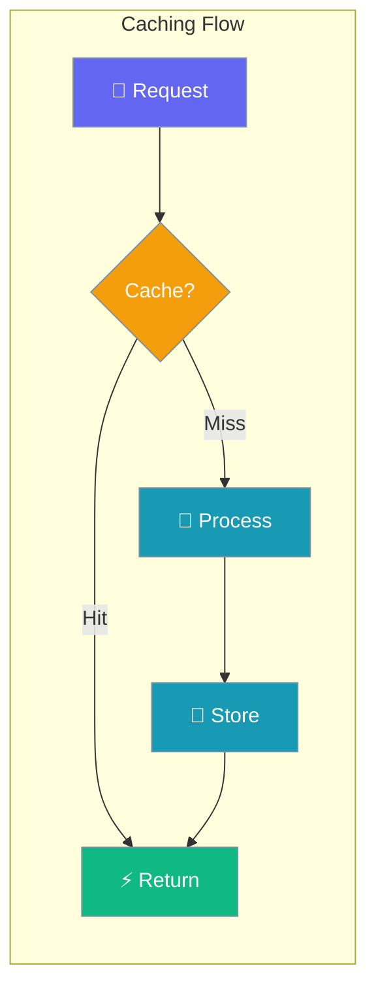

Enable response and prompt caching to improve performance and reduce API costs.


```mermaid
graph LR
    subgraph "Caching Flow"
        A[📝 Request] --> B{Cache?}
        B -->|Hit| C[⚡ Return]
        B -->|Miss| D[🤖 Process]
        D --> E[💾 Store]
        E --> C
    end
    
    classDef request fill:#6366F1,stroke:#7C90A0,color:#fff
    classDef check fill:#F59E0B,stroke:#7C90A0,color:#fff
    classDef process fill:#189AB4,stroke:#7C90A0,color:#fff
    classDef output fill:#10B981,stroke:#7C90A0,color:#fff
    
    class A request
    class B check
    class D process
    class E process
    class C output
```

## Quick Start

<Steps>
<Step title="Simple Enable">

Enable caching with defaults:

```python
from praisonaiagents import Agent

agent = Agent(
    name="Cached Agent",
    instructions="Use caching",
    caching=True
)
```

</Step>

<Step title="With Configuration">

Configure caching behavior:

```python
from praisonaiagents import Agent
from praisonaiagents.config import CachingConfig

agent = Agent(
    name="Cached Agent",
    instructions="Use caching",
    caching=CachingConfig(
        enabled=True,
        prompt_caching=True
    )
)
```

</Step>
</Steps>

---

## Configuration Options

```python
from praisonaiagents.config import CachingConfig

config = CachingConfig(
    # Response caching
    enabled=True,
    
    # Prompt caching (provider-specific)
    prompt_caching=None
)
```

| Parameter | Type | Default | Description |
|-----------|------|---------|-------------|
| `enabled` | `bool` | `True` | Enable response caching |
| `prompt_caching` | `Optional[bool]` | `None` | On Anthropic, emits explicit `cache_control` markers on the system block and the stable history prefix (respecting Anthropic's 4-breakpoint budget). On OpenAI/Gemini, has no effect at the wire — those providers cache automatically when the prefix is byte-stable. |

### What gets cached

- System block: instructions, tools, and memory prelude
- Stable conversation-history prefix (Anthropic only) — the two most recent messages stay uncached

---

## Common Patterns

### Pattern 1: Full Caching

```python
from praisonaiagents import Agent
from praisonaiagents.config import CachingConfig

agent = Agent(
    name="Full Cache Agent",
    instructions="Maximum caching",
    caching=CachingConfig(
        enabled=True,
        prompt_caching=True
    )
)
```

### Pattern 2: Auto-Detection with Memory

Even without explicit `prompt_caching=True`, the SDK auto-detects model support and arranges the prefix accordingly:

```python
from praisonaiagents import Agent

agent = Agent(
    name="Auto Cache Agent",
    instructions="Cache optimization happens automatically",
    llm="openai/gpt-4o",      # SDK detects prompt cache support
    memory=True,              # Enables cache-optimized memory context
    caching=CachingConfig()   # prompt_caching=None means auto-detect
)
```

### Pattern 3: Disable Caching

```python
from praisonaiagents import Agent
from praisonaiagents.config import CachingConfig

agent = Agent(
    name="No Cache Agent",
    instructions="Always fresh responses",
    caching=CachingConfig(enabled=False)
)
```

---

## Best Practices

<AccordionGroup>
<Accordion title="Enable Prompt Caching for Anthropic">
Anthropic Claude supports prompt caching for significant cost savings on repeated prompts.
</Accordion>

<Accordion title="Disable for Real-Time Data">
Turn off caching when agents need fresh, real-time information.
</Accordion>
</AccordionGroup>

---

## Related

<CardGroup cols={2}>
<Card title="Performance" icon="gauge-high" href="/docs/best-practices/performance-tuning">
  Performance optimization tips
</Card>
<Card title="ExecutionConfig" icon="bolt" href="/docs/configuration/execution-config">
  Execution limits configuration
</Card>
</CardGroup>
