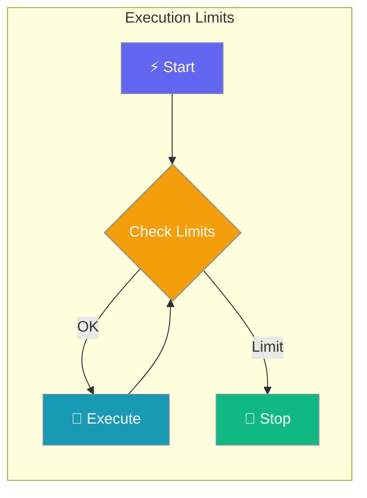
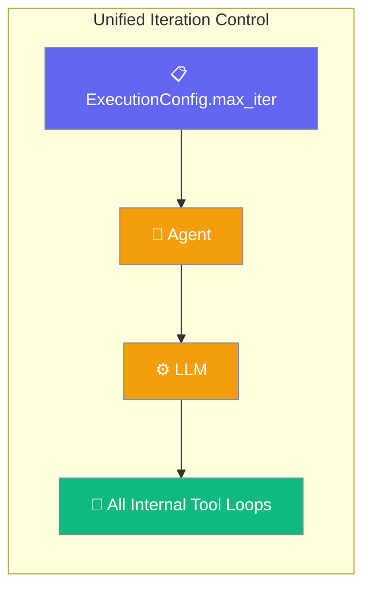
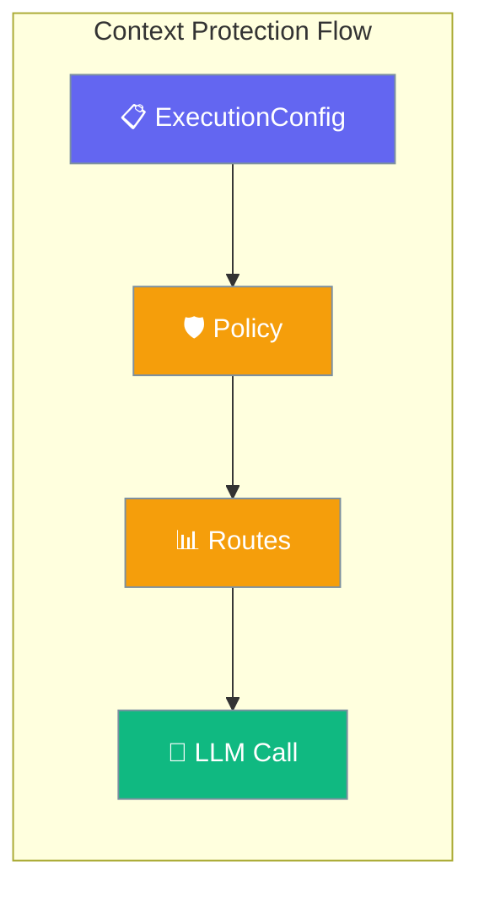

Control agent execution behavior with limits on iterations, rate limiting, timeouts, and retries.


```mermaid
graph LR
    subgraph "Execution Limits"
        A[⚡ Start] --> B{Check Limits}
        B -->|OK| C[🔄 Execute]
        C --> B
        B -->|Limit| D[🛑 Stop]
    end
    
    classDef start fill:#6366F1,stroke:#7C90A0,color:#fff
    classDef check fill:#F59E0B,stroke:#7C90A0,color:#fff
    classDef execute fill:#189AB4,stroke:#7C90A0,color:#fff
    classDef stop fill:#10B981,stroke:#7C90A0,color:#fff
    
    class A start
    class B check
    class C execute
    class D stop
```

## Quick Start

<Steps>
<Step title="Using Presets">

Use string presets for common configurations:

```python
from praisonaiagents import Agent

# Fast execution (fewer iterations)
agent = Agent(
    name="Fast Agent",
    instructions="Quick tasks",
    execution="fast"
)

# Thorough execution (more iterations)
agent = Agent(
    name="Thorough Agent",
    instructions="Complex analysis",
    execution="thorough"
)
```

</Step>

<Step title="With Configuration">

Fine-grained control:

```python
from praisonaiagents import Agent
from praisonaiagents.config import ExecutionConfig

agent = Agent(
    name="Custom Agent",
    instructions="Custom execution limits",
    execution=ExecutionConfig(
        max_iter=50,
        max_rpm=100,
        max_execution_time=300,
        max_retry_limit=5,
        max_tool_calls_per_turn=10
    )
)
```

</Step>
</Steps>

---

## Configuration Options

```python
from praisonaiagents.config import ExecutionConfig

config = ExecutionConfig(
    # Iteration limits
    max_iter=20,
    
    # Rate limiting (requests per minute)
    max_rpm=None,
    
    # Time limits (seconds)
    max_execution_time=None,
    
    # Retry settings
    max_retry_limit=2,
    
    # Tool call limits (loop protection)
    max_tool_calls_per_turn=10
)
```

| Parameter | Type | Default | Description |
|-----------|------|---------|-------------|
| `max_iter` | `int` | `20` | Maximum tool-calling iterations. Now propagated to the `LLM` instance, so it controls every internal loop (previously some loops were hardcoded to 5/10/20/50). Both the `ExecutionConfig` default and the `LLM`-direct-construction default are `20` (aligned as of PR #1898). |
| `max_rpm` | `int \| None` | `None` | Max requests per minute (rate limit) |
| `max_execution_time` | `int \| None` | `None` | Max execution time in seconds |
| `max_retry_limit` | `int` | `2` | Max retries on failure |
| `max_tool_calls_per_turn` | `int` | `10` | Maximum tool calls allowed in a single chat turn. When exceeded, execution stops with a clear message instead of looping forever. |
| `context_compaction` | `bool \| ContextCompactionPolicy` | `False` | Proactive context-overflow protection. `True` uses the `BALANCED_POLICY` preset. Pass a `ContextCompactionPolicy` instance for custom routing. **Default flips to `True` in the next release** — a `DeprecationWarning` is emitted today when left at `False`. See [Context Compaction Policy](/features/context-compaction-policy). |
| `max_budget` | `float \| None` | `None` | Hard USD cap per agent run. `None` = no limit. |
| `on_budget_exceeded` | `str \| callable` | `"stop"` | Action when limit is hit: `"stop"` raises `BudgetExceededError`, `"warn"` logs and continues, or a `callable(total_cost, max_budget)`. |

<Note>
For simple budget limits, use the `Agent(max_budget=...)` convenience parameter instead of importing `ExecutionConfig`. See [Agent max_budget](/docs/features/agent-max-budget) for details.
</Note>

---

## Execution Presets

| Preset | max_iter | Description |
|--------|----------|-------------|
| `"fast"` | 10 | Quick tasks, fewer iterations |
| `"balanced"` | 20 | Default, balanced approach |
| `"thorough"` | 50 | Complex tasks, more iterations |
| `"unlimited"` | 1000 | Long-running tasks |

---

## Iteration Propagation

`ExecutionConfig.max_iter` is now the single source of truth for iteration limits, replacing previously hardcoded internal caps.


```mermaid
graph LR
    subgraph "Unified Iteration Control"
        Config[📋 ExecutionConfig.max_iter] --> Agent[🤖 Agent]
        Agent --> LLM[⚙️ LLM]
        LLM --> Loops[🔄 All Internal Tool Loops]
    end
    
    classDef config fill:#6366F1,stroke:#7C90A0,color:#fff
    classDef process fill:#F59E0B,stroke:#7C90A0,color:#fff
    classDef output fill:#10B981,stroke:#7C90A0,color:#fff
    
    class Config config
    class Agent,LLM process
    class Loops output
```

**Before**: Internal LLM loops were hardcoded to different limits (5, 10, 20, 50)
**After**: All loops respect the configured `max_iter` value

```python
from praisonaiagents import Agent
from praisonaiagents.config import ExecutionConfig

# This now controls ALL iteration loops, not just agent-level loops
agent = Agent(
    name="Unified Control",
    instructions="Respect iteration limits everywhere",
    execution=ExecutionConfig(max_iter=15)
)
# The agent's LLM will respect 15 iterations in all internal loops
```

---

## Proactive Context Compaction


```mermaid
graph LR
    subgraph "Context Protection Flow"
        Config[📋 ExecutionConfig] --> Policy[🛡️ Policy]
        Policy --> Routes[📊 Routes]
        Routes --> LLM[🤖 LLM Call]
    end
    
    classDef config fill:#6366F1,stroke:#7C90A0,color:#fff
    classDef process fill:#F59E0B,stroke:#7C90A0,color:#fff
    classDef output fill:#10B981,stroke:#7C90A0,color:#fff
    
    class Config config
    class Policy,Routes process
    class LLM output
```

Context compaction proactively prevents overflow before LLM calls instead of reacting after errors.

```python
from praisonaiagents import Agent, ExecutionConfig, BALANCED_POLICY

agent = Agent(
    name="Researcher",
    execution=ExecutionConfig(
        max_iter=30,
        context_compaction=BALANCED_POLICY,  # explicit preset
    ),
)
```

See [Context Compaction Policy](/features/context-compaction-policy) for detailed configuration options.

---

## Common Patterns

### Pattern 1: Rate-Limited Agent

```python
from praisonaiagents import Agent
from praisonaiagents.config import ExecutionConfig

agent = Agent(
    name="Rate Limited Agent",
    instructions="Respect API limits",
    execution=ExecutionConfig(
        max_rpm=60,  # 60 requests per minute
        max_retry_limit=3
    )
)
```

### Pattern 2: Time-Bounded Agent

```python
from praisonaiagents import Agent
from praisonaiagents.config import ExecutionConfig

agent = Agent(
    name="Timed Agent",
    instructions="Complete within time limit",
    execution=ExecutionConfig(
        max_execution_time=60,  # 60 seconds max
        max_iter=100
    )
)
```

### Pattern 3: Resilient Agent

```python
from praisonaiagents import Agent
from praisonaiagents.config import ExecutionConfig

agent = Agent(
    name="Resilient Agent",
    instructions="Handle failures gracefully",
    execution=ExecutionConfig(
        max_retry_limit=5,
        max_iter=30
    )
)
```

### Pattern 4: Loop-Protected Agent

```python
from praisonaiagents import Agent
from praisonaiagents.config import ExecutionConfig

agent = Agent(
    name="Protected Agent",
    instructions="Agent with experimental tools",
    execution=ExecutionConfig(
        max_tool_calls_per_turn=5,  # Lower limit for potentially noisy tools
        max_iter=20
    )
)
```

---

## Best Practices

<AccordionGroup>
<Accordion title="Set Iteration Limits">
Always set `max_iter` to prevent runaway agents consuming resources.
</Accordion>

<Accordion title="Use Rate Limiting for APIs">
Set `max_rpm` when calling external APIs to avoid rate limit errors.
</Accordion>

<Accordion title="Set Timeouts for Production">
Use `max_execution_time` in production to prevent hung processes.
</Accordion>

<Accordion title="Configure Loop Protection">
Adjust `max_tool_calls_per_turn` based on your tools: lower for experimental tools (3-5), higher for complex multi-tool workflows (20-30).
</Accordion>
</AccordionGroup>

---

## Related

<CardGroup cols={2}>
<Card title="Context Compaction Policy" icon="shield-check" href="/features/context-compaction-policy">
  Proactive context overflow protection
</Card>
<Card title="LLM Error Classification" icon="circle-alert" href="/features/llm-error-classification">
  Iteration control and error handling integration
</Card>
<Card title="Async Execution" icon="clock" href="/docs/features/async">
  Async agent execution
</Card>
<Card title="Background Tasks" icon="list-check" href="/docs/features/background-tasks">
  Run agents in background
</Card>
<Card title="Structured LLM Errors" icon="circle-alert" href="/features/structured-llm-errors">
  LLM error handling and retry policies
</Card>
</CardGroup>
