Control agent execution behavior with limits on iterations, rate limiting, timeouts, and retries.

```mermaid
graph LR
    subgraph "Execution Limits"
        A[⚡ Start] --> B{Check Limits}
        B -->|OK| C[🔄 Execute]
        C --> B
        B -->|Limit| D[🛑 Stop]
    end
    
    classDef start fill:#6366F1,stroke:#7C90A0,color:#fff
    classDef check fill:#F59E0B,stroke:#7C90A0,color:#fff
    classDef execute fill:#189AB4,stroke:#7C90A0,color:#fff
    classDef stop fill:#10B981,stroke:#7C90A0,color:#fff
    
    class A start
    class B check
    class C execute
    class D stop
```



## Quick Start

<Steps>
<Step title="Using Presets">

Use string presets for common configurations:

```python
from praisonaiagents import Agent

# Fast execution (fewer iterations)
agent = Agent(
    name="Fast Agent",
    instructions="Quick tasks",
    execution="fast"
)

# Thorough execution (more iterations)
agent = Agent(
    name="Thorough Agent",
    instructions="Complex analysis",
    execution="thorough"
)
```

</Step>

<Step title="With Configuration">

Fine-grained control:

```python
from praisonaiagents import Agent
from praisonaiagents.config import ExecutionConfig

agent = Agent(
    name="Custom Agent",
    instructions="Custom execution limits",
    execution=ExecutionConfig(
        max_iter=50,
        max_rpm=100,
        max_execution_time=300,
        max_retry_limit=5
    )
)
```

</Step>
</Steps>

---

## Configuration Options

```python
from praisonaiagents.config import ExecutionConfig

config = ExecutionConfig(
    # Iteration limits
    max_iter=20,
    
    # Rate limiting (requests per minute)
    max_rpm=None,
    
    # Time limits (seconds)
    max_execution_time=None,
    
    # Retry settings
    max_retry_limit=2
)
```

| Parameter | Type | Default | Description |
|-----------|------|---------|-------------|
| `max_iter` | `int` | `20` | Maximum tool call iterations |
| `max_rpm` | `int \| None` | `None` | Max requests per minute (rate limit) |
| `max_execution_time` | `int \| None` | `None` | Max execution time in seconds |
| `max_retry_limit` | `int` | `2` | Max retries on failure |

---

## Execution Presets

| Preset | max_iter | Description |
|--------|----------|-------------|
| `"fast"` | 10 | Quick tasks, fewer iterations |
| `"balanced"` | 20 | Default, balanced approach |
| `"thorough"` | 50 | Complex tasks, more iterations |
| `"unlimited"` | 1000 | Long-running tasks |

---

## Common Patterns

### Pattern 1: Rate-Limited Agent

```python
from praisonaiagents import Agent
from praisonaiagents.config import ExecutionConfig

agent = Agent(
    name="Rate Limited Agent",
    instructions="Respect API limits",
    execution=ExecutionConfig(
        max_rpm=60,  # 60 requests per minute
        max_retry_limit=3
    )
)
```

### Pattern 2: Time-Bounded Agent

```python
from praisonaiagents import Agent
from praisonaiagents.config import ExecutionConfig

agent = Agent(
    name="Timed Agent",
    instructions="Complete within time limit",
    execution=ExecutionConfig(
        max_execution_time=60,  # 60 seconds max
        max_iter=100
    )
)
```

### Pattern 3: Resilient Agent

```python
from praisonaiagents import Agent
from praisonaiagents.config import ExecutionConfig

agent = Agent(
    name="Resilient Agent",
    instructions="Handle failures gracefully",
    execution=ExecutionConfig(
        max_retry_limit=5,
        max_iter=30
    )
)
```

---

## Best Practices

<AccordionGroup>
<Accordion title="Set Iteration Limits">
Always set `max_iter` to prevent runaway agents consuming resources.
</Accordion>

<Accordion title="Use Rate Limiting for APIs">
Set `max_rpm` when calling external APIs to avoid rate limit errors.
</Accordion>

<Accordion title="Set Timeouts for Production">
Use `max_execution_time` in production to prevent hung processes.
</Accordion>
</AccordionGroup>

---

## Related

<CardGroup cols={2}>
<Card title="Async Execution" icon="clock" href="/docs/features/async">
  Async agent execution
</Card>
<Card title="Background Tasks" icon="list-check" href="/docs/features/background-tasks">
  Run agents in background
</Card>
</CardGroup>
