Attach callbacks to agent lifecycle events for monitoring, logging, and custom behavior.

```mermaid
graph LR
    subgraph "Hook System"
        A[🤖 Agent] --> B[📍 on_step]
        A --> C[🔧 on_tool_call]
        A --> D[🔗 middleware]
    end
    
    classDef agent fill:#6366F1,stroke:#7C90A0,color:#fff
    classDef hook fill:#F59E0B,stroke:#7C90A0,color:#fff
    
    class A agent
    class B,C,D hook
```



## Quick Start

<Steps>
<Step title="Step Callback">

Monitor each agent step:

```python
from praisonaiagents import Agent
from praisonaiagents.config import HooksConfig

def on_step(step_info):
    print(f"Step: {step_info}")

agent = Agent(
    name="Hooked Agent",
    instructions="Agent with callbacks",
    hooks=HooksConfig(on_step=on_step)
)
```

</Step>

<Step title="Tool Call Callback">

Monitor tool executions:

```python
from praisonaiagents import Agent
from praisonaiagents.config import HooksConfig

def on_tool_call(tool_name, args, result):
    print(f"Tool: {tool_name}, Args: {args}")

agent = Agent(
    name="Hooked Agent",
    instructions="Agent with tool monitoring",
    hooks=HooksConfig(on_tool_call=on_tool_call)
)
```

</Step>
</Steps>

---

## Configuration Options

```python
from praisonaiagents.config import HooksConfig

config = HooksConfig(
    # Step callback
    on_step=None,
    
    # Tool call callback
    on_tool_call=None,
    
    # Middleware list
    middleware=[]
)
```

| Parameter | Type | Default | Description |
|-----------|------|---------|-------------|
| `on_step` | `Callable \| None` | `None` | Called on each agent step |
| `on_tool_call` | `Callable \| None` | `None` | Called on tool execution |
| `middleware` | `List[Any]` | `[]` | Middleware chain |

---

## Common Patterns

### Pattern 1: Logging All Events

```python
from praisonaiagents import Agent
from praisonaiagents.config import HooksConfig
import logging

logger = logging.getLogger(__name__)

def log_step(step_info):
    logger.info(f"Step: {step_info}")

def log_tool(tool_name, args, result):
    logger.info(f"Tool: {tool_name}")

agent = Agent(
    name="Logged Agent",
    instructions="Full logging",
    hooks=HooksConfig(
        on_step=log_step,
        on_tool_call=log_tool
    )
)
```

### Pattern 2: Custom Middleware

```python
from praisonaiagents import Agent
from praisonaiagents.config import HooksConfig

class TimingMiddleware:
    def __call__(self, next_handler):
        import time
        def handler(request):
            start = time.time()
            result = next_handler(request)
            print(f"Duration: {time.time() - start:.2f}s")
            return result
        return handler

agent = Agent(
    name="Timed Agent",
    instructions="Track timing",
    hooks=HooksConfig(
        middleware=[TimingMiddleware()]
    )
)
```

---

## Best Practices

<AccordionGroup>
<Accordion title="Keep Callbacks Lightweight">
Callbacks run synchronously. Keep them fast to avoid slowing down the agent.
</Accordion>

<Accordion title="Use Middleware for Cross-Cutting Concerns">
Middleware is ideal for logging, metrics, authentication, etc.
</Accordion>

<Accordion title="Handle Errors in Callbacks">
Wrap callback logic in try/except to prevent callback errors from crashing the agent.
</Accordion>
</AccordionGroup>

---

## Related

<CardGroup cols={2}>
<Card title="Hooks System" icon="webhook" href="/docs/features/hooks">
  Learn about the hooks system
</Card>
<Card title="Observability" icon="eye" href="/docs/observability/overview">
  Monitoring and tracing
</Card>
</CardGroup>
