Configure knowledge sources, embedding, chunking, and retrieval settings for RAG-powered agents.

```mermaid
graph LR
    subgraph "Knowledge Pipeline"
        A[📄 Sources] --> B[✂️ Chunk]
        B --> C[🔢 Embed]
        C --> D[🔍 Retrieve]
        D --> E[📝 Augment]
    end
    
    classDef input fill:#6366F1,stroke:#7C90A0,color:#fff
    classDef process fill:#F59E0B,stroke:#7C90A0,color:#fff
    classDef embed fill:#189AB4,stroke:#7C90A0,color:#fff
    classDef retrieve fill:#8B0000,stroke:#7C90A0,color:#fff
    classDef output fill:#10B981,stroke:#7C90A0,color:#fff
    
    class A input
    class B process
    class C embed
    class D retrieve
    class E output
```



## Quick Start

<Steps>
<Step title="Simple Usage">

Add knowledge sources directly:

```python
from praisonaiagents import Agent

agent = Agent(
    name="Knowledge Agent",
    instructions="Answer questions from the documentation",
    knowledge=["docs/", "data.pdf"]
)
```

</Step>

<Step title="With Configuration">

Configure retrieval settings:

```python
from praisonaiagents import Agent
from praisonaiagents.config import KnowledgeConfig

agent = Agent(
    name="Knowledge Agent",
    instructions="Answer questions from the documentation",
    knowledge=KnowledgeConfig(
        sources=["docs/"],
        embedder="openai",
        chunking_strategy="semantic",
        retrieval_k=5,
        rerank=True
    )
)
```

</Step>
</Steps>

---

## Configuration Options

```python
from praisonaiagents.config import KnowledgeConfig, ChunkingStrategy

config = KnowledgeConfig(
    # Knowledge sources
    sources=["docs/", "data.pdf"],
    
    # Embedder configuration
    embedder="openai",
    embedder_config=None,
    
    # Chunking settings
    chunking_strategy=ChunkingStrategy.SEMANTIC,
    chunk_size=1000,
    chunk_overlap=200,
    chunker=None,  # Alternative dict config
    
    # Retrieval settings
    retrieval_k=5,
    retrieval_threshold=0.0,
    
    # Reranking
    rerank=False,
    rerank_model=None,
    
    # Auto-retrieval
    auto_retrieve=True,
    
    # Vector store
    vector_store=None,
    
    # Advanced config
    config=None
)
```

| Parameter | Type | Default | Description |
|-----------|------|---------|-------------|
| `sources` | `List[str]` | `[]` | Files, directories, or URLs |
| `embedder` | `str` | `"openai"` | Embedding provider |
| `embedder_config` | `Dict \| None` | `None` | Embedder-specific settings |
| `chunking_strategy` | `str \| ChunkingStrategy` | `"semantic"` | Chunking method (`fixed`, `semantic`, `sentence`, `paragraph`) |
| `chunk_size` | `int` | `1000` | Target chunk size in tokens |
| `chunk_overlap` | `int` | `200` | Overlap between chunks |
| `chunker` | `Dict \| None` | `None` | Alternative chunker config dict |
| `retrieval_k` | `int` | `5` | Number of chunks to retrieve |
| `retrieval_threshold` | `float` | `0.0` | Minimum similarity threshold |
| `rerank` | `bool` | `False` | Enable result reranking |
| `rerank_model` | `str \| None` | `None` | Model for reranking |
| `auto_retrieve` | `bool` | `True` | Auto-inject relevant context |
| `vector_store` | `Dict \| None` | `None` | Vector database settings |
| `config` | `Dict \| None` | `None` | Advanced configuration dict |

---

## Common Patterns

### Pattern 1: High-Precision Retrieval

```python
from praisonaiagents import Agent
from praisonaiagents.config import KnowledgeConfig

agent = Agent(
    name="Precise Agent",
    instructions="Provide accurate answers",
    knowledge=KnowledgeConfig(
        sources=["docs/"],
        retrieval_k=10,
        rerank=True,
        retrieval_threshold=0.7
    )
)
```

### Pattern 2: Custom Chunking

```python
from praisonaiagents import Agent
from praisonaiagents.config import KnowledgeConfig

agent = Agent(
    name="Custom Chunk Agent",
    instructions="Process large documents",
    knowledge=KnowledgeConfig(
        sources=["large_docs/"],
        chunker={
            "type": "semantic",
            "chunk_size": 512,
            "chunk_overlap": 100
        }
    )
)
```

### Pattern 3: External Vector Store

```python
from praisonaiagents import Agent
from praisonaiagents.config import KnowledgeConfig

agent = Agent(
    name="Qdrant Agent",
    instructions="Use external vector database",
    knowledge=KnowledgeConfig(
        sources=["docs/"],
        vector_store={
            "provider": "qdrant",
            "url": "http://localhost:6333",
            "collection": "my_docs"
        }
    )
)
```

---

## Best Practices

<AccordionGroup>
<Accordion title="Use Semantic Chunking for Documents">
Semantic chunking preserves context better than fixed-size chunks, especially for technical documentation.
</Accordion>

<Accordion title="Enable Reranking for Accuracy">
Reranking improves retrieval precision by using a cross-encoder to reorder results.
</Accordion>

<Accordion title="Set Retrieval Threshold">
Use `retrieval_threshold` to filter low-quality matches and prevent hallucination.
</Accordion>

<Accordion title="Auto-Retrieve by Default">
Keep `auto_retrieve=True` to automatically inject relevant context into prompts.
</Accordion>
</AccordionGroup>

---

## Related

<CardGroup cols={2}>
<Card title="Knowledge Overview" icon="book" href="/docs/knowledge/overview">
  Learn about the knowledge system
</Card>
<Card title="RAG" icon="magnifying-glass" href="/docs/rag/overview">
  RAG configuration and features
</Card>
</CardGroup>
