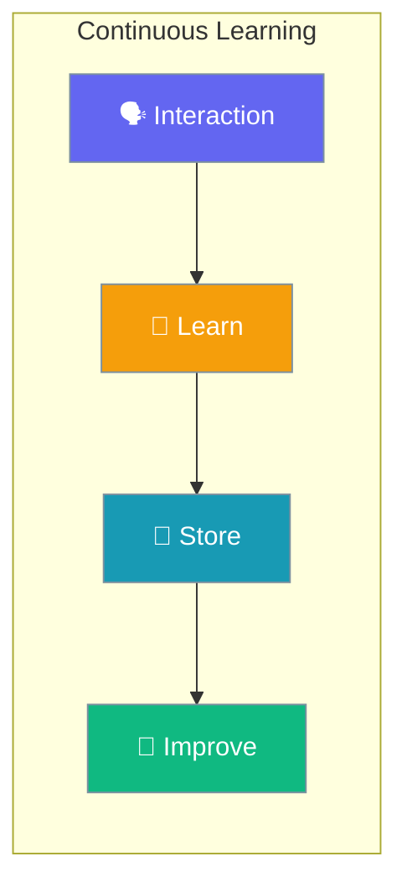
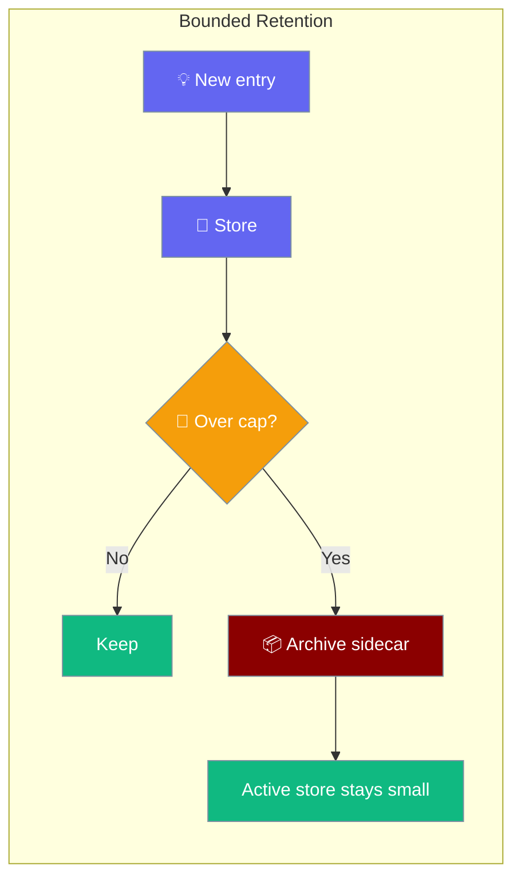

Configure agents to learn from interactions, capturing patterns, preferences, and insights to improve future responses.


```mermaid
graph LR
    subgraph "Continuous Learning"
        A[🗣️ Interaction] --> B[🧠 Learn]
        B --> C[💾 Store]
        C --> D[🔄 Improve]
    end
    
    classDef input fill:#6366F1,stroke:#7C90A0,color:#fff
    classDef process fill:#F59E0B,stroke:#7C90A0,color:#fff
    classDef store fill:#189AB4,stroke:#7C90A0,color:#fff
    classDef output fill:#10B981,stroke:#7C90A0,color:#fff
    
    class A input
    class B process
    class C store
    class D output
```

## Quick Start

<Steps>
<Step title="Simple Enable">

Enable learning with default settings:

```python
from praisonaiagents import Agent

agent = Agent(
    name="Learning Agent",
    instructions="You are a helpful assistant",
    learn=True
)
```

</Step>

<Step title="With Configuration">

Enable specific learning capabilities:

```python
from praisonaiagents import Agent, LearnConfig

agent = Agent(
    name="Learning Agent",
    instructions="You are a helpful assistant",
    learn=LearnConfig(
        persona=True,      # User preferences
        insights=True,     # Observations
        patterns=True,     # Reusable knowledge
        scope="private"
    )
)
```

</Step>

<Step title="With Bounded Retention">

Cap store size and expire stale entries automatically:

```python
from praisonaiagents import Agent, LearnConfig

agent = Agent(
    name="Assistant",
    instructions="Adapts to user preferences",
    learn=LearnConfig(
        persona=True,
        max_entries=1000,        # Cap per store
        retention_days=90,       # Drop stale entries after 90 days
    ),
)
```

</Step>
</Steps>

---

## Configuration Options

```python
from praisonaiagents import LearnConfig

config = LearnConfig(
    # Learning capabilities
    persona=True,           # User preferences and profile
    insights=True,          # Observations and learnings
    thread=True,            # Session/conversation context
    patterns=False,         # Reusable knowledge patterns
    decisions=False,        # Decision logging
    feedback=False,         # Outcome signals
    improvements=False,     # Self-improvement proposals
    
    # Scope configuration
    scope="private",
    
    # Storage configuration
    store_path=None,        # Custom storage path
    backend="file",         # Storage backend (file, sqlite, redis, mongodb)
    
    # Retention (0 = unbounded, existing data unaffected)
    max_entries=0,          # Max entries per store (0 = no cap)
    retention_days=0,       # Days until stale (0 = never expires)
    
    # Learning mode
    mode="disabled",        # How to extract learnings automatically
)
```

| Parameter | Type | Default | Description |
|-----------|------|---------|-------------|
| `persona` | `bool` | `True` | Learn user preferences and profile |
| `insights` | `bool` | `True` | Capture observations and learnings |
| `thread` | `bool` | `True` | Maintain session/conversation context |
| `patterns` | `bool` | `False` | Store reusable knowledge patterns |
| `decisions` | `bool` | `False` | Log decision-making process |
| `feedback` | `bool` | `False` | Capture outcome signals |
| `improvements` | `bool` | `False` | Store self-improvement proposals |
| `scope` | `str \| LearnScope` | `"private"` | Visibility scope (`private`, `shared`) |
| `store_path` | `str \| None` | `None` | Custom path for learning storage |
| `backend` | `str \| LearnBackend` | `"file"` | Storage backend (`file`, `sqlite`, `redis`, `mongodb`) |
| `mode` | `str \| LearnMode` | `"disabled"` | Learning extraction mode (`disabled`, `agentic`) |
| `max_entries` | `int` | `0` | Maximum entries per store. `0` = unbounded (default, existing behaviour unchanged). When the cap is exceeded, the store prunes least-used / oldest entries on the next write or `prune()` call. Evicted entries are archived to a `.archive.json` sidecar. |
| `retention_days` | `int` | `0` | Soft expiry in days. `0` = no time-based pruning (default). Entries older than this with no recent use become eligible for pruning. |

<Note>
Both `max_entries` and `retention_days` default to `0` (unbounded). Existing agents are unaffected unless you explicitly set these values. There is no silent eviction — entries are only pruned when a cap is set.
</Note>

---

## Bounded Retention

Retention limits keep long-running agents healthy without losing data — evicted entries are saved to a `.archive.json` sidecar file next to the store, so nothing is permanently lost.


```mermaid
graph LR
    subgraph "Bounded Retention"
        A[💡 New entry] --> B[💾 Store]
        B --> C{🚦 Over cap?}
        C -->|No| D[Keep]
        C -->|Yes| E[📦 Archive sidecar]
        E --> F[Active store stays small]
    end

    classDef input fill:#6366F1,stroke:#7C90A0,color:#fff
    classDef proc fill:#F59E0B,stroke:#7C90A0,color:#fff
    classDef ok fill:#10B981,stroke:#7C90A0,color:#fff
    classDef archive fill:#8B0000,stroke:#7C90A0,color:#fff
    class A,B input
    class C proc
    class D,F ok
    class E archive
```

### How pruning works

| Trigger | When |
|---------|------|
| On write | Automatically when `max_entries > 0` and the cap is exceeded |
| On `prune()` call | Manually, for one-off cleanup |

Entries are scored by **least used first, then oldest** — the most valuable, recently accessed learnings are always kept.

The archive sidecar is written to the same directory as the store file, named `<store>.archive.json` (e.g., `persona.archive.json`).

### Manual pruning

```python
from praisonaiagents import LearnConfig
from praisonaiagents.memory.memory import Memory

# Access LearnManager via Memory instance
mem = Memory({"learn": {"max_entries": 1000, "retention_days": 90}})
# Run across all configured stores; returns evicted count per store
evicted = mem.learn.prune()
print(f"Pruned: {evicted}")
# e.g. {"persona": 12, "insights": 3}
```

<Tip>
`prune()` is also called automatically on every write when limits are set. Manual calls are only needed for one-off cleanup of a long-running agent.
</Tip>

---

## Common Patterns

### Pattern 1: Full Learning Profile

```python
from praisonaiagents import Agent, LearnConfig

agent = Agent(
    name="Full Learning Agent",
    instructions="You are a personalized assistant",
    learn=LearnConfig(
        persona=True,
        insights=True,
        thread=True,
        patterns=True,
        decisions=True,
        feedback=True,
        improvements=True
    )
)
```

### Pattern 2: Shared Team Learning

```python
from praisonaiagents import Agent, LearnConfig

agent = Agent(
    name="Team Agent",
    instructions="Share learnings with team",
    learn=LearnConfig(
        patterns=True,
        insights=True,
        scope="shared"
    )
)
```

### Pattern 3: Compliance-Ready Agent

```python
from praisonaiagents import Agent, LearnConfig

agent = Agent(
    name="Compliance Agent",
    instructions="Process requests with data retention limits",
    learn=LearnConfig(
        persona=True,
        insights=True,
        max_entries=500,
        retention_days=30,   # Purge entries older than 30 days
    )
)
```

---

## Best Practices

<AccordionGroup>
<Accordion title="Leave defaults for most agents">
Both `max_entries` and `retention_days` default to `0` (unbounded). Unless your agent runs for months or handles compliance requirements, the defaults are fine. Stores only grow with actual interactions.
</Accordion>

<Accordion title="Cap long-running gateway agents">
For agents that run continuously and interact with many users, set `max_entries=1000` to keep store files small and search fast. The archive sidecar preserves evicted entries if you need to audit them.
</Accordion>

<Accordion title="Use retention_days for compliance">
For compliance requirements (e.g., GDPR, data minimization), set `retention_days` to automatically make old entries eligible for pruning. Pair with `max_entries` for proactive pruning on every write.
</Accordion>

<Accordion title="Use Private Scope by Default">
Keep learnings private unless you explicitly need shared team knowledge. This protects user data.
</Accordion>

<Accordion title="Restoring from archive">
Evicted entries are never hard-deleted. Find the `.archive.json` sidecar (same directory as the store file) to recover them. The archive is append-only JSON.
</Accordion>
</AccordionGroup>

---

## Related

<CardGroup cols={2}>
<Card title="Bounded Learning" icon="database" href="/docs/features/learning-retention">
  User-flow guide: retention caps, archival, and the prune API
</Card>
<Card title="Agent Learn" icon="lightbulb" href="/docs/concepts/agent-learn">
  Learn about the Agent Learn concept
</Card>
</CardGroup>
