Configure agents to learn from interactions, capturing patterns, preferences, and insights to improve future responses.

```mermaid
graph LR
    subgraph "Continuous Learning"
        A[🗣️ Interaction] --> B[🧠 Learn]
        B --> C[💾 Store]
        C --> D[🔄 Improve]
    end
    
    classDef input fill:#6366F1,stroke:#7C90A0,color:#fff
    classDef process fill:#F59E0B,stroke:#7C90A0,color:#fff
    classDef store fill:#189AB4,stroke:#7C90A0,color:#fff
    classDef output fill:#10B981,stroke:#7C90A0,color:#fff
    
    class A input
    class B process
    class C store
    class D output
```



## Quick Start

<Steps>
<Step title="Simple Enable">

Enable learning with default settings:

```python
from praisonaiagents import Agent
from praisonaiagents.config import MemoryConfig

agent = Agent(
    name="Learning Agent",
    instructions="You are a helpful assistant",
    memory=MemoryConfig(learn=True)
)
```

</Step>

<Step title="With Configuration">

Enable specific learning capabilities:

```python
from praisonaiagents import Agent
from praisonaiagents.config import MemoryConfig, LearnConfig

agent = Agent(
    name="Learning Agent",
    instructions="You are a helpful assistant",
    memory=MemoryConfig(
        learn=LearnConfig(
            persona=True,      # User preferences
            insights=True,     # Observations
            patterns=True,     # Reusable knowledge
            scope="private"
        )
    )
)
```

</Step>
</Steps>

---

## Configuration Options

```python
from praisonaiagents.config import LearnConfig, LearnScope

config = LearnConfig(
    # Learning capabilities
    persona=True,           # User preferences and profile
    insights=True,          # Observations and learnings
    thread=True,            # Session/conversation context
    patterns=False,         # Reusable knowledge patterns
    decisions=False,        # Decision logging
    feedback=False,         # Outcome signals
    improvements=False,     # Self-improvement proposals
    
    # Scope configuration
    scope=LearnScope.PRIVATE,
    
    # Storage configuration
    store_path=None,        # Custom storage path
    
    # Maintenance settings
    auto_consolidate=True,  # Auto-consolidate learnings
    retention_days=None     # Days to retain (None = forever)
)
```

| Parameter | Type | Default | Description |
|-----------|------|---------|-------------|
| `persona` | `bool` | `True` | Learn user preferences and profile |
| `insights` | `bool` | `True` | Capture observations and learnings |
| `thread` | `bool` | `True` | Maintain session/conversation context |
| `patterns` | `bool` | `False` | Store reusable knowledge patterns |
| `decisions` | `bool` | `False` | Log decision-making process |
| `feedback` | `bool` | `False` | Capture outcome signals |
| `improvements` | `bool` | `False` | Store self-improvement proposals |
| `scope` | `str \| LearnScope` | `"private"` | Visibility scope (`private`, `shared`) |
| `store_path` | `str \| None` | `None` | Custom path for learning storage |
| `auto_consolidate` | `bool` | `True` | Automatically consolidate learnings |
| `retention_days` | `int \| None` | `None` | Days to retain learnings (None = forever) |

---

## Common Patterns

### Pattern 1: Full Learning Profile

```python
from praisonaiagents import Agent
from praisonaiagents.config import MemoryConfig, LearnConfig

agent = Agent(
    name="Full Learning Agent",
    instructions="You are a personalized assistant",
    memory=MemoryConfig(
        learn=LearnConfig(
            persona=True,
            insights=True,
            thread=True,
            patterns=True,
            decisions=True,
            feedback=True,
            improvements=True
        )
    )
)
```

### Pattern 2: Shared Team Learning

```python
from praisonaiagents import Agent
from praisonaiagents.config import MemoryConfig, LearnConfig, LearnScope

agent = Agent(
    name="Team Agent",
    instructions="Share learnings with team",
    memory=MemoryConfig(
        learn=LearnConfig(
            patterns=True,
            insights=True,
            scope=LearnScope.SHARED
        )
    )
)
```

---

## Best Practices

<AccordionGroup>
<Accordion title="Start with Default Capabilities">
The defaults (`persona`, `insights`, `thread`) cover most use cases. Only enable additional capabilities when needed.
</Accordion>

<Accordion title="Use Private Scope by Default">
Keep learnings private unless you explicitly need shared team knowledge. This protects user data.
</Accordion>

<Accordion title="Set Retention for Compliance">
For compliance requirements, set `retention_days` to automatically purge old learnings.
</Accordion>
</AccordionGroup>

---

## Related

<CardGroup cols={2}>
<Card title="MemoryConfig" icon="brain" href="/docs/configuration/memory-config">
  Parent configuration for memory settings
</Card>
<Card title="Agent Learn" icon="lightbulb" href="/docs/concepts/agent-learn">
  Learn about the Agent Learn concept
</Card>
</CardGroup>
