Control how agents display output, from silent mode for programmatic use to verbose mode with rich formatting.

```mermaid
graph LR
    subgraph "Output Modes"
        A[🤖 Agent] --> B{Mode}
        B -->|silent| C[🔇 No Output]
        B -->|actions| D[⚡ Tool Trace]
        B -->|verbose| E[📊 Rich Panels]
        B -->|json| F[📋 JSONL]
    end
    
    classDef agent fill:#6366F1,stroke:#7C90A0,color:#fff
    classDef mode fill:#F59E0B,stroke:#7C90A0,color:#fff
    classDef output fill:#10B981,stroke:#7C90A0,color:#fff
    
    class A agent
    class B mode
    class C,D,E,F output
```



## Quick Start

<Steps>
<Step title="Default (Silent Mode)">

Silent mode is the default for programmatic use:

```python
from praisonaiagents import Agent

# No output overhead - fastest performance
agent = Agent(
    name="Silent Agent",
    instructions="Work quietly"
)
```

</Step>

<Step title="With Presets">

Use string presets for common configurations:

```python
from praisonaiagents import Agent

# Actions mode - shows tool calls
agent = Agent(
    name="Traced Agent",
    instructions="Show what I do",
    output="actions"
)

# Verbose mode - rich panels
agent = Agent(
    name="Verbose Agent",
    instructions="Show everything",
    output="verbose"
)
```

</Step>

<Step title="With Configuration">

Fine-grained control:

```python
from praisonaiagents import Agent
from praisonaiagents.config import OutputConfig

agent = Agent(
    name="Custom Output Agent",
    instructions="Custom output settings",
    output=OutputConfig(
        verbose=True,
        markdown=True,
        stream=True,
        metrics=True
    )
)
```

</Step>
</Steps>

---

## Configuration Options

```python
from praisonaiagents.config import OutputConfig

config = OutputConfig(
    # Verbosity
    verbose=False,
    
    # Formatting
    markdown=False,
    
    # Streaming
    stream=False,
    
    # Metrics display
    metrics=False,
    
    # Show reasoning steps
    reasoning_steps=False,
    
    # Output style
    style=None,
    
    # Actions trace mode
    actions_trace=False,
    
    # JSON output mode
    json_output=False,
    
    # Simple output (no panels)
    simple_output=False,
    
    # Show LLM parameters (debug)
    show_parameters=False,
    
    # Status trace mode
    status_trace=False,
    
    # Save response to file
    output_file=None,
    
    # Response format template
    template=None
)
```

| Parameter | Type | Default | Description |
|-----------|------|---------|-------------|
| `verbose` | `bool` | `False` | Enable verbose output |
| `markdown` | `bool` | `False` | Format output as markdown |
| `stream` | `bool` | `False` | Stream output tokens |
| `metrics` | `bool` | `False` | Show performance metrics |
| `reasoning_steps` | `bool` | `False` | Display reasoning process |
| `style` | `Any \| None` | `None` | Custom output styling |
| `actions_trace` | `bool` | `False` | Show tool calls and lifecycle |
| `json_output` | `bool` | `False` | Emit JSONL events |
| `simple_output` | `bool` | `False` | Plain text without panels |
| `show_parameters` | `bool` | `False` | Show LLM parameters (debug) |
| `status_trace` | `bool` | `False` | Inline status updates |
| `output_file` | `str \| None` | `None` | Save response to file |
| `template` | `str \| None` | `None` | Response format template |

---

## Output Presets

| Preset | Description |
|--------|-------------|
| `"silent"` | No output (default, fastest) |
| `"minimal"` | Basic output only |
| `"normal"` | Standard output |
| `"verbose"` | Detailed with rich panels |
| `"debug"` | All information including parameters |

---

## Common Patterns

### Pattern 1: Streaming Chat

```python
from praisonaiagents import Agent
from praisonaiagents.config import OutputConfig

agent = Agent(
    name="Chat Agent",
    instructions="Interactive chat",
    output=OutputConfig(
        stream=True,
        markdown=True,
        simple_output=True
    )
)
```

### Pattern 2: Save to File

```python
from praisonaiagents import Agent
from praisonaiagents.config import OutputConfig

agent = Agent(
    name="Writer Agent",
    instructions="Generate content",
    output=OutputConfig(
        output_file="output.md",
        template="# {title}\n\n{content}"
    )
)
```

### Pattern 3: JSON Pipeline

```python
from praisonaiagents import Agent
from praisonaiagents.config import OutputConfig

agent = Agent(
    name="Pipeline Agent",
    instructions="Emit structured events",
    output=OutputConfig(json_output=True)
)
```

---

## Best Practices

<AccordionGroup>
<Accordion title="Use Silent Mode for Production">
Silent mode has zero output overhead, making it ideal for programmatic use.
</Accordion>

<Accordion title="Use Actions Mode for Debugging">
Actions trace shows tool calls and agent lifecycle without full verbosity.
</Accordion>

<Accordion title="Enable Streaming for Interactive Use">
Streaming improves perceived responsiveness for chat interfaces.
</Accordion>
</AccordionGroup>

---

## Related

<CardGroup cols={2}>
<Card title="Display System" icon="display" href="/docs/features/display-system">
  Learn about the display system
</Card>
<Card title="Output Styles" icon="palette" href="/docs/features/output-styles">
  Customize output styling
</Card>
</CardGroup>
