Enable agents to create step-by-step plans before executing tasks, with optional approval workflows.

```mermaid
graph LR
    subgraph "Planning Mode"
        A[📋 Task] --> B[🗺️ Plan]
        B --> C[✅ Approve]
        C --> D[⚡ Execute]
    end
    
    classDef input fill:#6366F1,stroke:#7C90A0,color:#fff
    classDef plan fill:#F59E0B,stroke:#7C90A0,color:#fff
    classDef approve fill:#189AB4,stroke:#7C90A0,color:#fff
    classDef execute fill:#10B981,stroke:#7C90A0,color:#fff
    
    class A input
    class B plan
    class C approve
    class D execute
```



## Quick Start

<Steps>
<Step title="Simple Enable">

Enable planning with defaults:

```python
from praisonaiagents import Agent

agent = Agent(
    name="Planning Agent",
    instructions="You plan before acting",
    planning=True
)
```

</Step>

<Step title="With Configuration">

Configure planning behavior:

```python
from praisonaiagents import Agent
from praisonaiagents.config import PlanningConfig

agent = Agent(
    name="Planning Agent",
    instructions="You plan before acting",
    planning=PlanningConfig(
        llm="gpt-4o",
        reasoning=True,
        auto_approve=False
    )
)
```

</Step>
</Steps>

---

## Configuration Options

```python
from praisonaiagents.config import PlanningConfig

config = PlanningConfig(
    # Planning LLM (if different from main)
    llm=None,
    
    # Tools available during planning
    tools=None,
    
    # Enable reasoning during planning
    reasoning=False,
    
    # Auto-approve plans without confirmation
    auto_approve=False,
    
    # Read-only mode (only read operations)
    read_only=False
)
```

| Parameter | Type | Default | Description |
|-----------|------|---------|-------------|
| `llm` | `str \| None` | `None` | Model for planning (defaults to agent's model) |
| `tools` | `List[Any] \| None` | `None` | Tools available during planning phase |
| `reasoning` | `bool` | `False` | Enable chain-of-thought reasoning |
| `auto_approve` | `bool` | `False` | Skip approval step for plans |
| `read_only` | `bool` | `False` | Restrict to read-only operations |

---

## Common Patterns

### Pattern 1: Planning with Tools

```python
from praisonaiagents import Agent
from praisonaiagents.config import PlanningConfig

def search(query: str) -> str:
    """Search for information."""
    return f"Results for: {query}"

agent = Agent(
    name="Research Planner",
    instructions="Plan and execute research",
    planning=PlanningConfig(
        tools=[search],
        reasoning=True
    )
)
```

### Pattern 2: Auto-Approved Planning

```python
from praisonaiagents import Agent
from praisonaiagents.config import PlanningConfig

agent = Agent(
    name="Auto Planner",
    instructions="Execute plans automatically",
    planning=PlanningConfig(
        auto_approve=True,
        reasoning=True
    )
)
```

### Pattern 3: Read-Only Planning

```python
from praisonaiagents import Agent
from praisonaiagents.config import PlanningConfig

agent = Agent(
    name="Safe Planner",
    instructions="Only read operations allowed",
    planning=PlanningConfig(
        read_only=True,
        auto_approve=False
    )
)
```

---

## Best Practices

<AccordionGroup>
<Accordion title="Enable Reasoning for Complex Tasks">
Use `reasoning=True` for tasks that benefit from chain-of-thought planning.
</Accordion>

<Accordion title="Review Plans Before Execution">
Keep `auto_approve=False` for critical operations to review plans before execution.
</Accordion>

<Accordion title="Use Read-Only for Safety">
Enable `read_only=True` when agents should only analyze but not modify data.
</Accordion>
</AccordionGroup>

---

## Related

<CardGroup cols={2}>
<Card title="Planning Mode" icon="map" href="/docs/features/planning-mode">
  Learn about planning mode features
</Card>
<Card title="ReflectionConfig" icon="rotate" href="/docs/configuration/reflection-config">
  Configure self-reflection
</Card>
</CardGroup>
