Enable agents to evaluate their own responses and iteratively improve quality through self-reflection.

```mermaid
graph LR
    subgraph "Self-Reflection Loop"
        A[📝 Response] --> B[🔍 Evaluate]
        B --> C{Good?}
        C -->|No| D[🔄 Refine]
        D --> A
        C -->|Yes| E[✅ Final]
    end
    
    classDef response fill:#6366F1,stroke:#7C90A0,color:#fff
    classDef evaluate fill:#F59E0B,stroke:#7C90A0,color:#fff
    classDef decision fill:#189AB4,stroke:#7C90A0,color:#fff
    classDef output fill:#10B981,stroke:#7C90A0,color:#fff
    
    class A response
    class B evaluate
    class C decision
    class D evaluate
    class E output
```



## Quick Start

<Steps>
<Step title="Simple Enable">

Enable reflection with defaults:

```python
from praisonaiagents import Agent

agent = Agent(
    name="Reflective Agent",
    instructions="You self-reflect on responses",
    reflection=True
)
```

</Step>

<Step title="With Configuration">

Configure reflection behavior:

```python
from praisonaiagents import Agent
from praisonaiagents.config import ReflectionConfig

agent = Agent(
    name="Reflective Agent",
    instructions="You self-reflect on responses",
    reflection=ReflectionConfig(
        min_iterations=1,
        max_iterations=3,
        llm="gpt-4o",
        prompt="Evaluate accuracy and completeness..."
    )
)
```

</Step>
</Steps>

---

## Configuration Options

```python
from praisonaiagents.config import ReflectionConfig

config = ReflectionConfig(
    # Iteration limits
    min_iterations=1,
    max_iterations=3,
    
    # Reflection LLM (if different from main)
    llm=None,
    
    # Custom reflection prompt
    prompt=None
)
```

| Parameter | Type | Default | Description |
|-----------|------|---------|-------------|
| `min_iterations` | `int` | `1` | Minimum reflection iterations |
| `max_iterations` | `int` | `3` | Maximum reflection iterations |
| `llm` | `str \| None` | `None` | Model for reflection (defaults to agent's model) |
| `prompt` | `str \| None` | `None` | Custom prompt for evaluation |

---

## Common Patterns

### Pattern 1: High-Quality Responses

```python
from praisonaiagents import Agent
from praisonaiagents.config import ReflectionConfig

agent = Agent(
    name="Quality Agent",
    instructions="Produce high-quality analysis",
    reflection=ReflectionConfig(
        min_iterations=2,
        max_iterations=5,
        prompt="Check for: accuracy, completeness, clarity, actionability"
    )
)
```

### Pattern 2: Different Model for Reflection

```python
from praisonaiagents import Agent
from praisonaiagents.config import ReflectionConfig

agent = Agent(
    name="Dual Model Agent",
    instructions="Use GPT-4o to review responses",
    llm="gpt-4o-mini",  # Main model
    reflection=ReflectionConfig(
        llm="gpt-4o",   # Better model for evaluation
        max_iterations=2
    )
)
```

---

## Best Practices

<AccordionGroup>
<Accordion title="Set Reasonable Iteration Limits">
Balance quality with response time. 2-3 iterations is usually sufficient.
</Accordion>

<Accordion title="Use Custom Prompts for Specific Domains">
Customize the reflection prompt to evaluate domain-specific criteria.
</Accordion>

<Accordion title="Consider Cost vs Quality">
More iterations and stronger models improve quality but increase cost and latency.
</Accordion>
</AccordionGroup>

---

## Related

<CardGroup cols={2}>
<Card title="Self Reflection" icon="rotate" href="/docs/features/selfreflection">
  Learn about self-reflection features
</Card>
<Card title="PlanningConfig" icon="map" href="/docs/configuration/planning-config">
  Configure planning mode
</Card>
</CardGroup>
